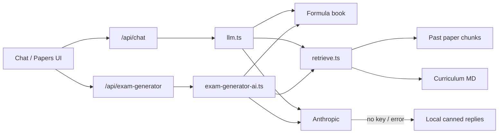

# AI Gaps — Context & To-Do

> Living doc for finishing unfinished AI work in GrindsAI.
> Safe to pick up from any agent / session — read this first.

**ICM home:** [`docs/icm/ai-gaps/`](./icm/ai-gaps/CONTEXT.md) (module map + knock-off protocol)  
**Knocked-off memory (append-only):** [`docs/icm/ai-gaps/KNOCKED-OFF.md`](./icm/ai-gaps/KNOCKED-OFF.md)

When an item below is finished: mark `- [x]` here **and** append an entry to `KNOCKED-OFF.md` in the same turn. Do not delete history from the knock-off log.

**Last updated:** 2026-08-05  
**Branch context when written:** `main`  
**Related code:** `src/lib/llm.ts`, `src/lib/retrieve.ts`, `src/lib/onboarding.ts`, `src/lib/exam-generator-ai.ts`, `src/app/api/chat/route.ts`, `src/app/api/exam-generator/route.ts`

---

## Current AI inventory (context)

GrindsAI has **two live generative AI features**, both on **Anthropic Claude** (default `claude-sonnet-4-20250514` via `ANTHROPIC_MODEL` / `ANTHROPIC_API_KEY`):

| Feature | API | Core lib | UI |
|---------|-----|----------|-----|
| Socratic tutor chat (streaming) | `POST /api/chat` | `src/lib/llm.ts` → `streamTutorReply()` | Conversation view + question tutor panel |
| Exam question generator (JSON, non-stream) | `POST /api/exam-generator` | `src/lib/exam-generator-ai.ts` | Papers view |

**Shared context injected into both:**

- Formulae and Tables excerpts — `src/lib/formula-book.ts`
- Past-paper + curriculum snippets — `src/lib/retrieve.ts` → local keyword RAG via `exam-question-chunks.ts` + `curriculum-context.ts`

**Also relevant:**

- Fallback without Anthropic: `socraticReply()` in `src/lib/constants.ts`
- Question handoffs pass a `studentContext` string into chat (papers/archive → tutor)
- Maths past-paper archive is **browse + handoff**, not generative
- Progress / recommendations are **heuristics**, not LLM
- No Vercel AI SDK, no tool calling, no agent loop today

---

## The 5 gaps

1. **Onboarding → AI personalisation unwired** — `buildStudentContextPrompt()` exists, never called
2. **Vector RAG effectively unused** — OpenAI embeddings + Supabase `match_exam_chunks` shadowed by local keyword path
3. **No tools / agents** — single prompt → single response only
4. **Dead `generateTutorReply()`** — non-streaming twin of `streamTutorReply()`, no callers
5. **Persistent learning profile missing** — Supabase `profiles` is billing-only; study prefs + strengths/weaknesses signals are browser-local / in-memory

### Suggested delivery order

| Priority | Gap | Why |
|----------|-----|-----|
| **1** | Gap 5 — persistent learning profile (schema + sync) | Foundation for durable teaching decisions; Gap 1 is weak without a server source of truth |
| **2** | Gap 1 — onboarding personalisation into LLM | Highest tutor UX value once profile is readable (can still start with localStorage short-term) |
| **3** | Gap 4 — dead path cleanup/refactor | Makes Gaps 1 & 3 safer via one prompt/RAG path |
| **4** | Gap 2 — vector RAG activate **or** retire | Product/ops decision first; don’t half-enable |
| **5** | Gap 3 — tools/agents | Biggest design + latency/cost surface; do after prompt path is clean |

### Audit note (2026-08-05)

Checked `supabase/migrations/*` + app code. Live Supabase MCP auth was unavailable this session — conclusions are from repo migrations and usage. Re-verify against the hosted project before shipping schema changes.

---

## Gap 1 — Wire onboarding personalisation into the LLM

`buildStudentContextPrompt()` already exists in `src/lib/onboarding.ts` but is never called. Chat already accepts a `studentContext` string (used today for question handoffs). Goal: merge **profile personalisation** with **question context** without breaking papers → tutor handoff.

### Discover / decide

- [x] Confirm where the live profile is read today (`localStorage` / cookie / Supabase) and whether the chat API can trust client-sent profile vs should load server-side
- [x] Decide merge order for context blocks: profile personalisation vs question/paper handoff (recommend: profile first, handoff second, both capped)
- [x] Decide whether exam generator should also receive personalisation (year, challenge, urgency) or chat-only for v1
- [x] Decide what happens when onboarding is incomplete / skipped (`profile === null`)

### Implementation

- [x] Create a small helper e.g. `composeStudentContext({ profile, handoffContext })` that:
  - Calls `buildStudentContextPrompt(profile)` when profile exists
  - Appends existing question/paper `studentContext` when present
  - Enforces the existing ~12k char cap sanely (truncate handoff first, keep profile)
- [x] Wire profile into `ConversationView` send path (`src/components/app/conversation-view.tsx`) so every normal chat turn includes personalisation
- [x] Wire profile into `QuestionTutorPanel` (`src/components/app/question-tutor-panel.tsx`) so handoffs get both profile + question
- [ ] Optionally wire into `/api/exam-generator` request + `exam-generator-ai.ts` system prompt if product wants personalised question difficulty/tone
- [x] Prefer server-side profile load in `/api/chat` if/when profile is stored in Supabase (avoids client spoofing / stale localStorage)
- [x] Keep question handoff behaviour unchanged when profile is missing

### Prompt quality

- [x] Review `buildStudentContextPrompt` copy against real tutor behaviour (5th vs 6th vs repeat; challenges: concepts / exam-freeze / time-management / practice)
- [x] Add an explicit instruction that personalisation must not override Socratic rules or curriculum lock
- [x] Cap profile prompt length separately so a long handoff can’t wipe personalisation

### QA

- [ ] New chat with full onboarding → reply tone matches year + challenge
- [ ] Papers/archive “Ask tutor” still injects the question correctly *and* keeps personalisation
- [ ] No profile → chat still works; no empty “Student context:” noise
- [ ] Profile edit via `/onboarding?edit=1` reflects on next message without hard refresh (or document refresh requirement)
- [ ] Character cap: huge marking-scheme handoff still leaves room for profile text

### Docs / cleanup

- [x] Document the two `studentContext` meanings (profile vs handoff) in code comments
- [ ] Add a unit test for `composeStudentContext` merge + truncation rules

**Key files:** `src/lib/onboarding.ts`, `src/lib/llm.ts` (`buildSystemPrompt`), `src/app/api/chat/route.ts`, `src/components/app/conversation-view.tsx`, `src/components/app/question-tutor-panel.tsx`

---

## Gap 2 — Make vector RAG useful (or deliberately retire it)

Today every product subject hits local keyword RAG via `hasProcessedSubjectConfig()`, so OpenAI embeddings + Supabase `match_exam_chunks` never run. Goal: either **activate hybrid retrieval** properly, or **delete/disable the dead path** so it doesn’t rot.

### Discover / decide (pick a strategy)

- [ ] **Option A — Hybrid:** keyword + vector, merge/rerank top results
- [ ] **Option B — Vector-first with keyword fallback**
- [ ] **Option C — Retire vector path** until a subject lacks local processed docs
- [ ] Audit whether `match_exam_chunks` still exists in Supabase, what schema/filters it expects, and whether embeddings are populated for current subjects
- [ ] Measure keyword RAG quality on a few hard queries (wrong topic, synonyms, multi-topic, Irish-language subjects) to justify vector work

### If activating vector RAG

- [ ] Document / add `OPENAI_API_KEY` to `.env.example`
- [ ] Build or refresh an embedding ingest pipeline for processed chunks (all subjects or pilot maths first)
- [ ] Confirm embedding model (`text-embedding-3-small`) matches stored vectors
- [ ] Change `getPastPaperContext()` so processed subjects can still call vector search (don’t `return` early forever)
- [ ] Implement merge/dedupe of keyword hits + vector hits (stable ranking, max N chunks)
- [ ] Add timeouts / graceful degradation if OpenAI or RPC fails (keep keyword path)
- [ ] Align filters (`filter_subject`, `filter_level`, `filter_topic`) with processed corpus IDs
- [ ] Resolve the dead Applied Maths branch in `retrieve.ts` (Path B shadowed by Path A) — either use it or delete it
- [ ] Log retrieval provenance (`keyword` / `vector` / `hybrid`) for debugging without dumping full chunks to clients

### If retiring vector RAG

- [ ] Remove or feature-flag OpenAI client + `match_exam_chunks` RPC call in `retrieve.ts`
- [ ] Remove unused `openai` dependency if nothing else needs it
- [ ] Delete dead Applied Maths special-case if fully covered by processed Path A
- [ ] Leave a short ADR/comment: “vector RAG deferred; local keyword is source of truth”

### QA (activation path)

- [ ] Side-by-side eval: keyword-only vs hybrid on 20 tutor queries + 10 exam-gen briefs
- [ ] No regression when `OPENAI_API_KEY` missing (keyword still works)
- [ ] Cost/latency check: embeddings + RPC under acceptable chat TTFT budget
- [ ] Confirm exam generator still gets useful style examples without copying verbatim

### Ops

- [ ] Decide chunk re-embed process when `docs/processed/**` updates
- [ ] Add a smoke script: embed one query → RPC → print top matches

**Key files:** `src/lib/retrieve.ts`, `src/lib/exam-question-chunks.ts`, `src/lib/processed-subjects.ts`, `src/lib/curriculum-context.ts`, Supabase `match_exam_chunks` RPC

---

## Gap 3 — Add tools / agent capabilities (beyond single-shot prompts)

Today both features are single prompt → single response. No tool calling, no multi-step agent loop. Goal: define the *smallest useful* tool set for a LC tutor, then implement carefully without breaking Socratic behaviour.

### Product design first

- [ ] List candidate tools and kill anything that undermines “don’t just give the answer”:
  - `lookup_formula_page` — fetch a specific Formulae and Tables page/topic
  - `lookup_past_paper` — retrieve a similar past question + marking scheme excerpt
  - `lookup_curriculum` — pull a syllabus learning outcome
  - `get_student_profile` — year/challenge/subjects (if not always in system prompt)
  - `generate_practice_question` — invoke exam-gen logic mid-chat
  - `save_study_note` / `mark_topic_struggling` — write study state (optional)
- [ ] Decide hard rules: tools may inform the tutor; final answer still Socratic; no “dump marking scheme” tool unless gated behind “I’m stuck”
- [ ] Decide UX: silent tools vs visible “Checking formula book…” status chips in the chat UI

### Architecture

- [ ] Choose implementation approach:
  - Anthropic native tool use on current SDK, **or**
  - Vercel AI SDK (`ai` package) with streaming + tools
- [ ] Design a shared tool registry used by chat (and optionally exam gen)
- [ ] Define max tool rounds (e.g. 2–3) to bound cost/latency
- [ ] Keep streaming UX: stream text after tools finish, or stream with intermediate status events
- [ ] Separate “retrieval tools” from “generation tools” so exam gen doesn’t recurse into itself accidentally

### Implementation (phased)

- [ ] **Phase 1:** Convert current always-on RAG injection into optional tools (`lookup_past_paper`, `lookup_curriculum`, `lookup_formula_page`) *or* keep always-on RAG and add tools only for follow-up lookups
- [ ] **Phase 2:** Wire Anthropic/AI SDK tool definitions + server-side executors wrapping existing libs (`formula-book`, `exam-question-chunks`, `curriculum-context`)
- [ ] **Phase 3:** Add chat UI status for tool activity (optional but recommended)
- [ ] **Phase 4:** Optional `generate_practice_question` tool that reuses `generateExamQuestions` with strict limits
- [ ] Persist tool traces only server-side/logs initially (don’t store noisy tool JSON in user-visible messages unless useful)

### Safety / product constraints

- [ ] Tool outputs must stay curriculum-locked and citation-aware (printed formula pages, paper year/question where possible)
- [ ] Prevent homework-complete mode via tools (e.g. marking scheme tool requires stuck signal / explicit request)
- [ ] Rate-limit tool calls per conversation turn
- [ ] Ensure fallback path still works with no API key (no tools, canned `socraticReply`)

### QA

- [ ] Tutor asks for a formula → uses formula tool → cites page
- [ ] Tutor doesn’t call tools on every trivial message (over-tooling check)
- [ ] Tool failure → tutor still answers usefully without crashing stream
- [ ] Latency budget documented (p50/p95 with 0, 1, 2 tool rounds)
- [ ] Regression: existing papers → tutor handoff still works

### Docs

- [ ] Write a short “Tutor tools” section: available tools, when they fire, what they must never do

**Key files:** `src/lib/llm.ts`, `src/app/api/chat/route.ts`, formula/RAG libs above, conversation UI components

---

## Gap 4 — Clean up / consolidate `generateTutorReply()` (dead non-streaming path)

`generateTutorReply()` in `src/lib/llm.ts` duplicates prompt/RAG/Anthropic setup used by `streamTutorReply()`, but no route calls it. Goal: either use it somewhere intentionally, or delete/refactor so there’s one code path.

### Discover / decide

- [ ] Confirm zero callers (was true as of 2026-08-04 for app routes/UI)
- [ ] Decide preferred outcome:
  - **A. Delete it** and keep streaming-only
  - **B. Refactor shared core** (`buildTutorRequest` / `runTutorOnce`) used by stream + non-stream
  - **C. Use it** for a real non-stream need (e.g. background title generation, eval harness, “regenerate without stream”, server jobs)

### If deleting (simplest)

- [ ] Remove `generateTutorReply()` from `llm.ts`
- [ ] Grep again for imports/tests
- [ ] Keep `streamTutorReply()` + `buildSystemPrompt()` + `anthropicMessages()` as the single path

### If refactoring (recommended if tools/personalisation are coming)

- [ ] Extract shared steps:
  - resolve model/api key
  - fetch formula + past-paper context
  - build system prompt (incl. future profile context)
  - build Anthropic messages array
- [ ] `streamTutorReply` = shared prep + `.stream`
- [ ] `generateTutorReply` = shared prep + `.create` (only if a caller exists or is planned)
- [ ] Share fallback behaviour (`socraticReply`) in one place
- [ ] Share RAG logging format (`[RAG] ...`) so stream/non-stream don’t drift

### If giving it a real job

- [ ] Pick a concrete consumer, e.g.:
  - conversation auto-title from first exchange
  - offline eval script comparing prompts
  - exam-gen “tutor tip” blurb
  - non-stream regenerate button
- [ ] Implement that consumer before keeping the function “just in case”
- [ ] Add tests around the non-stream path if it becomes user-facing

### QA

- [ ] Chat streaming still works after cleanup
- [ ] Fallback without `ANTHROPIC_API_KEY` still works
- [ ] No duplicate prompt drift between paths (if both kept)
- [ ] Bundle/server import still tree-shakes cleanly

**Key files:** `src/lib/llm.ts`, `src/app/api/chat/route.ts`

---

## Gap 5 — Persistent learning profile (Supabase)

**What exists today**

| Layer | Reality |
|-------|---------|
| Supabase `public.profiles` | `id`, `email`, `subscription_status`, `stripe_customer_id`, `updated_at` only — billing / account row created on signup |
| RLS on `profiles` | `select` own + `insert` own — **no** `update` policy for the logged-in user (Stripe webhook updates via service role) |
| Onboarding `StudentProfile` | year, subjects, HL/OL, exam target, challenge — saved to **`localStorage`** + `grindsai_onboarding` cookie only (`src/lib/onboarding.ts`) |
| Study / progress signals | Focus areas, results, activities — **React in-memory** in `chat-client` via `study-state.ts`; lost on refresh; never written to Supabase |
| Chat history | Conversations + messages **are** in Supabase — raw transcript, not summarised into strengths/weaknesses |
| Teaching use | No derived mastery / weak-topic model; tutor does not read a DB learning profile |

**Goal:** When the student studies, capture durable signals and build a profile the product (and later the tutor) can use to decide how to teach — strengths, weaknesses, focus areas — not just “which subjects they picked once.”

### Discover / decide

- [x] Verify hosted Supabase matches migrations (`profiles` columns, RLS, no extra unpublished tables)
- [x] Decide schema shape:
  - **A.** Extend `profiles` with onboarding JSON/columns only, plus separate `study_signals` / `topic_stats` tables
  - **B.** `student_profiles` (prefs) + `topic_mastery` (aggregates) + keep billing fields on `profiles`
  - **C.** Other — document in `docs/icm/ai-gaps/learning-profile/output/`
- [x] Decide source of truth for onboarding gate: cookie vs DB vs both (cookie today can lie relative to localStorage)
- [x] Decide which events write signals: tutor turns, exam-gen, “still stuck” reflections, manual focus areas, logged results
- [x] Decide v1 vs later: store raw signals first vs also compute mastery scores / strengths-weaknesses summary
- [x] Decide how Gap 1 reads profile: server-side from Supabase (preferred) vs keep client localStorage until Gap 5 ships

### Schema / RLS (implementation)

- [x] Create migration with `supabase migration new …` (do not hand-invent filenames)
- [x] Add columns and/or tables for: year group, subjects, subject levels, exam target, challenge, onboarding completed_at
- [x] Add tables (or equivalent) for per-subject/topic signals: focus areas, results, activity events, optional mastery aggregates
- [x] Enable RLS on every new exposed table; policies for select/insert/update **own** rows (`auth.uid()`)
- [x] Add missing `profiles_update_own` (or equivalent) if users must update their own profile row from the client — today only select + insert exist
- [x] Do **not** put authorization in `user_metadata` / JWT user claims; keep prefs in tables
- [x] Run advisors / security checklist before committing migration

### App wiring

- [x] On onboarding finish: upsert profile prefs to Supabase (keep localStorage as cache/offline optional)
- [x] On `/onboarding?edit=1`: load from Supabase, save back
- [x] Persist study-state writes (focus / results / activities) instead of memory-only
- [ ] Optionally backfill topic hints from existing `conversations` / `messages` (read-only analysis job — later)
- [x] Proxy/onboarding cookie: set/clear from real DB completion, not only localStorage
- [x] Cross-device: same user on a new browser sees subjects + focus areas

### Teaching / AI use (after data exists)

- [x] Define a compact “learning summary” string or structured blob for the tutor (weak topics, recent struggles, improved areas)
- [ ] Hand that into Gap 1’s `composeStudentContext` / server chat path when ready
- [x] Keep Socratic rules: profile steers pedagogy, does not unlock answer-dumping

### QA

- [x] New signup → onboarding → row(s) visible in Supabase for that user only
- [x] Hard refresh: focus areas / results still present
- [x] Second device/browser: prefs load after login
- [x] RLS: user A cannot read user B’s learning data
- [x] Stripe subscription updates still work on `profiles`
- [x] Clearing localStorage alone does not wipe server profile (or documented migration path)

**Key files:** `supabase/migrations/001_initial.sql`, `003_profiles_insert_own.sql`, `src/lib/onboarding.ts`, `src/components/onboarding/onboarding-flow.tsx`, `src/components/app/study-state.ts`, `src/app/chat/chat-client.tsx`, `src/lib/subscription.ts`, Stripe webhook

**ICM module:** [`docs/icm/ai-gaps/learning-profile/`](./icm/ai-gaps/learning-profile/CONTEXT.md)

---

## Cross-cutting checklist

Apply while doing any of the above:

- [ ] Keep Socratic constraints sacred in every prompt/tool change
- [ ] Keep auth + subscription gates on `/api/chat` and `/api/exam-generator`
- [ ] Don’t log full student messages/PII in production RAG/tool logs
- [ ] Update `.env.example` whenever a new key becomes required (`OPENAI_API_KEY`, etc.)
- [ ] Add at least one happy-path + one fallback-path manual test note per gap
- [ ] Prefer server-owned context (profile, retrieval) over trusting large client-supplied blobs where possible

---

## Progress log

Canonical completion memory is now [`docs/icm/ai-gaps/KNOCKED-OFF.md`](./icm/ai-gaps/KNOCKED-OFF.md). Keep a one-line pointer here when useful:

| Date | What changed |
|------|----------------|
| 2026-08-04 | Doc created from AI inventory + 4-gap to-do discussion. No implementation yet. |
| 2026-08-05 | ICM module map scaffolded under `docs/icm/ai-gaps/`; knock-off log is source of truth for completed items. |
| 2026-08-05 | Gap 5 added after profile/Supabase audit: learning profile not in DB yet (billing-only `profiles`). |
| 2026-08-05 | Gap 5 v1 shipped: migration applied to hosted grindsAI; prefs/events/BKT/emitters/read helper. |

<!-- Agents: prefer appending to KNOCKED-OFF.md; add a row here only for major milestones. -->
