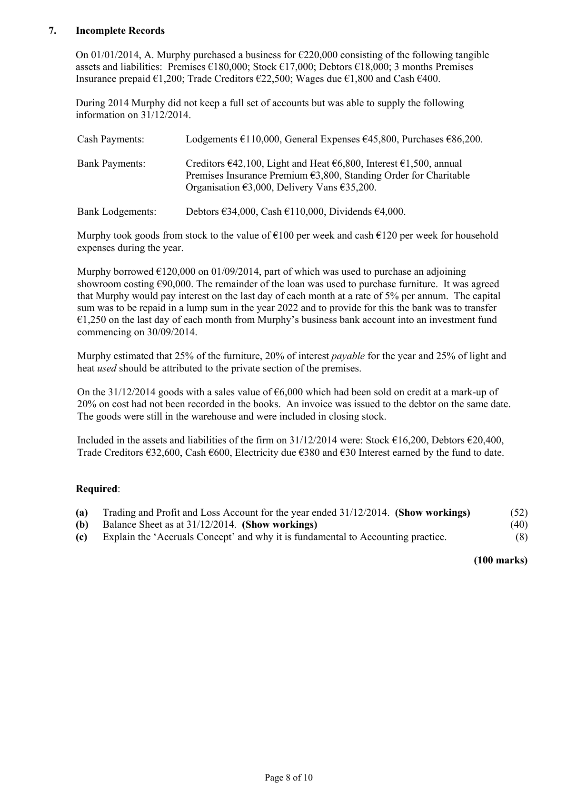
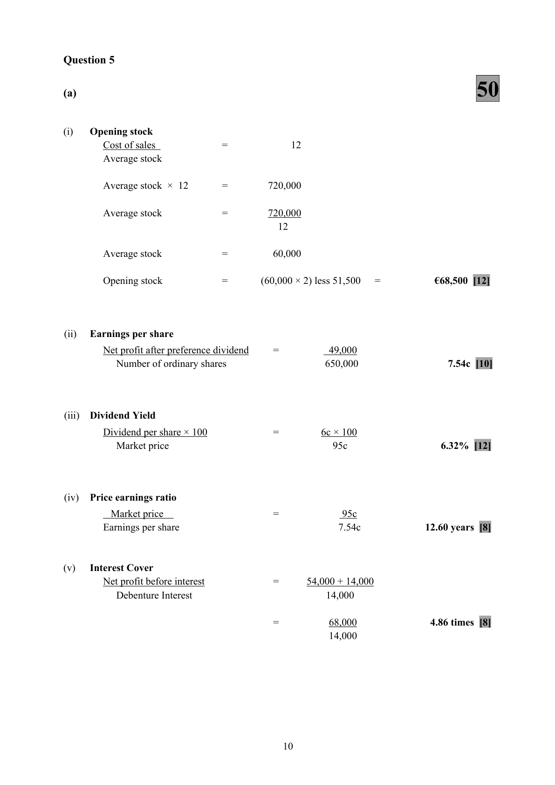
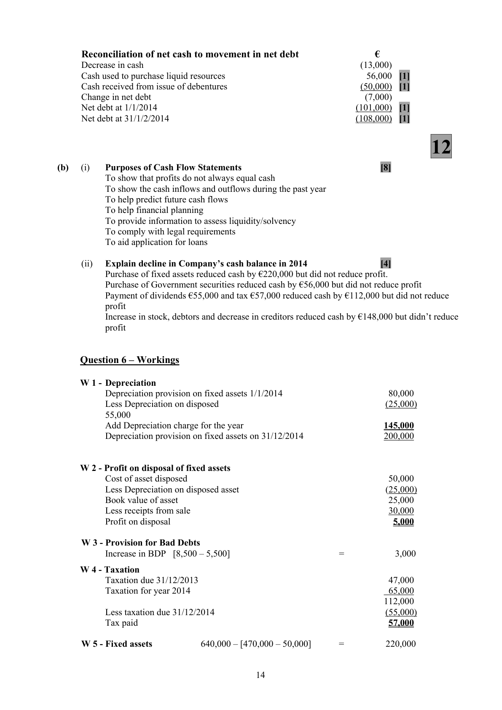
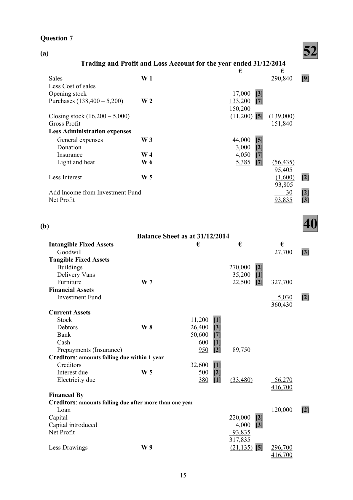

# Question

6.   Cash Flow Statement

     The following are the Balance Sheets of Quig plc as at 31/12/2013 and 31/12/2014.

      Balance Sheets as at                        31/12/2014             31/12/2013
      Fixed Assets                            €          €          €           €
       Cost                                  640,000                470,000
       Less accumulated depreciation           (200,000)     440,000    (80,000)      390,000
       Financial Assets
       Investments at cost                                  100,000                  200,000
      Current Assets
       Stock                                 350,000                295,000
       Debtors                               170,000                110,000
       Less bad debt provision                     (8,500)                  (5,500)
      Government Securities                    56,000                       ----------
      Cash                                   34,000                 60,000
                                             601,500                459,500
       Less Creditors: amounts falling due within 1 year
       Trade creditors                         202,000                235,000
      Bank                                   18,000                  31,000
       Taxation                                55,000                  47,000
                                             275,000     326,500    313,000       146,500
                                                         866,500                 736,500
      Financed by
       Creditors: amounts falling due after more than one year
     10% Debentures                                    180,000                 130,000
       Capital and Reserves
       Ordinary shares @ €1 each               310,000                 250,000
       Share premium                          15,000                        ---------
        Profit and Loss account                  361,500     686,500    356,500      606,500
                                                         866,500                 736,500

    The following information is also available:
       1.    60,000 shares were issued at €1.25 per share.
       2.    Fixed assets, which cost €50,000 and on which total depreciation of €25,000 had been provided
           were sold for €30,000.
       3.    €50,000 Debentures were issued on 01/01/2014
       4.    Dividends paid during the year amounted to €55,000.
       5.    Taxation charge on profits for the year 2014 was €65,000
       6.    Investments which cost €100,000 were sold for cash at their book value.

    Required:
       (a)    (i)    Prepare an Abridged Profit & Loss account to ascertain the operating profit for the year
                 ending 31/12/2014.
                 (ii)   Prepare the Cash Flow Statement of Quig plc for the year ending 31/12/2014, including
                   Reconciliation statements.
                                                                                                          (88)
      (b)    (i)    Outline the purposes of cash flow statements.
                 (ii)   Explain, why having earned a profit during 2014, the company’s cash balance declined.   (12)

                                                                                         (100 marks)

                                               Page 7 of 10

<!-- PAGE 8 -->
# Page 8

<!-- HAS_VISUAL: true -->
<!-- VISUAL_REASON: text contains visual keywords: table; page image extracted because text may not fully capture visual content -->

# Marking Scheme

6.     Fire Damage Loss                 6,000 – 5,000                            1,000 (P &L)

6.     Light, heat and fuel                                      2,210
    Add stock 1/1                                        620
      Less due 1/1                                              (330)
      Less stock 31/12                                           (560)
                                                             1,940
      Less drawings (25% of 1,940)                              (485)         1,455

                                           9

<!-- PAGE 12 -->
# Page 12

<!-- HAS_VISUAL: true -->
<!-- VISUAL_REASON: page contains vector drawings; page image extracted because text may not fully capture visual content -->

Question 6
                                     88

       Abridged Profit and Loss account for the year ending 31/12/2014       €
      Operating profit                                                         143,000    [3]
      Less interest                                                                  (18,000)   [3]
       Profit before tax                                                         125,000
      Taxation                                                                     (65,000)   [3]
       Profit after tax                                                            60,000
      Dividends                                                                    (55,000)   [3]
      Retained profit                                                              5,000
       Profit and loss balance 1/1/2014                                           356,500    [3]
       Profit and loss balance 31/12/2014                                         361,500    [3]

     Reconciliation of operating profit to net cash flow from operating activities
                                                                           €
      Operating profit                                                         143,000    [2]
      Depreciation charge for the year   W 1                                145,000    [4]
       Profit on sale of fixed assets     W 2                                     (5,000)   [2]
      Increase in provision for bad debts  W 3                                   3,000    [3]
      Increase in stock                                                              (55,000)   [3]
      Increase in debtors                                                            (60,000)   [3]
      Decrease in creditors                                                          (33,000)   [3]
     Net cash inflow from operating activities                                   138,000

           Cash Flow Statement of Quig plc for the year ended 31/12/2014
     Operating Activities                                    €                €
        Net cash inflow from operating activities                                 138,000    [2]
     Return on Investment and Servicing of Finance [1]
          Interest paid                                                               (18,000)   [3]
     Taxation [1]
       Tax paid           W 4                                   (57,000)   [3]
      Capital Expenditure and Financial Investment [1]
         Sale of fixed assets                                    30,000  [5]
         Purchase of fixed assets     W 5               (220,000)  [5]
         Sale of investments                                  100,000  [4]      (90,000)
     Equity Dividends paid [1]
        Dividends paid                                                            (55,000)   [3]
     Net cash outflow before liquid resources and financing                          (82,000)
     Management of Liquid Resources [1]
        Government securities                                                     (56,000)   [3]
     Financing [1]
         Issue of debentures                                    50,000  [3]
         Issue of ordinary shares                                60,000  [2]
        Share premium                                        15,000  [2]     125,000
     Decrease in Cash                                                            (13,000)   [5]

                                           13

<!-- PAGE 16 -->
# Page 16

<!-- HAS_VISUAL: true -->
<!-- VISUAL_REASON: page contains vector drawings; text contains visual keywords: line; page image extracted because text may not fully capture visual content -->

Reconciliation of net cash to movement in net debt               €
      Decrease in cash                                                       (13,000)
     Cash used to purchase liquid resources                                 56,000  [1]
     Cash received from issue of debentures                                  (50,000)  [1]
     Change in net debt                                                       (7,000)
     Net debt at 1/1/2014                                                 (101,000)  [1]
     Net debt at 31/1/2/2014                                              (108,000)  [1]

                                     12
(b)    (i)   Purposes of Cash Flow Statements                                       [8]
         To show that profits do not always equal cash
         To show the cash inflows and outflows during the past year
         To help predict future cash flows
         To help financial planning
         To provide information to assess liquidity/solvency
         To comply with legal requirements
         To aid application for loans

        (ii)   Explain decline in Company’s cash balance in 2014                    [4]
           Purchase of fixed assets reduced cash by €220,000 but did not reduce profit.
           Purchase of Government securities reduced cash by €56,000 but did not reduce profit
          Payment of dividends €55,000 and tax €57,000 reduced cash by €112,000 but did not reduce
              profit
            Increase in stock, debtors and decrease in creditors reduced cash by €148,000 but didn’t reduce
              profit

Question 6 – Workings

  W 1 - Depreciation
            Depreciation provision on fixed assets 1/1/2014                         80,000
           Less Depreciation on disposed                                          (25,000)
           55,000
         Add Depreciation charge for the year                                 145,000
            Depreciation provision on fixed assets on 31/12/2014                   200,000

  W 2 - Profit on disposal of fixed assets
           Cost of asset disposed                                               50,000
           Less Depreciation on disposed asset                                     (25,000)
          Book value of asset                                                  25,000
           Less receipts from sale                                               30,000
              Profit on disposal                                                     5,000

   W 3 - Provision for Bad Debts
            Increase in BDP  [8,500 – 5,500]                     =            3,000

  W 4 - Taxation
            Taxation due 31/12/2013                                             47,000
            Taxation for year 2014                                               65,000
                                                                            112,000
           Less taxation due 31/12/2014                                           (55,000)
          Tax paid                                                           57,000

   W 5 - Fixed assets           640,000 – [470,000 – 50,000]     =          220,000

                                           14

<!-- PAGE 17 -->
# Page 17

<!-- HAS_VISUAL: true -->
<!-- VISUAL_REASON: page contains vector drawings; page image extracted because text may not fully capture visual content -->

6.    Light and heat     [6,800 + 380 – 1,795]                                            5,385

# Source References

Exam paper:
- file: intermediate_markdown/exam_papers/higher/accounting_higher_2015_paper_1_exam.md
- pages: [8]

Marking scheme:
- file: intermediate_markdown/marking_schemes/higher/accounting_higher_2015_paper_1_marking_scheme.md
- pages: [12, 16, 17]

# Notes

