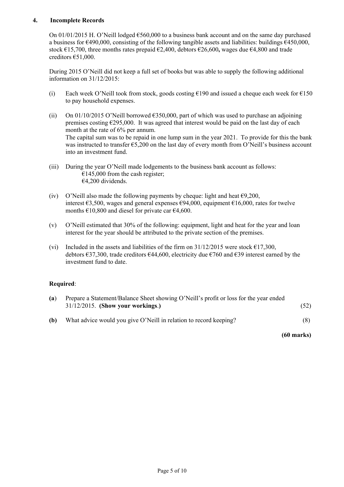
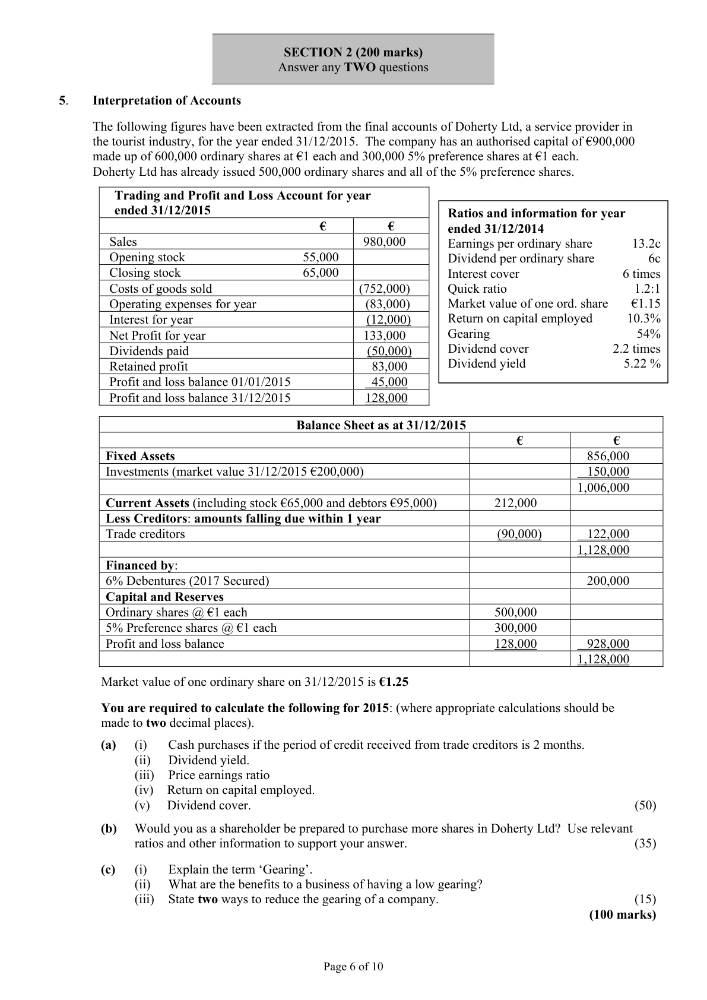
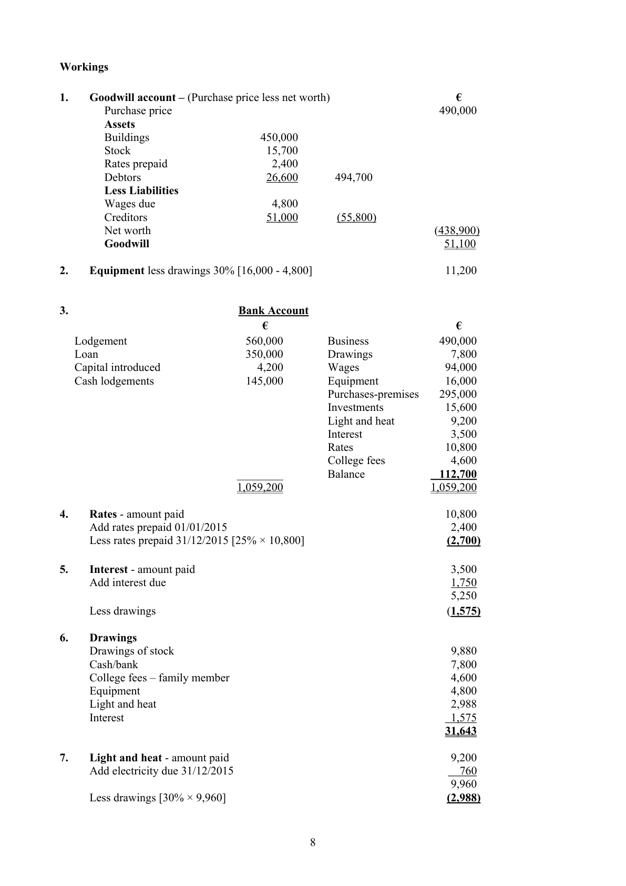

# Question

4. Levy for 2014 of €50 each due from 20 members.
       (vi)  The club has decided that life membership is to be credited to income over a 10 year period
          commencing in 2015.
       (vii)  The dishonoured cheque was not subsequently recovered and was written off as a bad debt.
        (viii) Bar debtors and creditors on 31/12/2015 were €500 and €1,230 respectively.

     Required:

       (a)   Show the club’s accumulated fund (capital) on 01/01/2015.                                   (25)
      (b)  Show the income and expenditure account for the year ending 31/12/2015.                    (27)
       (c)    Distinguish between ‘levy’ and ‘life membership’. Explain how both are
             treated in the accounts.                                                                            (8)
                                                                                           (60 marks)

                                            Page 4 of 10

<!-- PAGE 5 -->
# Page 5

4.    Incomplete Records

    On 01/01/2015 H. O’Neill lodged €560,000 to a business bank account and on the same day purchased
      a business for €490,000, consisting of the following tangible assets and liabilities: buildings €450,000,
      stock €15,700, three months rates prepaid €2,400, debtors €26,600, wages due €4,800 and trade
       creditors €51,000.

     During 2015 O’Neill did not keep a full set of books but was able to supply the following additional
      information on 31/12/2015:

        (i)   Each week O’Neill took from stock, goods costing €190 and issued a cheque each week for €150
             to pay household expenses.

        (ii)  On 01/10/2015 O’Neill borrowed €350,000, part of which was used to purchase an adjoining
            premises costing €295,000.  It was agreed that interest would be paid on the last day of each
          month at the rate of 6% per annum.
          The capital sum was to be repaid in one lump sum in the year 2021. To provide for this the bank
          was instructed to transfer €5,200 on the last day of every month from O’Neill’s business account
             into an investment fund.

         (iii)  During the year O’Neill made lodgements to the business bank account as follows:
                 €145,000 from the cash register;
                 €4,200 dividends.

       (iv)   O’Neill also made the following payments by cheque: light and heat €9,200,
              interest €3,500, wages and general expenses €94,000, equipment €16,000, rates for twelve
           months €10,800 and diesel for private car €4,600.

       (v)   O’Neill estimated that 30% of the following: equipment, light and heat for the year and loan
              interest for the year should be attributed to the private section of the premises.

       (vi)   Included in the assets and liabilities of the firm on 31/12/2015 were stock €17,300,
            debtors €37,300, trade creditors €44,600, electricity due €760 and €39 interest earned by the
            investment fund to date.

     Required:

       (a)   Prepare a Statement/Balance Sheet showing O’Neill’s profit or loss for the year ended
            31/12/2015. (Show your workings.)                                                     (52)

      (b)   What advice would you give O’Neill in relation to record keeping?                           (8)

                                                                                        (60 marks)

                                            Page 5 of 10

<!-- PAGE 6 -->
# Page 6

<!-- HAS_VISUAL: true -->
<!-- VISUAL_REASON: page contains vector drawings; text contains visual keywords: figure; page image extracted because text may not fully capture visual content -->

SECTION 2 (200 marks)
                                Answer any TWO questions

# Marking Scheme

4.    Depreciation - plant and machinery        16,000 + 15,100                         31,100
                                             30,200 + 900

4.   Bar Trading Account                              €              €
         Sales (76,300 - 355 + 500)                                         76,445
        Stock 01/01/2015                                  6,000
       Add Purchases (33,600 – 3,000 + 1,230)            31,830
                                                        37,830
        Less Closing stock                                (16,900)          (20,930)
        Bar profit                                                        55,515

Question 4

(a)
                                     52
                                Balance Sheet as at 31/12/2015
   Intangible Assets                                                €            €
     Goodwill            W 1                                       51,100 [3]
   Fixed Assets
      Buildings       (450,000 + 295,000)                             745,000 [4]
     Equipment           W 2                          11,200 [3]  756,200
   Financial Assets
      Investments                                                                  15,639 [5]
                                                                                822,939
   Current Assets
      Stock at 31/12/2015                                 17,300 [2]
      Trade debtors                                       37,300 [2]
     Bank             W 3            112,700 [5]
      Rates prepaid          W 4               2,700 [3]  170,000

   Less Creditors: amounts falling due within 1 year
      Creditors                                           44,600 [2]
       Interest due           W 5               1,750 [3]
       Electricity due                                     760 [2]   (47,110)
   Working capital                                                                122,890
                                                                                945,829
   Financed by

   Creditors: amounts falling due after more than 1 year
     Loan                                                                      350,000 [2]

   Capital - Balance at 01/01/2015                                    560,000 [2]
         Add Capital introduced                                       4,200 [3]
            Less Drawings       W 6                           (31,643) [7]  532,557
                                                                                882,557
  Add Net profit                                                                   63,272 [4]
   Capital employed                                                              945,829

(b)
                                      8

      O’Neill should keep a detailed cash book and general ledger supported by appropriate
      subsidiary day books. This would enable O’Neill to prepare an accurate trading and profit
     and loss account and therefore would avoid reliance on estimates or net worth to ascertain
       profit.

                                           7

<!-- PAGE 10 -->
# Page 10

<!-- HAS_VISUAL: true -->
<!-- VISUAL_REASON: page contains vector drawings; page image extracted because text may not fully capture visual content -->

Workings

4.    Rates - amount paid                                                 10,800
    Add rates prepaid 01/01/2015                                           2,400
      Less rates prepaid 31/12/2015 [25% × 10,800]                             (2,700)

4.    Tangible Fixed Assets [7]
                                Land/Buildings      Vehicles            Total
     Value 01/01/2015                785,000          290,000        1,075,000
      Disposal                           (85,000)                            (85,000)
      Revaluation surplus 31/12/2015    100,000        _______          100,000
     Value at 31/12/2015              800,000          290,000        1,090,000

      Depreciation 01/01/2015          121,300          104,000          225,300
     Charge for the year                14,000           58,000           72,000
                                     135,300          162,000          297,300
      Transfer on revaluation            (135,300)                  -            (135,300)
      Depreciation 31/12/2015                  ------          162,000          162,000

     Net book value 01/01/2015        663,700          186,000          849,700

     Net book value 31/12/2015        800,000          128,000          928,000

4.    Other operating income     46,000 + 8,250 + 13,000                       =       67,250

# Source References

Exam paper:
- file: intermediate_markdown/exam_papers/higher/accounting_higher_2016_paper_1_exam.md
- pages: [5, 6]

Marking scheme:
- file: intermediate_markdown/marking_schemes/higher/accounting_higher_2016_paper_1_marking_scheme.md
- pages: [10]

# Notes

