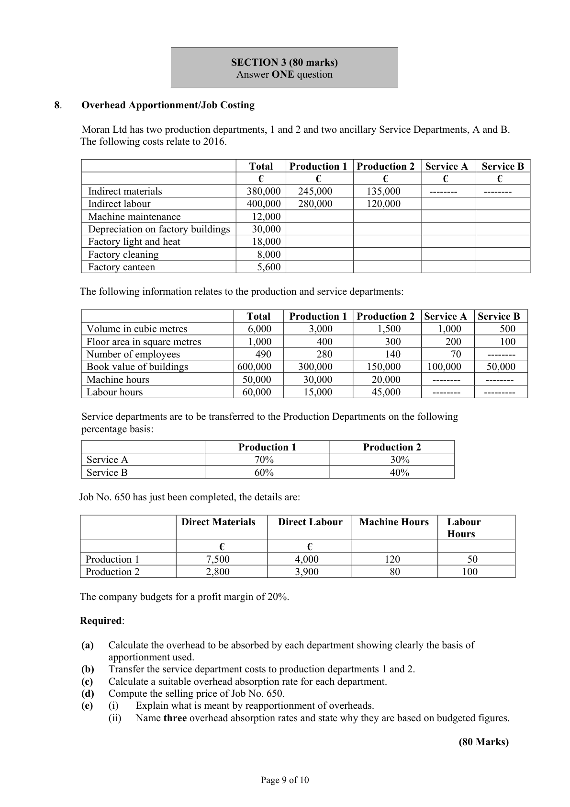
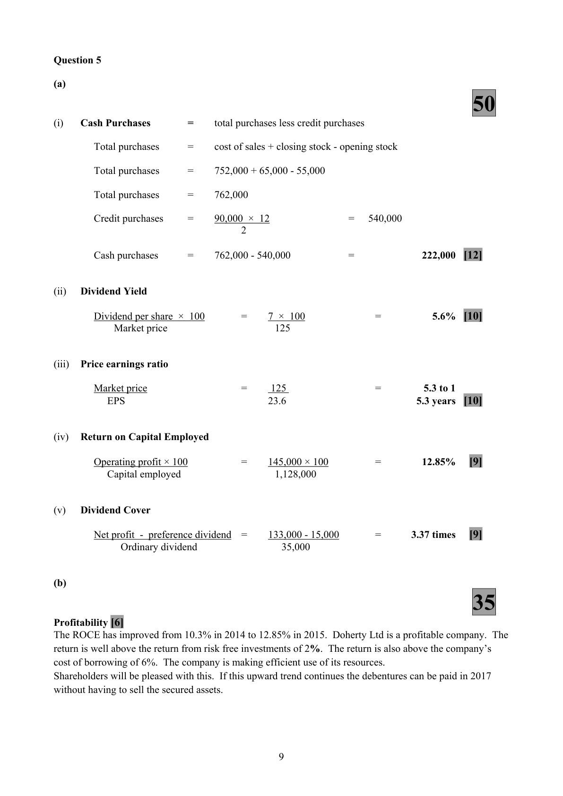
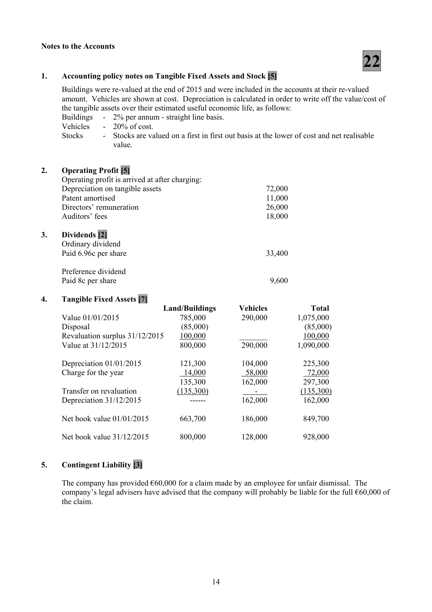

# Question

7.    Published Accounts
      Atkinson plc has an authorised share capital of €900,000 divided into 600,000 ordinary shares at €1
      each and 300,000 8% preference shares at €1 each. The following trial balance was extracted from
      the books at 31/12/2015.
                                                               €              €
           Vehicles at cost                                        290,000
           Vehicles - accumulated depreciation on 01/01/2015                          104,000
        6% Investments                                        250,000
            Buildings at cost                                        700,000
            Buildings - accumulated depreciation on 01/01/2015                         121,300
           Investment income                                                          5,400
           Debtors and creditors                                    129,000           94,000
           Stock 01/01/2015                                        91,000
            Patent 01/01/2015                                        33,000
            Administrative expenses                                 203,000
            Distribution costs                                       121,000
           Purchases and sales                                     1,165,000        1,799,700
            Rental income                                                            46,000
             Profit on the sale of land                                                   35,000
           Dividends paid                                           43,000
          Bank                                                   90,000
       VAT                                                                    21,300
             Profit and loss account at 01/01/2015                                        72,000
            Issued capital
              Ordinary shares                                                      480,000
          8% Preference shares                                                 120,000
            Provision for bad debts                                                    15,500
        7% Debentures 2018/2019                                                200,000
           Discount                                                                 13,000
           Debenture interest paid                                    12,200       ________
                                                                  3,127,200        3,127,200
     The following information is relevant:
        (i)    Stock on 31/12/2015 is €76,000.
        (ii)   The patent was acquired on 01/01/2011 for €77,000.  It is being amortised over 7 years in equal
             instalments. This amortisation is to be included in cost of sales.
         (iii)  Provide for debenture interest due, investment income due, auditors’ fees €18,000,
             directors’ fees €26,000 and corporation tax €56,000.
       (iv)   Included in administrative expenses is the receipt of €8,250 for rental income.
       (v)   During the year, land adjacent to the company’s premises, which had cost €85,000 was sold for
            €120,000. At the end of the year the company revalued its buildings to €800,000 and wishes to
            incorporate this value in this year’s accounts.
       (vi)   Provide for depreciation:    Buildings 2% straight line.
                                       Vehicles 20% of cost.
       (vii) A former employee has made a claim of €60,000 for unfair dismissal. The company’s legal
             advisers have advised that the company will probably be liable for the full amount.
     Required:

       (a)   Prepare the published profit and loss account for the year ended 31/12/2015 and a balance sheet
            as at that date in accordance with the Companies Acts and appropriate accounting standards
           showing the following notes:
              1.    Accounting policy note for tangible fixed assets and stock
              2.    Operating profit
              3.    Dividends
              4.    Tangible fixed assets
              5.    Contingent liability.                                                               (88)

      (b)    (i)    Explain why it is important that financial statements are properly regulated.
                 (ii)  How does the European Union regulate the presentation of accounts?                (12)
                                                                                    (100 marks)

                                            Page 8 of 10

<!-- PAGE 9 -->
# Page 9

<!-- HAS_VISUAL: true -->
<!-- VISUAL_REASON: page contains vector drawings; text contains visual keywords: figure, table; page image extracted because text may not fully capture visual content -->

SECTION 3 (80 marks)
                                 Answer ONE question

# Marking Scheme

7.    Sales - finished goods                    1,352,000 – 15,000                    1,337,000

7.    Catering Profit         6,500 - 4,200 (4800 - 600)        =           2,300

7.    Light and heat - amount paid                                           9,200
    Add electricity due 31/12/2015                                       760
                                                                           9,960
      Less drawings [30% × 9,960]                                              (2,988)

                                           8

<!-- PAGE 11 -->
# Page 11

<!-- HAS_VISUAL: true -->
<!-- VISUAL_REASON: page contains vector drawings; text contains visual keywords: table; page image extracted because text may not fully capture visual content -->

Question 7
                                     40
                 Profit and Loss Account of Atkinson plc for the year ended 31/12/2015
                                                                          €
Turnover                                                                      1,799,700 [2]
Cost of sales        W 1                                              (1,191,000) [5]
Gross profit                                                                  608,700
Distribution costs      W 2                                               (179,000) [3]
Administrative expenses   W 3                                               (329,250) [7]
                                                                            100,450
Other operating income   W 4                                              67,250 [4]
Operating profit                                                              167,700
Investment income     W 5                                              15,000 [3]
Profit on the sale of land                                                         35,000 [2]
                                                                            217,700
Interest payable                                                                    (14,000) [3]
Profit on ordinary activities before taxation      [1]                               203,700
Tax on profit on ordinary activities                                                  (56,000) [2]
Profit on ordinary activities after taxation                                         147,700
Dividend paid                                                                      (43,000) [2]
Profit retained for the year                                                      104,700
Profit brought forward on 01/01/2015                                             72,000 [2]
Profit carried forward on 31/12/2015                                            176,700 [4]

                                      26
                         Balance Sheet of Atkinson plc as at 31/12/2015

Fixed Assets                                        €           €             €
   Intangible assets                                                                22,000 [1]
   Tangible assets                                                               928,000 [2]
   Financial assets                                                               250,000 [1]
                                                                                 1,200,000
Current Assets
   Stock                                          76,000 [1]
   Debtors        W 6                 123,100 [3]
  Bank                                           90,000 [1]   289,100

Creditors: amounts falling due within 1 year     [1]
   Trade creditors                                  94,000 [1]
   Taxation        W 7                  77,300 [2]
   Other creditors      W 8                 105,800 [4]   (277,100)
Net current assets                                                                  12,000
Total assets less current liabilities                                                   1,212,000

Creditors: amounts falling due after more than 1 year
  7% Debentures                                                                       [2] 200,000
Capital and Reserves
     Issued shares                                               600,000 [2]                      [1]
    Revaluation reserve   W 9                               235,300 [3]
     Profit carried forward                                       176,700 [1]
                                                                                 1,012,000
                                                                                 1,212,000

                                           13

<!-- PAGE 16 -->
# Page 16

<!-- HAS_VISUAL: true -->
<!-- VISUAL_REASON: page contains vector drawings; text contains visual keywords: line; page image extracted because text may not fully capture visual content -->

Notes to the Accounts
                                     22

7.    Taxation                  21,300 + 56,000                             =       77,300

# Source References

Exam paper:
- file: intermediate_markdown/exam_papers/higher/accounting_higher_2016_paper_1_exam.md
- pages: [9]

Marking scheme:
- file: intermediate_markdown/marking_schemes/higher/accounting_higher_2016_paper_1_marking_scheme.md
- pages: [11, 16]

# Notes

