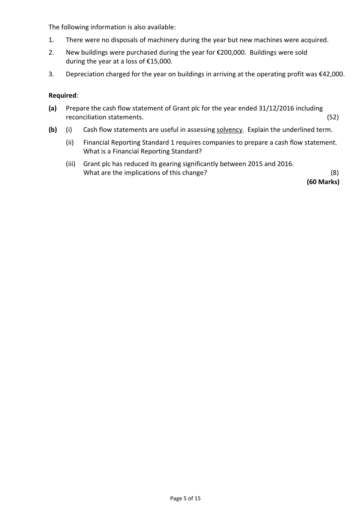
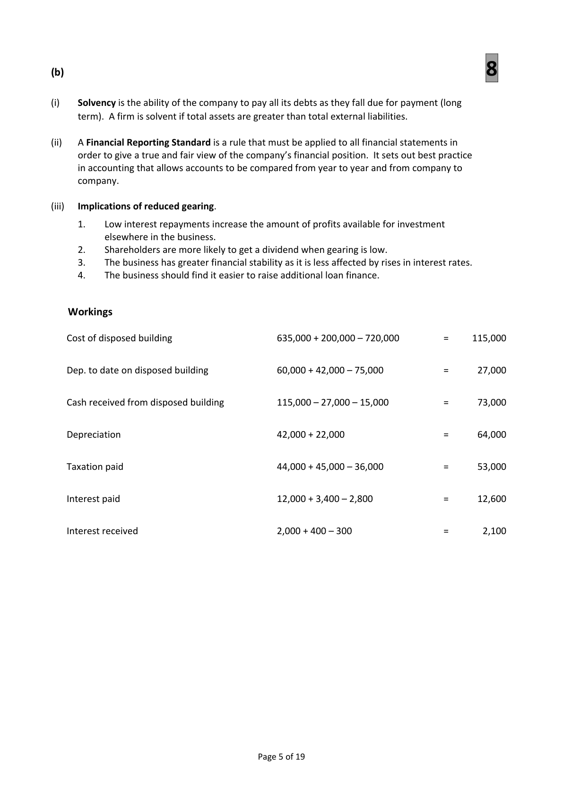
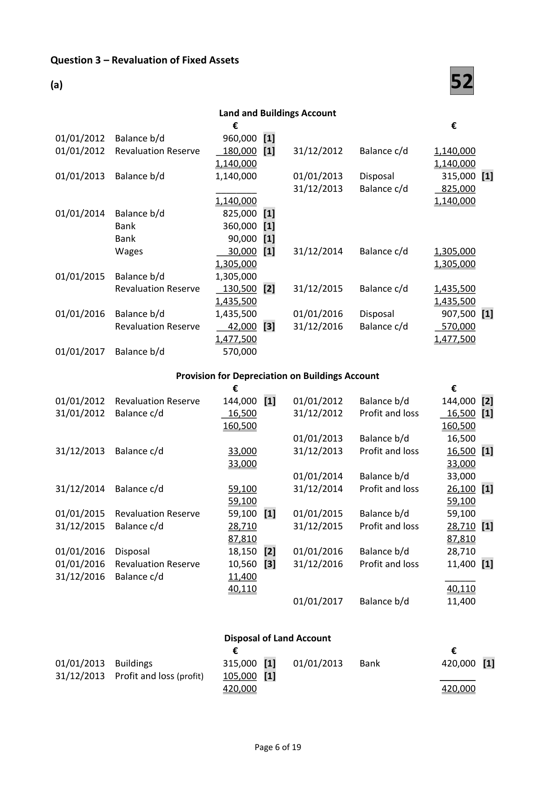

# Question

2.   Cash Flow Statement

     The following are the balance sheets of Grant plc as at 31/12/2016 and 31/12/2015 together
     with an abridged profit and loss account for the year ended 31/12/2016.

     Abridged Profit and Loss Account for the year ended 31/12/2016

                                                               €
  Operating profit                                                  157,000
  Investment income for the year                                        2,000
   Interest for the year                                                    (12,000)
   Profit before taxation                                             147,000
  Taxation for the year                                                   (44,000)
   Profit after taxation                                               103,000
  Dividends paid                                                         (32,000)
  Retained profit for the year                                          71,000
  Retained profit on 01/01/2016                                       85,000
  Retained profit on 31/12/2016                                     156,000

  Balance Sheets as at                        31/12/2016           31/12/2015
  Fixed Assets                             €         €          €          €
  Land and buildings at cost                720,000                635,000
  Less accumulated depreciation             (75,000)     645,000    (60,000)      575,000
  Machinery at cost                       405,000                325,000
  Less accumulated depreciation            (185,000)     220,000   (163,000)     162,000
                                                     865,000                737,000
   Financial Assets
  Investments at cost                                    75,000                280,000
  Current Assets
  Stock                                  151,000                144,000
  Debtors                                148,000                135,000
  Investment income due                    300                   400
  Government securities                    40,000                          ‐‐‐‐‐‐‐‐‐‐
  Cash                                      3,500                   2,000
                                         342,800                 281,400
  Less Creditors: amounts falling due within 1 year
  Trade creditors                         180,000                 210,000
  Bank                                      8,000                  12,000
   Interest due                               2,800                   3,400
  Taxation                                 36,000                  45,000
                                         226,800      116,000    270,400       11,000
                                                      1,056,000                1,028,000
  Financed by
   Creditors: amounts falling due after more than one year
  8% Debentures                                      180,000                350,000
   Capital and Reserves
  Ordinary shares @ €1 each               700,000                 580,000
  Share premium                           20,000                  13,000
   Profit and loss account                   156,000      876,000     85,000     678,000
                                                      1,056,000                1,028,000

                                                                       Continued on page 5

                                              Page 4 of 15

<!-- PAGE 5 -->
# Page 5

<!-- HAS_VISUAL: true -->
<!-- VISUAL_REASON: page contains vector drawings; text contains visual keywords: line; page image extracted because text may not fully capture visual content -->

The following information is also available:

1.   There were no disposals of machinery during the year but new machines were acquired.

2.   New buildings were purchased during the year for €200,000. Buildings were sold
     during the year at a loss of €15,000.

# Marking Scheme

2.      Closing stock                      76,500 – 1,500 + 12,800               87,800

Question 2 – Cash Flow Statement

(a)
                                    52
            Reconciliation of operating profit to net cash flow from operating activities
                                                            €
       Operating profit                                          157,000    [2]
       Deprecation charge for the year                              64,000    [3]
       Loss on sale of fixed assets                                   15,000    [2]
       Increase in stock                                                 (7,000)    [3]
       Increase in debtors                                            (13,000)    [3]
      Decrease in creditors                                           (30,000)   [3]
      Net cash inflow from operating activities                     186,000    [2]

                    Cash Flow Statement of Grant plc for the year ended 31/12/2016

       Operating Activities                              €                 €
        Net cash inflow from operating activities                               186,000
      Return on Investment and Servicing of Finance
          Interest paid                                       (12,600)     [2]
          Interest received                                  2,100      [2]      (10,500)
       Taxation
         Corporation tax paid                                                     (53,000)   [2]
       Capital Expenditure and Financial Investment   [1]
         Sale of investments                             205,000      [2]
         Sale of buildings                                 73,000      [2]
        Purchase of machinery                             (80,000)     [2]
        Purchase of buildings                             (200,000)     [2]        (2,000)
       Equity Dividends Paid                            [1]
         Equity dividends Paid                                                     (32,000) [1]
        Net cash inflow before liquid resources and financing                     88,500  [2]
      Management of Liquid Resources                [1]
        Purchase of government securities                                        (40,000) [1]
       Financing                                          [1]
       Repayment of debentures                         (170,000)     [1]
         Receipts from issue of ordinary shares             120,000      [1]
         Receipts from share premium                       7,000      [1]      (43,000)
       Increase in cash                                                         5,500  [4]

       Reconciliation of net cash to movement in net debt                       €
       Increase in cash                                                         5,500  [1]
      Cash used to purchase liquid resources                                   40,000  [1]
      Cash used to repay debentures                                        170,000  [1]
      Change in net debt                                                   215,500
      Net debt 01/01/2016                                                    (360,000) [1]
      Net debt 31/12/2016                                                    (144,500) [1]

                                            Page 4 of 19

<!-- PAGE 7 -->
# Page 7

<!-- HAS_VISUAL: true -->
<!-- VISUAL_REASON: page contains vector drawings; page image extracted because text may not fully capture visual content -->

(b)                                     8

(i)    Solvency is the ability of the company to pay all its debts as they fall due for payment (long
      term). A firm is solvent if total assets are greater than total external liabilities.

(ii)   A Financial Reporting Standard is a rule that must be applied to all financial statements in
      order to give a true and fair view of the company’s financial position.  It sets out best practice
       in accounting that allows accounts to be compared from year to year and from company to
     company.

(iii)   Implications of reduced gearing.

       1.   Low interest repayments increase the amount of profits available for investment
           elsewhere in the business.
       2.    Shareholders are more likely to get a dividend when gearing is low.
       3.    The business has greater financial stability as it is less affected by rises in interest rates.
       4.    The business should find it easier to raise additional loan finance.

   Workings

   Cost of disposed building                     635,000 + 200,000 – 720,000         =     115,000

   Dep. to date on disposed building              60,000 + 42,000 – 75,000            =      27,000

   Cash received from disposed building           115,000 – 27,000 – 15,000           =      73,000

   Depreciation                                42,000 + 22,000                   =      64,000

   Taxation paid                                44,000 + 45,000 – 36,000            =      53,000

    Interest paid                                12,000 + 3,400 – 2,800              =      12,600

    Interest received                             2,000 + 400 – 300                  =       2,100

                                            Page 5 of 19

<!-- PAGE 8 -->
# Page 8

<!-- HAS_VISUAL: true -->
<!-- VISUAL_REASON: page contains vector drawings; page image extracted because text may not fully capture visual content -->

2.  Member fees            270,000 + 3,000 + 2,700 – 4,200   =    271,500

# Source References

Exam paper:
- file: intermediate_markdown/exam_papers/higher/accounting_higher_2017_paper_1_exam.md
- pages: [5]

Marking scheme:
- file: intermediate_markdown/marking_schemes/higher/accounting_higher_2017_paper_1_marking_scheme.md
- pages: [7, 8]

# Notes

