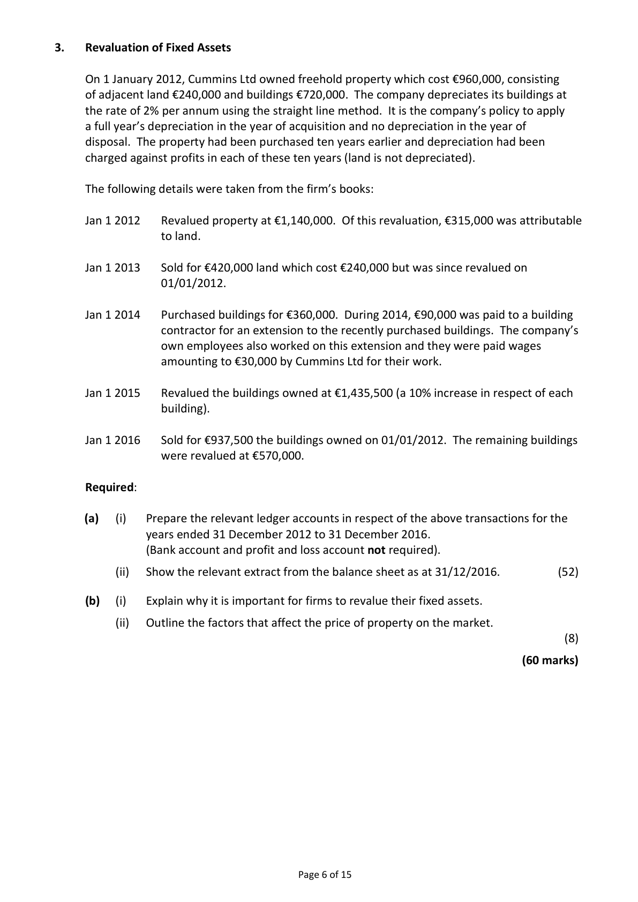
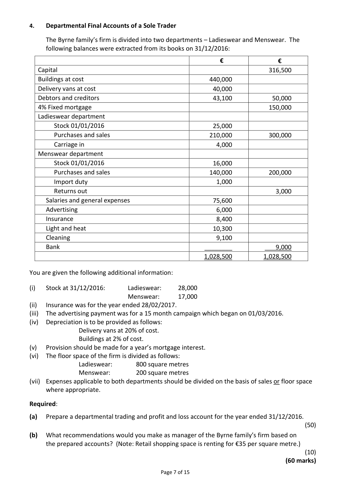
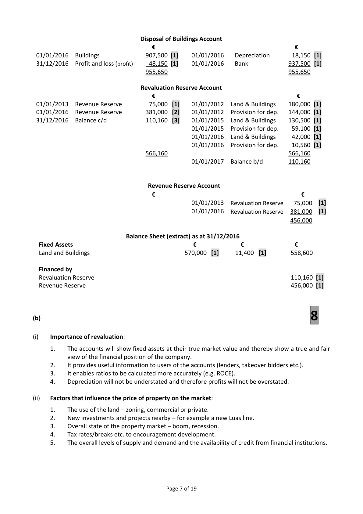
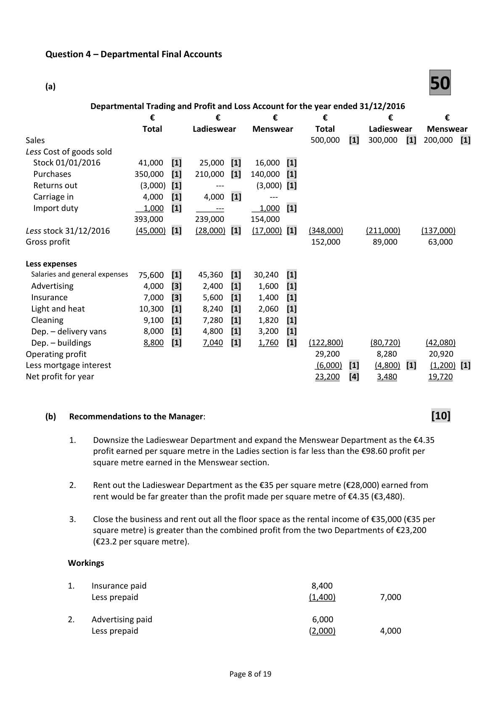

# Question

3.    Depreciation charged for the year on buildings in arriving at the operating profit was €42,000.

Required:

(a)   Prepare the cash flow statement of Grant plc for the year ended 31/12/2016 including
      reconciliation statements.                                                              (52)

(b)    (i)   Cash flow statements are useful in assessing solvency. Explain the underlined term.

         (ii)   Financial Reporting Standard 1 requires companies to prepare a cash flow statement.
        What is a Financial Reporting Standard?

         (iii)  Grant plc has reduced its gearing significantly between 2015 and 2016.
        What are the implications of this change?                                             (8)
                                                                                (60 Marks)

                                        Page 5 of 15

<!-- PAGE 6 -->
# Page 6

<!-- HAS_VISUAL: true -->
<!-- VISUAL_REASON: text contains visual keywords: line, table; page image extracted because text may not fully capture visual content -->

3.    Revaluation of Fixed Assets

    On 1 January 2012, Cummins Ltd owned freehold property which cost €960,000, consisting
      of adjacent land €240,000 and buildings €720,000. The company depreciates its buildings at
     the rate of 2% per annum using the straight line method.  It is the company’s policy to apply
     a full year’s depreciation in the year of acquisition and no depreciation in the year of
      disposal. The property had been purchased ten years earlier and depreciation had been
     charged against profits in each of these ten years (land is not depreciated).

     The following details were taken from the firm’s books:

     Jan 1 2012   Revalued property at €1,140,000. Of this revaluation, €315,000 was attributable
                   to land.

     Jan 1 2013    Sold for €420,000 land which cost €240,000 but was since revalued on
                  01/01/2012.

     Jan 1 2014   Purchased buildings for €360,000. During 2014, €90,000 was paid to a building
                   contractor for an extension to the recently purchased buildings. The company’s
              own employees also worked on this extension and they were paid wages
                 amounting to €30,000 by Cummins Ltd for their work.

     Jan 1 2015   Revalued the buildings owned at €1,435,500 (a 10% increase in respect of each
                      building).

     Jan 1 2016    Sold for €937,500 the buildings owned on 01/01/2012. The remaining buildings
                were revalued at €570,000.

     Required:

      (a)     (i)   Prepare the relevant ledger accounts in respect of the above transactions for the
                years ended 31 December 2012 to 31 December 2016.
               (Bank account and profit and loss account not required).

                  (ii)  Show the relevant extract from the balance sheet as at 31/12/2016.           (52)

      (b)    (i)    Explain why it is important for firms to revalue their fixed assets.

                  (ii)   Outline the factors that affect the price of property on the market.
                                                                                                           (8)

                                                                                  (60 marks)

                                              Page 6 of 15

<!-- PAGE 7 -->
# Page 7

<!-- HAS_VISUAL: true -->
<!-- VISUAL_REASON: page contains vector drawings; page image extracted because text may not fully capture visual content -->

# Marking Scheme

3.      Delivery vans at cost               150,000 – 40,000 + 48,000           158,000

Question 3 – Revaluation of Fixed Assets
(a)                                  52

                                 Land and Buildings Account
                                   €                                         €
 01/01/2012  Balance b/d            960,000  [1]
 01/01/2012  Revaluation Reserve     180,000  [1]    31/12/2012    Balance c/d      1,140,000
                                    1,140,000                                      1,140,000
 01/01/2013  Balance b/d           1,140,000       01/01/2013    Disposal          315,000  [1]
                                ________       31/12/2013    Balance c/d       825,000
                                    1,140,000                                      1,140,000
 01/01/2014  Balance b/d            825,000  [1]
             Bank                  360,000  [1]
             Bank                   90,000  [1]
            Wages                  30,000  [1]    31/12/2014    Balance c/d      1,305,000
                                    1,305,000                                      1,305,000
 01/01/2015  Balance b/d           1,305,000
              Revaluation Reserve     130,500  [2]    31/12/2015    Balance c/d      1,435,500
                                    1,435,500                                      1,435,500
 01/01/2016  Balance b/d           1,435,500       01/01/2016    Disposal          907,500  [1]
              Revaluation Reserve      42,000  [3]    31/12/2016    Balance c/d       570,000
                                    1,477,500                                      1,477,500
 01/01/2017  Balance b/d            570,000

                             Provision for Depreciation on Buildings Account
                                   €                                         €
 01/01/2012  Revaluation Reserve     144,000  [1]    01/01/2012    Balance b/d       144,000  [2]
 31/01/2012  Balance c/d              16,500       31/12/2012    Profit and loss      16,500  [1]
                                    160,500                                      160,500
                                                 01/01/2013    Balance b/d        16,500
 31/12/2013  Balance c/d              33,000       31/12/2013    Profit and loss      16,500  [1]
                                     33,000                                        33,000
                                                 01/01/2014    Balance b/d        33,000
 31/12/2014  Balance c/d              59,100       31/12/2014    Profit and loss      26,100  [1]
                                     59,100                                        59,100
 01/01/2015  Revaluation Reserve      59,100  [1]    01/01/2015    Balance b/d        59,100
 31/12/2015  Balance c/d              28,710       31/12/2015    Profit and loss      28,710  [1]
                                     87,810                                        87,810
 01/01/2016  Disposal                18,150  [2]    01/01/2016    Balance b/d        28,710
 01/01/2016  Revaluation Reserve      10,560  [3]    31/12/2016    Profit and loss      11,400  [1]
 31/12/2016  Balance c/d              11,400                                     ______
                                     40,110                                        40,110
                                                 01/01/2017    Balance b/d        11,400

                                       Disposal of Land Account
                                   €                                         €
 01/01/2013  Buildings               315,000  [1]    01/01/2013   Bank             420,000  [1]
 31/12/2013   Profit and loss (profit)    105,000  [1]                                _______
                                    420,000                                      420,000

                                            Page 6 of 19

<!-- PAGE 9 -->
# Page 9

<!-- HAS_VISUAL: true -->
<!-- VISUAL_REASON: page contains vector drawings; text contains visual keywords: line; page image extracted because text may not fully capture visual content -->

Disposal of Buildings Account
                                   €                                         €
 01/01/2016  Buildings               907,500 [1]    01/01/2016    Depreciation       18,150 [1]
 31/12/2016   Profit and loss (profit)     48,150 [1]    01/01/2016   Bank             937,500 [1]
                                    955,650                                      955,650

                                    Revaluation Reserve Account
                                   €                                          €
 01/01/2013  Revenue Reserve         75,000  [1]    01/01/2012  Land & Buildings    180,000 [1]
 01/01/2016  Revenue Reserve       381,000  [2]    01/01/2012  Provision for dep.   144,000 [1]
 31/12/2016  Balance c/d            110,160  [3]    01/01/2015  Land & Buildings    130,500 [1]
                                                 01/01/2015  Provision for dep.    59,100 [1]
                                                 01/01/2016  Land & Buildings     42,000 [1]
                                 _______       01/01/2016  Provision for dep.    10,560 [1]
                                    566,160                                      566,160
                                                 01/01/2017  Balance b/d        110,160

                                 Revenue Reserve Account
                                   €                                           €
                                                 01/01/2013  Revaluation Reserve   75,000  [1]
                                                 01/01/2016  Revaluation Reserve  381,000  [1]
                                                                                  456,000

                              Balance Sheet (extract) as at 31/12/2016
  Fixed Assets                                   €             €               €
  Land and Buildings                              570,000  [1]     11,400  [1]        558,600

  Financed by
  Revaluation Reserve                                                              110,160 [1]
  Revenue Reserve                                                                 456,000 [1]

(b)                                     8

(i)    Importance of revaluation:

       1.    The accounts will show fixed assets at their true market value and thereby show a true and fair
           view of the financial position of the company.
       2.      It provides useful information to users of the accounts (lenders, takeover bidders etc.).
       3.      It enables ratios to be calculated more accurately (e.g. ROCE).
       4.    Depreciation will not be understated and therefore profits will not be overstated.

(ii)    Factors that influence the price of property on the market:

       1.    The use of the land – zoning, commercial or private.
       2.   New investments and projects nearby – for example a new Luas line.
       3.    Overall state of the property market – boom, recession.
       4.    Tax rates/breaks etc. to encouragement development.
       5.    The overall levels of supply and demand and the availability of credit from financial institutions.

                                            Page 7 of 19

<!-- PAGE 10 -->
# Page 10

<!-- HAS_VISUAL: true -->
<!-- VISUAL_REASON: page contains vector drawings; page image extracted because text may not fully capture visual content -->

3.   Light and heat            5,600 – 300 + 1,800 – 400         =      6,700

# Source References

Exam paper:
- file: intermediate_markdown/exam_papers/higher/accounting_higher_2017_paper_1_exam.md
- pages: [6, 7]

Marking scheme:
- file: intermediate_markdown/marking_schemes/higher/accounting_higher_2017_paper_1_marking_scheme.md
- pages: [9, 10]

# Notes

