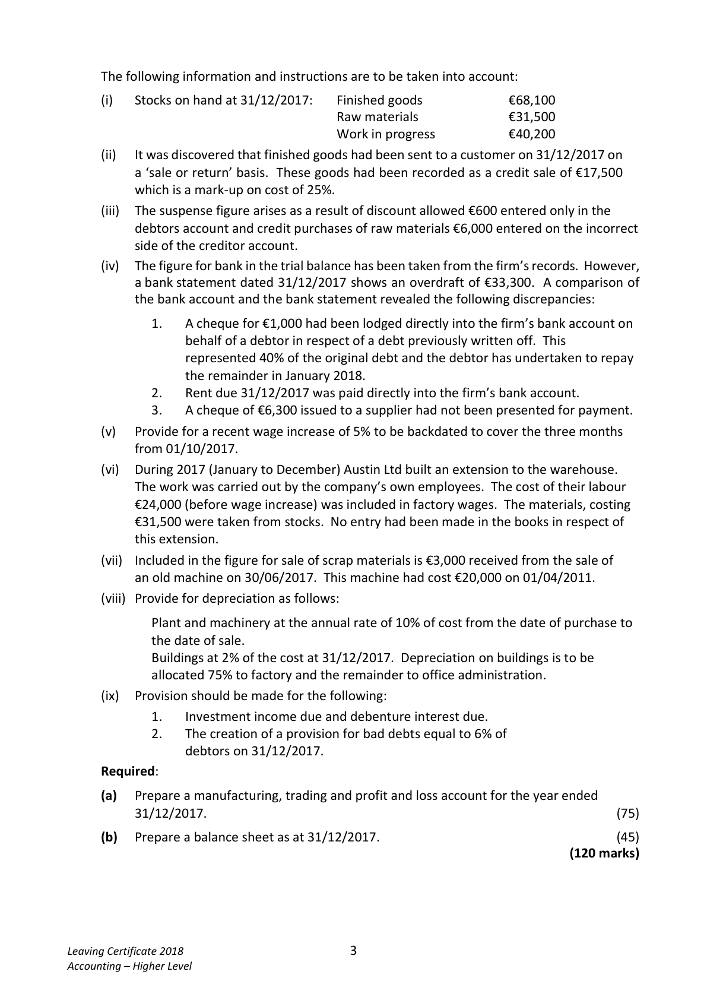

# Question

1.   Company Final Accounts including a Manufacturing Account

     Austin Ltd has an authorised capital of €900,000 divided into 600,000 ordinary shares at €1
     each and 300,000 5% preference shares at €1 each. The following trial balance was
     extracted from the books on 31/12/2017:

                                                       €            €
   Factory buildings (cost €940,000)                        900,000
    Plant and machinery (cost €420,000)                     255,000
    Profit and loss balance 01/01/2017                                     38,000
    Sales                                                               1,400,000
    Sale of scrap materials                                                  5,100
   Bank                                                                43,600
   Debtors and creditors                                   62,000        49,400
    Direct factory wages                                   200,000
   Purchase of raw materials                              514,200
    Selling expenses                                        45,000
   Administration expenses                                 59,200
   General factory overheads (including suspense)             91,400
   Stocks on hand 01/01/2017
       Finished goods                                      43,100
     Raw materials                                       41,500
     Work in progress                                    38,200
  8% Debentures (including €50,000 issued on 01/04/2017)                300,000
   Dividends paid                                          27,500
    Issued share capital   ‐ ordinary shares                                550,000
                                  ‐ 5% preference shares                           250,000
    Hire of special equipment                                39,800
   Discount (net)                                                          8,000
   Royalty payments                                       26,900
   Rent to 30/09/2017                                                     9,000
  4% Investments acquired on 01/03/2017                 330,000
   PAYE, PRSI & USC                                  ________        20,700
                                                         2,673,800     2,673,800

Leaving Certificate 2018                       2
Accounting – Higher Level

<!-- PAGE 3 -->
# Page 3

<!-- HAS_VISUAL: true -->
<!-- VISUAL_REASON: page contains vector drawings; text contains visual keywords: figure; page image extracted because text may not fully capture visual content -->

The following information and instructions are to be taken into account:

        (i)    Stocks on hand at 31/12/2017:    Finished goods             €68,100
                                 Raw materials             €31,500
                                  Work in progress           €40,200
         (ii)    It was discovered that finished goods had been sent to a customer on 31/12/2017 on
          a ‘sale or return’ basis. These goods had been recorded as a credit sale of €17,500
          which is a mark‐up on cost of 25%.
         (iii)  The suspense figure arises as a result of discount allowed €600 entered only in the
          debtors account and credit purchases of raw materials €6,000 entered on the incorrect
            side of the creditor account.
       (iv)  The figure for bank in the trial balance has been taken from the firm’s records. However,
          a bank statement dated 31/12/2017 shows an overdraft of €33,300. A comparison of
          the bank account and the bank statement revealed the following discrepancies:

                1.   A cheque for €1,000 had been lodged directly into the firm’s bank account on
                   behalf of a debtor in respect of a debt previously written off. This
                  represented 40% of the original debt and the debtor has undertaken to repay
                  the remainder in January 2018.

# Marking Scheme

1.   Accounting Policy Notes

     Tangible Fixed Assets [6]

      Buildings were revalued at the end of this year and have been included in the accounts at
      their revalued amount. Depreciation is calculated in order to write off the value or cost of
      tangible fixed assets over their estimated useful economic life, as follows:

      Buildings        2% per annum straight line basis
      Delivery vans     20% per annum reducing balance basis

     Stocks are valued on a first in first out basis at the lower of cost or net realisable value.

# Source References

Exam paper:
- file: intermediate_markdown/exam_papers/higher/accounting_higher_2018_paper_1_exam.md
- pages: [3]

Marking scheme:
- file: intermediate_markdown/marking_schemes/higher/accounting_higher_2018_paper_1_marking_scheme.md
- pages: []

# Notes

