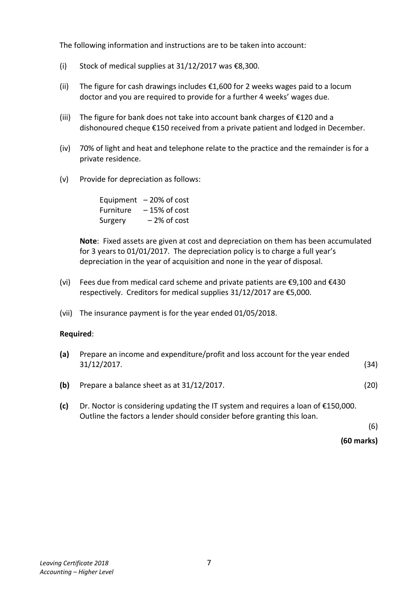
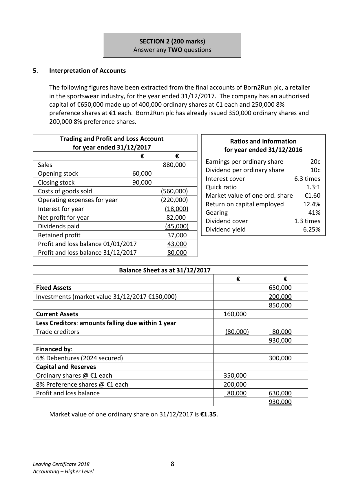

# Question

4.    Service Firm

     The following were included in the assets and liabilities of M. Noctor, a doctor, on
     01/01/2017:

     Surgery €160,000, equipment €90,000, stock of medical supplies €8,000,
    7% investments €70,000, creditors for medical supplies €10,400, furniture €30,000,
    amount owing from medical card scheme €9,500, capital and reserves €284,700,
     insurance prepaid €700.

     The following is a receipts and payments account for the year ended 31/12/2017:

             Receipts and Payments account for the year ended 31/12/2017

 Receipts                         €     Payments                            €
 Balance at bank 01/01/2017         4,000  Purchase of medical supplies            20,600
 Sale of equipment (cost €12,000)     6,000   Cleaning expenses                       3,200
 Medical card scheme              72,000  Insurance                               2,400
 Receipts from private patients      40,750  Sponsorship of prize at local GAA club      2,000
 Investment income                 3,500  Drawings                             37,000
                                                  Light and heat                           3,000
                                         Telephone                              8,450
                                    Wages of receptionist                   15,500
                                           Investment bonds (purchased
                                          31/12/2017)                           30,000
                              _______  Balance at bank 31/12/2017              4,100
                                126,250                                       126,250

Leaving Certificate 2018                       6
Accounting – Higher Level

<!-- PAGE 7 -->
# Page 7

<!-- HAS_VISUAL: true -->
<!-- VISUAL_REASON: text contains visual keywords: figure, line; page image extracted because text may not fully capture visual content -->

The following information and instructions are to be taken into account:

        (i)   Stock of medical supplies at 31/12/2017 was €8,300.

         (ii)   The figure for cash drawings includes €1,600 for 2 weeks wages paid to a locum
           doctor and you are required to provide for a further 4 weeks’ wages due.

         (iii)  The figure for bank does not take into account bank charges of €120 and a
          dishonoured cheque €150 received from a private patient and lodged in December.

       (iv)  70% of light and heat and telephone relate to the practice and the remainder is for a
            private residence.

       (v)   Provide for depreciation as follows:

              Equipment  – 20% of cost
                 Furniture   – 15% of cost
                Surgery     – 2% of cost

          Note: Fixed assets are given at cost and depreciation on them has been accumulated
            for 3 years to 01/01/2017. The depreciation policy is to charge a full year’s
           depreciation in the year of acquisition and none in the year of disposal.

       (vi)  Fees due from medical card scheme and private patients are €9,100 and €430
            respectively. Creditors for medical supplies 31/12/2017 are €5,000.

        (vii)  The insurance payment is for the year ended 01/05/2018.

     Required:

      (a)   Prepare an income and expenditure/profit and loss account for the year ended
          31/12/2017.                                                                       (34)

      (b)   Prepare a balance sheet as at 31/12/2017.                                         (20)

       (c)   Dr. Noctor is considering updating the IT system and requires a loan of €150,000.
           Outline the factors a lender should consider before granting this loan.
                                                                                                         (6)

                                                                                 (60 marks)

Leaving Certificate 2018                       7
Accounting – Higher Level

<!-- PAGE 8 -->
# Page 8

<!-- HAS_VISUAL: true -->
<!-- VISUAL_REASON: page contains vector drawings; text contains visual keywords: figure; page image extracted because text may not fully capture visual content -->

SECTION 2 (200 marks)
                            Answer any TWO questions

# Marking Scheme

4.    Capital expenditure commitments note [2]

     The company has entered into a preliminary contract with Stewart Ltd for the building of an
     extension to its premises for the sum of €400,000. They also intend to carry out further
      capital improvements to existing premises at a cost of €120,000.

# Source References

Exam paper:
- file: intermediate_markdown/exam_papers/higher/accounting_higher_2018_paper_1_exam.md
- pages: [7, 8]

Marking scheme:
- file: intermediate_markdown/marking_schemes/higher/accounting_higher_2018_paper_1_marking_scheme.md
- pages: []

# Notes

