# Question

5.    Interpretation of Accounts

     The following figures have been extracted from the final accounts of Born2Run plc, a retailer
      in the sportswear industry, for the year ended 31/12/2017. The company has an authorised
      capital of €650,000 made up of 400,000 ordinary shares at €1 each and 250,000 8%
     preference shares at €1 each. Born2Run plc has already issued 350,000 ordinary shares and
     200,000 8% preference shares.

         Trading and Profit and Loss Account                                                                  Ratios and information
              for year ended 31/12/2017                                                                    for year ended 31/12/2016
                               €         €
                                                         Earnings per ordinary share        20c  Sales                                  880,000
                                                       Dividend per ordinary share        10c
 Opening stock                 60,000
                                                              Interest cover                 6.3 times
  Closing stock                  90,000
                                                      Quick ratio                         1.3:1
  Costs of goods sold                       (560,000)
                                                  Market value of one ord. share    €1.60
  Operating expenses for year              (220,000)
                                                      Return on capital employed      12.4%
  Interest for year                            (18,000)
                                                       Gearing                    41%
 Net profit for year                        82,000
                                                       Dividend cover                1.3 times
  Dividends paid                             (45,000)                                                       Dividend yield                 6.25%
  Retained profit                           37,000
  Profit and loss balance 01/01/2017         43,000
  Profit and loss balance 31/12/2017         80,000

                           Balance Sheet as at 31/12/2017
                                                          €            €
 Fixed Assets                                                            650,000
 Investments (market value 31/12/2017 €150,000)                            200,000
                                                                        850,000
 Current Assets                                             160,000
 Less Creditors: amounts falling due within 1 year
 Trade creditors                                                  (80,000)       80,000
                                                                        930,000
 Financed by:
 6% Debentures (2024 secured)                                             300,000
 Capital and Reserves
 Ordinary shares @ €1 each                                  350,000
 8% Preference shares @ €1 each                             200,000
 Profit and loss balance                                       80,000       630,000
                                                                        930,000

     Market value of one ordinary share on 31/12/2017 is €1.35.

Leaving Certificate 2018                       8
Accounting – Higher Level

<!-- PAGE 9 -->
# Page 9

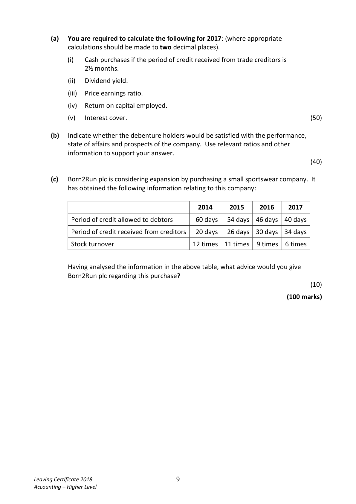

<!-- HAS_VISUAL: true -->
<!-- VISUAL_REASON: page contains vector drawings; text contains visual keywords: table; page image extracted because text may not fully capture visual content -->

(a)  You are required to calculate the following for 2017: (where appropriate
            calculations should be made to two decimal places).

                 (i)   Cash purchases if the period of credit received from trade creditors is
            2½ months.

                  (ii)   Dividend yield.

                  (iii)   Price earnings ratio.

               (iv)  Return on capital employed.

             (v)   Interest cover.                                                               (50)

      (b)   Indicate whether the debenture holders would be satisfied with the performance,
            state of affairs and prospects of the company. Use relevant ratios and other
           information to support your answer.
                                                                                               (40)

       (c)   Born2Run plc is considering expansion by purchasing a small sportswear company.  It
          has obtained the following information relating to this company:

                                             2014     2015    2016    2017

            Period of credit allowed to debtors      60 days   54 days  46 days  40 days

            Period of credit received from creditors   20 days   26 days  30 days  34 days

            Stock turnover                      12 times  11 times  9 times  6 times

          Having analysed the information in the above table, what advice would you give
         Born2Run plc regarding this purchase?
                                                                                               (10)

                                                                             (100 marks)

Leaving Certificate 2018                       9
Accounting – Higher Level

<!-- PAGE 10 -->
# Page 10

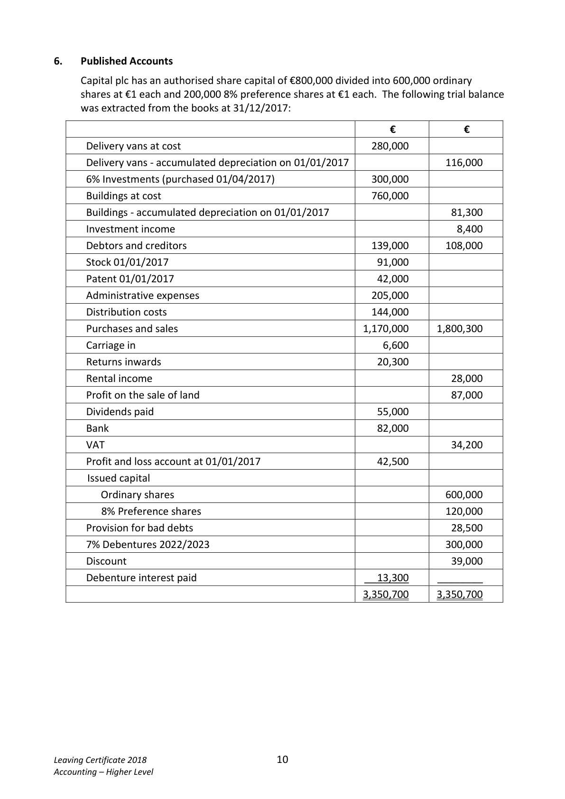

<!-- HAS_VISUAL: true -->
<!-- VISUAL_REASON: page contains vector drawings; page image extracted because text may not fully capture visual content -->

# Marking Scheme

5.    Tangible Fixed Assets [7]

                                       Land and      Delivery       Total
                                              Buildings       Vans
                                         €           €           €
 Cost 01/01/2017                           840,000      280,000     1,120,000
 Disposal                                       (80,000)                     (80,000)
 Revaluation surplus                          90,000     _______        90,000
                                           850,000      280,000     1,130,000

 Accumulated depreciation 01/01/2017         81,300      116,000      197,300
 Charge for year 31/12/2017                   15,200       32,800        48,000
 Transfer to revaluation                        (96,500)    _______        (96,500)
                                                                  ‐‐‐‐‐‐‐‐‐‐      148,800      148,800

 Net book value 01/01/2017                  758,700      164,000      922,700
 Net book value 31/12/2017                  850,000      131,200      981,200

(b)                                           10

    How does the auditor safeguard the interests of the shareholders?
      By examining the financial statements and giving an assurance that they give a true and
          fair view.
      By preparing an audit report and giving an assurance that the financial statements have
       been prepared in accordance with the Companies Acts and accounting standards and
         practices.
      By being able to threaten a qualified audit report thereby discouraging fraud.
       Being independent of the directors, the auditor is appointed by the shareholders and is
        responsible to them.

                                              18

<!-- PAGE 21 -->
# Page 21

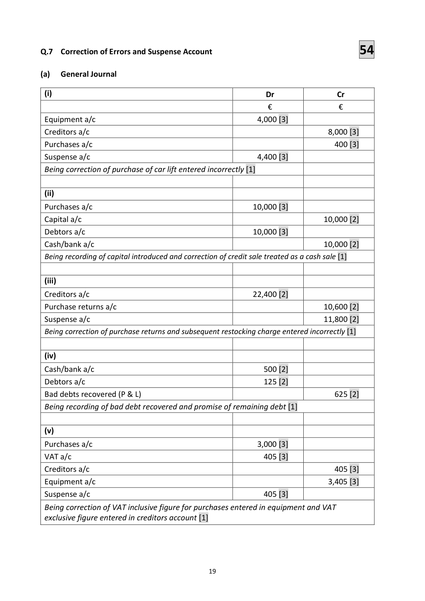

<!-- HAS_VISUAL: true -->
<!-- VISUAL_REASON: page contains vector drawings; text contains visual keywords: figure; page image extracted because text may not fully capture visual content -->

Q.7  Correction of Errors and Suspense Account                    54

(a)   General Journal

  (i)                                                   Dr                 Cr
                                                    €               €
 Equipment a/c                                          4,000 [3]
 Creditors a/c                                                             8,000 [3]
 Purchases a/c                                                        400 [3]
 Suspense a/c                                           4,400 [3]
 Being correction of purchase of car lift entered incorrectly [1]

  (ii)

 Purchases a/c                                        10,000 [3]
 Capital a/c                                                             10,000 [2]
 Debtors a/c                                          10,000 [3]
 Cash/bank a/c                                                          10,000 [2]
 Being recording of capital introduced and correction of credit sale treated as a cash sale [1]

  (iii)

 Creditors a/c                                         22,400 [2]
 Purchase returns a/c                                                    10,600 [2]
 Suspense a/c                                                           11,800 [2]
 Being correction of purchase returns and subsequent restocking charge entered incorrectly [1]

 (iv)

 Cash/bank a/c                                       500 [2]
 Debtors a/c                                         125 [2]
 Bad debts recovered (P & L)                                             625 [2]
 Being recording of bad debt recovered and promise of remaining debt [1]

 (v)

 Purchases a/c                                          3,000 [3]
 VAT a/c                                            405 [3]
 Creditors a/c                                                         405 [3]
 Equipment a/c                                                            3,405 [3]
 Suspense a/c                                        405 [3]

 Being correction of VAT inclusive figure for purchases entered in equipment and VAT
 exclusive figure entered in creditors account [1]

                                              19

<!-- PAGE 22 -->
# Page 22

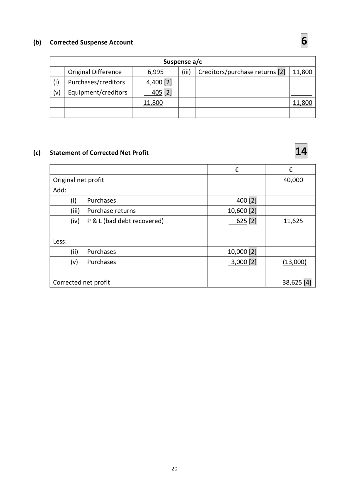

<!-- HAS_VISUAL: true -->
<!-- VISUAL_REASON: page contains vector drawings; page image extracted because text may not fully capture visual content -->

(b)   Corrected Suspense Account                            6

                                      Suspense a/c
            Original Difference        6,995          (iii)  Creditors/purchase returns [2]  11,800
          (i)   Purchases/creditors       4,400 [2]
        (v)  Equipment/creditors       405 [2]                                  ______
                                  11,800                                        11,800

(c)   Statement of Corrected Net Profit                         14

                                                         €              €
       Original net profit                                                       40,000
      Add:
                   (i)   Purchases                                  400 [2]
                     (iii)  Purchase returns                            10,600 [2]
                 (iv)  P & L (bad debt recovered)                    625 [2]        11,625

       Less:
                    (ii)   Purchases                                  10,000 [2]
               (v)   Purchases                                    3,000 [2]         (13,000)

      Corrected net profit                                                     38,625 [4]

                                              20

<!-- PAGE 23 -->
# Page 23

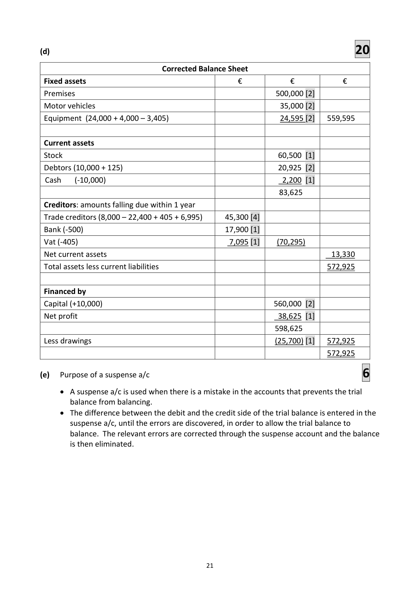

<!-- HAS_VISUAL: true -->
<!-- VISUAL_REASON: page contains vector drawings; page image extracted because text may not fully capture visual content -->

(d)                                           20

                                Corrected Balance Sheet
 Fixed assets                                   €           €           €
 Premises                                                  500,000 [2]
 Motor vehicles                                               35,000 [2]
 Equipment (24,000 + 4,000 – 3,405)                            24,595 [2]   559,595

 Current assets
 Stock                                                       60,500 [1]
 Debtors (10,000 + 125)                                        20,925 [2]
 Cash    (‐10,000)                                              2,200 [1]
                                                             83,625
 Creditors: amounts falling due within 1 year
 Trade creditors (8,000 – 22,400 + 405 + 6,995)      45,300 [4]
 Bank (‐500)                                    17,900 [1]
 Vat (‐405)                                       7,095 [1]     (70,295)
 Net current assets                                                         13,330
 Total assets less current liabilities                                          572,925

 Financed by
 Capital (+10,000)                                           560,000 [2]
 Net profit                                                   38,625 [1]
                                                           598,625
 Less drawings                                                   (25,700) [1]   572,925
                                                                        572,925

(e)   Purpose of a suspense a/c                              6
      A suspense a/c is used when there is a mistake in the accounts that prevents the trial
        balance from balancing.
      The difference between the debit and the credit side of the trial balance is entered in the
        suspense a/c, until the errors are discovered, in order to allow the trial balance to
        balance. The relevant errors are corrected through the suspense account and the balance
           is then eliminated.

                                              21

<!-- PAGE 24 -->
# Page 24

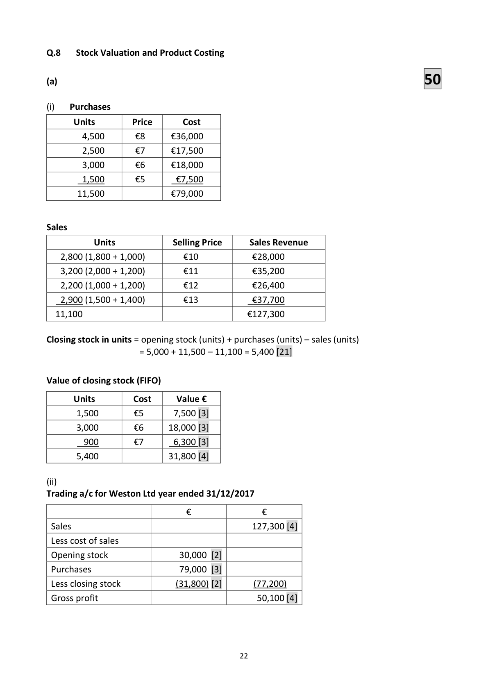

<!-- HAS_VISUAL: true -->
<!-- VISUAL_REASON: page contains vector drawings; page image extracted because text may not fully capture visual content -->

Q.8   Stock Valuation and Product Costing

(a)                                            50

(i)   Purchases

      Units         Price       Cost
        4,500      €8      €36,000
        2,500      €7      €17,500
        3,000      €6      €18,000
        1,500      €5       €7,500
       11,500              €79,000

Sales

           Units               Selling Price       Sales Revenue
   2,800 (1,800 + 1,000)        €10            €28,000
   3,200 (2,000 + 1,200)        €11            €35,200
   2,200 (1,000 + 1,200)        €12            €26,400
   2,900 (1,500 + 1,400)        €13            €37,700
  11,100                                   €127,300

Closing stock in units = opening stock (units) + purchases (units) – sales (units)
                   = 5,000 + 11,500 – 11,100 = 5,400 [21]

Value of closing stock (FIFO)

      Units         Cost     Value €
       1,500       €5       7,500 [3]
       3,000       €6     18,000 [3]
       900       €7       6,300 [3]
       5,400               31,800 [4]

(ii)
Trading a/c for Weston Ltd year ended 31/12/2017

                            €              €
 Sales                                       127,300 [4]
 Less cost of sales
 Opening stock                30,000 [2]
 Purchases                   79,000 [3]
 Less closing stock             (31,800) [2]        (77,200)
 Gross profit                                   50,100 [4]

                                              22

<!-- PAGE 25 -->
# Page 25

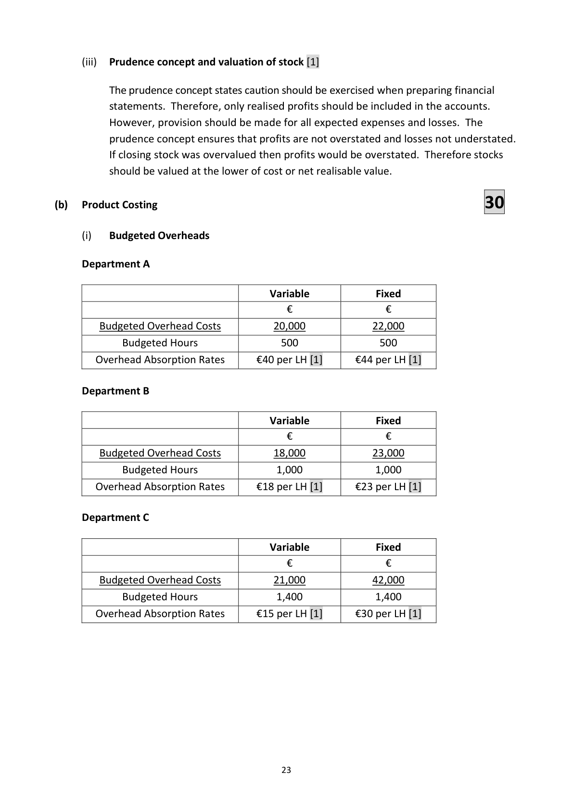

<!-- HAS_VISUAL: true -->
<!-- VISUAL_REASON: page contains vector drawings; page image extracted because text may not fully capture visual content -->

(iii)  Prudence concept and valuation of stock [1]

         The prudence concept states caution should be exercised when preparing financial
           statements. Therefore, only realised profits should be included in the accounts.
         However, provision should be made for all expected expenses and losses. The
          prudence concept ensures that profits are not overstated and losses not understated.
                 If closing stock was overvalued then profits would be overstated. Therefore stocks
          should be valued at the lower of cost or net realisable value.

(b)   Product Costing                                  30

        (i)   Budgeted Overheads

     Department A

                                           Variable             Fixed
                                        €                €
        Budgeted Overhead Costs          20,000            22,000
            Budgeted Hours              500              500
       Overhead Absorption Rates     €40 per LH [1]      €44 per LH [1]

     Department B

                                           Variable             Fixed
                                        €                €
        Budgeted Overhead Costs          18,000            23,000
            Budgeted Hours               1,000              1,000
       Overhead Absorption Rates     €18 per LH [1]      €23 per LH [1]

     Department C

                                           Variable             Fixed
                                        €                €
        Budgeted Overhead Costs          21,000            42,000
            Budgeted Hours               1,400              1,400
       Overhead Absorption Rates     €15 per LH [1]      €30 per LH [1]

                                              23

<!-- PAGE 26 -->
# Page 26

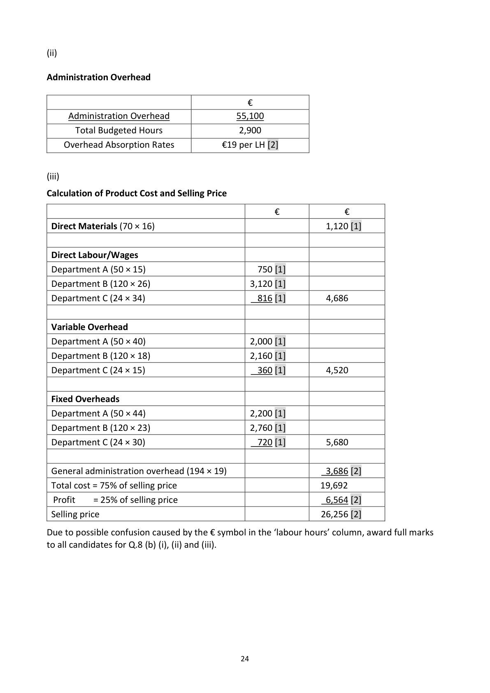

<!-- HAS_VISUAL: true -->
<!-- VISUAL_REASON: page contains vector drawings; page image extracted because text may not fully capture visual content -->

(ii)

Administration Overhead

                                        €
     Administration Overhead               55,100
       Total Budgeted Hours                 2,900
   Overhead Absorption Rates          €19 per LH [2]

(iii)

Calculation of Product Cost and Selling Price

                                              €             €
 Direct Materials (70 × 16)                                      1,120 [1]

 Direct Labour/Wages
 Department A (50 × 15)                      750 [1]
 Department B (120 × 26)                      3,120 [1]
 Department C (24 × 34)                      816 [1]         4,686

 Variable Overhead
 Department A (50 × 40)                       2,000 [1]
 Department B (120 × 18)                      2,160 [1]
 Department C (24 × 15)                      360 [1]         4,520

 Fixed Overheads
 Department A (50 × 44)                       2,200 [1]
 Department B (120 × 23)                      2,760 [1]
 Department C (24 × 30)                      720 [1]         5,680

 General administration overhead (194 × 19)                      3,686 [2]
 Total cost = 75% of selling price                               19,692
  Profit    = 25% of selling price                                 6,564 [2]
 Selling price                                                26,256 [2]

Due to possible confusion caused by the € symbol in the ‘labour hours’ column, award full marks
to all candidates for Q.8 (b) (i), (ii) and (iii).

                                              24

<!-- PAGE 27 -->
# Page 27

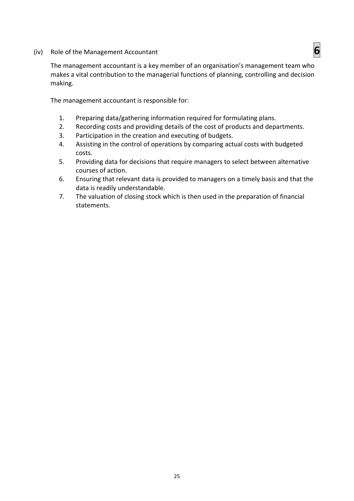

<!-- HAS_VISUAL: true -->
<!-- VISUAL_REASON: page contains vector drawings; page image extracted because text may not fully capture visual content -->

(iv)  Role of the Management Accountant                          6

     The management accountant is a key member of an organisation’s management team who
     makes a vital contribution to the managerial functions of planning, controlling and decision
     making.

     The management accountant is responsible for:

         1.    Preparing data/gathering information required for formulating plans.
         2.    Recording costs and providing details of the cost of products and departments.
         3.    Participation in the creation and executing of budgets.
         4.    Assisting in the control of operations by comparing actual costs with budgeted
               costs.
         5.    Providing data for decisions that require managers to select between alternative
             courses of action.
         6.    Ensuring that relevant data is provided to managers on a timely basis and that the
             data is readily understandable.
         7.   The valuation of closing stock which is then used in the preparation of financial
             statements.

                                              25

<!-- PAGE 28 -->
# Page 28

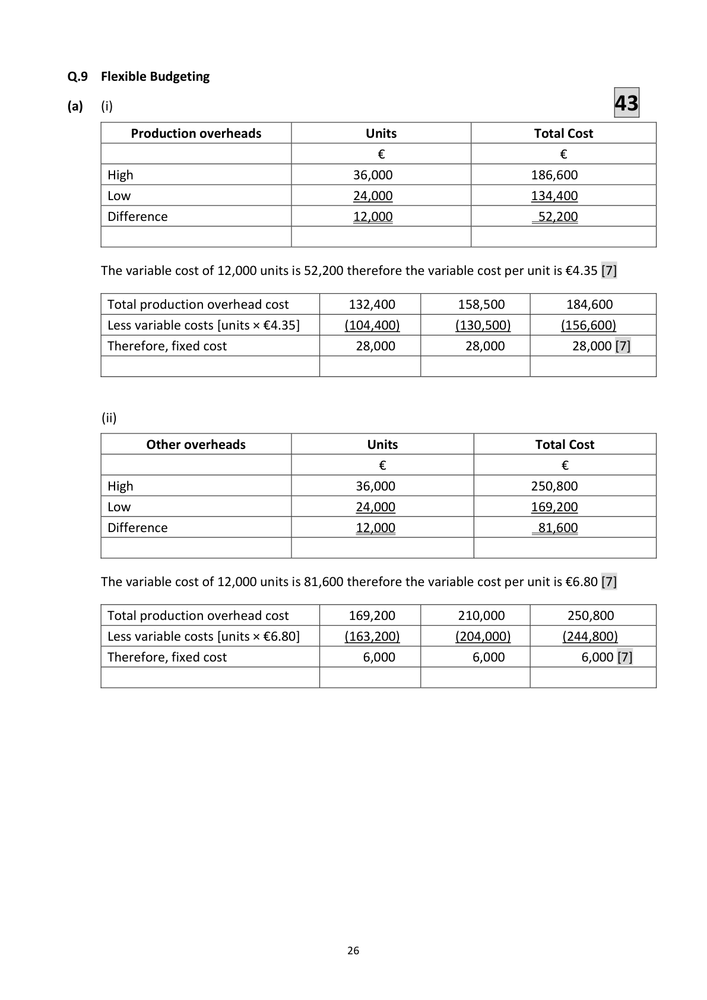

<!-- HAS_VISUAL: true -->
<!-- VISUAL_REASON: page contains vector drawings; page image extracted because text may not fully capture visual content -->

Q.9  Flexible Budgeting
(a)    (i)                                          43

          Production overheads                 Units                       Total Cost
                                           €                        €
      High                                 36,000                     186,600
     Low                                  24,000                     134,400
       Difference                            12,000                      52,200

     The variable cost of 12,000 units is 52,200 therefore the variable cost per unit is €4.35 [7]

       Total production overhead cost         132,400         158,500         184,600
       Less variable costs [units × €4.35]       (104,400)         (130,500)        (156,600)
       Therefore, fixed cost                   28,000           28,000          28,000 [7]

         (ii)

           Other overheads                    Units                       Total Cost
                                           €                        €
      High                                  36,000                    250,800
     Low                                  24,000                    169,200
       Difference                            12,000                      81,600

     The variable cost of 12,000 units is 81,600 therefore the variable cost per unit is €6.80 [7]

       Total production overhead cost         169,200         210,000         250,800
       Less variable costs [units × €6.80]       (163,200)         (204,000)        (244,800)
       Therefore, fixed cost                     6,000            6,000            6,000 [7]

                                              26

<!-- PAGE 29 -->
# Page 29

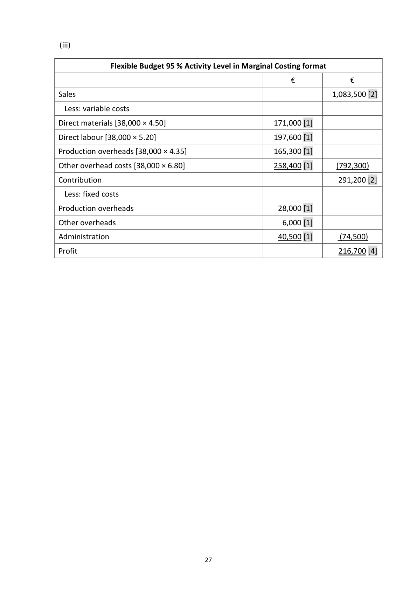

<!-- HAS_VISUAL: true -->
<!-- VISUAL_REASON: page contains vector drawings; page image extracted because text may not fully capture visual content -->

(iii)

                Flexible Budget 95 % Activity Level in Marginal Costing format

                                                       €             €

Sales                                                                    1,083,500 [2]

  Less: variable costs

Direct materials [38,000 × 4.50]                           171,000 [1]

Direct labour [38,000 × 5.20]                              197,600 [1]

Production overheads [38,000 × 4.35]                      165,300 [1]

Other overhead costs [38,000 × 6.80]                      258,400 [1]      (792,300)

Contribution                                                            291,200 [2]

  Less: fixed costs

Production overheads                                     28,000 [1]

Other overheads                                            6,000 [1]

Administration                                           40,500 [1]        (74,500)

Profit                                                                  216,700 [4]

                                         27

<!-- PAGE 30 -->
# Page 30

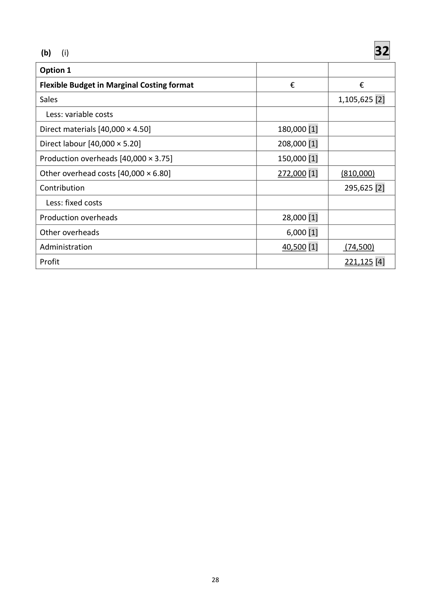

<!-- HAS_VISUAL: true -->
<!-- VISUAL_REASON: page contains vector drawings; page image extracted because text may not fully capture visual content -->

(b)    (i)                                          32

Option 1

Flexible Budget in Marginal Costing format                      €               €

Sales                                                                        1,105,625 [2]

  Less: variable costs

Direct materials [40,000 × 4.50]                               180,000 [1]

Direct labour [40,000 × 5.20]                                  208,000 [1]

Production overheads [40,000 × 3.75]                          150,000 [1]

Other overhead costs [40,000 × 6.80]                          272,000 [1]      (810,000)

Contribution                                                                295,625 [2]

  Less: fixed costs

Production overheads                                         28,000 [1]

Other overheads                                               6,000 [1]

Administration                                               40,500 [1]       (74,500)

Profit                                                                      221,125 [4]

                                               28

<!-- PAGE 31 -->
# Page 31

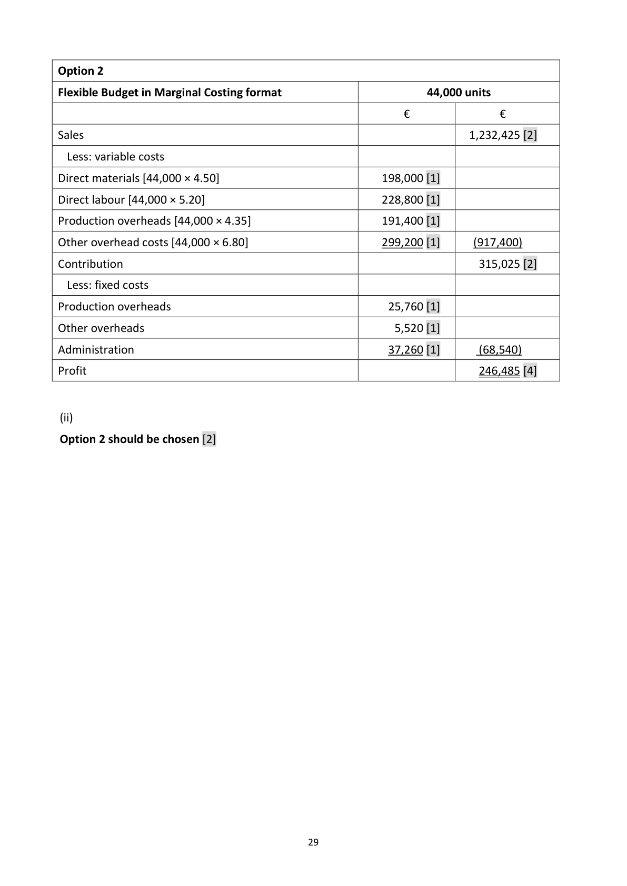

<!-- HAS_VISUAL: true -->
<!-- VISUAL_REASON: page contains vector drawings; page image extracted because text may not fully capture visual content -->

Option 2

Flexible Budget in Marginal Costing format                         44,000 units

                                                      €              €

Sales                                                                    1,232,425 [2]

  Less: variable costs

Direct materials [44,000 × 4.50]                           198,000 [1]

Direct labour [44,000 × 5.20]                              228,800 [1]

Production overheads [44,000 × 4.35]                      191,400 [1]

Other overhead costs [44,000 × 6.80]                      299,200 [1]      (917,400)

Contribution                                                            315,025 [2]

  Less: fixed costs

Production overheads                                     25,760 [1]

Other overheads                                            5,520 [1]

Administration                                           37,260 [1]       (68,540)

Profit                                                                  246,485 [4]

 (ii)

Option 2 should be chosen [2]

                                               29

<!-- PAGE 32 -->
# Page 32

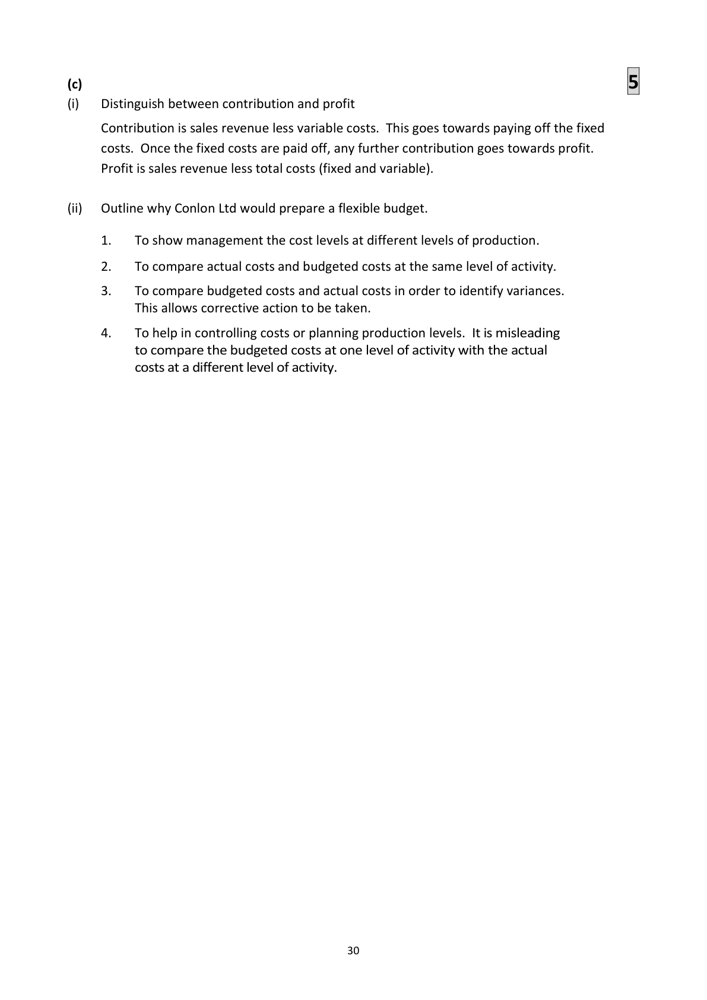

<!-- HAS_VISUAL: true -->
<!-- VISUAL_REASON: page contains vector drawings; text contains visual keywords: line; page image extracted because text may not fully capture visual content -->

(c)                                                  5
(i)    Distinguish between contribution and profit

     Contribution is sales revenue less variable costs. This goes towards paying off the fixed
      costs. Once the fixed costs are paid off, any further contribution goes towards profit.
      Profit is sales revenue less total costs (fixed and variable).

(ii)   Outline why Conlon Ltd would prepare a flexible budget.

      1.   To show management the cost levels at different levels of production.

      2.   To compare actual costs and budgeted costs at the same level of activity.

      3.   To compare budgeted costs and actual costs in order to identify variances.
            This allows corrective action to be taken.

      4.   To help in controlling costs or planning production levels. It is misleading
          to compare the budgeted costs at one level of activity with the actual
           costs at a different level of activity.

                                              30

<!-- PAGE 33 -->
# Page 33

<!-- HAS_VISUAL: true -->
<!-- VISUAL_REASON: page contains vector drawings; text extraction is sparse relative to visible page content; page image extracted because text may not fully capture visual content -->

<!-- EXTRACTION_ISSUE: very sparse extracted text -->

Blank Page

<!-- PAGE 34 -->
# Page 34

<!-- HAS_VISUAL: true -->
<!-- VISUAL_REASON: page contains vector drawings; text extraction is sparse relative to visible page content; page image extracted because text may not fully capture visual content -->

<!-- EXTRACTION_ISSUE: very sparse extracted text -->

Blank Page

<!-- PAGE 35 -->
# Page 35

<!-- HAS_VISUAL: true -->
<!-- VISUAL_REASON: page contains vector drawings; text extraction is sparse relative to visible page content; page image extracted because text may not fully capture visual content -->

<!-- EXTRACTION_ISSUE: very sparse extracted text -->

Blank Page

<!-- PAGE 36 -->
# Page 36

<!-- HAS_VISUAL: true -->
<!-- VISUAL_REASON: page contains vector drawings; text extraction is sparse relative to visible page content; page image extracted because text may not fully capture visual content -->

<!-- EXTRACTION_ISSUE: no extractable text found -->

[No extractable text found]

# Source References

Exam paper:
- file: intermediate_markdown/exam_papers/higher/accounting_higher_2018_paper_1_exam.md
- pages: [9, 10]

Marking scheme:
- file: intermediate_markdown/marking_schemes/higher/accounting_higher_2018_paper_1_marking_scheme.md
- pages: [21, 22, 23, 24, 25, 26, 27, 28, 29, 30, 31, 32, 33, 34, 35, 36]

# Notes

