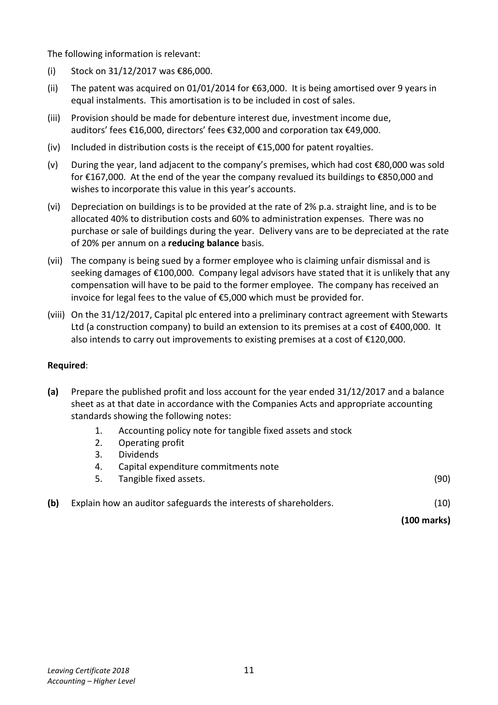
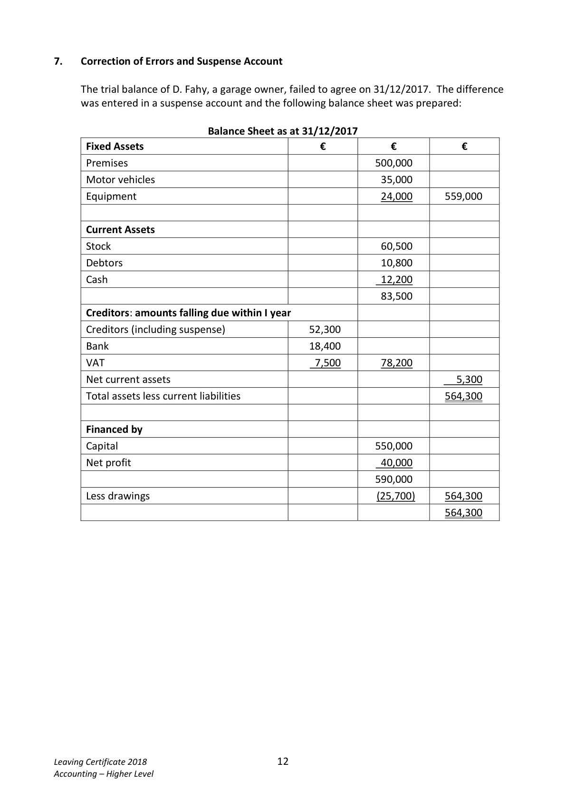

# Question

6.    Published Accounts

      Capital plc has an authorised share capital of €800,000 divided into 600,000 ordinary
     shares at €1 each and 200,000 8% preference shares at €1 each. The following trial balance
    was extracted from the books at 31/12/2017:

                                                          €            €
       Delivery vans at cost                                    280,000
       Delivery vans ‐ accumulated depreciation on 01/01/2017                  116,000
     6% Investments (purchased 01/04/2017)                  300,000
       Buildings at cost                                       760,000
       Buildings ‐ accumulated depreciation on 01/01/2017                       81,300
      Investment income                                                      8,400
      Debtors and creditors                                   139,000       108,000
      Stock 01/01/2017                                       91,000
      Patent 01/01/2017                                      42,000
       Administrative expenses                                205,000
       Distribution costs                                      144,000
      Purchases and sales                                    1,170,000     1,800,300
       Carriage in                                                6,600
      Returns inwards                                         20,300
       Rental income                                                         28,000
        Profit on the sale of land                                                87,000
      Dividends paid                                          55,000
      Bank                                                   82,000
     VAT                                                                  34,200
        Profit and loss account at 01/01/2017                      42,500
       Issued capital
         Ordinary shares                                                   600,000
       8% Preference shares                                              120,000
       Provision for bad debts                                                 28,500
     7% Debentures 2022/2023                                            300,000
      Discount                                                             39,000
      Debenture interest paid                                  13,300     ________
                                                            3,350,700     3,350,700

Leaving Certificate 2018                       10
Accounting – Higher Level

<!-- PAGE 11 -->
# Page 11

<!-- HAS_VISUAL: true -->
<!-- VISUAL_REASON: text contains visual keywords: line; page image extracted because text may not fully capture visual content -->

The following information is relevant:

(i)   Stock on 31/12/2017 was €86,000.

(ii)   The patent was acquired on 01/01/2014 for €63,000.  It is being amortised over 9 years in
     equal instalments. This amortisation is to be included in cost of sales.

(iii)   Provision should be made for debenture interest due, investment income due,
      auditors’ fees €16,000, directors’ fees €32,000 and corporation tax €49,000.

(iv)  Included in distribution costs is the receipt of €15,000 for patent royalties.

(v)   During the year, land adjacent to the company’s premises, which had cost €80,000 was sold
      for €167,000. At the end of the year the company revalued its buildings to €850,000 and
     wishes to incorporate this value in this year’s accounts.

(vi)  Depreciation on buildings is to be provided at the rate of 2% p.a. straight line, and is to be
      allocated 40% to distribution costs and 60% to administration expenses. There was no
     purchase or sale of buildings during the year. Delivery vans are to be depreciated at the rate
      of 20% per annum on a reducing balance basis.

(vii)  The company is being sued by a former employee who is claiming unfair dismissal and is
     seeking damages of €100,000. Company legal advisors have stated that it is unlikely that any
     compensation will have to be paid to the former employee. The company has received an
      invoice for legal fees to the value of €5,000 which must be provided for.

(viii) On the 31/12/2017, Capital plc entered into a preliminary contract agreement with Stewarts
      Ltd (a construction company) to build an extension to its premises at a cost of €400,000.  It
      also intends to carry out improvements to existing premises at a cost of €120,000.

Required:

(a)   Prepare the published profit and loss account for the year ended 31/12/2017 and a balance
     sheet as at that date in accordance with the Companies Acts and appropriate accounting
     standards showing the following notes:
            1.    Accounting policy note for tangible fixed assets and stock
            2.    Operating profit
            3.    Dividends
            4.    Capital expenditure commitments note
            5.    Tangible fixed assets.                                                        (90)

(b)   Explain how an auditor safeguards the interests of shareholders.                         (10)

                                                                             (100 marks)

Leaving Certificate 2018                       11
Accounting – Higher Level

<!-- PAGE 12 -->
# Page 12

<!-- HAS_VISUAL: true -->
<!-- VISUAL_REASON: page contains vector drawings; page image extracted because text may not fully capture visual content -->

# Marking Scheme

[No matching marking scheme section detected.]

# Source References

Exam paper:
- file: intermediate_markdown/exam_papers/higher/accounting_higher_2018_paper_1_exam.md
- pages: [11, 12]

Marking scheme:
- file: 
- pages: []

# Notes

