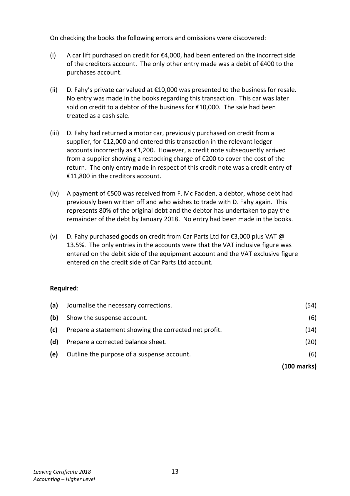
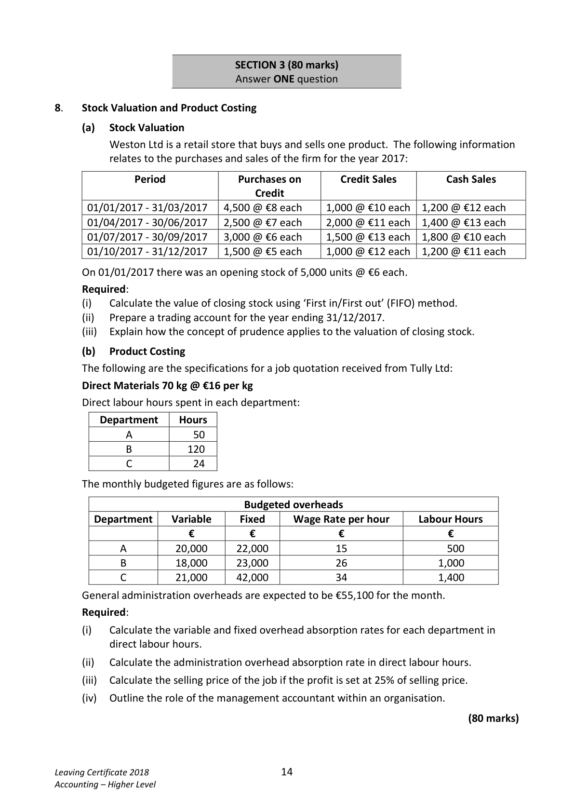

# Question

7.    Correction of Errors and Suspense Account

     The trial balance of D. Fahy, a garage owner, failed to agree on 31/12/2017. The difference
    was entered in a suspense account and the following balance sheet was prepared:

                             Balance Sheet as at 31/12/2017
      Fixed Assets                              €           €           €
      Premises                                              500,000
     Motor vehicles                                           35,000
      Equipment                                              24,000      559,000

      Current Assets
      Stock                                                   60,500
      Debtors                                                 10,800
      Cash                                                    12,200
                                                              83,500
       Creditors: amounts falling due within I year
       Creditors (including suspense)                52,300
      Bank                                      18,400
     VAT                                        7,500        78,200
      Net current assets                                                       5,300
       Total assets less current liabilities                                      564,300

      Financed by
       Capital                                                550,000
      Net profit                                               40,000
                                                            590,000
       Less drawings                                               (25,700)      564,300
                                                                         564,300

Leaving Certificate 2018                       12
Accounting – Higher Level

<!-- PAGE 13 -->
# Page 13

<!-- HAS_VISUAL: true -->
<!-- VISUAL_REASON: text contains visual keywords: figure, line; page image extracted because text may not fully capture visual content -->

On checking the books the following errors and omissions were discovered:

        (i)   A car lift purchased on credit for €4,000, had been entered on the incorrect side
           of the creditors account. The only other entry made was a debit of €400 to the
          purchases account.

         (ii)   D. Fahy’s private car valued at €10,000 was presented to the business for resale.
        No entry was made in the books regarding this transaction. This car was later
           sold on credit to a debtor of the business for €10,000. The sale had been
           treated as a cash sale.

         (iii)  D. Fahy had returned a motor car, previously purchased on credit from a
            supplier, for €12,000 and entered this transaction in the relevant ledger
          accounts incorrectly as €1,200. However, a credit note subsequently arrived
          from a supplier showing a restocking charge of €200 to cover the cost of the
            return. The only entry made in respect of this credit note was a credit entry of
          €11,800 in the creditors account.

       (iv)  A payment of €500 was received from F. Mc Fadden, a debtor, whose debt had
           previously been written off and who wishes to trade with D. Fahy again. This
           represents 80% of the original debt and the debtor has undertaken to pay the
          remainder of the debt by January 2018. No entry had been made in the books.

       (v)   D. Fahy purchased goods on credit from Car Parts Ltd for €3,000 plus VAT @
          13.5%. The only entries in the accounts were that the VAT inclusive figure was
          entered on the debit side of the equipment account and the VAT exclusive figure
          entered on the credit side of Car Parts Ltd account.

     Required:

      (a)   Journalise the necessary corrections.                                               (54)

      (b)  Show the suspense account.                                                              (6)

       (c)   Prepare a statement showing the corrected net profit.                             (14)

      (d)   Prepare a corrected balance sheet.                                                 (20)

      (e)   Outline the purpose of a suspense account.                                             (6)

                                                                             (100 marks)

Leaving Certificate 2018                       13
Accounting – Higher Level

<!-- PAGE 14 -->
# Page 14

<!-- HAS_VISUAL: true -->
<!-- VISUAL_REASON: page contains vector drawings; text contains visual keywords: figure, line; page image extracted because text may not fully capture visual content -->

SECTION 3 (80 marks)
                               Answer ONE question

# Marking Scheme

[No matching marking scheme section detected.]

# Source References

Exam paper:
- file: intermediate_markdown/exam_papers/higher/accounting_higher_2018_paper_1_exam.md
- pages: [13, 14]

Marking scheme:
- file: 
- pages: []

# Notes

