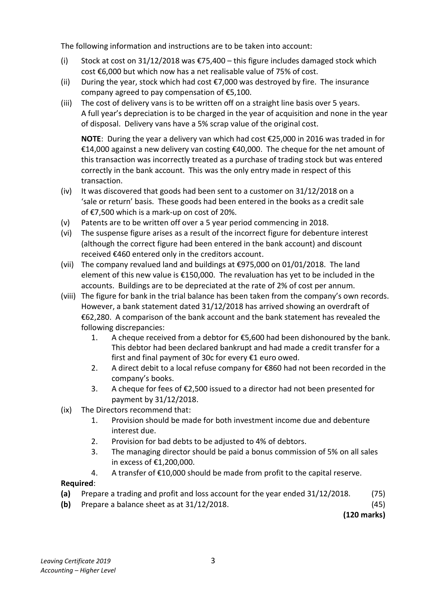

# Question

1.   Company Final Accounts

     Linken Ltd, has an authorised capital of €1,200,000 divided into 700,000 ordinary shares at
     €1 each and 500,000 5% preference shares at €1 each. The following trial balance was extracted
     from its books at 31/12/2018:

                                                         €             €

       Land and buildings at cost                            850,000

       Accumulated depreciation ‐ land and buildings                             55,000

         Delivery vans (cost €155,000)                         120,000

        Discount (net)                                                         15,500

         Profit and loss balance 01/01/2018                                       71,500

        Stocks on hand 01/01/2018                            64,500

       Debenture interest for the first three months              6,400

      3% Investments 01/04/2018                          360,000

        Patents (incorporating 5 months investment income)      43,500

        Purchases and sales                                 1,045,000         1,590,000

        Dividends paid                                       55,000

       Bad debts provision                                                      4,000

        Debtors and creditors                                 98,200           69,100

       Bank                                                                 60,000

         Salaries and general expenses (including suspense)       243,100

      7% Debentures (including €60,000 issued on 01/04/2018)                 300,000

        Issued share capital  – ordinary shares                                  500,000

                         – 5% preference shares                            200,000

       VAT                                                                    6,800

        Advertising                                          31,200

         Capital reserve                                  ________           45,000

                                                           2,916,900         2,916,900

Leaving Certificate 2019                       2
Accounting – Higher Level

<!-- PAGE 3 -->
# Page 3

<!-- HAS_VISUAL: true -->
<!-- VISUAL_REASON: text contains visual keywords: figure, line; page image extracted because text may not fully capture visual content -->

The following information and instructions are to be taken into account:

        (i)   Stock at cost on 31/12/2018 was €75,400 – this figure includes damaged stock which
           cost €6,000 but which now has a net realisable value of 75% of cost.
         (ii)   During the year, stock which had cost €7,000 was destroyed by fire. The insurance
         company agreed to pay compensation of €5,100.
         (iii)  The cost of delivery vans is to be written off on a straight line basis over 5 years.
        A full year’s depreciation is to be charged in the year of acquisition and none in the year
           of disposal. Delivery vans have a 5% scrap value of the original cost.

         NOTE: During the year a delivery van which had cost €25,000 in 2016 was traded in for
          €14,000 against a new delivery van costing €40,000. The cheque for the net amount of
             this transaction was incorrectly treated as a purchase of trading stock but was entered
            correctly in the bank account. This was the only entry made in respect of this
            transaction.
       (iv)    It was discovered that goods had been sent to a customer on 31/12/2018 on a
             ‘sale or return’ basis. These goods had been entered in the books as a credit sale
           of €7,500 which is a mark‐up on cost of 20%.
       (v)   Patents are to be written off over a 5 year period commencing in 2018.
       (vi)  The suspense figure arises as a result of the incorrect figure for debenture interest
           (although the correct figure had been entered in the bank account) and discount
           received €460 entered only in the creditors account.
        (vii)  The company revalued land and buildings at €975,000 on 01/01/2018. The land
          element of this new value is €150,000. The revaluation has yet to be included in the
           accounts. Buildings are to be depreciated at the rate of 2% of cost per annum.
        (viii) The figure for bank in the trial balance has been taken from the company’s own records.
          However, a bank statement dated 31/12/2018 has arrived showing an overdraft of
           €62,280. A comparison of the bank account and the bank statement has revealed the
           following discrepancies:
                1.   A cheque received from a debtor for €5,600 had been dishonoured by the bank.
                    This debtor had been declared bankrupt and had made a credit transfer for a
                          first and final payment of 30c for every €1 euro owed.

# Marking Scheme

1.    Sales                       1,590,000 – 7,500                        1,582,500

1.   Investment income      2,800 – 400 + 300 = 2,700 = 4%
     4 % Investment          2,700/4 × 100 = 67,500

1.    Operating profit                               79,750       [1]

# Source References

Exam paper:
- file: intermediate_markdown/exam_papers/higher/accounting_higher_2019_paper_1_exam.md
- pages: [3]

Marking scheme:
- file: intermediate_markdown/marking_schemes/higher/accounting_higher_2019_paper_1_marking_scheme.md
- pages: []

# Notes

