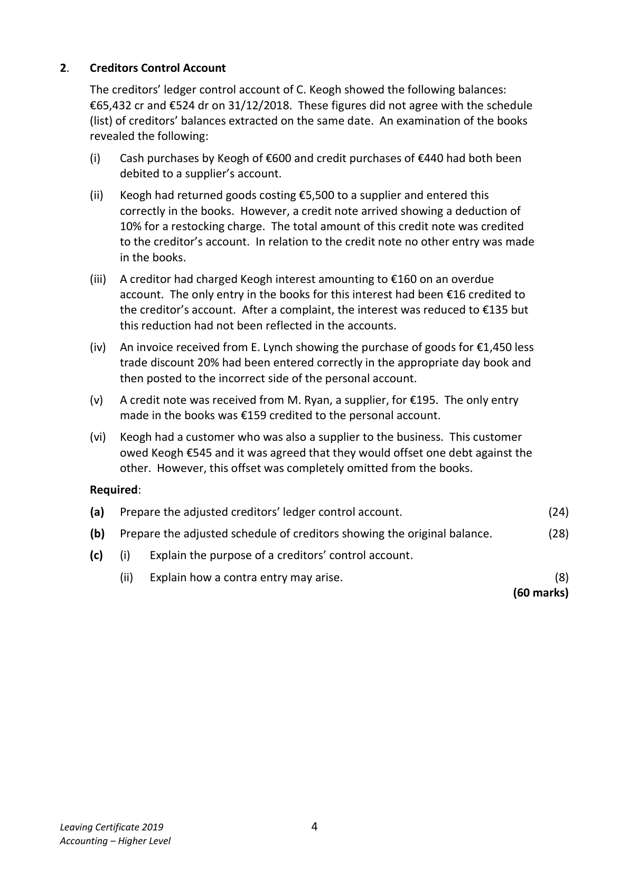
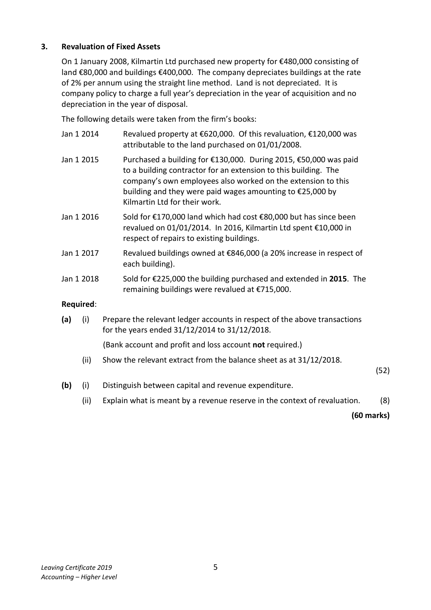
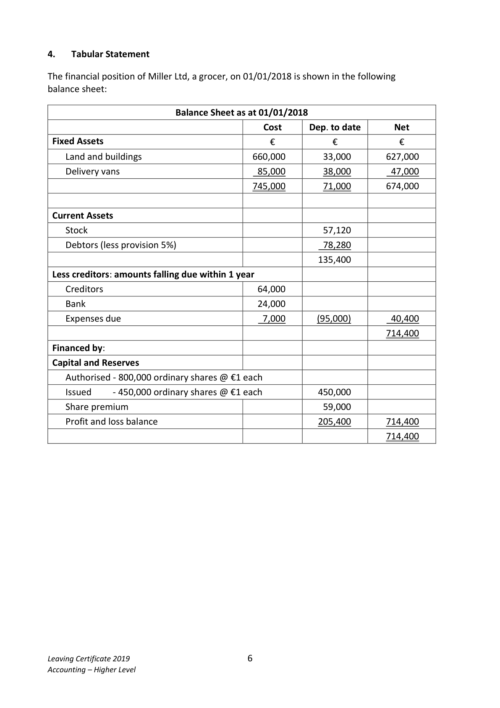
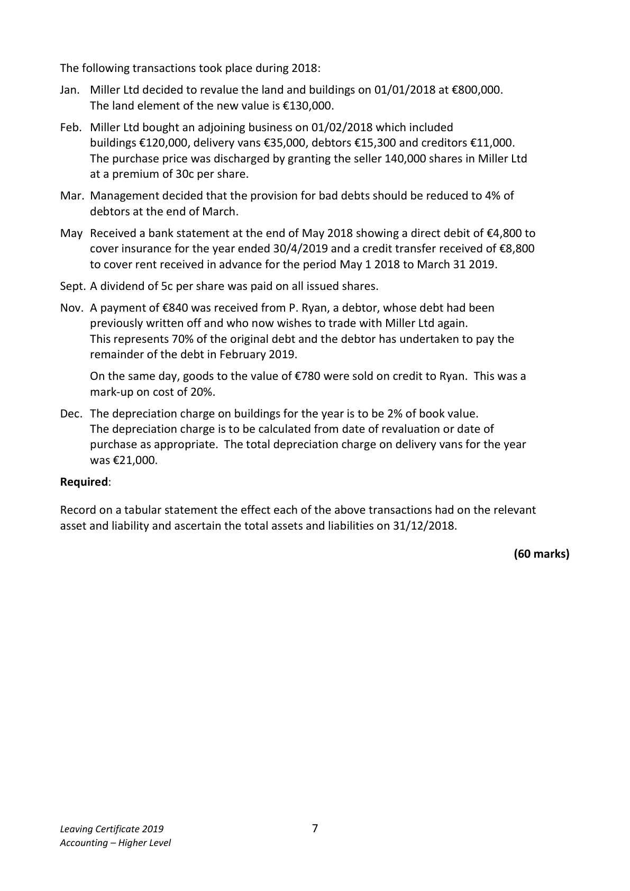
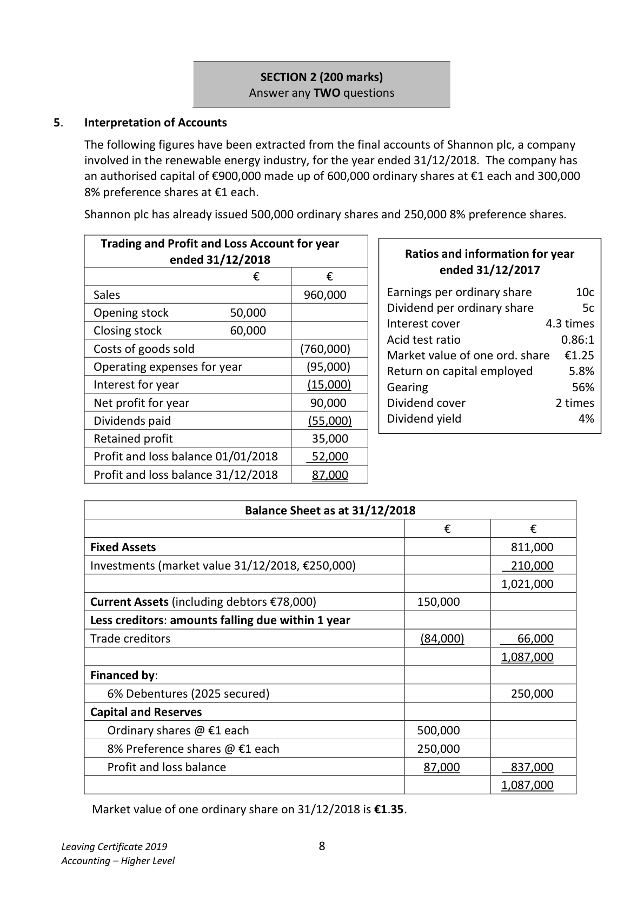

# Question

4.   A transfer of €10,000 should be made from profit to the capital reserve.
     Required:
      (a)   Prepare a trading and profit and loss account for the year ended 31/12/2018.      (75)
      (b)   Prepare a balance sheet as at 31/12/2018.                                         (45)
                                                                             (120 marks)

Leaving Certificate 2019                       3
Accounting – Higher Level

<!-- PAGE 4 -->
# Page 4

<!-- HAS_VISUAL: true -->
<!-- VISUAL_REASON: text contains visual keywords: figure; page image extracted because text may not fully capture visual content -->

2.    Creditors Control Account

     The creditors’ ledger control account of C. Keogh showed the following balances:
     €65,432 cr and €524 dr on 31/12/2018. These figures did not agree with the schedule
        (list) of creditors’ balances extracted on the same date. An examination of the books
     revealed the following:

        (i)   Cash purchases by Keogh of €600 and credit purchases of €440 had both been
           debited to a supplier’s account.

         (ii)   Keogh had returned goods costing €5,500 to a supplier and entered this
            correctly in the books. However, a credit note arrived showing a deduction of
        10% for a restocking charge. The total amount of this credit note was credited
           to the creditor’s account. In relation to the credit note no other entry was made
             in the books.

         (iii)  A creditor had charged Keogh interest amounting to €160 on an overdue
           account. The only entry in the books for this interest had been €16 credited to
          the creditor’s account. After a complaint, the interest was reduced to €135 but
             this reduction had not been reflected in the accounts.

       (iv)  An invoice received from E. Lynch showing the purchase of goods for €1,450 less
           trade discount 20% had been entered correctly in the appropriate day book and
          then posted to the incorrect side of the personal account.

       (v)  A credit note was received from M. Ryan, a supplier, for €195. The only entry
        made in the books was €159 credited to the personal account.

       (vi)  Keogh had a customer who was also a supplier to the business. This customer
        owed Keogh €545 and it was agreed that they would offset one debt against the
           other. However, this offset was completely omitted from the books.

     Required:

      (a)   Prepare the adjusted creditors’ ledger control account.                            (24)

      (b)   Prepare the adjusted schedule of creditors showing the original balance.           (28)

       (c)     (i)    Explain the purpose of a creditors’ control account.

                  (ii)   Explain how a contra entry may arise.                                             (8)
                                                                                 (60 marks)

Leaving Certificate 2019                       4
Accounting – Higher Level

<!-- PAGE 5 -->
# Page 5

<!-- HAS_VISUAL: true -->
<!-- VISUAL_REASON: text contains visual keywords: line, table; page image extracted because text may not fully capture visual content -->

3.    Revaluation of Fixed Assets

    On 1 January 2008, Kilmartin Ltd purchased new property for €480,000 consisting of
     land €80,000 and buildings €400,000. The company depreciates buildings at the rate
      of 2% per annum using the straight line method. Land is not depreciated.  It is
    company policy to charge a full year’s depreciation in the year of acquisition and no
      depreciation in the year of disposal.

     The following details were taken from the firm’s books:

     Jan 1 2014      Revalued property at €620,000. Of this revaluation, €120,000 was
                       attributable to the land purchased on 01/01/2008.

     Jan 1 2015      Purchased a building for €130,000. During 2015, €50,000 was paid
                      to a building contractor for an extension to this building. The
                   company’s own employees also worked on the extension to this
                       building and they were paid wages amounting to €25,000 by
                       Kilmartin Ltd for their work.

     Jan 1 2016      Sold for €170,000 land which had cost €80,000 but has since been
                     revalued on 01/01/2014. In 2016, Kilmartin Ltd spent €10,000 in
                      respect of repairs to existing buildings.

     Jan 1 2017      Revalued buildings owned at €846,000 (a 20% increase in respect of
                    each building).

     Jan 1 2018      Sold for €225,000 the building purchased and extended in 2015. The
                     remaining buildings were revalued at €715,000.

     Required:

      (a)    (i)   Prepare the relevant ledger accounts in respect of the above transactions
                  for the years ended 31/12/2014 to 31/12/2018.

               (Bank account and profit and loss account not required.)

                  (ii)  Show the relevant extract from the balance sheet as at 31/12/2018.
                                                                                               (52)

      (b)    (i)    Distinguish between capital and revenue expenditure.

                  (ii)   Explain what is meant by a revenue reserve in the context of revaluation.      (8)

                                                                                 (60 marks)

Leaving Certificate 2019                       5
Accounting – Higher Level

<!-- PAGE 6 -->
# Page 6

<!-- HAS_VISUAL: true -->
<!-- VISUAL_REASON: page contains vector drawings; page image extracted because text may not fully capture visual content -->

4.    Tabular Statement

The financial position of Miller Ltd, a grocer, on 01/01/2018 is shown in the following
balance sheet:

                           Balance Sheet as at 01/01/2018
                                               Cost      Dep. to date       Net
 Fixed Assets                                 €           €            €
    Land and buildings                       660,000        33,000       627,000
    Delivery vans                             85,000        38,000         47,000
                                           745,000        71,000       674,000

 Current Assets
    Stock                                                  57,120
    Debtors (less provision 5%)                               78,280
                                                         135,400
 Less creditors: amounts falling due within 1 year
    Creditors                                 64,000
    Bank                                     24,000
    Expenses due                               7,000       (95,000)         40,400
                                                                       714,400
 Financed by:
 Capital and Reserves
    Authorised ‐ 800,000 ordinary shares @ €1 each
    Issued       ‐ 450,000 ordinary shares @ €1 each            450,000
    Share premium                                          59,000
     Profit and loss balance                                  205,400       714,400
                                                                       714,400

Leaving Certificate 2019                       6
Accounting – Higher Level

<!-- PAGE 7 -->
# Page 7

The following transactions took place during 2018:

Jan.  Miller Ltd decided to revalue the land and buildings on 01/01/2018 at €800,000.
     The land element of the new value is €130,000.

Feb.  Miller Ltd bought an adjoining business on 01/02/2018 which included
      buildings €120,000, delivery vans €35,000, debtors €15,300 and creditors €11,000.
     The purchase price was discharged by granting the seller 140,000 shares in Miller Ltd
      at a premium of 30c per share.

Mar. Management decided that the provision for bad debts should be reduced to 4% of
     debtors at the end of March.

May Received a bank statement at the end of May 2018 showing a direct debit of €4,800 to
     cover insurance for the year ended 30/4/2019 and a credit transfer received of €8,800
     to cover rent received in advance for the period May 1 2018 to March 31 2019.

Sept. A dividend of 5c per share was paid on all issued shares.

Nov. A payment of €840 was received from P. Ryan, a debtor, whose debt had been
      previously written off and who now wishes to trade with Miller Ltd again.
      This represents 70% of the original debt and the debtor has undertaken to pay the
     remainder of the debt in February 2019.

    On the same day, goods to the value of €780 were sold on credit to Ryan. This was a
     mark‐up on cost of 20%.

Dec. The depreciation charge on buildings for the year is to be 2% of book value.
     The depreciation charge is to be calculated from date of revaluation or date of
     purchase as appropriate. The total depreciation charge on delivery vans for the year
    was €21,000.

Required:

Record on a tabular statement the effect each of the above transactions had on the relevant
asset and liability and ascertain the total assets and liabilities on 31/12/2018.

                                                                                 (60 marks)

Leaving Certificate 2019                       7
Accounting – Higher Level

<!-- PAGE 8 -->
# Page 8

<!-- HAS_VISUAL: true -->
<!-- VISUAL_REASON: page contains vector drawings; text contains visual keywords: figure; page image extracted because text may not fully capture visual content -->

SECTION 2 (200 marks)
                              Answer any TWO questions

# Marking Scheme

4.    Patents                     (43,500 + 4,500) ÷ 5                          9,600

4.    Subscriptions              126,900 + 1,900 – 15,000 – 900 – 30,000 – 1,000 81,900

4.    Profit before tax                              74,950

# Source References

Exam paper:
- file: intermediate_markdown/exam_papers/higher/accounting_higher_2019_paper_1_exam.md
- pages: [4, 5, 6, 7, 8]

Marking scheme:
- file: intermediate_markdown/marking_schemes/higher/accounting_higher_2019_paper_1_marking_scheme.md
- pages: []

# Notes

