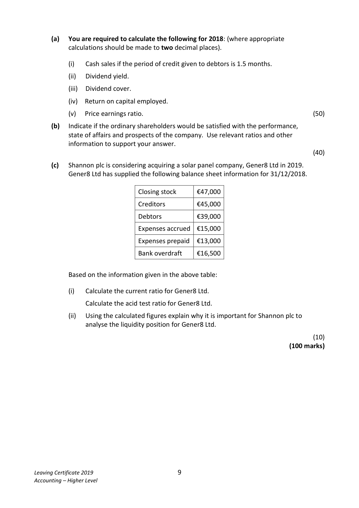
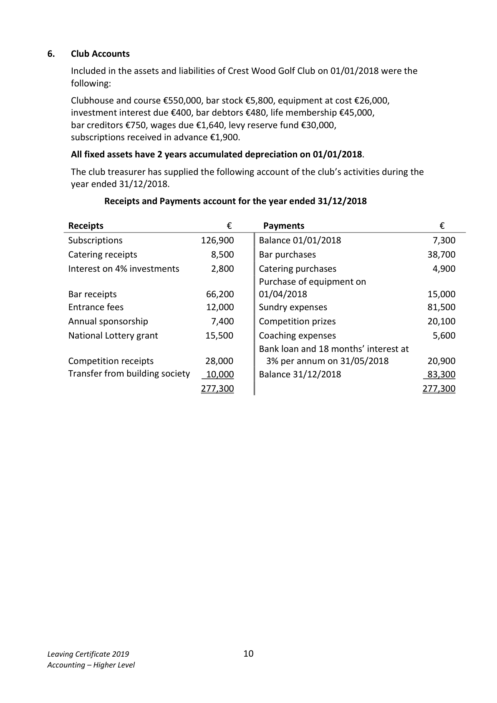

# Question

5.    Interpretation of Accounts

     The following figures have been extracted from the final accounts of Shannon plc, a company
     involved in the renewable energy industry, for the year ended 31/12/2018. The company has
     an authorised capital of €900,000 made up of 600,000 ordinary shares at €1 each and 300,000
    8% preference shares at €1 each.

     Shannon plc has already issued 500,000 ordinary shares and 250,000 8% preference shares.

        Trading and Profit and Loss Account for year
                                                               Ratios and information for year                 ended 31/12/2018
                                                         ended 31/12/2017
                              €          €
       Sales                              960,000       Earnings per ordinary share       10c
                                                         Dividend per ordinary share        5c      Opening stock          50,000
                                                                 Interest cover                4.3 times
       Closing stock           60,000
                                                          Acid test ratio                  0.86:1
       Costs of goods sold                   (760,000)
                                                    Market value of one ord. share   €1.25
       Operating expenses for year            (95,000)                                                       Return on capital employed      5.8%
        Interest for year                       (15,000)      Gearing                   56%
      Net profit for year                    90,000       Dividend cover              2 times
       Dividends paid                         (55,000)      Dividend yield               4%
       Retained profit                       35,000
        Profit and loss balance 01/01/2018      52,000
        Profit and loss balance 31/12/2018      87,000

                                Balance Sheet as at 31/12/2018
                                                           €            €
      Fixed Assets                                                          811,000
      Investments (market value 31/12/2018, €250,000)                         210,000
                                                                             1,021,000
      Current Assets (including debtors €78,000)                 150,000
       Less creditors: amounts falling due within 1 year
      Trade creditors                                              (84,000)         66,000
                                                                             1,087,000
      Financed by:
       6% Debentures (2025 secured)                                        250,000
       Capital and Reserves
         Ordinary shares @ €1 each                            500,000
       8% Preference shares @ €1 each                       250,000
           Profit and loss balance                                 87,000        837,000
                                                                             1,087,000

      Market value of one ordinary share on 31/12/2018 is €1.35.

  Leaving Certificate 2019                       8
  Accounting – Higher Level

<!-- PAGE 9 -->
# Page 9

<!-- HAS_VISUAL: true -->
<!-- VISUAL_REASON: page contains vector drawings; text contains visual keywords: figure, table; page image extracted because text may not fully capture visual content -->

(a)  You are required to calculate the following for 2018: (where appropriate
            calculations should be made to two decimal places).

                 (i)   Cash sales if the period of credit given to debtors is 1.5 months.

                  (ii)   Dividend yield.

                  (iii)  Dividend cover.

               (iv)  Return on capital employed.

             (v)   Price earnings ratio.                                                          (50)

      (b)   Indicate if the ordinary shareholders would be satisfied with the performance,
            state of affairs and prospects of the company. Use relevant ratios and other
           information to support your answer.
                                                                                               (40)

       (c)   Shannon plc is considering acquiring a solar panel company, Gener8 Ltd in 2019.
         Gener8 Ltd has supplied the following balance sheet information for 31/12/2018.

                                   Closing stock      €47,000

                                   Creditors         €45,000

                               Debtors          €39,000

                               Expenses accrued  €15,000

                               Expenses prepaid  €13,000

                             Bank overdraft    €16,500

          Based on the information given in the above table:

                 (i)    Calculate the current ratio for Gener8 Ltd.

                 Calculate the acid test ratio for Gener8 Ltd.

                  (ii)   Using the calculated figures explain why it is important for Shannon plc to
                analyse the liquidity position for Gener8 Ltd.

                                                                                               (10)
                                                                             (100 marks)

Leaving Certificate 2019                       9
Accounting – Higher Level

<!-- PAGE 10 -->
# Page 10

<!-- HAS_VISUAL: true -->
<!-- VISUAL_REASON: page contains vector drawings; page image extracted because text may not fully capture visual content -->

# Marking Scheme

5.    Salaries and general exp.     243,100 + 2,200 + 460 + 860                246,620

5.    Catering                  8,500 – 4,900 + 400                            4,000

5.    Taxation                                        (51,000)      [2]

# Source References

Exam paper:
- file: intermediate_markdown/exam_papers/higher/accounting_higher_2019_paper_1_exam.md
- pages: [9, 10]

Marking scheme:
- file: intermediate_markdown/marking_schemes/higher/accounting_higher_2019_paper_1_marking_scheme.md
- pages: []

# Notes

