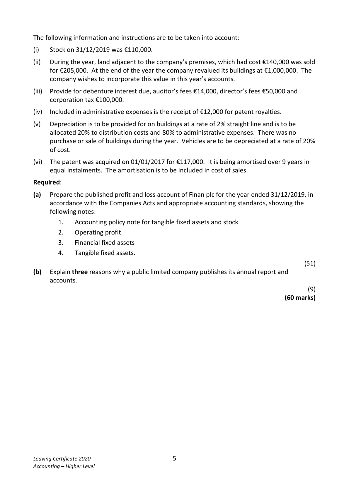

# Question

2.    Published Accounts

Finan plc has an authorised share capital of €750,000 divided into 500,000 ordinary shares at
€1 each and 250,000 5% preference shares at €1 each. The following trial balance was extracted
from its books on 31/12/2019:

                                                       €             €

 Buildings at cost                                          800,000

 Buildings – accumulated depreciation on 01/01/2019                          74,000

 Vehicles at cost                                          420,000

 Vehicles – accumulated depreciation on 01/01/2019                          134,000

 Quoted investments at cost (market value €290,000)          250,000

 Unquoted investments at cost (directors’ value €98,000)        85,000

 Debtors and creditors                                     302,000        308,000

 Stock 01/01/2019                                          85,000

 Patent 01/01/2019                                         91,000

 Distribution costs                                         378,000

 Administrative expenses                                    92,000

 Purchases and sales                                       1,450,000       2,380,000

 Rental income                                                            60,000

 Profit on sale of land                                                       65,000

 Dividends paid                                             38,000

 Bank                                                     79,000

 VAT                                                                     50,000

 6% Debentures 2024/2025                                                300,000

 Profit and loss account at 01/01/2019                                        81,000

 Investment income received – quoted                                        10,500

 Investment income received – unquoted                                       5,500

 Issued capital

    Ordinary shares                                                      350,000

   5% preference shares                                                 200,000

 Provision for bad debts                                                     15,000

 Debenture interest paid                                     10,000

 Discount                                            ________         47,000

                                                          4,080,000       4,080,000

Leaving Certificate 2020                       4
Accounting – Higher Level

<!-- PAGE 5 -->
# Page 5

<!-- HAS_VISUAL: true -->
<!-- VISUAL_REASON: text contains visual keywords: line; page image extracted because text may not fully capture visual content -->

The following information and instructions are to be taken into account:

(i)   Stock on 31/12/2019 was €110,000.

(ii)   During the year, land adjacent to the company’s premises, which had cost €140,000 was sold
      for €205,000. At the end of the year the company revalued its buildings at €1,000,000. The
    company wishes to incorporate this value in this year’s accounts.

(iii)  Provide for debenture interest due, auditor’s fees €14,000, director’s fees €50,000 and
     corporation tax €100,000.

(iv)  Included in administrative expenses is the receipt of €12,000 for patent royalties.

(v)   Depreciation is to be provided for on buildings at a rate of 2% straight line and is to be
      allocated 20% to distribution costs and 80% to administrative expenses. There was no
     purchase or sale of buildings during the year. Vehicles are to be depreciated at a rate of 20%
      of cost.

(vi)  The patent was acquired on 01/01/2017 for €117,000.  It is being amortised over 9 years in
     equal instalments. The amortisation is to be included in cost of sales.

Required:

(a)   Prepare the published profit and loss account of Finan plc for the year ended 31/12/2019, in
     accordance with the Companies Acts and appropriate accounting standards, showing the
      following notes:
         1.    Accounting policy note for tangible fixed assets and stock
         2.    Operating profit

# Marking Scheme

2.   Purchases                   1,080,000 + 19,600 – 38,000         =   1,061,600

2.   Distribution costs: 378,000 + 3,200 + 84,000                     =    465,200
       Administration expenses: 92,000 + 12,000 + 14,000 + 50,000  3.                                                            =    180,800      +12,800

2.  Operating Profit [3]
     The operating profit is arrived at after charging:
     Depreciation on tangible fixed assets                                100,000
     Patent amortised                                                  13,000
      Director’s remuneration                                            50,000
      Auditors’ fees                                                     14,000

2.   Delivery vans                                            84,000
           Plus: new van                                         45,000     129,000

2.  Motor vehicles              60,000 + 45,000 – 30,000              75,000
    Accumulated depreciation    36,000 + 13,000 – 22,000              27,000
     Depreciation P & L           8,000 + 5,000                         13,000
     Loss on vehicle              30,000 – 22,000 – 7,000                 1,000

# Source References

Exam paper:
- file: intermediate_markdown/exam_papers/higher/accounting_higher_2020_paper_1_exam.md
- pages: [5]

Marking scheme:
- file: intermediate_markdown/marking_schemes/higher/accounting_higher_2020_paper_1_marking_scheme.md
- pages: []

# Notes

