# Question

6.    Correction of Errors and Suspense Account

     The trial balance of J. Beglin, a garage owner, failed to agree on 31/12/2019. The
      difference was entered in a suspense account and the following balance sheet was
     prepared:

                               Balance Sheet as at 31/12/2019
                                       €               €               €
      Fixed Assets                         Cost         Dep. to date         Net
      Premises                          740,000                          740,000
     Motor vehicles                     125,000           40,000           85,000
      Equipment                          38,700           14,600           24,100
                                        903,700           54,600          849,100

      Current Assets
         Stock                           84,900
         Debtors (including suspense)       66,300
         Cash                              3,200          154,400

       Creditors: amounts falling due within 1 year
          Creditors                          (79,800)
        Bank                              (26,600)
        VAT                               (12,000)         (118,400)
      Net current assets                                                     36,000
       Total assets less current liabilities                                      885,100

      Financed by
          Capital                                         850,000
        Net profit                                        42,700
                                                        892,700
          Less drawings                                          (7,600)         885,100
                                                                        885,100

Leaving Certificate 2020                       10
Accounting – Higher Level

<!-- PAGE 11 -->
# Page 11

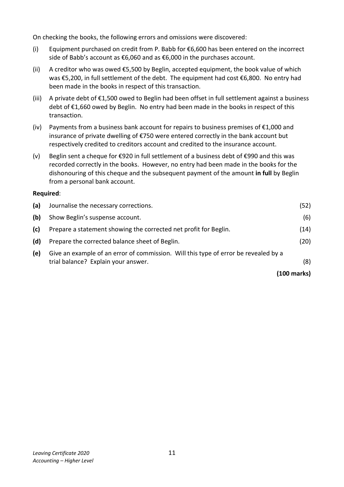

On checking the books, the following errors and omissions were discovered:

(i)   Equipment purchased on credit from P. Babb for €6,600 has been entered on the incorrect
      side of Babb’s account as €6,060 and as €6,000 in the purchases account.

(ii)  A creditor who was owed €5,500 by Beglin, accepted equipment, the book value of which
    was €5,200, in full settlement of the debt. The equipment had cost €6,800. No entry had
     been made in the books in respect of this transaction.

(iii)  A private debt of €1,500 owed to Beglin had been offset in full settlement against a business
     debt of €1,660 owed by Beglin. No entry had been made in the books in respect of this
      transaction.

(iv)  Payments from a business bank account for repairs to business premises of €1,000 and
     insurance of private dwelling of €750 were entered correctly in the bank account but
      respectively credited to creditors account and credited to the insurance account.

(v)   Beglin sent a cheque for €920 in full settlement of a business debt of €990 and this was
     recorded correctly in the books. However, no entry had been made in the books for the
     dishonouring of this cheque and the subsequent payment of the amount in full by Beglin
     from a personal bank account.

Required:

(a)   Journalise the necessary corrections.                                                    (52)

(b)  Show Beglin’s suspense account.                                                               (6)

(c)   Prepare a statement showing the corrected net profit for Beglin.                         (14)

(d)   Prepare the corrected balance sheet of Beglin.                                           (20)

(e)   Give an example of an error of commission. Will this type of error be revealed by a
       trial balance? Explain your answer.                                                            (8)

                                                                             (100 marks)

Leaving Certificate 2020                       11
Accounting – Higher Level

<!-- PAGE 12 -->
# Page 12

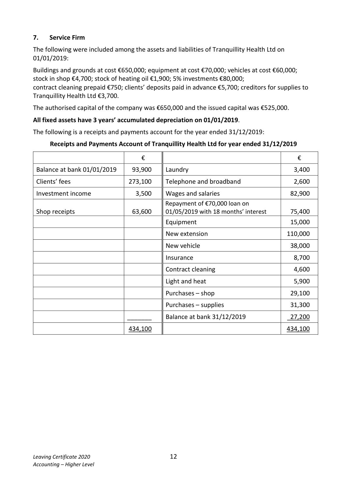

<!-- HAS_VISUAL: true -->
<!-- VISUAL_REASON: page contains vector drawings; page image extracted because text may not fully capture visual content -->

# Marking Scheme

6.    Profit on van disposal        48,000 – 23,200 – 26,000            =       1,200
      Depreciation on disposal     48,000 by 20% for 29/12 months      =     23,200

6.   Total dividends paid €38,000
         Preference dividends 5% of 200,000 = 10,000
         Ordinary dividend €28,000 = 8% of ordinary share capital

      Note: depreciation – buildings 2% of 800,000 = 16,000
              Distribution: 20% of 16,000                              =       3,200
             Administration: 80% of 16,000                           =     12,800

                                     6

<!-- PAGE 7 -->
# Page 7

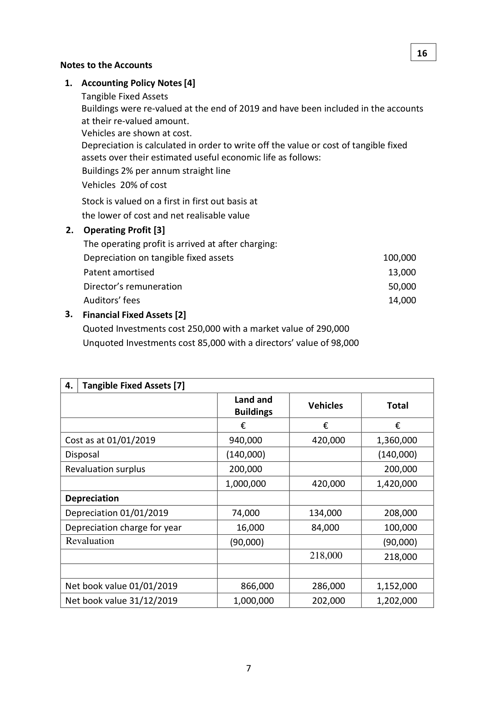

<!-- HAS_VISUAL: true -->
<!-- VISUAL_REASON: page contains vector drawings; text contains visual keywords: line; page image extracted because text may not fully capture visual content -->

16
Notes to the Accounts

6.   Rates 3 months rates prepaid 31/12/2019            10,320 × 3/12       2,580

6.   Loan interest
    5,400 × 4/18                                                      1,200
    5,400 × 14/18                                                     4,200

                                  25

<!-- PAGE 26 -->
# Page 26

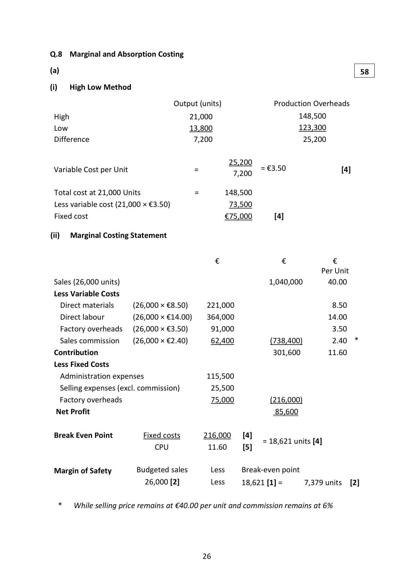

<!-- HAS_VISUAL: true -->
<!-- VISUAL_REASON: page contains vector drawings; page image extracted because text may not fully capture visual content -->

Q.8  Marginal and Absorption Costing
(a)                                                                       58
(i)   High Low Method
                               Output (units)              Production Overheads
 High                               21,000                      148,500
 Low                               13,800                      123,300
 Difference                           7,200                       25,200

                                              25,200
 Variable Cost per Unit                =               = €3.50                 [4]                                                7,200

 Total cost at 21,000 Units             =       148,500
 Less variable cost (21,000 × €3.50)               73,500
 Fixed cost                                   €75,000       [4]

(ii)   Marginal Costing Statement

                                       €               €           €
                                                                       Per Unit
 Sales (26,000 units)                                        1,040,000       40.00
 Less Variable Costs
   Direct materials     (26,000 × €8.50)     221,000                          8.50
   Direct labour        (26,000 × €14.00)    364,000                         14.00
   Factory overheads   (26,000 × €3.50)      91,000                          3.50
   Sales commission    (26,000 × €2.40)      62,400          (738,400)        2.40  *
 Contribution                                             301,600       11.60
 Less Fixed Costs
   Administration expenses                115,500
   Selling expenses (excl. commission)        25,500
   Factory overheads                       75,000          (216,000)
 Net Profit                                                85,600

 Break Even Point         Fixed costs      216,000    [4]
                                                   = 18,621 units [4]
                      CPU          11.60     [5]

 Margin of Safety      Budgeted sales      Less    Break-even point
                        26,000 [2]         Less    18,621 [1] =      7,379 units   [2]

  *   While selling price remains at €40.00 per unit and commission remains at 6%

                                    26

<!-- PAGE 27 -->
# Page 27

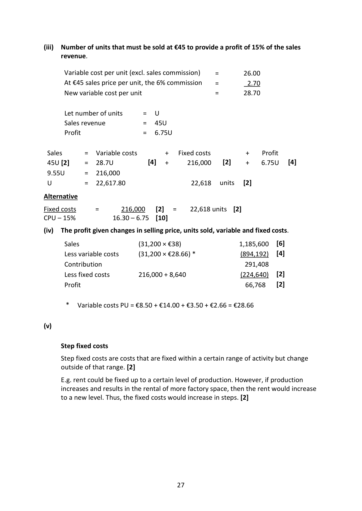

<!-- HAS_VISUAL: true -->
<!-- VISUAL_REASON: page contains vector drawings; page image extracted because text may not fully capture visual content -->

(iii)  Number of units that must be sold at €45 to provide a profit of 15% of the sales
     revenue.

       Variable cost per unit (excl. sales commission)    =       26.00
      At €45 sales price per unit, the 6% commission    =         2.70
     New variable cost per unit                    =       28.70

       Let number of units      =  U
       Sales revenue          =  45U
       Profit                 =  6.75U

 Sales      =  Variable costs        +   Fixed costs          +     Profit
 45U [2]    =  28.7U            [4]  +     216,000    [2]    +   6.75U   [4]
 9.55U     =  216,000
 U         =  22,617.80                   22,618   units   [2]
Alternative
Fixed costs     =      216,000    [2]  =    22,618 units  [2]
CPU – 15%           16.30 – 6.75  [10]
(iv)  The profit given changes in selling price, units sold, variable and fixed costs.
       Sales                  (31,200 × €38)                  1,185,600   [6]
       Less variable costs      (31,200 × €28.66) *              (894,192)   [4]
       Contribution                                          291,408
       Less fixed costs        216,000 + 8,640                 (224,640)   [2]
       Profit                                                 66,768    [2]

      *   Variable costs PU = €8.50 + €14.00 + €3.50 + €2.66 = €28.66

(v)

     Step fixed costs
     Step fixed costs are costs that are fixed within a certain range of activity but change
     outside of that range. [2]
      E.g. rent could be fixed up to a certain level of production. However, if production
      increases and results in the rental of more factory space, then the rent would increase
     to a new level. Thus, the fixed costs would increase in steps. [2]

                                    27

<!-- PAGE 28 -->
# Page 28

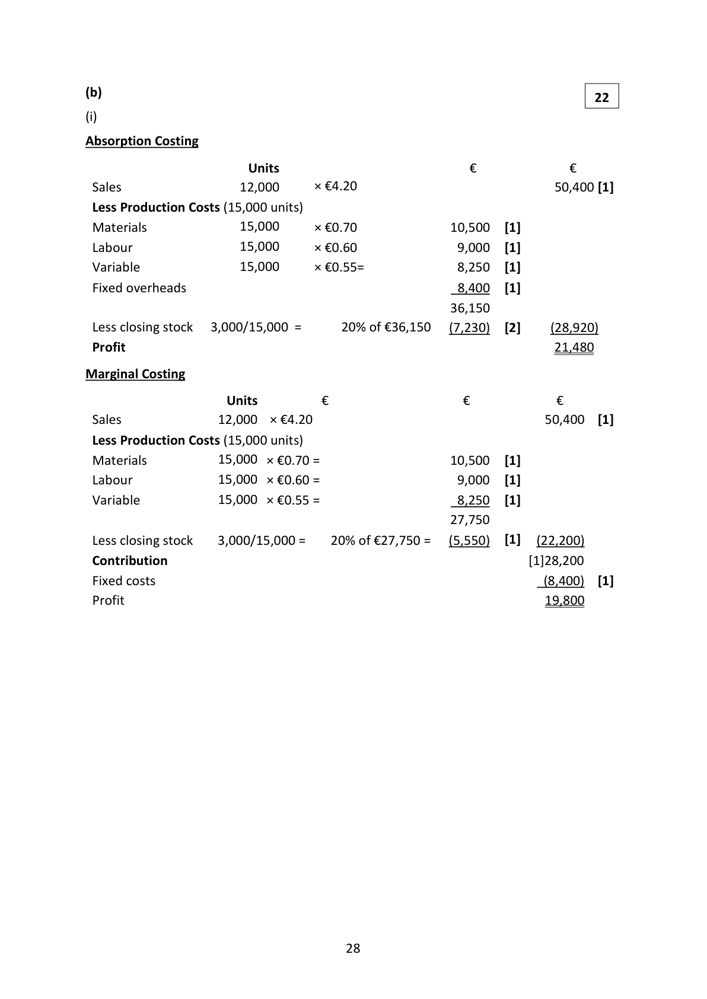

<!-- HAS_VISUAL: true -->
<!-- VISUAL_REASON: page contains vector drawings; page image extracted because text may not fully capture visual content -->

(b)                                                                      22
(i)
Absorption Costing
                          Units                          €             €
 Sales                  12,000     × €4.20                              50,400 [1]
 Less Production Costs (15,000 units)
 Materials              15,000     × €0.70              10,500   [1]
 Labour                15,000     × €0.60               9,000   [1]
 Variable               15,000     × €0.55=              8,250   [1]
 Fixed overheads                                          8,400   [1]
                                                       36,150
 Less closing stock   3,000/15,000 =     20% of €36,150   (7,230)   [2]     (28,920)
 Profit                                                                 21,480
Marginal Costing
                       Units         €                   €            €
 Sales               12,000  × €4.20                                   50,400  [1]
 Less Production Costs (15,000 units)
 Materials           15,000 × €0.70 =                    10,500   [1]
 Labour             15,000 × €0.60 =                     9,000   [1]
 Variable            15,000 × €0.55 =                     8,250   [1]
                                                       27,750
 Less closing stock    3,000/15,000 =   20% of €27,750 =   (5,550)   [1]   (22,200)
 Contribution                                                          [1]28,200
 Fixed costs                                                                  (8,400)  [1]
 Profit                                                                19,800

                                    28

<!-- PAGE 29 -->
# Page 29

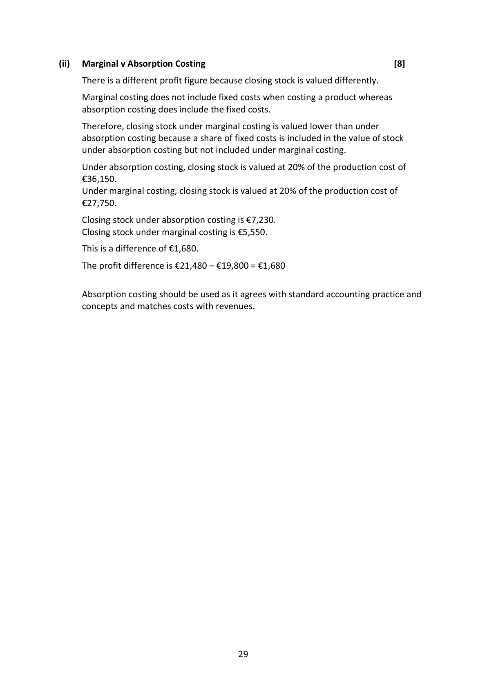

<!-- HAS_VISUAL: true -->
<!-- VISUAL_REASON: text contains visual keywords: figure; page image extracted because text may not fully capture visual content -->

(ii)   Marginal v Absorption Costing                                                  [8]
     There is a different profit figure because closing stock is valued differently.
     Marginal costing does not include fixed costs when costing a product whereas
     absorption costing does include the fixed costs.
     Therefore, closing stock under marginal costing is valued lower than under
     absorption costing because a share of fixed costs is included in the value of stock
     under absorption costing but not included under marginal costing.
     Under absorption costing, closing stock is valued at 20% of the production cost of
     €36,150.
     Under marginal costing, closing stock is valued at 20% of the production cost of
     €27,750.
      Closing stock under absorption costing is €7,230.
      Closing stock under marginal costing is €5,550.
      This is a difference of €1,680.
     The profit difference is €21,480 – €19,800 = €1,680

     Absorption costing should be used as it agrees with standard accounting practice and
     concepts and matches costs with revenues.

                                    29

<!-- PAGE 30 -->
# Page 30

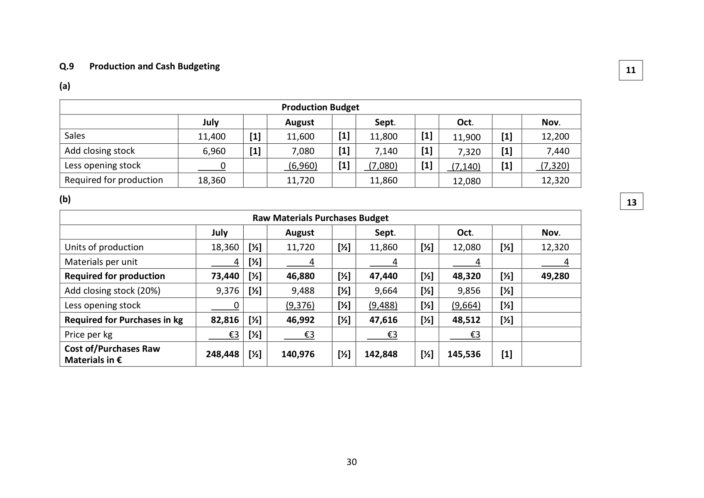

<!-- HAS_VISUAL: true -->
<!-- VISUAL_REASON: page contains embedded images; page contains vector drawings; page image extracted because text may not fully capture visual content -->

Q.9   Production and Cash Budgeting                                                                                                               11
(a)

                                                Production Budget
                                    July              August              Sept.              Oct.              Nov.
 Sales                        11,400      [1]     11,600      [1]    11,800      [1]    11,900     [1]      12,200
 Add closing stock               6,960      [1]       7,080      [1]     7,140      [1]     7,320     [1]       7,440
 Less opening stock                0               (6,960)     [1]     (7,080)      [1]     (7,140)     [1]       (7,320)
 Required for production       18,360             11,720            11,860            12,080             12,320
(b)                                                                                                               13
                                Raw Materials Purchases Budget
                                      July            August              Sept.              Oct.              Nov.
 Units of production              18,360  [½]     11,720     [½]    11,860     [½]    12,080    [½]      12,320
 Materials per unit                   4  [½]         4               4               4                4
 Required for production          73,440  [½]     46,880     [½]    47,440     [½]    48,320    [½]      49,280
 Add closing stock (20%)            9,376  [½]       9,488     [½]     9,664     [½]     9,856    [½]
 Less opening stock                  0           (9,376)     [½]    (9,488)     [½]    (9,664)    [½]
 Required for Purchases in kg      82,816  [½]     46,992     [½]    47,616     [½]    48,512    [½]
 Price per kg                       €3  [½]        €3              €3              €3
 Cost of/Purchases Raw                               248,448  [½]    140,976     [½]   142,848     [½]   145,536     [1] Materials in €

                                                        30

<!-- PAGE 31 -->
# Page 31

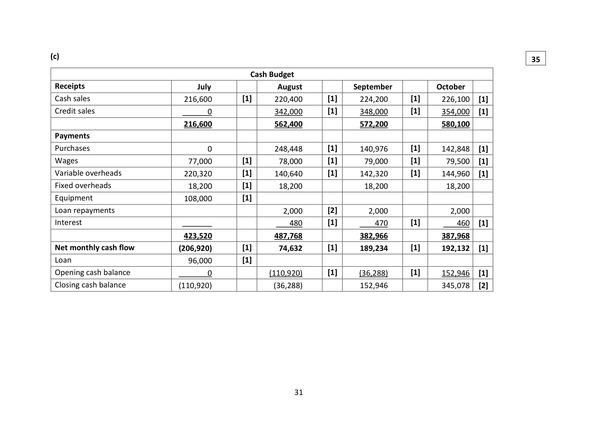

<!-- HAS_VISUAL: true -->
<!-- VISUAL_REASON: page contains vector drawings; page image extracted because text may not fully capture visual content -->

(c)                                                                                                               35
                                                Cash Budget
 Receipts                                 July                August            September           October
 Cash sales                       216,600         [1]      220,400        [1]      224,200       [1]     226,100   [1]
 Credit sales                          0                342,000        [1]      348,000       [1]     354,000   [1]
                                 216,600                562,400              572,200             580,100
 Payments
 Purchases                           0                248,448        [1]      140,976       [1]     142,848   [1]
 Wages                            77,000         [1]       78,000        [1]       79,000       [1]      79,500   [1]
 Variable overheads                220,320         [1]      140,640        [1]      142,320       [1]     144,960   [1]
 Fixed overheads                   18,200         [1]       18,200                18,200               18,200
 Equipment                       108,000         [1]
 Loan repayments                                           2,000        [2]        2,000                2,000
 Interest                                                 480        [1]         470       [1]         460   [1]
                                 423,520               487,768              382,966             387,968
 Net monthly cash flow            (206,920)         [1]       74,632        [1]      189,234       [1]     192,132   [1]
 Loan                              96,000         [1]
 Opening cash balance                  0                (110,920)        [1]      (36,288)       [1]     152,946   [1]
 Closing cash balance              (110,920)                 (36,288)              152,946             345,078   [2]

                                                        31

<!-- PAGE 32 -->
# Page 32

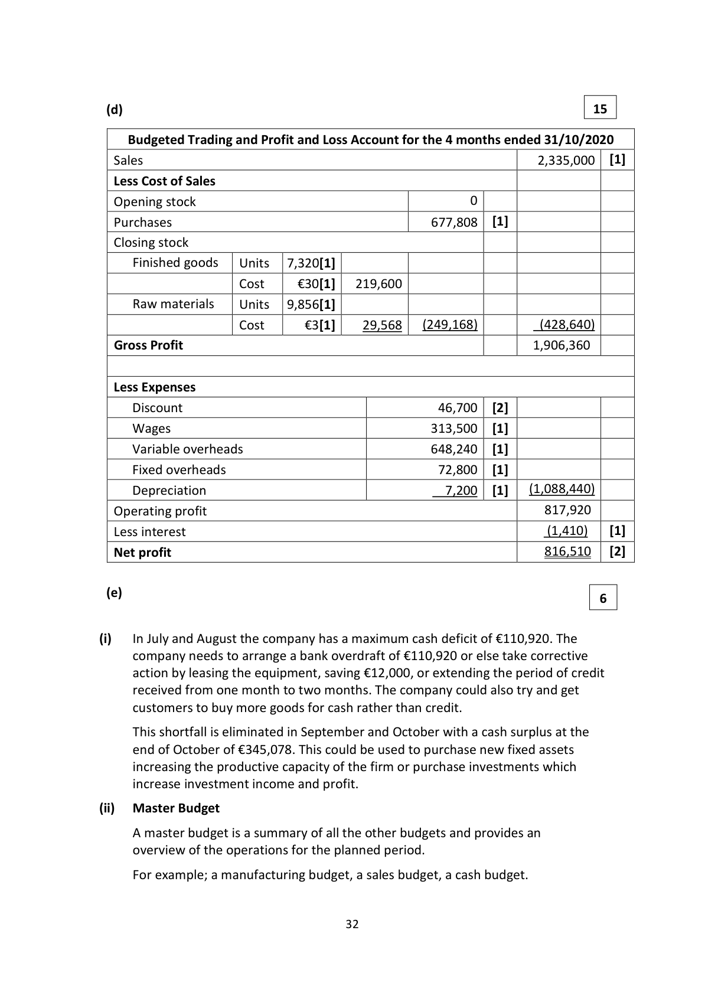

<!-- HAS_VISUAL: true -->
<!-- VISUAL_REASON: page contains embedded images; page contains vector drawings; page image extracted because text may not fully capture visual content -->

(d)                                                                 15

    Budgeted Trading and Profit and Loss Account for the 4 months ended 31/10/2020
  Sales                                                              2,335,000   [1]
  Less Cost of Sales
  Opening stock                                      0
  Purchases                                       677,808   [1]
  Closing stock
      Finished goods   Units   7,320[1]
                      Cost     €30[1]   219,600
    Raw materials    Units   9,856[1]
                      Cost       €3[1]    29,568   (249,168)          (428,640)
  Gross Profit                                                       1,906,360

  Less Expenses
     Discount                                       46,700   [2]
    Wages                                       313,500   [1]
      Variable overheads                            648,240   [1]
     Fixed overheads                                72,800   [1]
     Depreciation                                     7,200   [1]   (1,088,440)
  Operating profit                                                   817,920
  Less interest                                                              (1,410)    [1]
  Net profit                                                        816,510   [2]

 (e)                                                                      6

(i)    In July and August the company has a maximum cash deficit of €110,920. The
    company needs to arrange a bank overdraft of €110,920 or else take corrective
      action by leasing the equipment, saving €12,000, or extending the period of credit
     received from one month to two months. The company could also try and get
     customers to buy more goods for cash rather than credit.
      This shortfall is eliminated in September and October with a cash surplus at the
     end of October of €345,078. This could be used to purchase new fixed assets
      increasing the productive capacity of the firm or purchase investments which
      increase investment income and profit.
(ii)   Master Budget
    A master budget is a summary of all the other budgets and provides an
     overview of the operations for the planned period.
     For example; a manufacturing budget, a sales budget, a cash budget.

                                     32

<!-- PAGE 33 -->
# Page 33

<!-- HAS_VISUAL: true -->
<!-- VISUAL_REASON: page contains embedded images; text extraction is sparse relative to visible page content; page image extracted because text may not fully capture visual content -->

<!-- EXTRACTION_ISSUE: no extractable text found -->

[No extractable text found]

<!-- PAGE 34 -->
# Page 34

<!-- HAS_VISUAL: true -->
<!-- VISUAL_REASON: page contains embedded images; text extraction is sparse relative to visible page content; page image extracted because text may not fully capture visual content -->

<!-- EXTRACTION_ISSUE: no extractable text found -->

[No extractable text found]

<!-- PAGE 35 -->
# Page 35

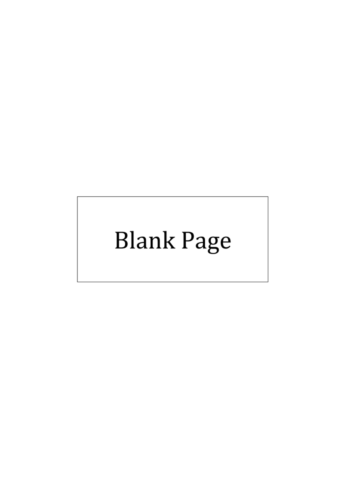

<!-- HAS_VISUAL: true -->
<!-- VISUAL_REASON: page contains embedded images; text extraction is sparse relative to visible page content; page image extracted because text may not fully capture visual content -->

<!-- EXTRACTION_ISSUE: no extractable text found -->

[No extractable text found]

<!-- PAGE 36 -->
# Page 36

<!-- HAS_VISUAL: true -->
<!-- VISUAL_REASON: page contains vector drawings; text extraction is sparse relative to visible page content; page image extracted because text may not fully capture visual content -->

<!-- EXTRACTION_ISSUE: no extractable text found -->

[No extractable text found]

# Source References

Exam paper:
- file: intermediate_markdown/exam_papers/higher/accounting_higher_2020_paper_1_exam.md
- pages: [11, 12]

Marking scheme:
- file: intermediate_markdown/marking_schemes/higher/accounting_higher_2020_paper_1_marking_scheme.md
- pages: [7, 26, 27, 28, 29, 30, 31, 32, 33, 34, 35, 36]

# Notes

