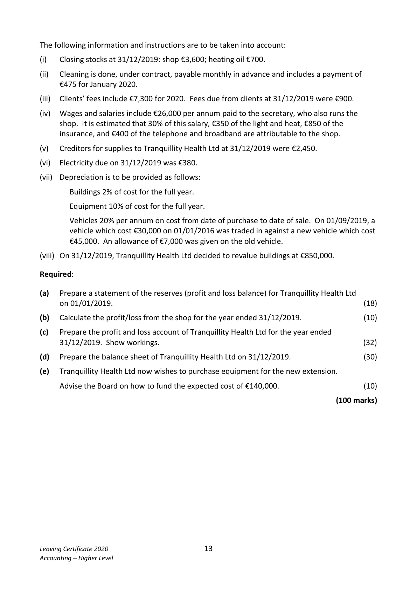
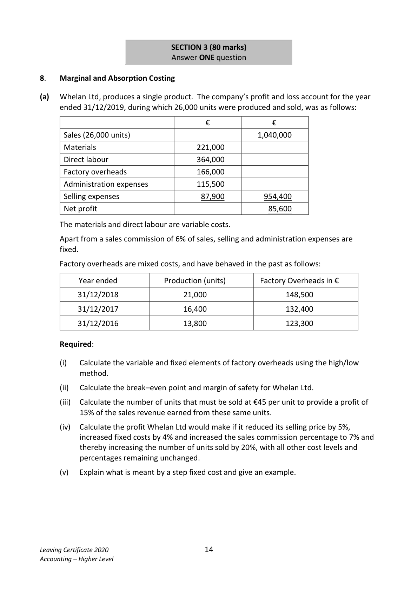

# Question

7.    Service Firm

The following were included among the assets and liabilities of Tranquillity Health Ltd on
01/01/2019:

Buildings and grounds at cost €650,000; equipment at cost €70,000; vehicles at cost €60,000;
stock in shop €4,700; stock of heating oil €1,900; 5% investments €80,000;
contract cleaning prepaid €750; clients’ deposits paid in advance €5,700; creditors for supplies to
Tranquillity Health Ltd €3,700.

The authorised capital of the company was €650,000 and the issued capital was €525,000.

All fixed assets have 3 years’ accumulated depreciation on 01/01/2019.

The following is a receipts and payments account for the year ended 31/12/2019:

      Receipts and Payments Account of Tranquillity Health Ltd for year ended 31/12/2019

                               €                                           €

 Balance at bank 01/01/2019     93,900    Laundry                                 3,400

 Clients’ fees                  273,100    Telephone and broadband                 2,600

 Investment income              3,500    Wages and salaries                      82,900
                                      Repayment of €70,000 loan on
 Shop receipts                  63,600    01/05/2019 with 18 months’ interest       75,400
                                      Equipment                             15,000

                               New extension                        110,000

                               New vehicle                            38,000

                                           Insurance                                8,700

                                           Contract cleaning                         4,600

                                                Light and heat                            5,900

                                          Purchases – shop                       29,100

                                          Purchases – supplies                    31,300

                           _______    Balance at bank 31/12/2019              27,200

                             434,100                                         434,100

Leaving Certificate 2020                       12
Accounting – Higher Level

<!-- PAGE 13 -->
# Page 13

<!-- HAS_VISUAL: true -->
<!-- VISUAL_REASON: text contains visual keywords: table; page image extracted because text may not fully capture visual content -->

The following information and instructions are to be taken into account:

(i)    Closing stocks at 31/12/2019: shop €3,600; heating oil €700.

(ii)   Cleaning is done, under contract, payable monthly in advance and includes a payment of
     €475 for January 2020.

(iii)   Clients’ fees include €7,300 for 2020. Fees due from clients at 31/12/2019 were €900.

(iv)  Wages and salaries include €26,000 per annum paid to the secretary, who also runs the
     shop.  It is estimated that 30% of this salary, €350 of the light and heat, €850 of the
      insurance, and €400 of the telephone and broadband are attributable to the shop.

(v)   Creditors for supplies to Tranquillity Health Ltd at 31/12/2019 were €2,450.

(vi)   Electricity due on 31/12/2019 was €380.

(vii)  Depreciation is to be provided as follows:

         Buildings 2% of cost for the full year.

       Equipment 10% of cost for the full year.

        Vehicles 20% per annum on cost from date of purchase to date of sale. On 01/09/2019, a
         vehicle which cost €30,000 on 01/01/2016 was traded in against a new vehicle which cost
        €45,000. An allowance of €7,000 was given on the old vehicle.

(viii) On 31/12/2019, Tranquillity Health Ltd decided to revalue buildings at €850,000.

Required:

(a)   Prepare a statement of the reserves (profit and loss balance) for Tranquillity Health Ltd
    on 01/01/2019.                                                                          (18)

(b)   Calculate the profit/loss from the shop for the year ended 31/12/2019.                  (10)

(c)   Prepare the profit and loss account of Tranquillity Health Ltd for the year ended
     31/12/2019. Show workings.                                                            (32)

(d)   Prepare the balance sheet of Tranquillity Health Ltd on 31/12/2019.                     (30)

(e)   Tranquillity Health Ltd now wishes to purchase equipment for the new extension.

     Advise the Board on how to fund the expected cost of €140,000.                         (10)

                                                                             (100 marks)

Leaving Certificate 2020                       13
Accounting – Higher Level

<!-- PAGE 14 -->
# Page 14

<!-- HAS_VISUAL: true -->
<!-- VISUAL_REASON: page contains vector drawings; page image extracted because text may not fully capture visual content -->

SECTION 3 (80 marks)
                               Answer ONE question

# Marking Scheme

7.   Change in BDP               4,500 – 3,920                     =       580
     Bad debt provision           98,000 × 4%                      =       3,920

7.   Investment Income P & L: 25,000 @ 4% @ 1 Year              1,000
           Less: received                                              (750)
        Due 31/12/2019                                                 250

# Source References

Exam paper:
- file: intermediate_markdown/exam_papers/higher/accounting_higher_2020_paper_1_exam.md
- pages: [13, 14]

Marking scheme:
- file: intermediate_markdown/marking_schemes/higher/accounting_higher_2020_paper_1_marking_scheme.md
- pages: []

# Notes

