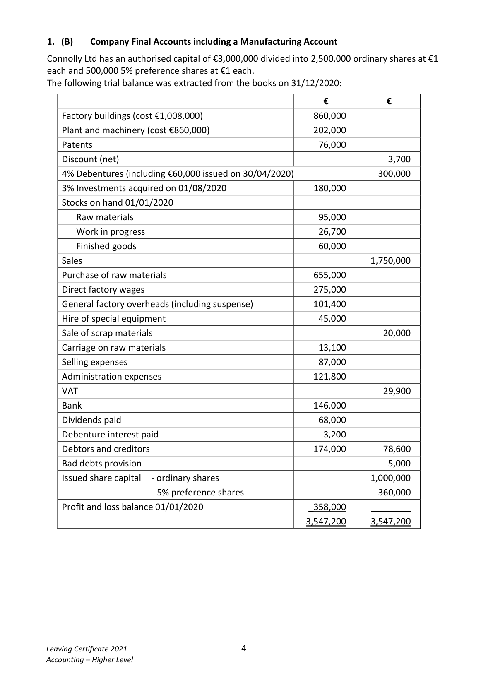
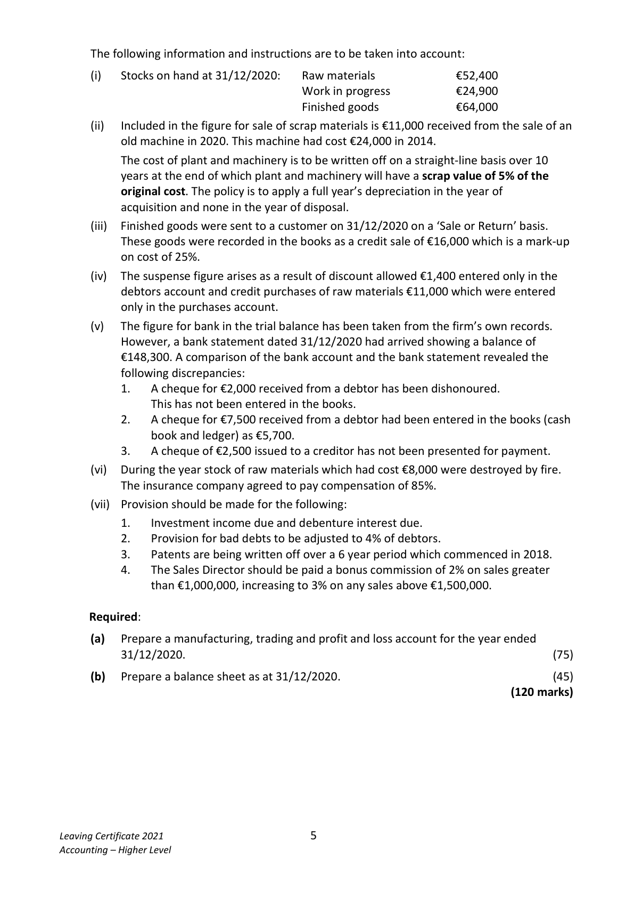

# Question

2.    Provision for bad debts is to be adjusted to 6% of debtors.
Required:
(a)   Prepare a trading and profit and loss account for the year ended 31/12/2020.            (75)
(b)   Prepare a balance sheet as at 31/12/2020.                                               (45)
                                                                             (120 marks)

Leaving Certificate 2021                       3
Accounting – Higher Level

<!-- PAGE 4 -->
# Page 4

<!-- HAS_VISUAL: true -->
<!-- VISUAL_REASON: page contains vector drawings; page image extracted because text may not fully capture visual content -->

1.  (B)   Company Final Accounts including a Manufacturing Account

Connolly Ltd has an authorised capital of €3,000,000 divided into 2,500,000 ordinary shares at €1
each and 500,000 5% preference shares at €1 each.
The following trial balance was extracted from the books on 31/12/2020:

                                                       €            €
    Factory buildings (cost €1,008,000)                        860,000
    Plant and machinery (cost €860,000)                      202,000
    Patents                                                 76,000
    Discount (net)                                                           3,700
   4% Debentures (including €60,000 issued on 30/04/2020)                  300,000
   3% Investments acquired on 01/08/2020                   180,000
    Stocks on hand 01/01/2020
     Raw materials                                        95,000
     Work in progress                                      26,700
       Finished goods                                       60,000
    Sales                                                                 1,750,000
   Purchase of raw materials                               655,000
    Direct factory wages                                    275,000
   General factory overheads (including suspense)             101,400
    Hire of special equipment                                 45,000
    Sale of scrap materials                                                  20,000
    Carriage on raw materials                                 13,100
    Selling expenses                                         87,000
    Administration expenses                                121,800
   VAT                                                                  29,900
   Bank                                                  146,000
    Dividends paid                                           68,000
   Debenture interest paid                                    3,200
   Debtors and creditors                                   174,000        78,600
   Bad debts provision                                                      5,000
    Issued share capital   ‐ ordinary shares                                  1,000,000
                                   ‐ 5% preference shares                             360,000
    Profit and loss balance 01/01/2020                      _358,000     ________
                                                          3,547,200     3,547,200

Leaving Certificate 2021                       4
Accounting – Higher Level

<!-- PAGE 5 -->
# Page 5

<!-- HAS_VISUAL: true -->
<!-- VISUAL_REASON: text contains visual keywords: figure, line; page image extracted because text may not fully capture visual content -->

The following information and instructions are to be taken into account:

         (i)    Stocks on hand at 31/12/2020:   Raw materials             €52,400
                                  Work in progress           €24,900
                                             Finished goods             €64,000
         (ii)   Included in the figure for sale of scrap materials is €11,000 received from the sale of an
           old machine in 2020. This machine had cost €24,000 in 2014.
          The cost of plant and machinery is to be written off on a straight‐line basis over 10
           years at the end of which plant and machinery will have a scrap value of 5% of the
            original cost. The policy is to apply a full year’s depreciation in the year of
            acquisition and none in the year of disposal.
         (iii)   Finished goods were sent to a customer on 31/12/2020 on a ‘Sale or Return’ basis.
          These goods were recorded in the books as a credit sale of €16,000 which is a mark‐up
         on cost of 25%.
        (iv)  The suspense figure arises as a result of discount allowed €1,400 entered only in the
           debtors account and credit purchases of raw materials €11,000 which were entered
           only in the purchases account.
       (v)   The figure for bank in the trial balance has been taken from the firm’s own records.
          However, a bank statement dated 31/12/2020 had arrived showing a balance of
           €148,300. A comparison of the bank account and the bank statement revealed the
           following discrepancies:
             1.   A cheque for €2,000 received from a debtor has been dishonoured.
                  This has not been entered in the books.
             2.   A cheque for €7,500 received from a debtor had been entered in the books (cash
              book and ledger) as €5,700.

# Marking Scheme

2. Shareholders are less likely to get a good dividend when gearing is high.

2. Reduce or repay loans to reduce fixed interest debt as a proportion of capital employed.

2.  Operating Profit [5]
      The operating profit is arrived at after charging:         €
        Depreciation on tangible fixed assets                86,000
       Patent amortised                                 40,000
        Directors fees                                    64,000
        Auditors fees                                     12,000

2.  Profit on disposal of Fixed Assets, increase profit by €18,000 but does not increase cash
      by the same amount.

2. Sales volume

2. To compare actual costs and budgeted costs at the same level of activity, in order to
  determine if actual costs exceeded or were less than budgeted costs.

# Source References

Exam paper:
- file: intermediate_markdown/exam_papers/higher/accounting_higher_2021_paper_1_exam.md
- pages: [4, 5]

Marking scheme:
- file: intermediate_markdown/marking_schemes/higher/accounting_higher_2021_paper_1_marking_scheme.md
- pages: []

# Notes

