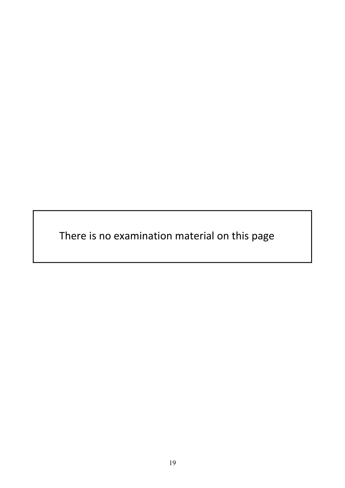
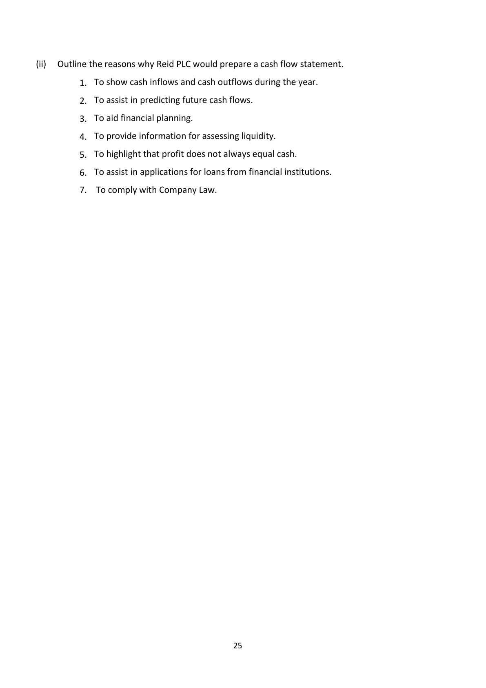
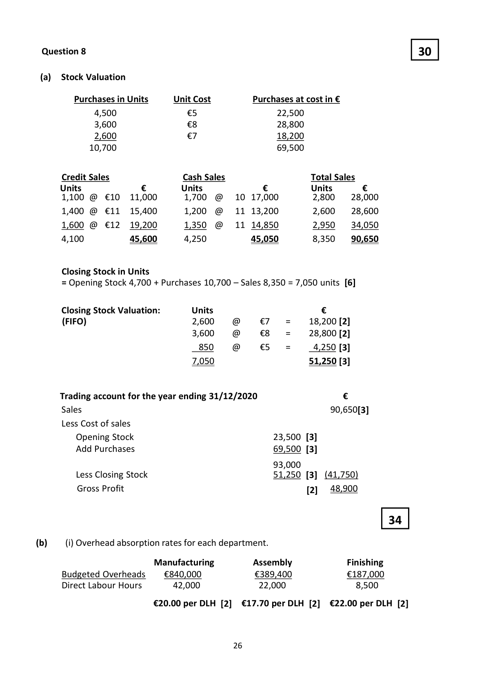
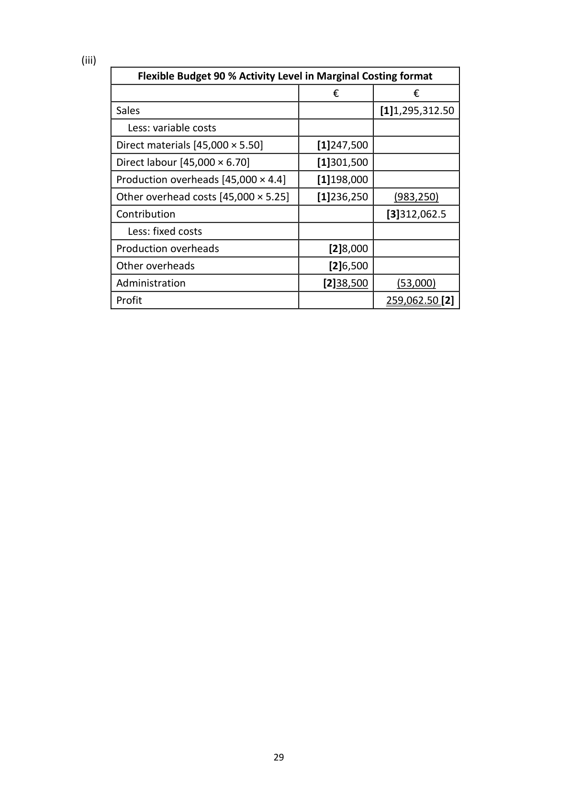
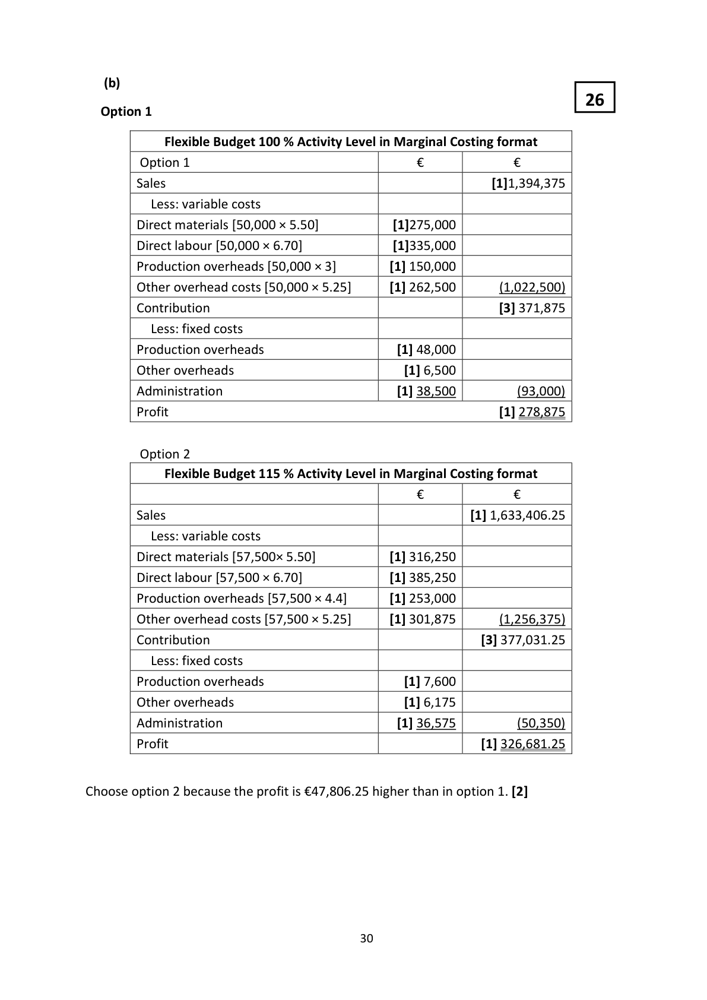
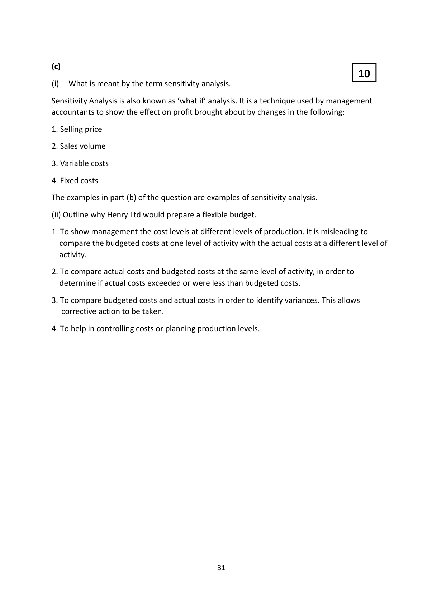

# Question

9.    Flexible Budgeting

Henry Ltd manufactures a component for the medical industry. The following flexible
budgets have already been prepared for 55%, 75% and 95% of the plant’s capacity:

  Output levels                 55%           75%           95%
  Units                            27,500            37,500            47,500

  Costs                            €               €               €
  Direct materials                  151,250           206,250           261,250
  Direct wages                    184,250           251,250           318,250
  Production overheads            129,000           173,000           217,000
  Other overhead costs             150,875           203,375           255,875
  Administration overheads          38,500            38,500            38,500
                                 653,875           872,375          1,090,875

Profit is budgeted to be 20% of sales. All units produced are sold.

(a)   Required:

         (i)   Separate production overheads into fixed and variable elements.

         (ii)   Separate other overhead costs into fixed and variable elements.

         (iii)  Prepare a flexible budget for 90% activity level using marginal costing principles, and
         show the contribution.

(b)  Henry Ltd is currently operating at 100% capacity and is considering two options as follows:

     Option 1

     Modernisation of machinery.
      This will involve employing one new production supervisor at a cost of €40,000. This will
     save €1.40 per unit in the production overheads.

     Option 2

     Purchase of machinery which would increase the plant’s capacity by 15% while reducing all
      fixed overheads (including administration) by 5%.

     Required:

         (i)   Prepare flexible budgets, using marginal costing principles and showing contributions,
            for both options taking the new cost structures into account.

         (ii)   Advise the company on the best option.

(c)   Required:

         (i)   What is meant by the term sensitivity analysis?

         (ii)   Outline why Henry Ltd would prepare a flexible budget.

                                                                                 (80 marks)

Leaving Certificate 2021                       18
Accounting – Higher Level

<!-- PAGE 19 -->
# Page 19

<!-- HAS_VISUAL: true -->
<!-- VISUAL_REASON: page contains vector drawings; text extraction is sparse relative to visible page content; page image extracted because text may not fully capture visual content -->

There is no examination material on this page

                                19

<!-- PAGE 20 -->
# Page 20

<!-- HAS_VISUAL: true -->
<!-- VISUAL_REASON: page contains embedded images; page contains vector drawings; page image extracted because text may not fully capture visual content -->

There is no examination material on this page

Leaving Certificate 2021                       20
Accounting – Higher Level

# Marking Scheme

9. Payments to redeem Debentures, €50,000, reduce cash but has no immediate effect on
      on profit.

                                           24

<!-- PAGE 25 -->
# Page 25

<!-- HAS_VISUAL: true -->
<!-- VISUAL_REASON: text contains visual keywords: line; page image extracted because text may not fully capture visual content -->

(ii)   Outline the reasons why Reid PLC would prepare a cash flow statement.

            1. To show cash inflows and cash outflows during the year.

            2. To assist in predicting future cash flows.

            3. To aid financial planning.

            4. To provide information for assessing liquidity.

            5. To highlight that profit does not always equal cash.

            6. To assist in applications for loans from financial institutions.

            7.  To comply with Company Law.

                                           25

<!-- PAGE 26 -->
# Page 26

<!-- HAS_VISUAL: true -->
<!-- VISUAL_REASON: page contains vector drawings; page image extracted because text may not fully capture visual content -->

Question 9  Flexible Budgeting
                                                         44
   (a)    (i)

               Production overheads                 Units           Total Cost

                                                                           €
         High                                           47,500                 217,000
       Low                                           27,500                 129,000
         Difference                                      20,000                   88,000

       The variable cost of 20,000 units is 88,000 therefore the variable cost per unit is €4.40 [7]

          Total production overhead cost                 129,000                 217,000

         Less variable costs [units × €4.40]               (121,000)                 (209,000)

         Fixed cost                                       8,000                  8,000[7]

             (ii)

        Other overheads                             Units                  Total Cost

                                                                     €
         High                                      47,500                255,875
       Low                                      27,500                150,875
         Difference                                 20,000                105,000

       The variable cost of 20,000 units is 105,000 therefore the variable cost per unit is €5.25 [7]

          Total production overhead cost                 150,875              255,875

         Less variable costs [units × €5.25                (144,375)               (249,375)

         Fixed cost                                     6,500                 6,500[7]

                                           28

<!-- PAGE 29 -->
# Page 29

<!-- HAS_VISUAL: true -->
<!-- VISUAL_REASON: page contains vector drawings; page image extracted because text may not fully capture visual content -->

(iii)
            Flexible Budget 90 % Activity Level in Marginal Costing format

                                           €             €
       Sales                                                [1]1,295,312.50
          Less: variable costs
       Direct materials [45,000 × 5.50]           [1]247,500
       Direct labour [45,000 × 6.70]             [1]301,500
       Production overheads [45,000 × 4.4]      [1]198,000
      Other overhead costs [45,000 × 5.25]     [1]236,250     (983,250)
       Contribution                                          [3]312,062.5
          Less: fixed costs
       Production overheads                      [2]8,000
      Other overheads                           [2]6,500
       Administration                           [2]38,500      (53,000)
        Profit                                               259,062.50 [2]

                                    29

<!-- PAGE 30 -->
# Page 30

<!-- HAS_VISUAL: true -->
<!-- VISUAL_REASON: page contains vector drawings; page image extracted because text may not fully capture visual content -->

(b)
                                                    26
  Option 1

              Flexible Budget 100 % Activity Level in Marginal Costing format
        Option 1                               €            €
         Sales                                                     [1]1,394,375
            Less: variable costs
         Direct materials [50,000 × 5.50]            [1]275,000
         Direct labour [50,000 × 6.70]              [1]335,000
        Production overheads [50,000 × 3]          [1] 150,000
        Other overhead costs [50,000 × 5.25]       [1] 262,500       (1,022,500)
        Contribution                                                     [3] 371,875
            Less: fixed costs
        Production overheads                        [1] 48,000
        Other overheads                               [1] 6,500
        Administration                                [1] 38,500          (93,000)
          Profit                                                            [1] 278,875

        Option 2
              Flexible Budget 115 % Activity Level in Marginal Costing format
                                              €            €
         Sales                                                       [1] 1,633,406.25
            Less: variable costs
         Direct materials [57,500× 5.50]             [1] 316,250
         Direct labour [57,500 × 6.70]                [1] 385,250
        Production overheads [57,500 × 4.4]        [1] 253,000
        Other overhead costs [57,500 × 5.25]       [1] 301,875       (1,256,375)
        Contribution                                                 [3] 377,031.25
            Less: fixed costs
        Production overheads                         [1] 7,600
        Other overheads                               [1] 6,175
        Administration                                [1] 36,575          (50,350)
          Profit                                                         [1] 326,681.25

Choose option 2 because the profit is €47,806.25 higher than in option 1. [2]

                                         30

<!-- PAGE 31 -->
# Page 31

<!-- HAS_VISUAL: true -->
<!-- VISUAL_REASON: page contains vector drawings; text contains visual keywords: line; page image extracted because text may not fully capture visual content -->

(c)
                                                     10
(i)  What is meant by the term sensitivity analysis.

Sensitivity Analysis is also known as ‘what if’ analysis. It is a technique used by management
accountants to show the effect on profit brought about by changes in the following:

# Source References

Exam paper:
- file: intermediate_markdown/exam_papers/higher/accounting_higher_2021_paper_1_exam.md
- pages: [19, 20]

Marking scheme:
- file: intermediate_markdown/marking_schemes/higher/accounting_higher_2021_paper_1_marking_scheme.md
- pages: [25, 26, 29, 30, 31]

# Notes

