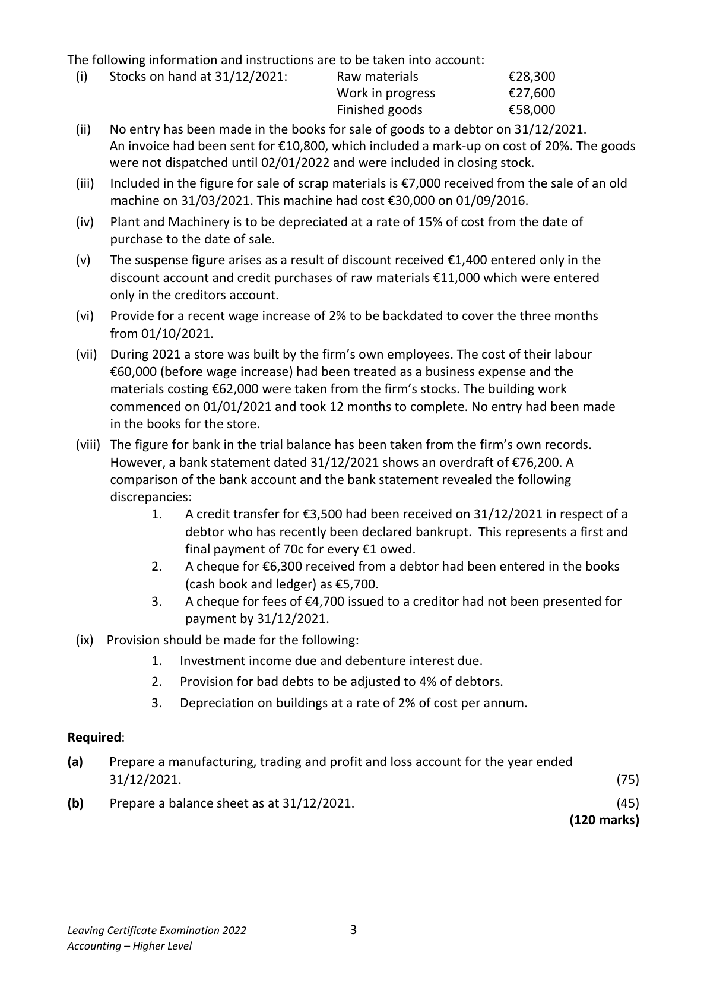

# Question

1.   Answer (A) OR (B)

(A)  Company Final Accounts including a Manufacturing Account

McGuigan Ltd has an authorised capital of €2,000,000 divided into 1,500,000 ordinary shares at
€1 each and 500,000 4% preference shares at €1 each.
The following trial balance was extracted from the books on 31/12/2021:
                                                        €              €
  Plant and machinery (cost €340,000)                            290,000

  Factory buildings (cost €890,000)                               865,000

  Hire of special equipment                                       37,800

  General factory overheads (including suspense)                   126,700

  Stocks on hand 01/01/2021

     Raw materials                                             27,300

     Work in progress                                          38,650

       Finished goods                                            38,400

  Direct factory wages                                          148,000

  Purchase of raw materials                                     760,400

  Royalty payments                                              29,600

  Sale of scrap materials                                                          18,950

  Selling expenses                                               45,000

  Administration expenses                                        57,900

  Sales                                                                        1,650,000

  Discount (net)                                                                   5,350

  Rent                                                                         15,700

 4% Investments acquired on 01/04/2021                        250,000

  Investment interest received                                                      2,800

  Profit and loss balance 01/01/2021                                               69,500

  PAYE, PRSI & USC                                                                1,850

 8% Debentures (including €50,000 issued on 01/04/2021)                          300,000

  Debenture interest paid                                          5,000

  Bad debt provision                                                               3,050

  Dividends paid                                                27,500

  Bank                                                                         85,000

  Debtors and creditors                                          76,350          61,400

  Issued share capital - ordinary shares                                           460,000

 4% preference shares                                                         150,000

                                                              2,823,600       2,823,600

Leaving Certificate Examination 2022              2
Accounting – Higher Level

<!-- PAGE 3 -->
# Page 3

<!-- HAS_VISUAL: true -->
<!-- VISUAL_REASON: text contains visual keywords: figure; page image extracted because text may not fully capture visual content -->

The following information and instructions are to be taken into account:
  (i)    Stocks on hand at 31/12/2021:      Raw materials             €28,300
                                  Work in progress           €27,600
                                             Finished goods             €58,000
  (ii)  No entry has been made in the books for sale of goods to a debtor on 31/12/2021.
     An invoice had been sent for €10,800, which included a mark-up on cost of 20%. The goods
      were not dispatched until 02/01/2022 and were included in closing stock.
  (iii)   Included in the figure for sale of scrap materials is €7,000 received from the sale of an old
      machine on 31/03/2021. This machine had cost €30,000 on 01/09/2016.
  (iv)   Plant and Machinery is to be depreciated at a rate of 15% of cost from the date of
      purchase to the date of sale.
  (v)   The suspense figure arises as a result of discount received €1,400 entered only in the
       discount account and credit purchases of raw materials €11,000 which were entered
       only in the creditors account.
  (vi)   Provide for a recent wage increase of 2% to be backdated to cover the three months
      from 01/10/2021.
  (vii)  During 2021 a store was built by the firm’s own employees. The cost of their labour
      €60,000 (before wage increase) had been treated as a business expense and the
       materials costing €62,000 were taken from the firm’s stocks. The building work
     commenced on 01/01/2021 and took 12 months to complete. No entry had been made
        in the books for the store.
  (viii) The figure for bank in the trial balance has been taken from the firm’s own records.
      However, a bank statement dated 31/12/2021 shows an overdraft of €76,200. A
      comparison of the bank account and the bank statement revealed the following
       discrepancies:
                1.   A credit transfer for €3,500 had been received on 31/12/2021 in respect of a
                  debtor who has recently been declared bankrupt. This represents a first and
                       final payment of 70c for every €1 owed.

# Marking Scheme

[No matching marking scheme section detected.]

# Source References

Exam paper:
- file: intermediate_markdown/exam_papers/higher/accounting_higher_2022_paper_1_exam.md
- pages: [3]

Marking scheme:
- file: 
- pages: []

# Notes

