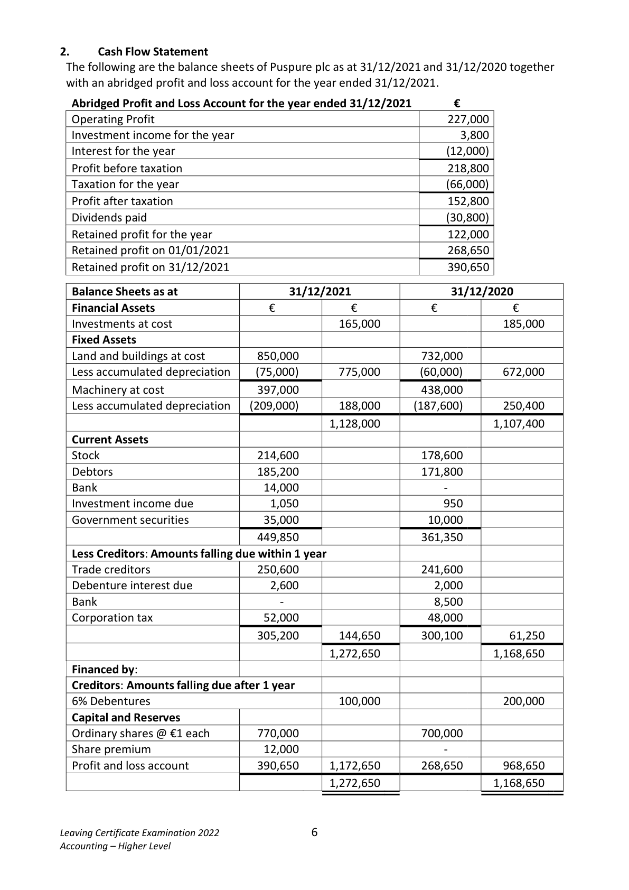
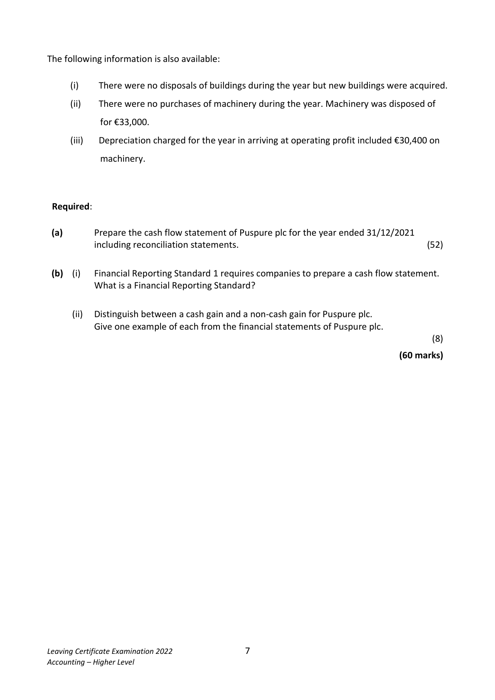
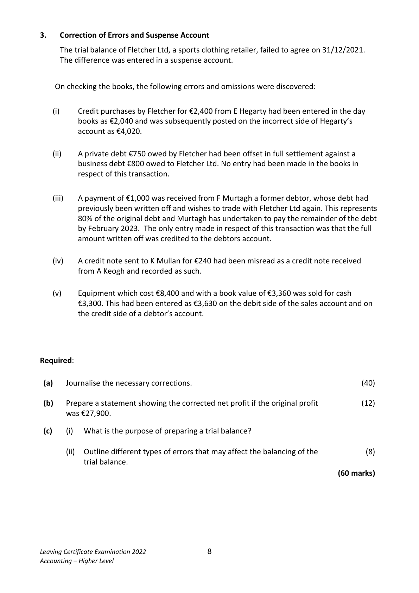
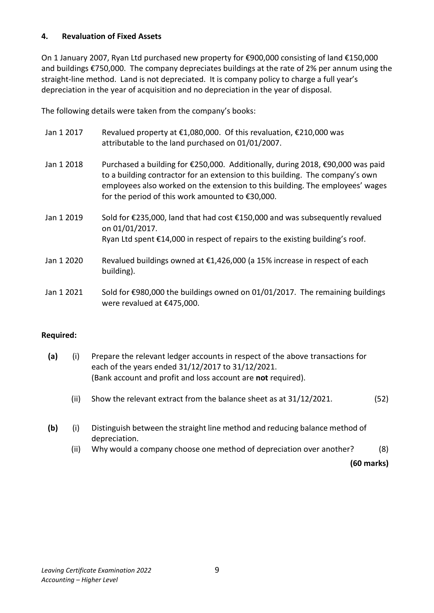
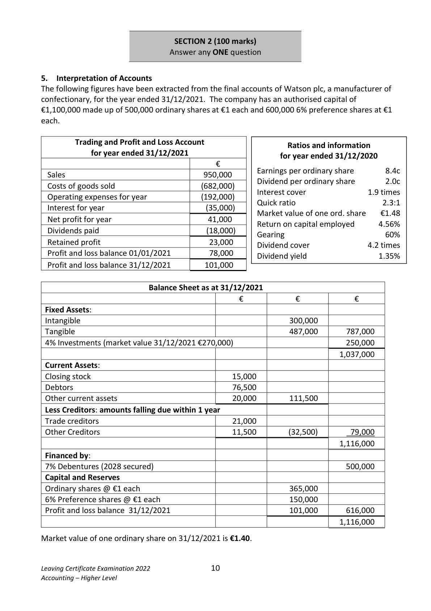
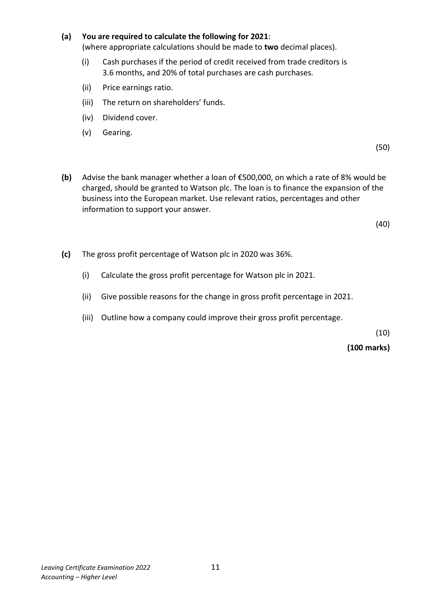
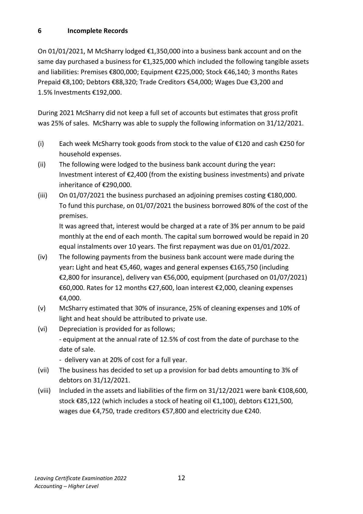

# Question

5.  Provision for corporation tax of €60,000 is to be recorded.
Required:

(a)    Prepare a trading and profit and loss account for the year ended 31/12/2021.          (75)

(b)    Prepare a balance sheet as at 31/12/2021.                                             (45)
                                                                             (120 marks)

Leaving Certificate Examination 2022              5
Accounting – Higher Level

<!-- PAGE 6 -->
# Page 6

<!-- HAS_VISUAL: true -->
<!-- VISUAL_REASON: page contains vector drawings; page image extracted because text may not fully capture visual content -->

2.     Cash Flow Statement
 The following are the balance sheets of Puspure plc as at 31/12/2021 and 31/12/2020 together
 with an abridged profit and loss account for the year ended 31/12/2021.

  Abridged Profit and Loss Account for the year ended 31/12/2021       €
  Operating Profit                                                 227,000
  Investment income for the year                                       3,800
  Interest for the year                                                  (12,000)
  Profit before taxation                                            218,800
  Taxation for the year                                                  (66,000)
  Profit after taxation                                              152,800
  Dividends paid                                                        (30,800)
  Retained profit for the year                                       122,000
  Retained profit on 01/01/2021                                     268,650
  Retained profit on 31/12/2021                                     390,650

  Balance Sheets as at                  31/12/2021                31/12/2020
  Financial Assets                  €            €           €            €
  Investments at cost                            165,000                     185,000
  Fixed Assets
  Land and buildings at cost         850,000                     732,000
  Less accumulated depreciation     (75,000)       775,000       (60,000)       672,000
  Machinery at cost                397,000                     438,000
  Less accumulated depreciation   (209,000)       188,000      (187,600)       250,400
                                               1,128,000                    1,107,400
  Current Assets
  Stock                          214,600                     178,600
  Debtors                        185,200                     171,800
  Bank                            14,000                                     -
  Investment income due             1,050                       950
  Government securities             35,000                      10,000
                                 449,850                     361,350
  Less Creditors: Amounts falling due within 1 year
  Trade creditors                  250,600                     241,600
  Debenture interest due             2,600                       2,000
  Bank                                               -                          8,500
  Corporation tax                   52,000                      48,000
                                 305,200       144,650       300,100        61,250
                                               1,272,650                    1,168,650
  Financed by:
  Creditors: Amounts falling due after 1 year
  6% Debentures                                100,000                     200,000
  Capital and Reserves
  Ordinary shares @ €1 each        770,000                     700,000
  Share premium                   12,000                                     -
   Profit and loss account           390,650     1,172,650       268,650       968,650
                                               1,272,650                    1,168,650

Leaving Certificate Examination 2022              6
Accounting – Higher Level

<!-- PAGE 7 -->
# Page 7

The following information is also available:

        (i)    There were no disposals of buildings during the year but new buildings were acquired.

         (ii)    There were no purchases of machinery during the year. Machinery was disposed of

              for €33,000.

         (iii)    Depreciation charged for the year in arriving at operating profit included €30,400 on

            machinery.

 Required:

 (a)       Prepare the cash flow statement of Puspure plc for the year ended 31/12/2021
            including reconciliation statements.                                               (52)

 (b)   (i)   Financial Reporting Standard 1 requires companies to prepare a cash flow statement.
        What is a Financial Reporting Standard?

         (ii)   Distinguish between a cash gain and a non-cash gain for Puspure plc.
          Give one example of each from the financial statements of Puspure plc.
                                                                                                        (8)

                                                                                (60 marks)

Leaving Certificate Examination 2022              7
Accounting – Higher Level

<!-- PAGE 8 -->
# Page 8

<!-- HAS_VISUAL: true -->
<!-- VISUAL_REASON: text contains visual keywords: line; page image extracted because text may not fully capture visual content -->

3.    Correction of Errors and Suspense Account

     The trial balance of Fletcher Ltd, a sports clothing retailer, failed to agree on 31/12/2021.
     The difference was entered in a suspense account.

   On checking the books, the following errors and omissions were discovered:

     (i)     Credit purchases by Fletcher for €2,400 from E Hegarty had been entered in the day
         books as €2,040 and was subsequently posted on the incorrect side of Hegarty’s
          account as €4,020.

      (ii)   A private debt €750 owed by Fletcher had been offset in full settlement against a
          business debt €800 owed to Fletcher Ltd. No entry had been made in the books in
          respect of this transaction.

      (iii)   A payment of €1,000 was received from F Murtagh a former debtor, whose debt had
           previously been written off and wishes to trade with Fletcher Ltd again. This represents
        80% of the original debt and Murtagh has undertaken to pay the remainder of the debt
         by February 2023. The only entry made in respect of this transaction was that the full
        amount written off was credited to the debtors account.

     (iv)   A credit note sent to K Mullan for €240 had been misread as a credit note received
         from A Keogh and recorded as such.

    (v)    Equipment which cost €8,400 and with a book value of €3,360 was sold for cash
          €3,300. This had been entered as €3,630 on the debit side of the sales account and on
          the credit side of a debtor’s account.

Required:

 (a)    Journalise the necessary corrections.                                                  (40)

 (b)   Prepare a statement showing the corrected net profit if the original profit             (12)
      was €27,900.

 (c)      (i)  What is the purpose of preparing a trial balance?

            (ii)  Outline different types of errors that may affect the balancing of the               (8)
                trial balance.
                                                                                (60 marks)

Leaving Certificate Examination 2022              8
Accounting – Higher Level

<!-- PAGE 9 -->
# Page 9

<!-- HAS_VISUAL: true -->
<!-- VISUAL_REASON: text contains visual keywords: line, table; page image extracted because text may not fully capture visual content -->

4.    Revaluation of Fixed Assets

On 1 January 2007, Ryan Ltd purchased new property for €900,000 consisting of land €150,000
and buildings €750,000. The company depreciates buildings at the rate of 2% per annum using the
straight-line method. Land is not depreciated.  It is company policy to charge a full year’s
depreciation in the year of acquisition and no depreciation in the year of disposal.

The following details were taken from the company’s books:

 Jan 1 2017     Revalued property at €1,080,000. Of this revaluation, €210,000 was
                 attributable to the land purchased on 01/01/2007.

 Jan 1 2018     Purchased a building for €250,000. Additionally, during 2018, €90,000 was paid
                to a building contractor for an extension to this building. The company’s own
              employees also worked on the extension to this building. The employees’ wages
                  for the period of this work amounted to €30,000.

 Jan 1 2019     Sold for €235,000, land that had cost €150,000 and was subsequently revalued
             on 01/01/2017.
              Ryan Ltd spent €14,000 in respect of repairs to the existing building’s roof.

 Jan 1 2020     Revalued buildings owned at €1,426,000 (a 15% increase in respect of each
                  building).

 Jan 1 2021     Sold for €980,000 the buildings owned on 01/01/2017. The remaining buildings
             were revalued at €475,000.

Required:

  (a)      (i)   Prepare the relevant ledger accounts in respect of the above transactions for
            each of the years ended 31/12/2017 to 31/12/2021.
            (Bank account and profit and loss account are not required).

             (ii)  Show the relevant extract from the balance sheet as at 31/12/2021.            (52)

  (b)      (i)   Distinguish between the straight line method and reducing balance method of
              depreciation.
             (ii)  Why would a company choose one method of depreciation over another?        (8)

                                                                                (60 marks)

Leaving Certificate Examination 2022              9
Accounting – Higher Level

<!-- PAGE 10 -->
# Page 10

<!-- HAS_VISUAL: true -->
<!-- VISUAL_REASON: page contains vector drawings; text contains visual keywords: figure; page image extracted because text may not fully capture visual content -->

SECTION 2 (100 marks)
                             Answer any ONE question

5.  Interpretation of Accounts
The following figures have been extracted from the final accounts of Watson plc, a manufacturer of
confectionary, for the year ended 31/12/2021. The company has an authorised capital of
€1,100,000 made up of 500,000 ordinary shares at €1 each and 600,000 6% preference shares at €1
each.

         Trading and Profit and Loss Account                                                                  Ratios and information
              for year ended 31/12/2021                                                                    for year ended 31/12/2020
                                        €
                                                          Earnings per ordinary share         8.4c  Sales                                  950,000
                                                       Dividend per ordinary share        2.0c
  Costs of goods sold                       (682,000)
                                                              Interest cover                 1.9 times
  Operating expenses for year              (192,000)
                                                      Quick ratio                        2.3:1
  Interest for year                            (35,000)
                                                  Market value of one ord. share    €1.48
 Net profit for year                        41,000
                                                      Return on capital employed      4.56%
  Dividends paid                             (18,000)                                                       Gearing                    60%
  Retained profit                           23,000                                                       Dividend cover                4.2 times
  Profit and loss balance 01/01/2021         78,000                                                       Dividend yield                 1.35%
  Profit and loss balance 31/12/2021        101,000

                           Balance Sheet as at 31/12/2021
                                             €            €            €
 Fixed Assets:
 Intangible                                                   300,000
 Tangible                                                    487,000       787,000
 4% Investments (market value 31/12/2021 €270,000)                            250,000
                                                                            1,037,000
 Current Assets:
 Closing stock                                   15,000
 Debtors                                       76,500
 Other current assets                             20,000        111,500
 Less Creditors: amounts falling due within 1 year
 Trade creditors                                 21,000
 Other Creditors                                 11,500         (32,500)        79,000
                                                                            1,116,000
 Financed by:
 7% Debentures (2028 secured)                                               500,000
 Capital and Reserves
 Ordinary shares @ €1 each                                     365,000
 6% Preference shares @ €1 each                                150,000
 Profit and loss balance 31/12/2021                             101,000       616,000
                                                                            1,116,000

Market value of one ordinary share on 31/12/2021 is €1.40.

Leaving Certificate Examination 2022              10
Accounting – Higher Level

<!-- PAGE 11 -->
# Page 11

<!-- HAS_VISUAL: true -->
<!-- VISUAL_REASON: text contains visual keywords: line; page image extracted because text may not fully capture visual content -->

(a)  You are required to calculate the following for 2021:
          (where appropriate calculations should be made to two decimal places).

                 (i)   Cash purchases if the period of credit received from trade creditors is
                 3.6 months, and 20% of total purchases are cash purchases.

                  (ii)   Price earnings ratio.

                  (iii)  The return on shareholders’ funds.

               (iv)  Dividend cover.

             (v)   Gearing.

                                                                                               (50)

      (b)   Advise the bank manager whether a loan of €500,000, on which a rate of 8% would be
           charged, should be granted to Watson plc. The loan is to finance the expansion of the
           business into the European market. Use relevant ratios, percentages and other
           information to support your answer.

                                                                                               (40)

       (c)   The gross profit percentage of Watson plc in 2020 was 36%.

                 (i)   Calculate the gross profit percentage for Watson plc in 2021.

                  (ii)  Give possible reasons for the change in gross profit percentage in 2021.

                  (iii)  Outline how a company could improve their gross profit percentage.

                                                                                               (10)

                                                                             (100 marks)

Leaving Certificate Examination 2022              11
Accounting – Higher Level

<!-- PAGE 12 -->
# Page 12

# Marking Scheme

[No matching marking scheme section detected.]

# Source References

Exam paper:
- file: intermediate_markdown/exam_papers/higher/accounting_higher_2022_paper_1_exam.md
- pages: [6, 7, 8, 9, 10, 11, 12]

Marking scheme:
- file: 
- pages: []

# Notes

