# Question

3.   Equipment to be depreciated at 10% of cost per annum.

Required:

(a)   Prepare a trading and profit and loss account for the year ended 31/12/2022.             (75)
(b)   Prepare a balance sheet as at 31/12/2022.                                                (45)
                                                                              (120 marks)

Leaving Certificate Examination 2023               3
Accounting - Higher Level

<!-- PAGE 4 -->
# Page 4

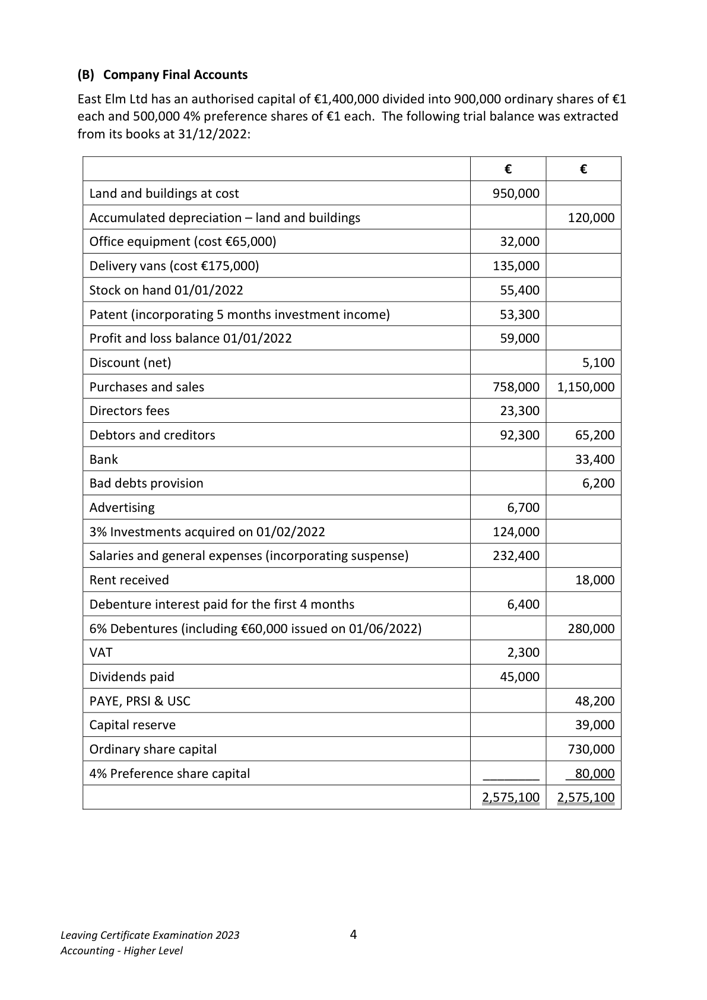

<!-- HAS_VISUAL: true -->
<!-- VISUAL_REASON: page contains vector drawings; page image extracted because text may not fully capture visual content -->

(B) Company Final Accounts

   East Elm Ltd has an authorised capital of €1,400,000 divided into 900,000 ordinary shares of €1
  each and 500,000 4% preference shares of €1 each. The following trial balance was extracted
  from its books at 31/12/2022:

                                                             €         €

    Land and buildings at cost                                      950,000

    Accumulated depreciation – land and buildings                               120,000

     Office equipment (cost €65,000)                                  32,000

     Delivery vans (cost €175,000)                                   135,000

     Stock on hand 01/01/2022                                       55,400

     Patent (incorporating 5 months investment income)                 53,300

     Profit and loss balance 01/01/2022                               59,000

     Discount (net)                                                               5,100

    Purchases and sales                                           758,000   1,150,000

     Directors fees                                                  23,300

    Debtors and creditors                                           92,300     65,200

    Bank                                                                     33,400

    Bad debts provision                                                          6,200

     Advertising                                                      6,700

   3% Investments acquired on 01/02/2022                         124,000

     Salaries and general expenses (incorporating suspense)             232,400

    Rent received                                                             18,000

    Debenture interest paid for the first 4 months                        6,400

   6% Debentures (including €60,000 issued on 01/06/2022)                      280,000

    VAT                                                             2,300

     Dividends paid                                                 45,000

    PAYE, PRSI & USC                                                          48,200

     Capital reserve                                                            39,000

     Ordinary share capital                                                    730,000

   4% Preference share capital                                 ________     80,000

                                                                  2,575,100   2,575,100

Leaving Certificate Examination 2023               4
Accounting - Higher Level

<!-- PAGE 5 -->
# Page 5

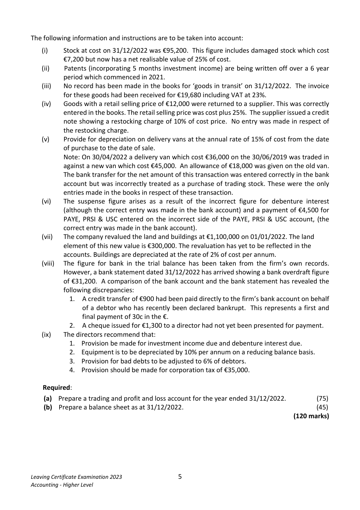

<!-- HAS_VISUAL: true -->
<!-- VISUAL_REASON: text contains visual keywords: figure; page image extracted because text may not fully capture visual content -->

The following information and instructions are to be taken into account:

     (i)     Stock at cost on 31/12/2022 was €95,200. This figure includes damaged stock which cost
          €7,200 but now has a net realisable value of 25% of cost.
      (ii)     Patents (incorporating 5 months investment income) are being written off over a 6 year
          period which commenced in 2021.
      (iii)   No record has been made in the books for ‘goods in transit’ on 31/12/2022. The invoice
           for these goods had been received for €19,680 including VAT at 23%.
     (iv)   Goods with a retail selling price of €12,000 were returned to a supplier. This was correctly
          entered in the books. The retail selling price was cost plus 25%. The supplier issued a credit
          note showing a restocking charge of 10% of cost price. No entry was made in respect of
          the restocking charge.
    (v)    Provide for depreciation on delivery vans at the annual rate of 15% of cost from the date
           of purchase to the date of sale.
          Note: On 30/04/2022 a delivery van which cost €36,000 on the 30/06/2019 was traded in
           against a new van which cost €45,000. An allowance of €18,000 was given on the old van.
         The bank transfer for the net amount of this transaction was entered correctly in the bank
          account but was incorrectly treated as a purchase of trading stock. These were the only
           entries made in the books in respect of these transaction.
     (vi)   The suspense figure arises as a result of the incorrect figure for debenture interest
          (although the correct entry was made in the bank account) and a payment of €4,500 for
          PAYE, PRSI & USC entered on the incorrect side of the PAYE, PRSI & USC account, (the
           correct entry was made in the bank account).
     (vii)   The company revalued the land and buildings at €1,100,000 on 01/01/2022. The land
         element of this new value is €300,000. The revaluation has yet to be reflected in the
          accounts. Buildings are depreciated at the rate of 2% of cost per annum.
     (viii)  The figure for bank in the trial balance has been taken from the firm’s own records.
         However, a bank statement dated 31/12/2022 has arrived showing a bank overdraft figure
           of €31,200. A comparison of the bank account and the bank statement has revealed the
           following discrepancies:
              1.  A credit transfer of €900 had been paid directly to the firm’s bank account on behalf
                 of a debtor who has recently been declared bankrupt.  This represents a first and
                    final payment of 30c in the €.
              2.  A cheque issued for €1,300 to a director had not yet been presented for payment.
     (ix)   The directors recommend that:
              1.  Provision be made for investment income due and debenture interest due.
              2.  Equipment is to be depreciated by 10% per annum on a reducing balance basis.
              3.  Provision for bad debts to be adjusted to 6% of debtors.

# Marking Scheme

3.   Loss on van                   35,000 -3,000 -29,750                           2,250

   3.   Depreciation on van - disposal   35,000 by 20% for 51/12 months                29,750

                                                                                  98,250

Question 3

                                                    24  (a)              Adjusted Creditors Control Account

                            €                                  €

 Balance b/d                  280 [2]   Balance b/d                  48,760 [2]

 Credit Note                 (v)     580 [4]   Purchases                     (ii)       360 [4]

 Contra/Debtors             (vi)     420 [3]   Discount disallowed    (iii)       184 [4]

 Balance c/d                  48,369       Restocking charge     (iv)        65 [4]

                            _____       Balance c/d                  280 [1]

                             49,649                                 49,649

 Balance b/d                  280       Balance b/d                  48,369

                                                    28
  (b)  Schedule of Creditors Accounts Balances

                                                €                  €
                                                                       30,584 [3]   Balance as per list of creditors

  Add

     Purchases                                              (i)            16,840   [4]

     Purchases                                               (ii)              730   [4]

     Discount disallowed                                (iii)              103   [4]

     Restocking charge                            (iv)              650    [4]     18,323

   Deduct                                                              48,907

      Credit note                                 (v)              638   [4]

     Contra                                          (vi)              180   [4]      (818)

  Net balance as per adjusted control account                              48,089 [1]

<!-- PAGE 12 -->
# Page 12

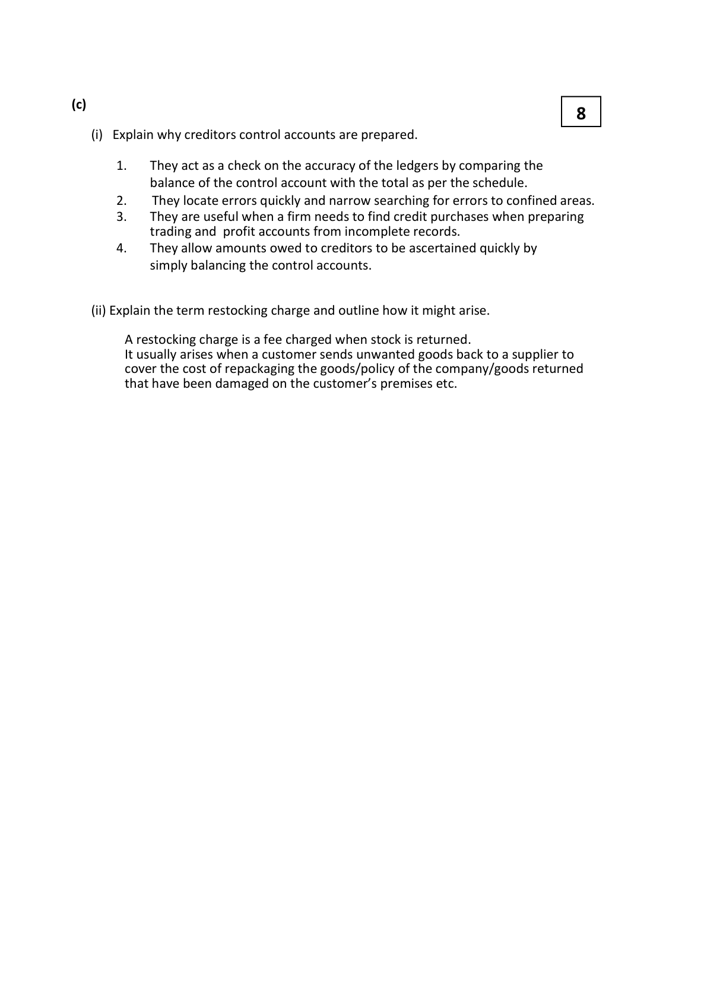

<!-- HAS_VISUAL: true -->
<!-- VISUAL_REASON: page contains vector drawings; text contains visual keywords: line; page image extracted because text may not fully capture visual content -->

(c)
                                                    8
     (i)  Explain why creditors control accounts are prepared.

        1.   They act as a check on the accuracy of the ledgers by comparing the
            balance of the control account with the total as per the schedule.
        2.    They locate errors quickly and narrow searching for errors to confined areas.
        3.   They are useful when a firm needs to find credit purchases when preparing
             trading and profit accounts from incomplete records.
        4.   They allow amounts owed to creditors to be ascertained quickly by
             simply balancing the control accounts.

     (ii) Explain the term restocking charge and outline how it might arise.

      A restocking charge is a fee charged when stock is returned.
             It usually arises when a customer sends unwanted goods back to a supplier to
        cover the cost of repackaging the goods/policy of the company/goods returned
         that have been damaged on the customer’s premises etc.

<!-- PAGE 13 -->
# Page 13

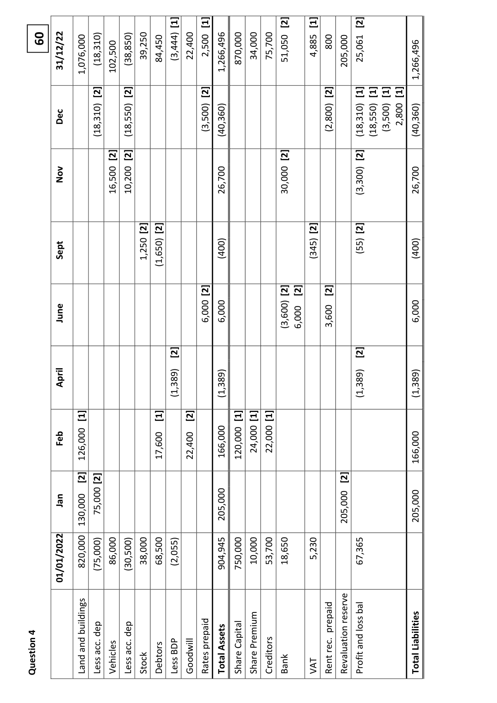

<!-- HAS_VISUAL: true -->
<!-- VISUAL_REASON: page contains vector drawings; page image extracted because text may not fully capture visual content -->

[1]      [1]                     [2]      [1]           [2]
                                                                                                                                                       51,050         4,885  800    205,000   25,061 60       31/12/22                                                                            84,450    (3,444)   22,400   2,500      1,266,496     870,000   34,000   75,700                                            1,076,000    (18,310)    102,500    (38,850)   39,250                                                                                                                                                                                                                                                                                                                                                        1,266,496

                   [2]      [2]                    [2]                                  [2]      [1] [1] [1] [1]

        Dec                                                    (18,310)                 (18,550)                                               (3,500)     (40,360)                                                                    (2,800)                 (18,310)   (18,550)  (3,500)  2,800     (40,360)

                        [2]  [2]                                            [2]                   [2]
        Nov                          16,500   10,200                                                  26,700                                30,000                                             (3,300)                           26,700

                                 [2]  [2]                                           [2]           [2]
           Sept                                     1,250    (1,650)                          (400)                                         (345)               (55)                       (400)

                                                    [2]                     [2] [2]      [2]
           June                                                                    6,000   6,000                                     (3,600)  6,000          3,600                                      6,000

                                           [2]                                                     [2]
              April                                                                         (1,389)                          (1,389)                                                                                          (1,389)                                (1,389)

               [1]                    [1]      [2]            [1]  [1]  [1]

        Feb                                                                                                                                    166,000     120,000   24,000   22,000                                  126,000                                        17,600             22,400                                                                                                                                                                                                                                                                            166,000

               [2]  [2]                                                                       [2]

        Jan                                       75,000                                                                                205,000                                                                                                                                                                                                                          205,000                                           205,000                                  130,000
                                                    (75,000)   86,000    (30,500)   38,000   68,500    (2,055)                          904,945     750,000   10,000   53,700   18,650         5,230                      67,365                           01/01/2022        820,000

                                                                                                  bal                                                                                                                                                                                                                          reserve                                                                                                                                                                                                               prepaid        loss4                                   buildings  dep      dep                                                                                                  and                                                  Liabilities                                                                                                                         prepaid    Assets     Capital    Premium                          rec.               and  acc.        acc.           BDPQuestion                Land  Less    Vehicles  Less   Stock    Debtors  Less    Goodwill   Rates   Total   Share   Share     Creditors  Bank      VAT  Rent      Revaluation   Profit                       Total

<!-- PAGE 14 -->
# Page 14

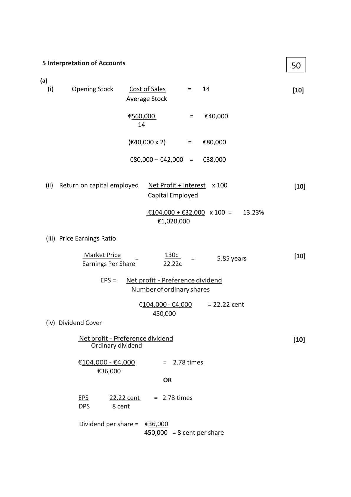

<!-- HAS_VISUAL: true -->
<!-- VISUAL_REASON: page contains vector drawings; page image extracted because text may not fully capture visual content -->

5 Interpretation of Accounts                                   50

(a)
    (i)     Opening Stock     Cost of Sales      =   14                             [10]
                          Average Stock

                          €560,000          =   €40,000
                           14

                            (€40,000 x 2)      =   €80,000

                           €80,000 – €42,000  =   €38,000

   (ii)  Return on capital employed   Net Profit + Interest  x 100                       [10]
                                      Capital Employed

                                €104,000 + €32,000  x 100 =   13.23%
                                    €1,028,000

   (iii) Price Earnings Ratio

             Market Price             130c                                         [10]                           =               =       5.85 years
              Earnings Per Share         22.22c

                 EPS =   Net profit - Preference dividend
                      Number of ordinary shares

                            €104,000 - €4,000    = 22.22 cent
                                  450,000
   (iv) Dividend Cover

           Net profit - Preference dividend                                        [10]
                Ordinary dividend

          €104,000 - €4,000        =  2.78 times
                 €36,000
                            OR

           EPS      22.22 cent    =  2.78 times
          DPS      8 cent

            Dividend per share =  €36,000
                               450,000 = 8 cent per share

<!-- PAGE 15 -->
# Page 15

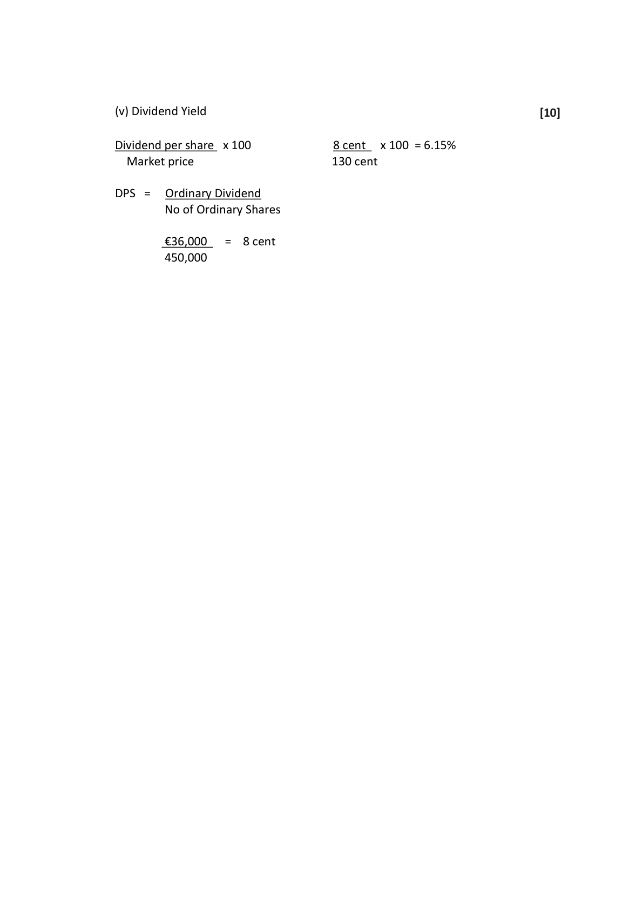

<!-- HAS_VISUAL: true -->
<!-- VISUAL_REASON: page contains vector drawings; page image extracted because text may not fully capture visual content -->

(v) Dividend Yield                                                                [10]

Dividend per share  x 100            8 cent   x 100 = 6.15%
  Market price                     130 cent

DPS =   Ordinary Dividend
       No of Ordinary Shares

        €36,000   =  8 cent
        450,000

<!-- PAGE 16 -->
# Page 16

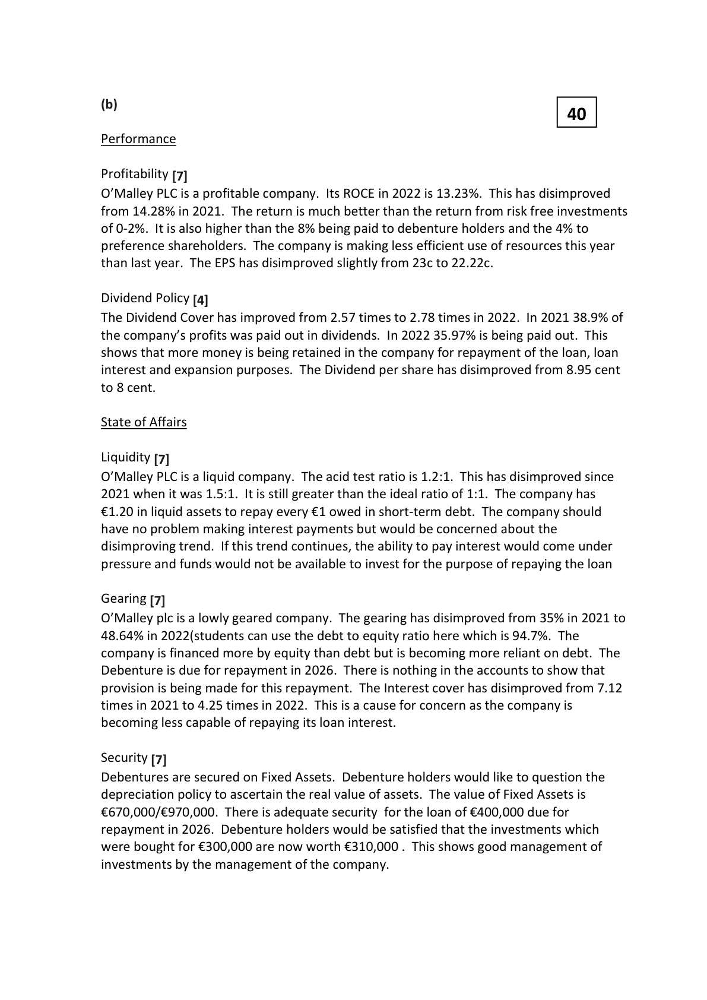

<!-- HAS_VISUAL: true -->
<!-- VISUAL_REASON: page contains vector drawings; text contains visual keywords: table; page image extracted because text may not fully capture visual content -->

(b)
                                                40

Performance

Profitability [7]
O’Malley PLC is a profitable company. Its ROCE in 2022 is 13.23%. This has disimproved
from 14.28% in 2021. The return is much better than the return from risk free investments
of 0-2%.  It is also higher than the 8% being paid to debenture holders and the 4% to
preference shareholders. The company is making less efficient use of resources this year
than last year. The EPS has disimproved slightly from 23c to 22.22c.

Dividend Policy [4]
The Dividend Cover has improved from 2.57 times to 2.78 times in 2022. In 2021 38.9% of
the company’s profits was paid out in dividends. In 2022 35.97% is being paid out. This
shows that more money is being retained in the company for repayment of the loan, loan
interest and expansion purposes. The Dividend per share has disimproved from 8.95 cent
to 8 cent.

State of Affairs

Liquidity [7]
O’Malley PLC is a liquid company. The acid test ratio is 1.2:1. This has disimproved since
2021 when it was 1.5:1.  It is still greater than the ideal ratio of 1:1. The company has
€1.20 in liquid assets to repay every €1 owed in short-term debt. The company should
have no problem making interest payments but would be concerned about the
disimproving trend.  If this trend continues, the ability to pay interest would come under
pressure and funds would not be available to invest for the purpose of repaying the loan

Gearing [7]
O’Malley plc is a lowly geared company. The gearing has disimproved from 35% in 2021 to
48.64% in 2022(students can use the debt to equity ratio here which is 94.7%. The
company is financed more by equity than debt but is becoming more reliant on debt. The
Debenture is due for repayment in 2026. There is nothing in the accounts to show that
provision is being made for this repayment. The Interest cover has disimproved from 7.12
times in 2021 to 4.25 times in 2022. This is a cause for concern as the company is
becoming less capable of repaying its loan interest.

Security [7]
Debentures are secured on Fixed Assets. Debenture holders would like to question the
depreciation policy to ascertain the real value of assets. The value of Fixed Assets is
€670,000/€970,000. There is adequate security for the loan of €400,000 due for
repayment in 2026. Debenture holders would be satisfied that the investments which
were bought for €300,000 are now worth €310,000 . This shows good management of
investments by the management of the company.

<!-- PAGE 17 -->
# Page 17

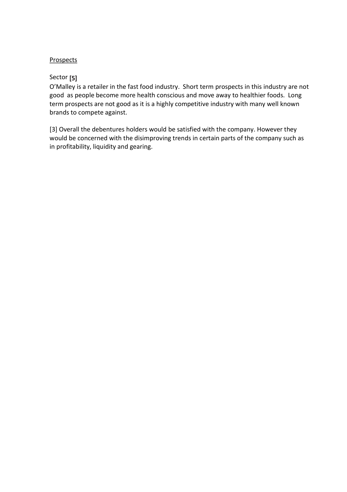

<!-- HAS_VISUAL: true -->
<!-- VISUAL_REASON: page contains vector drawings; page image extracted because text may not fully capture visual content -->

Prospects

Sector [5]
O’Malley is a retailer in the fast food industry. Short term prospects in this industry are not
good as people become more health conscious and move away to healthier foods. Long
term prospects are not good as it is a highly competitive industry with many well known
brands to compete against.

[3] Overall the debentures holders would be satisfied with the company. However they
would be concerned with the disimproving trends in certain parts of the company such as
in profitability, liquidity and gearing.

<!-- PAGE 18 -->
# Page 18

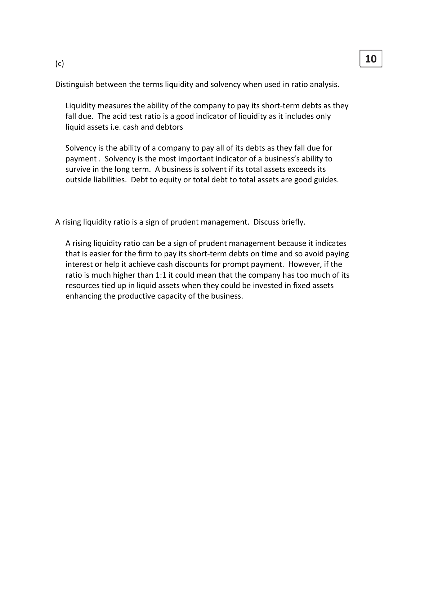

<!-- HAS_VISUAL: true -->
<!-- VISUAL_REASON: page contains embedded images; page contains vector drawings; page image extracted because text may not fully capture visual content -->

10(c)

Distinguish between the terms liquidity and solvency when used in ratio analysis.

   Liquidity measures the ability of the company to pay its short-term debts as they
    fall due. The acid test ratio is a good indicator of liquidity as it includes only
   liquid assets i.e. cash and debtors

   Solvency is the ability of a company to pay all of its debts as they fall due for
  payment . Solvency is the most important indicator of a business’s ability to
   survive in the long term. A business is solvent if its total assets exceeds its
   outside liabilities. Debt to equity or total debt to total assets are good guides.

A rising liquidity ratio is a sign of prudent management. Discuss briefly.

  A rising liquidity ratio can be a sign of prudent management because it indicates
   that is easier for the firm to pay its short-term debts on time and so avoid paying
   interest or help it achieve cash discounts for prompt payment. However, if the
   ratio is much higher than 1:1 it could mean that the company has too much of its
   resources tied up in liquid assets when they could be invested in fixed assets
   enhancing the productive capacity of the business.

<!-- PAGE 19 -->
# Page 19

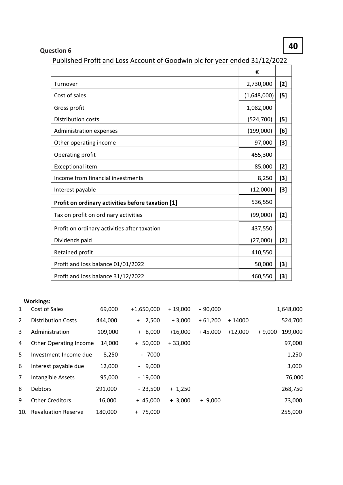

<!-- HAS_VISUAL: true -->
<!-- VISUAL_REASON: page contains vector drawings; page image extracted because text may not fully capture visual content -->

40       Question 6
          Published Profit and Loss Account of Goodwin plc for year ended 31/12/2022

                                                                          €

            Turnover                                                           2,730,000   [2]

             Cost of sales                                                           (1,648,000)  [5]

            Gross profit                                                         1,082,000

              Distribution costs                                                      (524,700)   [5]

             Administration expenses                                               (199,000)   [6]

            Other operating income                                               97,000   [3]

            Operating profit                                                    455,300

             Exceptional item                                                      85,000   [2]

           Income from financial investments                                        8,250   [3]

              Interest payable                                                          (12,000)   [3]

              Profit on ordinary activities before taxation [1]                         536,550

            Tax on profit on ordinary activities                                        (99,000)   [2]

               Profit on ordinary activities after taxation                               437,550

             Dividends paid                                                           (27,000)   [2]

            Retained profit                                                     410,550

               Profit and loss balance 01/01/2022                                      50,000   [3]

               Profit and loss balance 31/12/2022                                    460,550   [3]

  Workings:
1   Cost of Sales            69,000     +1,650,000   + 19,000    - 90,000                    1,648,000

2    Distribution Costs       444,000      +  2,500    + 3,000   + 61,200  + 14000           524,700

3   Administration         109,000      + 8,000   +16,000   + 45,000  +12,000   + 9,000  199,000

4   Other Operating Income  14,000     + 50,000   + 33,000                                97,000

5   Investment Income due    8,250            - 7000                                            1,250

6    Interest payable due      12,000          -  9,000                                            3,000

7    Intangible Assets         95,000          - 19,000                                           76,000

8   Debtors               291,000           - 23,500   + 1,250                               268,750

9   Other Creditors         16,000      + 45,000   + 3,000   + 9,000                      73,000

10.  Revaluation Reserve    180,000      + 75,000                                         255,000

<!-- PAGE 20 -->
# Page 20

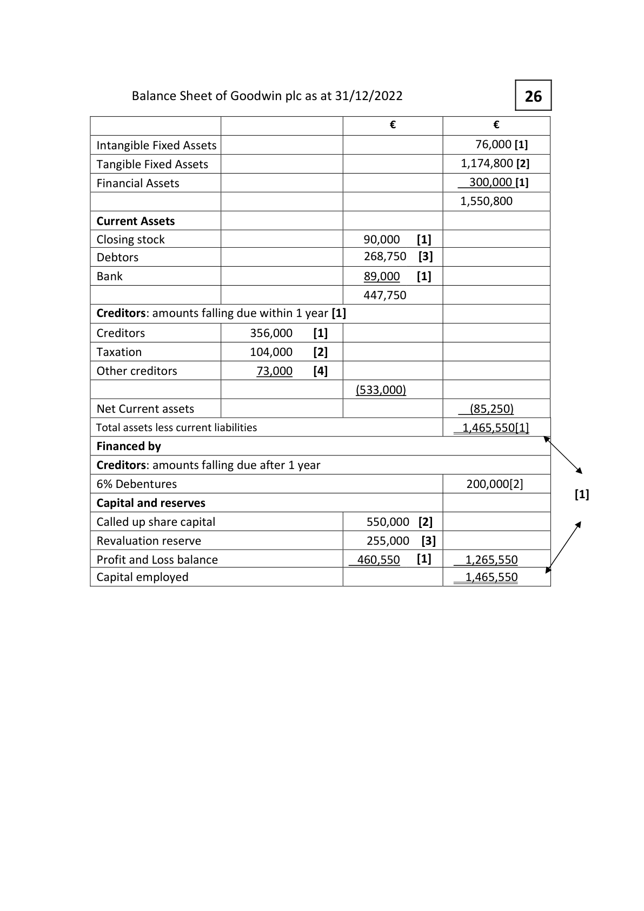

<!-- HAS_VISUAL: true -->
<!-- VISUAL_REASON: page contains vector drawings; page image extracted because text may not fully capture visual content -->

Balance Sheet of Goodwin plc as at 31/12/2022              26

                                                 €                €

Intangible Fixed Assets                                           76,000 [1]
Tangible Fixed Assets                                           1,174,800 [2]
Financial Assets                                                300,000 [1]
                                                              1,550,800

Current Assets
Closing stock                                 90,000   [1]
Debtors                                     268,750  [3]
Bank                                        89,000   [1]
                                            447,750
Creditors: amounts falling due within 1 year [1]

Creditors                 356,000    [1]
Taxation                  104,000    [2]
Other creditors             73,000    [4]
                                              (533,000)
Net Current assets                                                  (85,250)
Total assets less current liabilities                                     1,465,550[1]
Financed by
Creditors: amounts falling due after 1 year
6% Debentures                                                   200,000[2]
                                                                                                [1]
Capital and reserves
Called up share capital                         550,000  [2]
Revaluation reserve                           255,000  [3]
Profit and Loss balance                       460,550   [1]      1,265,550
Capital employed                                               1,465,550

<!-- PAGE 21 -->
# Page 21

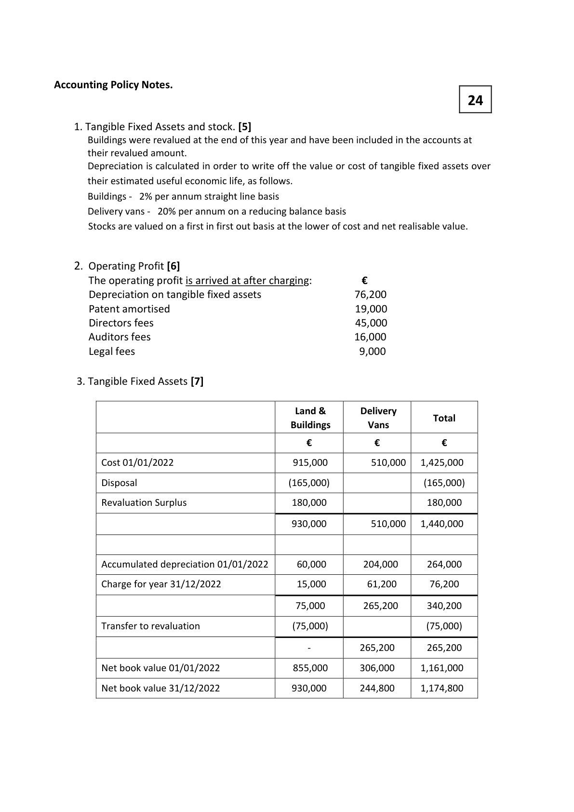

<!-- HAS_VISUAL: true -->
<!-- VISUAL_REASON: page contains vector drawings; text contains visual keywords: line; page image extracted because text may not fully capture visual content -->

Accounting Policy Notes.
                                                     24

3. Tangible Fixed Assets [7]

                                              Land &        Delivery
                                                                                    Total
                                                     Buildings       Vans

                                               €            €            €

          Cost 01/01/2022                        915,000         510,000   1,425,000

           Disposal                                 (165,000)                    (165,000)

          Revaluation Surplus                     180,000                    180,000

                                                930,000         510,000   1,440,000

         Accumulated depreciation 01/01/2022      60,000       204,000      264,000

         Charge for year 31/12/2022               15,000        61,200       76,200

                                                 75,000        265,200      340,200

           Transfer to revaluation                     (75,000)                      (75,000)

                                                                              -          265,200      265,200

         Net book value 01/01/2022               855,000      306,000     1,161,000

         Net book value 31/12/2022              930,000       244,800     1,174,800

<!-- PAGE 22 -->
# Page 22

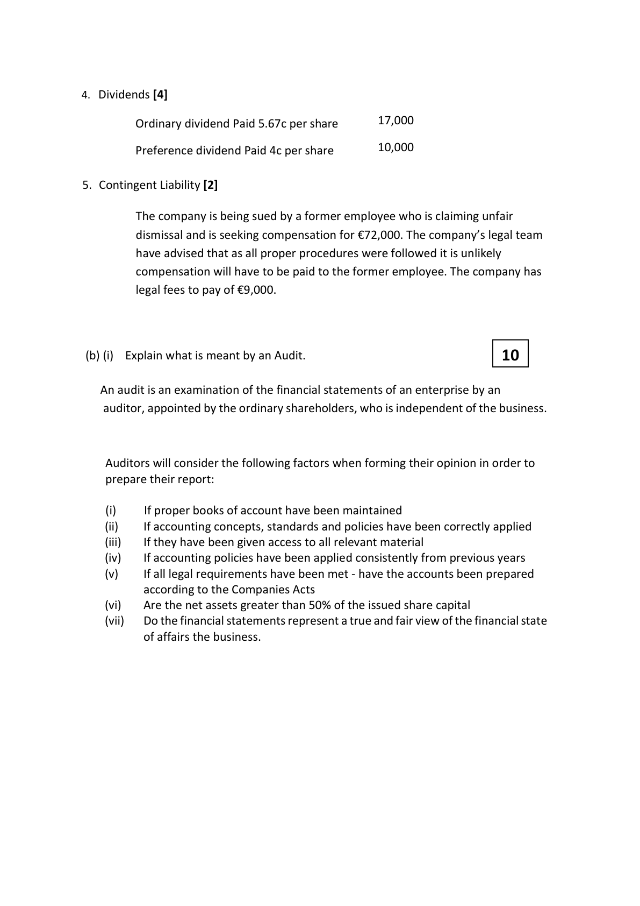

<!-- HAS_VISUAL: true -->
<!-- VISUAL_REASON: page contains vector drawings; page image extracted because text may not fully capture visual content -->

3. Helps managers to calculate the total cost of producing each product, which
     enables a business to manufacture the most profitable products.

  4 . There is no need to separate costs into variable and fixed costs which can be
     very time-consuming and costly, and in many cases may not be possible at all.

  5 Absorption costing complies with accounting principles and standards.

# Source References

Exam paper:
- file: intermediate_markdown/exam_papers/higher/accounting_higher_2023_paper_1_exam.md
- pages: [4, 5]

Marking scheme:
- file: intermediate_markdown/marking_schemes/higher/accounting_higher_2023_paper_1_marking_scheme.md
- pages: [12, 13, 14, 15, 16, 17, 18, 19, 20, 21, 22]

# Notes

