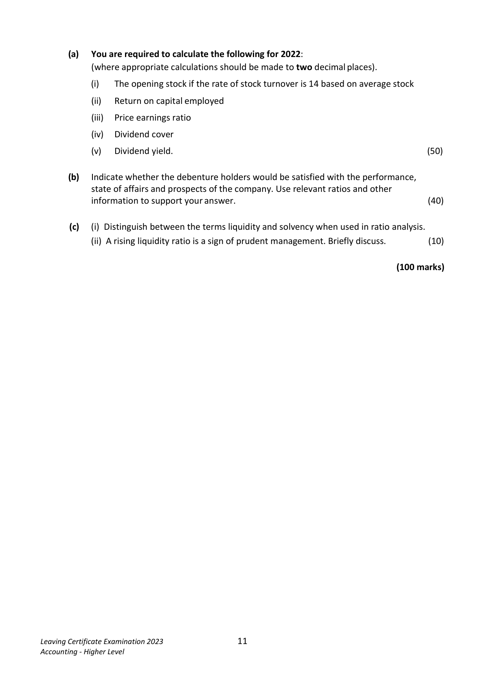
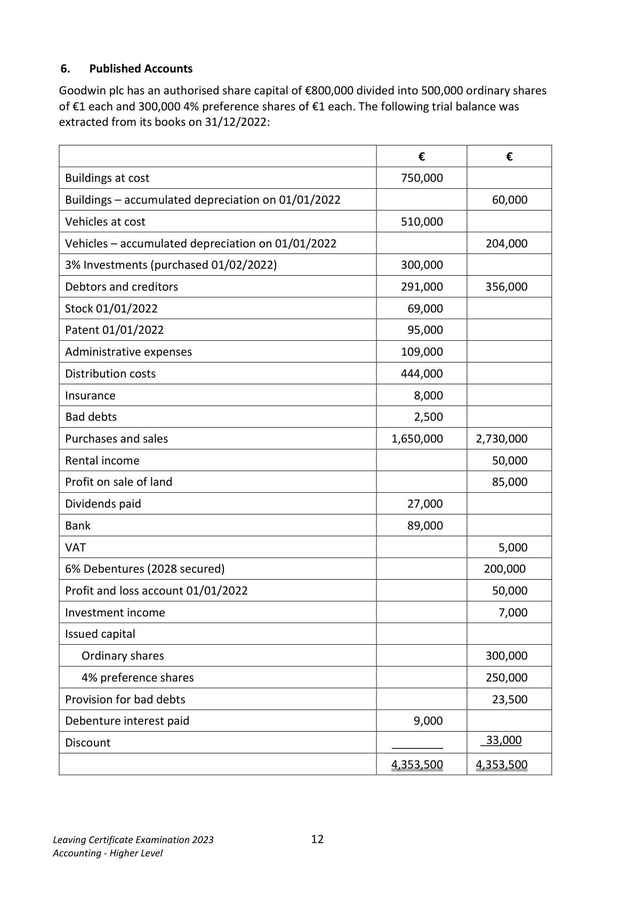
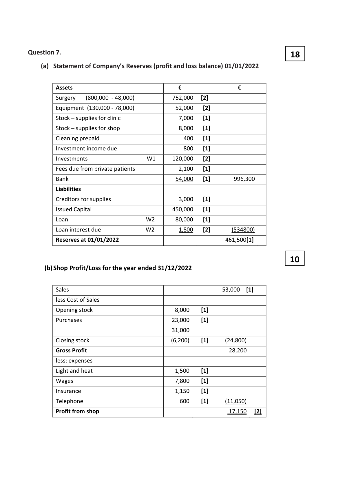

# Question

5.     Interpretation of Accounts

The following figures have been extracted from the final accounts of O’Malley Ltd, a retailer in the
fast food industry, for the year ended 31/12/2022. The company has an authorised capital of €750,000
made up of 550,000 ordinary shares of €1 each and 200,000 4% preference shares of €1 each.
O’Malley Ltd has already issued 450,000 ordinary shares and 100,000 4% preference shares.

   Trading and Profit and Loss Account                        Ratios and information
       for year ended 31/12/2022                              for year ended 31/12/2021
                                    €        Earnings per ordinary share              23c
  Sales                             956,000      Dividend cover                    2.57 times
  Costs of goods sold                 (560,000)     Market value of one ord. share         €1.25
  Operating expenses for year        (260,000)     Return on capital employed          14.28%
  Interest for year                     (32,000)     Gearing                         35%
 Net profit for year                 104,000       Interest cover                     7.12 times
  Dividends paid                      (40,000)      Quick Ratio                              1.5:1
  Retained profit                     64,000       Price earnings ratio                5.43 times
  Profit and loss balance 01/01/2022   14,000
  Profit and loss balance 31/12/2022    78,000

                           Balance Sheet as at 31/12/2022
                                                           €             €
 Fixed Assets                                                               670,000
 Investments (market value 31/12/2022, €310,000)                               300,000
                                                                           970,000
 Current Assets (including stock €42,000)                          140,000
 Less Creditors: amounts falling due within 1 year
 Trade creditors                                                     (50,000)
 Other creditors                                                     (32,000)       58,000
                                                                             1,028,000
 Financed by:
 8% Debentures (2026 secured)                                               400,000
 Capital and Reserves
 Ordinary shares of €1 each                                      450,000
 4% Preference shares of €1 each                                 100,000
 Profit and loss balance                                           78,000      628,000
                                                                             1,028,000

 Market value of one ordinary share on 31/12/2022 is €1.30.

Leaving Certificate Examination 2023               10
Accounting - Higher Level

<!-- PAGE 11 -->
# Page 11

(a)  You are required to calculate the following for 2022:
           (where appropriate calculations should be made to two decimal places).

                   (i)   The opening stock if the rate of stock turnover is 14 based on average stock

                    (ii)   Return on capital employed

                     (iii)   Price earnings ratio

                 (iv)  Dividend cover

               (v)   Dividend yield.                                                                (50)

       (b)   Indicate whether the debenture holders would be satisfied with the performance,
             state of affairs and prospects of the company. Use relevant ratios and other
            information to support your answer.                                                (40)

         (c)    (i) Distinguish between the terms liquidity and solvency when used in ratio analysis.
                   (ii) A rising liquidity ratio is a sign of prudent management. Briefly discuss.           (10)

                                                                                (100 marks)

Leaving Certificate Examination 2023               11
Accounting - Higher Level

<!-- PAGE 12 -->
# Page 12

<!-- HAS_VISUAL: true -->
<!-- VISUAL_REASON: page contains vector drawings; page image extracted because text may not fully capture visual content -->

# Marking Scheme

5. Contingent Liability [2]

        The company is being sued by a former employee who is claiming unfair
          dismissal and is seeking compensation for €72,000. The company’s legal team
         have advised that as all proper procedures were followed it is unlikely
         compensation will have to be paid to the former employee. The company has
           legal fees to pay of €9,000.

 (b) (i)  Explain what is meant by an Audit.                      10

   An audit is an examination of the financial statements of an enterprise by an
    auditor, appointed by the ordinary shareholders, who is independent of the business.

    Auditors will consider the following factors when forming their opinion in order to
    prepare their report:

       (i)        If proper books of account have been maintained
       (ii)       If accounting concepts, standards and policies have been correctly applied
       (iii)      If they have been given access to all relevant material
      (iv)      If accounting policies have been applied consistently from previous years
     (v)       If all legal requirements have been met - have the accounts been prepared
           according to the Companies Acts
      (vi)    Are the net assets greater than 50% of the issued share capital
      (vii)   Do the financial statements represent a true and fair view of the financial state
            of affairs the business.

<!-- PAGE 23 -->
# Page 23

<!-- HAS_VISUAL: true -->
<!-- VISUAL_REASON: page contains vector drawings; page image extracted because text may not fully capture visual content -->

# Source References

Exam paper:
- file: intermediate_markdown/exam_papers/higher/accounting_higher_2023_paper_1_exam.md
- pages: [11, 12]

Marking scheme:
- file: intermediate_markdown/marking_schemes/higher/accounting_higher_2023_paper_1_marking_scheme.md
- pages: [23]

# Notes

