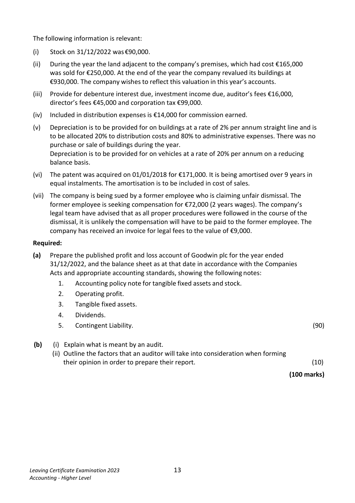
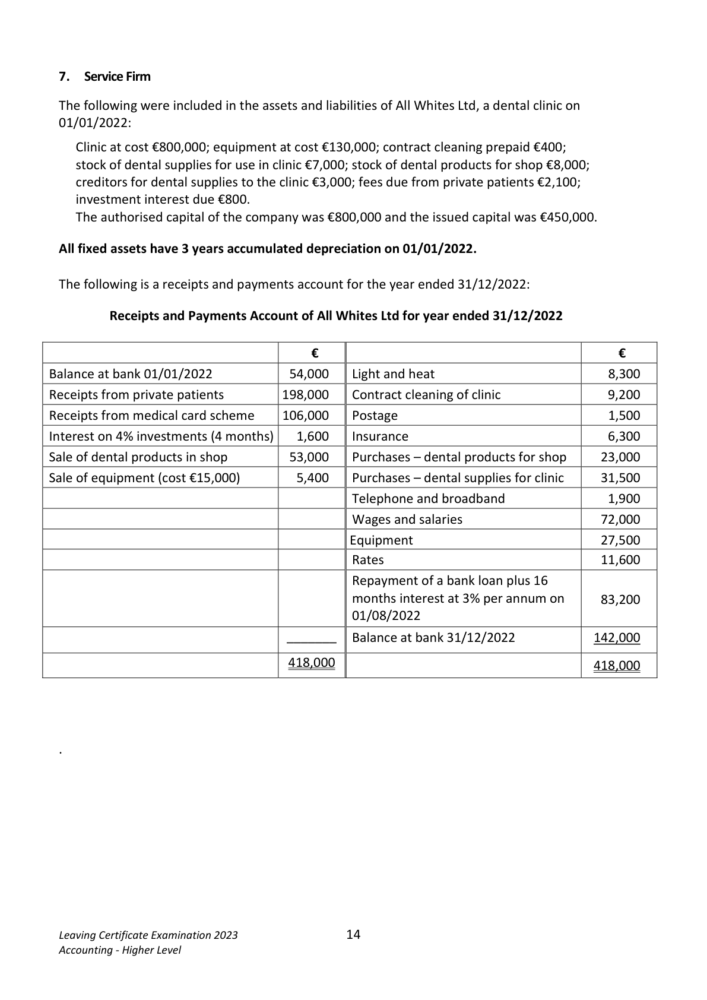
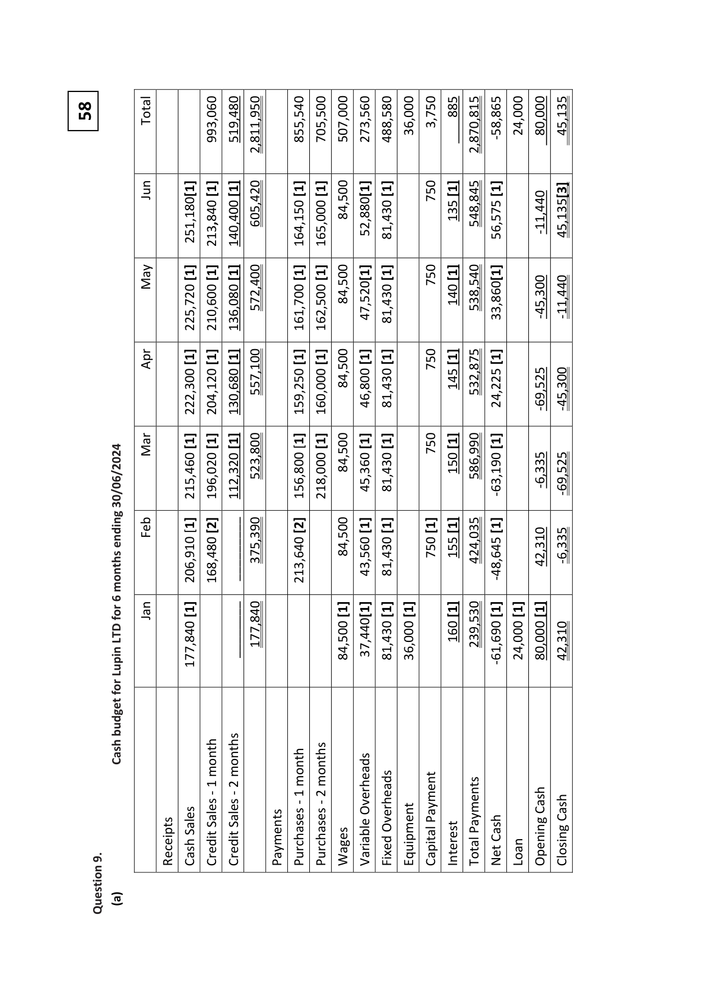

# Question

6.   Published Accounts

 Goodwin plc has an authorised share capital of €800,000 divided into 500,000 ordinary shares
 of €1 each and 300,000 4% preference shares of €1 each. The following trial balance was
 extracted from its books on 31/12/2022:

                                                        €             €

  Buildings at cost                                          750,000

  Buildings – accumulated depreciation on 01/01/2022                         60,000

  Vehicles at cost                                          510,000

  Vehicles – accumulated depreciation on 01/01/2022                         204,000

  3% Investments (purchased 01/02/2022)                     300,000

  Debtors and creditors                                     291,000       356,000

  Stock 01/01/2022                                          69,000

  Patent 01/01/2022                                         95,000

  Administrative expenses                                   109,000

  Distribution costs                                         444,000

  Insurance                                                   8,000

  Bad debts                                                   2,500

  Purchases and sales                                       1,650,000      2,730,000

  Rental income                                                           50,000

   Profit on sale of land                                                      85,000

  Dividends paid                                             27,000

  Bank                                                     89,000

  VAT                                                                       5,000

  6% Debentures (2028 secured)                                           200,000

   Profit and loss account 01/01/2022                                         50,000

  Investment income                                                         7,000

  Issued capital

     Ordinary shares                                                     300,000

    4% preference shares                                                250,000

  Provision for bad debts                                                    23,500

  Debenture interest paid                                      9,000
  Discount                                            ________       33,000

                                                           4,353,500      4,353,500

Leaving Certificate Examination 2023               12
Accounting - Higher Level

<!-- PAGE 13 -->
# Page 13

<!-- HAS_VISUAL: true -->
<!-- VISUAL_REASON: text contains visual keywords: line; page image extracted because text may not fully capture visual content -->

The following information is relevant:

  (i)    Stock on 31/12/2022 was €90,000.

  (ii)   During the year the land adjacent to the company’s premises, which had cost €165,000
     was sold for €250,000. At the end of the year the company revalued its buildings at
      €930,000. The company wishes to reflect this valuation in this year’s accounts.

  (iii)  Provide for debenture interest due, investment income due, auditor’s fees €16,000,
       director’s fees €45,000 and corporation tax €99,000.

  (iv)  Included in distribution expenses is €14,000 for commission earned.

 (v)   Depreciation is to be provided for on buildings at a rate of 2% per annum straight line and is
       to be allocated 20% to distribution costs and 80% to administrative expenses. There was no
      purchase or sale of buildings during the year.
       Depreciation is to be provided for on vehicles at a rate of 20% per annum on a reducing
      balance basis.

  (vi)  The patent was acquired on 01/01/2018 for €171,000. It is being amortised over 9 years in
      equal instalments. The amortisation is to be included in cost of sales.

  (vii)  The company is being sued by a former employee who is claiming unfair dismissal. The
      former employee is seeking compensation for €72,000 (2 years wages). The company’s
       legal team have advised that as all proper procedures were followed in the course of the
       dismissal, it is unlikely the compensation will have to be paid to the former employee. The
     company has received an invoice for legal fees to the value of €9,000.

 Required:

 (a)   Prepare the published profit and loss account of Goodwin plc for the year ended
      31/12/2022, and the balance sheet as at that date in accordance with the Companies
       Acts and appropriate accounting standards, showing the following notes:
           1.    Accounting policy note for tangible fixed assets and stock.
           2.    Operating profit.
           3.    Tangible fixed assets.
           4.    Dividends.
           5.    Contingent Liability.                                                              (90)

  (b)      (i)  Explain what is meant by an audit.
            (ii) Outline the factors that an auditor will take into consideration when forming
            their opinion in order to prepare their report.                                        (10)

                                                                               (100 marks)

Leaving Certificate Examination 2023               13
Accounting - Higher Level

<!-- PAGE 14 -->
# Page 14

<!-- HAS_VISUAL: true -->
<!-- VISUAL_REASON: page contains vector drawings; page image extracted because text may not fully capture visual content -->

# Marking Scheme

6.   Depreciation – Buildings        950,000 - 200,000 = 750,000

                                     750,000 × 2%                                 15,000

6.  It matches the costs and revenues for the period.

  7  Profit is higher under absorption costing.

<!-- PAGE 30 -->
# Page 30

<!-- HAS_VISUAL: true -->
<!-- VISUAL_REASON: page contains vector drawings; page image extracted because text may not fully capture visual content -->

58
                      Total                         993,060    519,480     2,811,950               855,540    705,500    507,000    273,560    488,580   36,000   3,750  885     2,870,815    -58,865   24,000   80,000   45,135

                                                                              135             Jun           [1]  [1]    605,420      [1]  [1]   84,500      [1]      750  [1]                                                                                                                                                                                                                                -11,440                                                                                                                                                                                                                                                                                                              45,135[3]                                                                                                                                81,430                                        56,575                                                                           251,180[1]    213,840    140,400                         164,150    165,000                   52,880[1]                                               548,845  [1]

                                                                              140             May      [1]  [1]  [1]    572,400      [1]  [1]   84,500      [1]      750  [1]                                                                                                                                                                                                                                -45,300    -11,440                                                                                                                                                                                  47,520[1]   81,430                                    538,540     33,860[1]                                                    225,720    210,600    136,080                         161,700    162,500

                                                                              145             Apr      [1]  [1]  [1]    557,100      [1]  [1]   84,500  [1]  [1]      750  [1]                                                                                                                                                                                                532,875  [1]                                                    222,300    204,120    130,680                         159,250    160,000            46,800   81,430                                        24,225               -69,525    -45,300

                                                                              150             Mar      [1]  [1]  [1]    523,800      [1]  [1]   84,500  [1]  [1]      750  [1]                                                                                                                                                                                                586,990  [1]                                                    215,460    196,020    112,320                         156,800    218,000            45,360   81,430                                               -63,190            -6,335    -69,525                          30/06/2024
             Feb      [1]  [2]               [2]           [1]  [1]      [1]  [1]      [1]                ending                                                                         750  155                                                                                     375,390                               84,500                                                                                                                                                                                                424,035                      42,310   -6,335                                                                                                                       43,560   81,430                                               -48,645                                                    206,910    168,480     _________                         213,640                months
   6
        for   Jan      [1]                             [1]      [1]  [1]      [1]      [1]  [1]  [1]
        LTD                                                                    160                                                                                    ________    177,840                               84,500     37,440[1]   81,430   36,000                         239,530            24,000   80,000   42,310                                                    177,840                                                                                                                                                -61,690             Lupin
        for
                budget
          Cash                             month   months         1 2                  month   months
         - -    1 2

               - -                                                                                                                                                                                  Overheads                                             Cash                                                                                                                                                                           Payment                                 Cash                                             Sales   Sales                                     Sales                                                                                                                    Overheads                                         Payments                                                                                                                    Cash

# Source References

Exam paper:
- file: intermediate_markdown/exam_papers/higher/accounting_higher_2023_paper_1_exam.md
- pages: [13, 14]

Marking scheme:
- file: intermediate_markdown/marking_schemes/higher/accounting_higher_2023_paper_1_marking_scheme.md
- pages: [30]

# Notes

