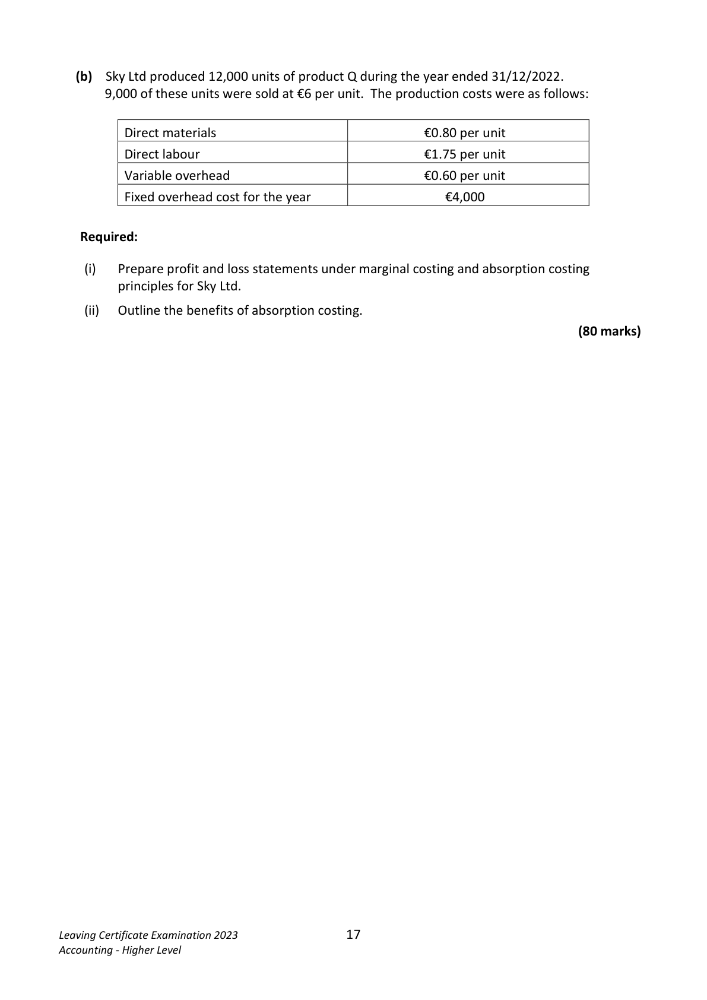
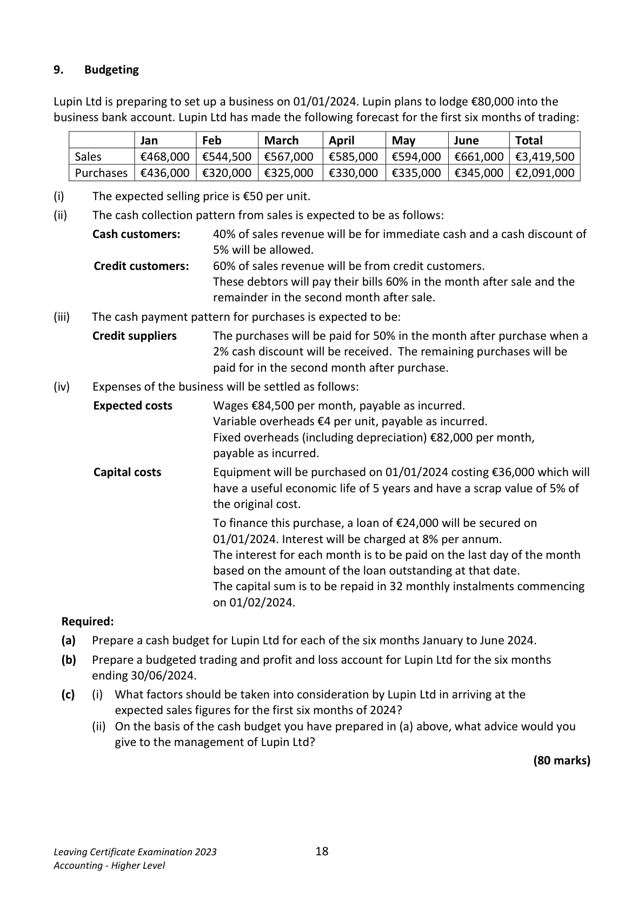
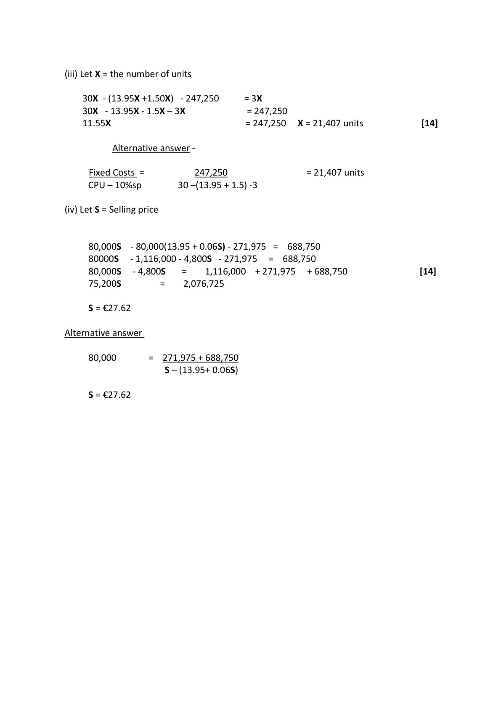
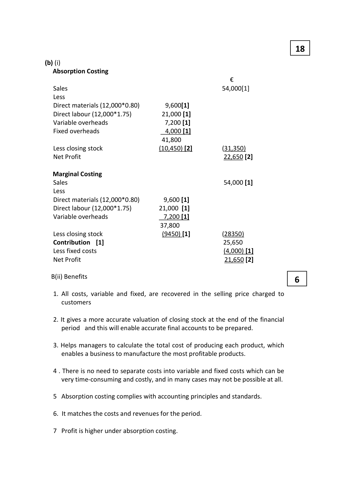

# Question

8.  Marginal and Absorption Costing

     (a) Wilson Ltd produces a single product. The company’s profit and loss account for
        the year ended 31/12/2022, during which 80,000 units were produced and sold,
       was as follows:

                                               €                €
        Sales (80,000 units)                                           2,160,000
        Materials                                420,000
        Direct labour                             376,000
        Factory overheads                        340,000
        Administration expenses                   152,500
         Selling expenses                          182,750            1,471,250
       Net profit                                                   688,750

       The materials and direct labour are variable costs.
        Apart from a sales commission of 5% of sales, selling and administration expenses are fixed.
        Factory overheads are mixed costs, and have behaved in the past as follows:

                Year ended            Output (units)        Factory overheads in €
               31/12/2021              100,000                420,000
               31/12/2020               70,000                300,000
               31/12/2019               25,000                120,000

     Required:
        (i)       Calculate the variable and fixed elements of factory overheads using the high/low
            method. (Show your workings).

         (ii)       a) Calculate the company’s break–even point and margin of safety.
              b) Explain what is meant by the term margin of safety. Reference the figures you
                have calculated in part (ii)(a) in your answer.

         (iii)     Calculate the number of units that must be sold at €30 per unit to provide a profit
              of 10% of the sales revenue earned from these same units.

       (iv)      Calculate the selling price the company must charge per unit in 2023, if
                 •   sales commission is increased to 6% of sales and
                 •   fixed costs increase by 10%
            The volume of sales and the profit earned are to remain the same.

Leaving Certificate Examination 2023               16
Accounting - Higher Level

<!-- PAGE 17 -->
# Page 17

<!-- HAS_VISUAL: true -->
<!-- VISUAL_REASON: page contains vector drawings; text contains visual keywords: line; page image extracted because text may not fully capture visual content -->

(b)  Sky Ltd produced 12,000 units of product Q during the year ended 31/12/2022.
       9,000 of these units were sold at €6 per unit. The production costs were as follows:

           Direct materials                                €0.80 per unit

           Direct labour                                   €1.75 per unit

           Variable overhead                              €0.60 per unit

           Fixed overhead cost for the year                    €4,000

   Required:

      (i)   Prepare profit and loss statements under marginal costing and absorption costing
           principles for Sky Ltd.

       (ii)   Outline the benefits of absorption costing.
                                                                                   (80 marks)

Leaving Certificate Examination 2023               17
Accounting - Higher Level

<!-- PAGE 18 -->
# Page 18

<!-- HAS_VISUAL: true -->
<!-- VISUAL_REASON: page contains vector drawings; text contains visual keywords: figure; page image extracted because text may not fully capture visual content -->

# Marking Scheme

8.   Patent                        48,800 +1,200 /8                                6,250

Question 8
                                                 56
 (a)(i)

     100,000                       420,000
      25,000                       120,000
      75,000                       300,000

     300,000     = €4 per unit variable cost                                       [8]
     75,000

      Units                   25,000           70,000          100,000
      Factory overheads      120,000          300,000          420,000
      Variable Cost          (100,000)         (280,000)         (400,000)
      Fixed Cost              20,000           20,000           20,000

      Fixed Costs are €20,000

      Sales                                        2,160,000   (€27)
      Less Variable Costs:
      Materials                420,000
      Direct Labour            376,000
     Factory Overheads        320,000
      Selling Expenses          108,000             (1,224,000) (€15.30) (€13.95 + €1.35)
      Contribution                                  936,000  (€11.70)
      Less Fixed Costs:
     Factory Overheads         20,000
      Selling expenses           74,750
    Admin                  152,500             (247,250)
     Net Profit                                   688,750

(ii) (a)    Break-even point 247,250 = 21,133 units
                          27-15.3                                            [16]

         Margin of Safety 80,000 -21,133 = 58,867 units

(ii) (b)                                                                                 [4]
       The Margin of Safety is the reduction in sales that can occur before the
       breakeven point of a business is reached. In this question the margin of
         safety is 58,867 units.

<!-- PAGE 28 -->
# Page 28

<!-- HAS_VISUAL: true -->
<!-- VISUAL_REASON: page contains vector drawings; page image extracted because text may not fully capture visual content -->

(iii) Let X = the number of units

   30X - (13.95X +1.50X)  - 247,250     = 3X
   30X  - 13.95X - 1.5X – 3X            = 247,250
    11.55X                           = 247,250  X = 21,407 units              [14]

            Alternative answer -

      Fixed Costs =           247,250                = 21,407 units
    CPU – 10%sp       30 –(13.95 + 1.5) -3

(iv) Let S = Selling price

     80,000S   - 80,000(13.95 + 0.06S) - 271,975 =  688,750
     80000S    - 1,116,000 - 4,800S  - 271,975  =  688,750
     80,000S    - 4,800S   =    1,116,000  + 271,975  + 688,750                 [14]
     75,200S        =    2,076,725

     S = €27.62

Alternative answer

     80,000      =  271,975 + 688,750
                     S – (13.95+ 0.06S)

     S = €27.62

<!-- PAGE 29 -->
# Page 29

<!-- HAS_VISUAL: true -->
<!-- VISUAL_REASON: page contains vector drawings; text contains visual keywords: table; page image extracted because text may not fully capture visual content -->

18

(b) (i)
  Absorption Costing
                                                    €
   Sales                                                   54,000[1]
   Less
   Direct materials (12,000*0.80)        9,600[1]
   Direct labour (12,000*1.75)         21,000 [1]
   Variable overheads                  7,200 [1]
   Fixed overheads                     4,000 [1]
                                    41,800
   Less closing stock                   (10,450) [2]          (31,350)
  Net Profit                                            22,650 [2]

  Marginal Costing
   Sales                                                54,000 [1]
   Less
   Direct materials (12,000*0.80)        9,600 [1]
   Direct labour (12,000*1.75)        21,000 [1]
   Variable overheads                 7,200 [1]
                                   37,800
   Less closing stock                   (9450) [1]          (28350)
   Contribution  [1]                                     25,650
   Less fixed costs                                            (4,000) [1]
  Net Profit                                            21,650 [2]

   B(ii) Benefits                                                     6

# Source References

Exam paper:
- file: intermediate_markdown/exam_papers/higher/accounting_higher_2023_paper_1_exam.md
- pages: [17, 18]

Marking scheme:
- file: intermediate_markdown/marking_schemes/higher/accounting_higher_2023_paper_1_marking_scheme.md
- pages: [28, 29]

# Notes

