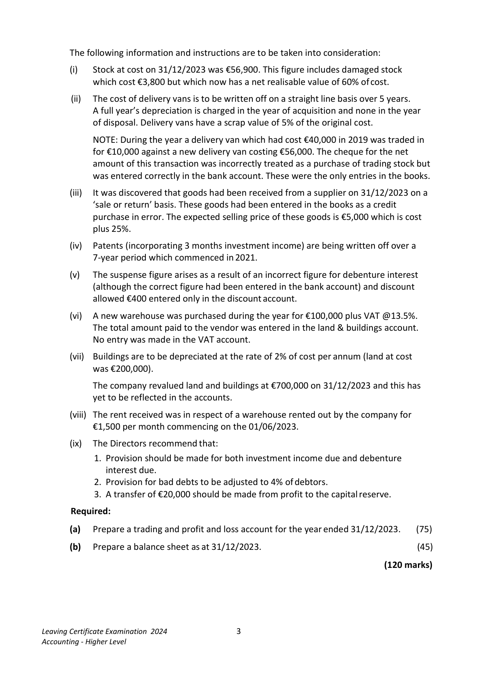
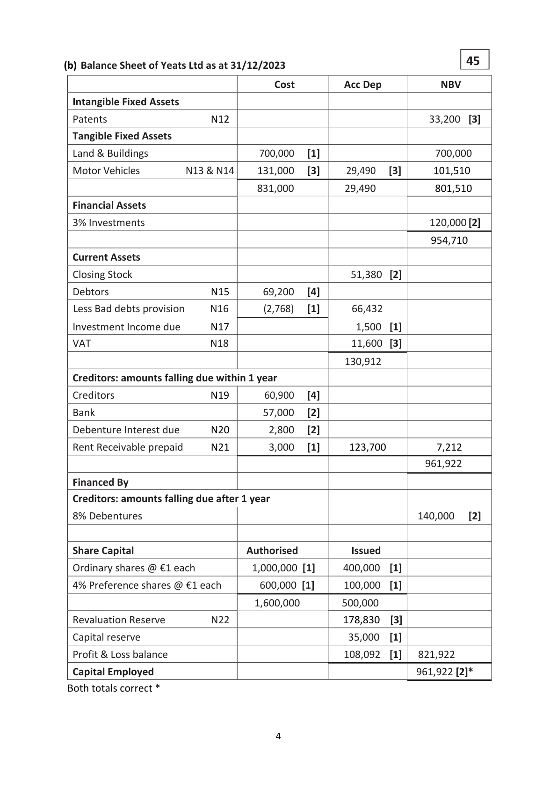
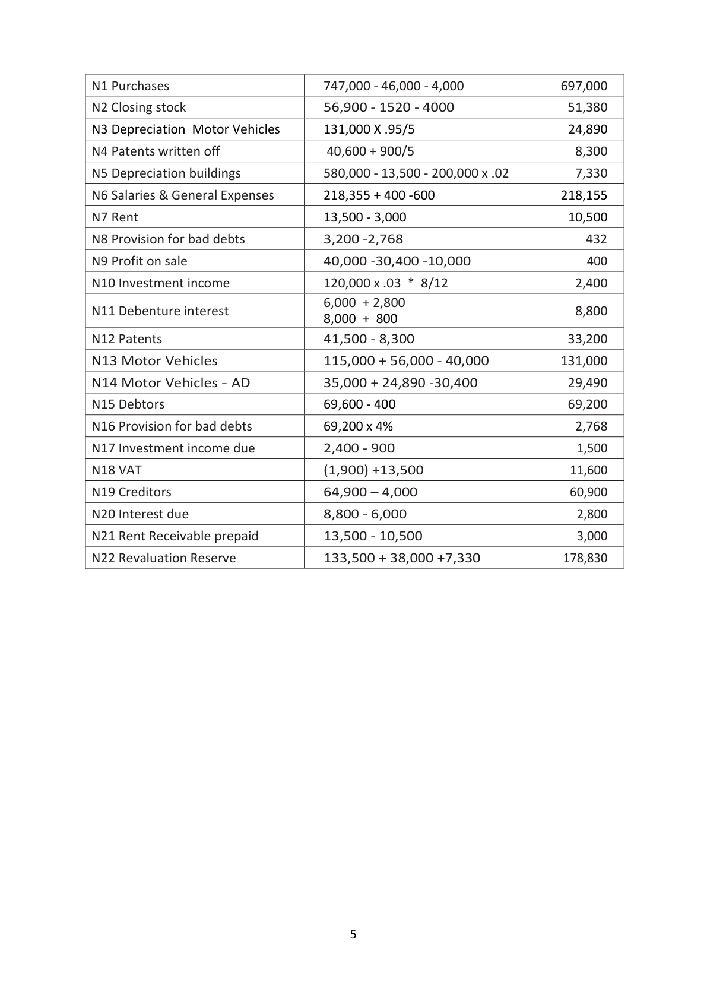
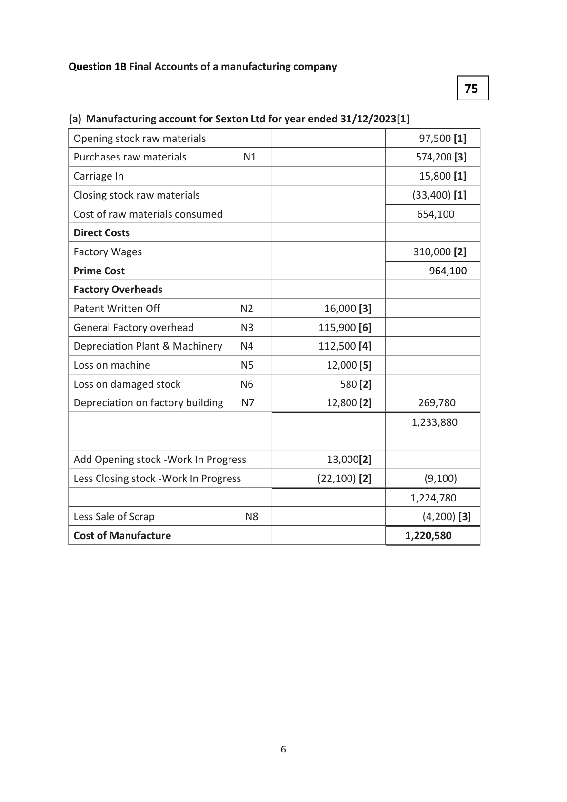
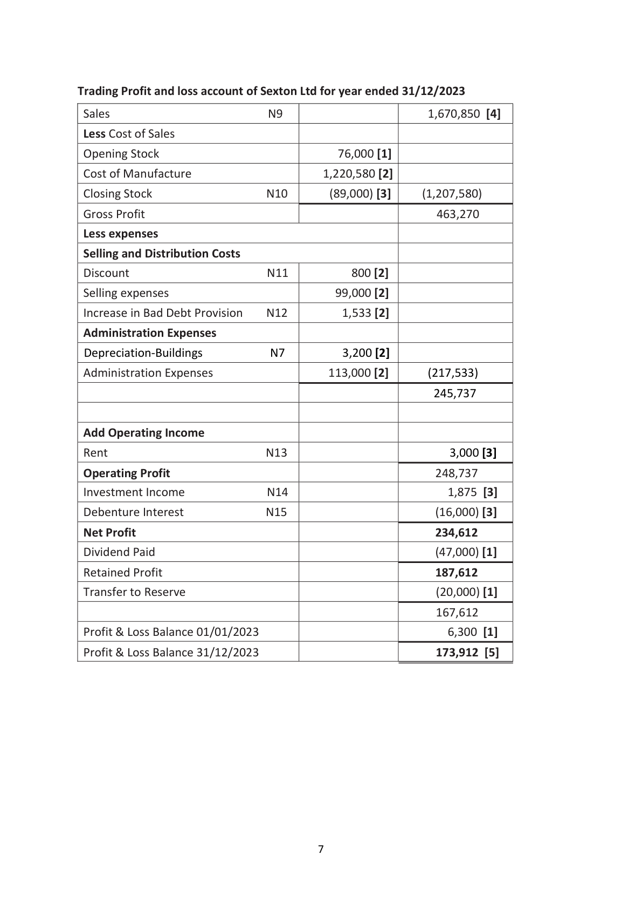
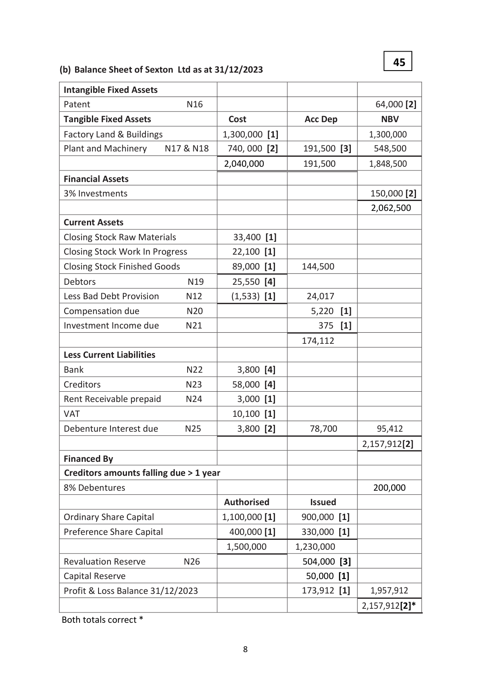
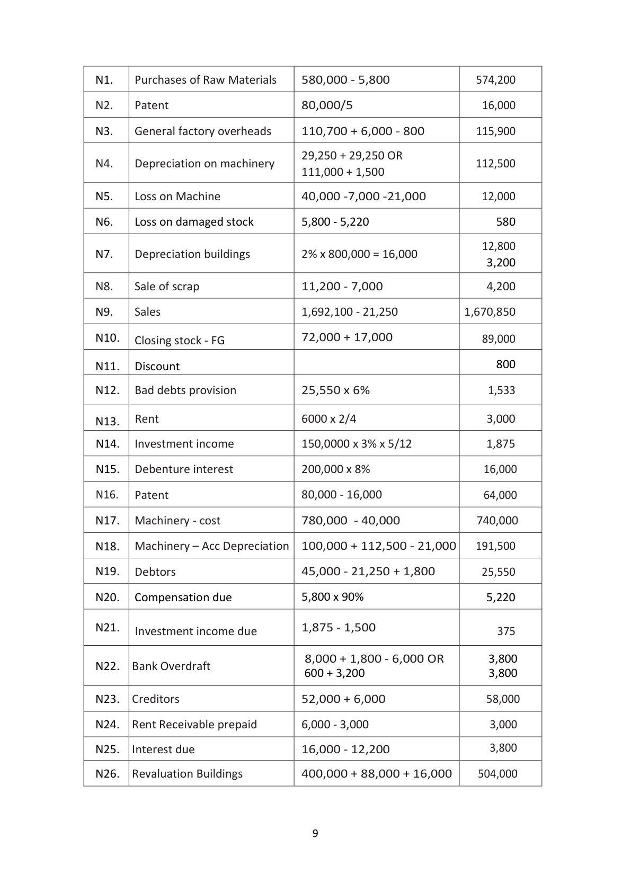
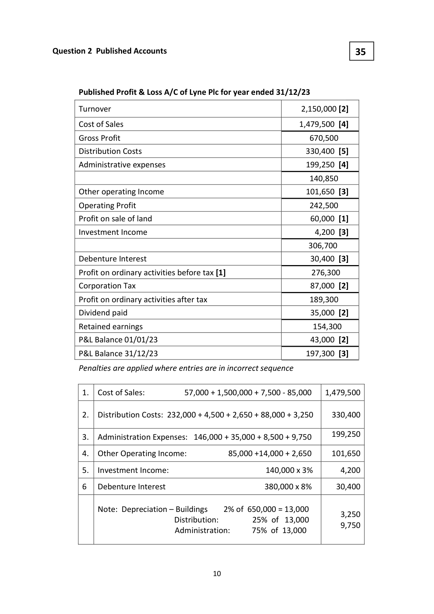

# Question

1. Answer (A) OR (B)

       (A)  Company Final Accounts

       Yeats Ltd, has an authorised capital of €1,600,000 divided into 1,000,000 ordinary shares of
      €1 each and 600,000 4% preference shares of €1 each. The following trial balance was
       extracted from its books at 31/12/2023:
                                                           €             €

        Land and buildings at cost                              580,000

        Accumulated depreciation - buildings                                     38,000

          Delivery vans (cost €115,000)                            80,000
         Discount (net)                                           3,500

           Profit and loss balance 01/01/2023                                       34,800

         Stock on hand 01/01/2023                               44,400

        Debenture interest for the first nine months                 5,400

       3% Investments acquired on 01/05/2023                 120,000

         Patents (incorporating 3 months investment income)        40,600

         Purchases and sales                                   747,000       1,080,700

         Dividends paid                                         15,000

        Bad debts provision                                                      3,200

         Debtors and creditors                                   69,600         64,900

        Bank                                                                 57,000

          Salaries and general expenses (including suspense)        218,355

       8% Debentures (including €40,000 issued on 01/10/2023)                 140,000

         Issued share capital  – ordinary shares                                  400,000

                          – 4% preference shares                            100,000

       VAT                                                                    1,900

          Advertising                                            25,145
        Rent received                                                         13,500

          Capital reserve                                                        15,000

                                                              1,949,000       1,949,000

Leaving Certificate Examination 2024                  2
Accounting - Higher Level

<!-- PAGE 3 -->
# Page 3

<!-- HAS_VISUAL: true -->
<!-- VISUAL_REASON: text contains visual keywords: figure, line; page image extracted because text may not fully capture visual content -->

The following information and instructions are to be taken into consideration:

          (i)    Stock at cost on 31/12/2023 was €56,900. This figure includes damaged stock
           which cost €3,800 but which now has a net realisable value of 60% of cost.

           (ii)  The cost of delivery vans is to be written off on a straight line basis over 5 years.
         A full year’s depreciation is charged in the year of acquisition and none in the year
            of disposal. Delivery vans have a scrap value of 5% of the original cost.

          NOTE: During the year a delivery van which had cost €40,000 in 2019 was traded in
             for €10,000 against a new delivery van costing €56,000. The cheque for the net
          amount of this transaction was incorrectly treated as a purchase of trading stock but
          was entered correctly in the bank account. These were the only entries in the books.

           (iii)    It was discovered that goods had been received from a supplier on 31/12/2023 on a
              ‘sale or return’ basis. These goods had been entered in the books as a credit
           purchase in error. The expected selling price of these goods is €5,000 which is cost
            plus 25%.

         (iv)   Patents (incorporating 3 months investment income) are being written off over a
            7-year period which commenced in 2021.

        (v)   The suspense figure arises as a result of an incorrect figure for debenture interest
            (although the correct figure had been entered in the bank account) and discount
           allowed €400 entered only in the discount account.

         (vi)  A new warehouse was purchased during the year for €100,000 plus VAT @13.5%.
          The total amount paid to the vendor was entered in the land & buildings account.
         No entry was made in the VAT account.

          (vii)  Buildings are to be depreciated at the rate of 2% of cost per annum (land at cost
          was €200,000).

          The company revalued land and buildings at €700,000 on 31/12/2023 and this has
            yet to be reflected in the accounts.

          (viii) The rent received was in respect of a warehouse rented out by the company for
           €1,500 per month commencing on the 01/06/2023.

         (ix)  The Directors recommend that:
              1. Provision should be made for both investment income due and debenture
                interest due.

# Marking Scheme

Question 1A Final Accounts of a company

                                                           75(a) Trading Profit and Loss Account of Yeats Ltd for the year ended 31/12/2023 [1]

                                   €                   €               €

  Sales                                                                     1,080,700[3]

  Less Cost of Sales

 Opening stock                                         44,400 [3]

  Purchases               N1                     697,000 [7]

  Less closing stock          N2                     (51,380) [7]        (690,020)

 Gross Profit                                                          390,680
  Less Expenses

  Distribution Costs

  Discount                                  3,500 [3]

  Depreciation Delivery Vans    N3         24,890 [4]

  Advertising                             25,145 [3]    53,535

  Administration Expenses
  Patents written off         N4        8,300  [5]

  Depreciation Buildings       N5       7,330   [3]
  Salaries & General Expenses   N6       218,155 [7]    233,785           287,320

                                                                      103,360
 Add Operating Income

 Rent Received            N7                     10,500  [4]

 Decrease in BDP           N8                      432  [4]
  Profit on Disposal          N9                      400  [4]          11,332

 Operating Profit                                                      114,692
 Investment Income        N10                                          2,400 [3]

                                                                      117,092
  Less Debenture           N11                                             (8,800) [4]

 Net Profit                                                            108,292
  Less Dividends paid                                                          (15,000) [2]

 Retained profit
  Capital Reserve                                                             (20,000) [2]

                                                                        73,292
 P&L balance 01/01/2023                                                 34,800 [1]
                                                                      108,092 [5] P&L balance 31/12/2023

                                         3

<!-- PAGE 4 -->
# Page 4

<!-- HAS_VISUAL: true -->
<!-- VISUAL_REASON: page contains embedded images; page contains vector drawings; page image extracted because text may not fully capture visual content -->

45(b) Balance Sheet of Yeats Ltd as at 31/12/2023

                                         Cost         Acc Dep         NBV

  Intangible Fixed Assets

  Patents                 N12                                      33,200  [3]

  Tangible Fixed Assets

  Land & Buildings                      700,000   [1]                      700,000

  Motor Vehicles       N13 & N14    131,000   [3]     29,490   [3]      101,510

                                     831,000          29,490           801,510
  Financial Assets

 3% Investments                                                      120,000 [2]

                                                                     954,710

  Current Assets

  Closing Stock                                          51,380  [2]

  Debtors                N15      69,200   [4]
  Less Bad debts provision    N16        (2,768)   [1]      66,432

  Investment Income due     N17                         1,500  [1]
 VAT                   N18                       11,600  [3]

                                                     130,912
  Creditors: amounts falling due within 1 year

  Creditors               N19       60,900   [4]

  Bank                                57,000   [2]

  Debenture Interest due     N20        2,800   [2]

  Rent Receivable prepaid    N21        3,000   [1]      123,700          7,212
                                                                    961,922

  Financed By
  Creditors: amounts falling due after 1 year

 8% Debentures                                                    140,000   [2]

  Share Capital                      Authorised           Issued

  Ordinary shares @ €1 each           1,000,000 [1]     400,000  [1]

 4% Preference shares @ €1 each       600,000 [1]     100,000  [1]

                                      1,600,000        500,000
  Revaluation Reserve       N22                      178,830  [3]

  Capital reserve                                        35,000  [1]

  Profit & Loss balance                                 108,092  [1]   821,922

  Capital Employed                                                  961,922 [2]*
 Both totals correct *

                                         4

<!-- PAGE 5 -->
# Page 5

<!-- HAS_VISUAL: true -->
<!-- VISUAL_REASON: page contains vector drawings; page image extracted because text may not fully capture visual content -->

N1 Purchases                       747,000 - 46,000 - 4,000              697,000

N2 Closing stock                   56,900 - 1520 - 4000                 51,380

N3 Depreciation Motor Vehicles      131,000 X .95/5                       24,890

N4 Patents written off                40,600 + 900/5                         8,300

N5 Depreciation buildings            580,000 - 13,500 - 200,000 x .02          7,330

N6 Salaries & General Expenses       218,355 + 400 -600                   218,155

N7 Rent                            13,500 - 3,000                        10,500

N8 Provision for bad debts           3,200 -2,768                         432

N9 Profit on sale                   40,000 -30,400 -10,000                 400

N10 Investment income              120,000 x .03 * 8/12                    2,400
                                    6,000 + 2,800
N11 Debenture interest                                                     8,800
                                    8,000 + 800
N12 Patents                      41,500 - 8,300                       33,200

N13 Motor Vehicles              115,000 + 56,000 - 40,000           131,000

N14 Motor Vehicles - AD          35,000 + 24,890 -30,400              29,490

N15 Debtors                        69,600 - 400                          69,200

N16 Provision for bad debts           69,200 x 4%                            2,768

N17 Investment income due          2,400 - 900                              1,500

N18 VAT                            (1,900) +13,500                       11,600

N19 Creditors                     64,900 – 4,000                        60,900

N20 Interest due                   8,800 - 6,000                            2,800

N21 Rent Receivable prepaid         13,500 - 10,500                         3,000

N22 Revaluation Reserve            133,500 + 38,000 +7,330             178,830

                                       5

<!-- PAGE 6 -->
# Page 6

<!-- HAS_VISUAL: true -->
<!-- VISUAL_REASON: page contains vector drawings; page image extracted because text may not fully capture visual content -->

Question 1B Final Accounts of a manufacturing company

                                                         75

(a) Manufacturing account for Sexton Ltd for year ended 31/12/2023[1]

 Opening stock raw materials                                        97,500 [1]

 Purchases raw materials         N1                               574,200 [3]

 Carriage In                                                        15,800 [1]

 Closing stock raw materials                                            (33,400) [1]

 Cost of raw materials consumed                                    654,100

 Direct Costs

 Factory Wages                                                  310,000 [2]

 Prime Cost                                                         964,100

 Factory Overheads

 Patent Written Off            N2             16,000 [3]

 General Factory overhead       N3            115,900 [6]

 Depreciation Plant & Machinery   N4            112,500 [4]

 Loss on machine              N5              12,000 [5]

 Loss on damaged stock         N6                580 [2]

 Depreciation on factory building   N7              12,800 [2]         269,780

                                                                   1,233,880

 Add Opening stock -Work In Progress                13,000[2]

 Less Closing stock -Work In Progress                (22,100) [2]           (9,100)

                                                                   1,224,780

 Less Sale of Scrap              N8                                   (4,200) [3]

 Cost of Manufacture                                             1,220,580

                                        6

<!-- PAGE 7 -->
# Page 7

<!-- HAS_VISUAL: true -->
<!-- VISUAL_REASON: page contains vector drawings; page image extracted because text may not fully capture visual content -->

Trading Profit and loss account of Sexton Ltd for year ended 31/12/2023

 Sales                     N9                         1,670,850 [4]

 Less Cost of Sales

 Opening Stock                              76,000 [1]

 Cost of Manufacture                       1,220,580 [2]

 Closing Stock                N10        (89,000) [3]      (1,207,580)

 Gross Profit                                                463,270
 Less expenses

 Selling and Distribution Costs

 Discount                   N11          800 [2]

 Selling expenses                            99,000 [2]

 Increase in Bad Debt Provision   N12         1,533 [2]

 Administration Expenses

 Depreciation-Buildings         N7          3,200 [2]

 Administration Expenses                   113,000 [2]       (217,533)

                                                          245,737

 Add Operating Income

 Rent                      N13                            3,000 [3]

 Operating Profit                                            248,737
 Investment Income           N14                           1,875 [3]

 Debenture Interest           N15                           (16,000) [3]

 Net Profit                                                 234,612
 Dividend Paid                                                   (47,000) [1]

 Retained Profit                                             187,612
 Transfer to Reserve                                              (20,000) [1]

                                                           167,612
 Profit & Loss Balance 01/01/2023                                6,300 [1]

 Profit & Loss Balance 31/12/2023                             173,912 [5]

                                        7

<!-- PAGE 8 -->
# Page 8

<!-- HAS_VISUAL: true -->
<!-- VISUAL_REASON: page contains vector drawings; page image extracted because text may not fully capture visual content -->

45
(b) Balance Sheet of Sexton Ltd as at 31/12/2023

 Intangible Fixed Assets
 Patent                  N16                                      64,000 [2]
 Tangible Fixed Assets                 Cost            Acc Dep       NBV

 Factory Land & Buildings             1,300,000 [1]                     1,300,000
 Plant and Machinery   N17 & N18    740, 000 [2]     191,500 [3]     548,500

                                     2,040,000        191,500        1,848,500

 Financial Assets
 3% Investments                                                    150,000 [2]
                                                                      2,062,500
 Current Assets
 Closing Stock Raw Materials            33,400 [1]
 Closing Stock Work In Progress          22,100 [1]
 Closing Stock Finished Goods           89,000 [1]      144,500

 Debtors                 N19      25,550 [4]
 Less Bad Debt Provision     N12       (1,533) [1]       24,017

 Compensation due         N20                        5,220  [1]
 Investment Income due     N21                       375  [1]

                                                    174,112
 Less Current Liabilities
 Bank                   N22        3,800 [4]
 Creditors               N23       58,000 [4]
 Rent Receivable prepaid    N24        3,000 [1]
 VAT                                 10,100 [1]
 Debenture Interest due     N25        3,800 [2]       78,700         95,412

                                                                      2,157,912[2]
 Financed By
 Creditors amounts falling due > 1 year
 8% Debentures                                                     200,000
                                    Authorised         Issued
 Ordinary Share Capital               1,100,000 [1]      900,000 [1]
 Preference Share Capital              400,000 [1]      330,000 [1]

                                      1,500,000      1,230,000
 Revaluation Reserve       N26                      504,000 [3]
 Capital Reserve                                       50,000 [1]
 Profit & Loss Balance 31/12/2023                      173,912 [1]     1,957,912

                                                                        2,157,912[2]*
Both totals correct *

                                        8

<!-- PAGE 9 -->
# Page 9

<!-- HAS_VISUAL: true -->
<!-- VISUAL_REASON: page contains vector drawings; page image extracted because text may not fully capture visual content -->

N1.    Purchases of Raw Materials    580,000 - 5,800               574,200

N2.    Patent                     80,000/5                       16,000

N3.    General factory overheads     110,700 + 6,000 - 800         115,900

                                   29,250 + 29,250 OR
N4.    Depreciation on machinery                                    112,500
                                   111,000 + 1,500

N5.    Loss on Machine            40,000 -7,000 -21,000          12,000

N6.    Loss on damaged stock        5,800 - 5,220                    580

                                                                     12,800
N7.    Depreciation buildings       2% x 800,000 = 16,000
                                                                    3,200

N8.    Sale of scrap                11,200 - 7,000                  4,200

N9.    Sales                         1,692,100 - 21,250            1,670,850

N10.   Closing stock - FG            72,000 + 17,000                89,000

N11.   Discount                                                 800

N12.  Bad debts provision          25,550 x 6%                      1,533

N13.  Rent                      6000 x 2/4                       3,000

N14.   Investment income           150,0000 x 3% x 5/12             1,875

N15.  Debenture interest           200,000 x 8%                    16,000

N16.   Patent                       80,000 - 16,000                  64,000

N17.  Machinery - cost            780,000 - 40,000             740,000

N18.  Machinery – Acc Depreciation  100,000 + 112,500 - 21,000   191,500

N19.   Debtors                   45,000 - 21,250 + 1,800        25,550

N20.  Compensation due            5,800 x 90%                     5,220

N21.                             1,875 - 1,500       Investment income due                                       375

                                 8,000 + 1,800 - 6,000 OR        3,800
N22.  Bank Overdraft
                                600 + 3,200                     3,800

N23.  Creditors                   52,000 + 6,000                  58,000

N24.  Rent Receivable prepaid        6,000 - 3,000                      3,000

N25.  Interest due                16,000 - 12,200                  3,800

N26.  Revaluation Buildings         400,000 + 88,000 + 16,000     504,000

                                     9

<!-- PAGE 10 -->
# Page 10

<!-- HAS_VISUAL: true -->
<!-- VISUAL_REASON: page contains vector drawings; page image extracted because text may not fully capture visual content -->

# Source References

Exam paper:
- file: intermediate_markdown/exam_papers/higher/accounting_higher_2024_paper_1_exam.md
- pages: [3]

Marking scheme:
- file: intermediate_markdown/marking_schemes/higher/accounting_higher_2024_paper_1_marking_scheme.md
- pages: [4, 5, 6, 7, 8, 9, 10]

# Notes

