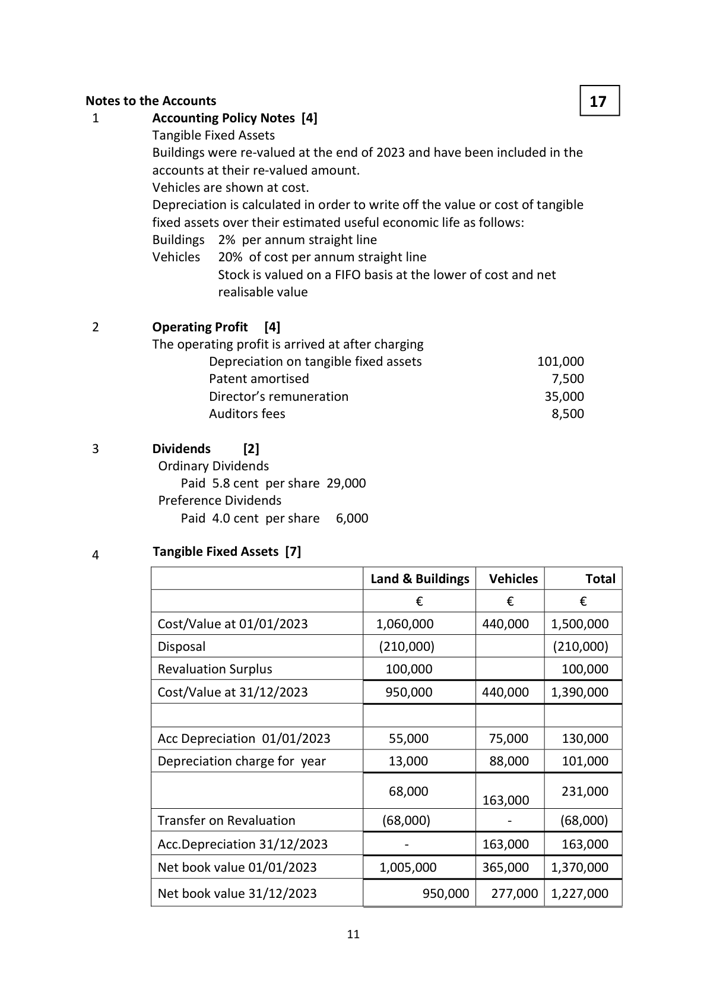
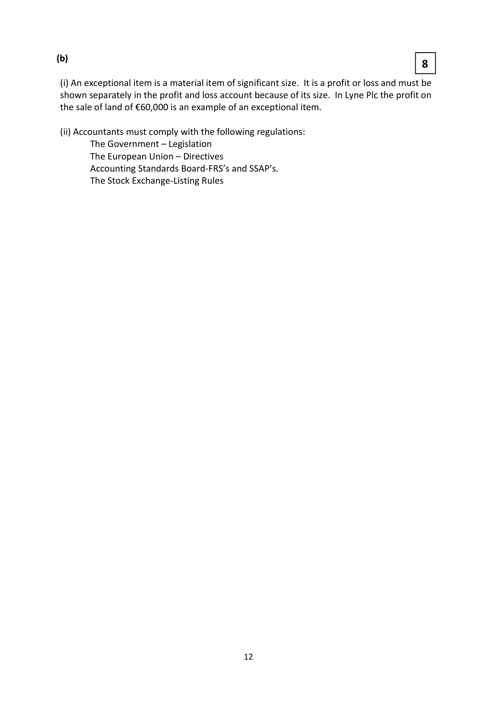
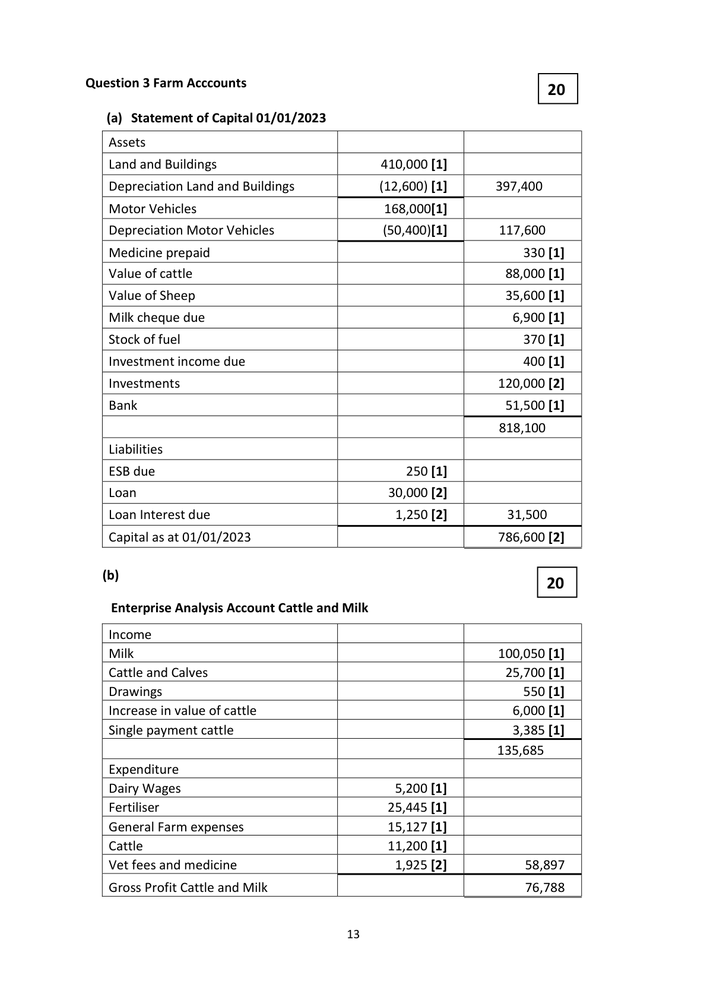

# Question

2. Provision for bad debts to be adjusted to 4% of debtors.

# Marking Scheme

Question 2 Published Accounts                                   35

       Published Profit & Loss A/C of Lyne Plc for year ended 31/12/23

      Turnover                                                2,150,000 [2]

       Cost of Sales                                             1,479,500 [4]

       Gross Profit                                              670,500
       Distribution Costs                                        330,400 [5]

       Administrative expenses                                  199,250 [4]

                                                              140,850
      Other operating Income                                  101,650 [3]

       Operating Profit                                          242,500
        Profit on sale of land                                       60,000 [1]

       Investment Income                                          4,200 [3]

                                                              306,700
      Debenture Interest                                        30,400 [3]

        Profit on ordinary activities before tax [1]                     276,300
       Corporation Tax                                           87,000 [2]

        Profit on ordinary activities after tax                         189,300
       Dividend paid                                             35,000 [2]

       Retained earnings                                         154,300
      P&L Balance 01/01/23                                      43,000 [2]

      P&L Balance 31/12/23                                    197,300 [3]

       Penalties are applied where entries are in incorrect sequence

         1.  Cost of Sales:          57,000 + 1,500,000 + 7,500 - 85,000   1,479,500

         2.   Distribution Costs: 232,000 + 4,500 + 2,650 + 88,000 + 3,250    330,400

                                                                    199,250         3.  Administration Expenses: 146,000 + 35,000 + 8,500 + 9,750

         4.  Other Operating Income:          85,000 +14,000 + 2,650     101,650

         5.  Investment Income:                        140,000 x 3%       4,200

       6   Debenture Interest                        380,000 x 8%      30,400

           Note: Depreciation – Buildings   2% of 650,000 = 13,000
                                                                        3,250
                                    Distribution:       25% of 13,000
                                                                        9,750
                                 Administration:    75% of 13,000

                                       10

<!-- PAGE 11 -->
# Page 11

<!-- HAS_VISUAL: true -->
<!-- VISUAL_REASON: page contains vector drawings; text contains visual keywords: line; page image extracted because text may not fully capture visual content -->

Notes to the Accounts                                           17
 1        Accounting Policy Notes [4]
           Tangible Fixed Assets
            Buildings were re-valued at the end of 2023 and have been included in the
          accounts at their re-valued amount.
           Vehicles are shown at cost.
           Depreciation is calculated in order to write off the value or cost of tangible
            fixed assets over their estimated useful economic life as follows:
            Buildings  2% per annum straight line
           Vehicles  20% of cost per annum straight line
                     Stock is valued on a FIFO basis at the lower of cost and net
                        realisable value

 2        Operating Profit   [4]
         The operating profit is arrived at after charging
                    Depreciation on tangible fixed assets                 101,000
                   Patent amortised                                     7,500
                      Director’s remuneration                              35,000
                    Auditors fees                                         8,500

 3        Dividends      [2]
           Ordinary Dividends
               Paid 5.8 cent per share 29,000
           Preference Dividends
               Paid 4.0 cent per share  6,000

 4         Tangible Fixed Assets [7]

                                        Land & Buildings   Vehicles        Total

                                              €            €         €

           Cost/Value at 01/01/2023           1,060,000       440,000   1,500,000

            Disposal                            (210,000)                   (210,000)

            Revaluation Surplus                 100,000                   100,000

           Cost/Value at 31/12/2023            950,000       440,000   1,390,000

           Acc Depreciation 01/01/2023         55,000         75,000     130,000

            Depreciation charge for year         13,000         88,000     101,000

                                              68,000                    231,000
                                                           163,000
            Transfer on Revaluation              (68,000)                  -        (68,000)

            Acc.Depreciation 31/12/2023                  -           163,000     163,000

          Net book value 01/01/2023          1,005,000       365,000   1,370,000

          Net book value 31/12/2023                950,000   277,000  1,227,000

                                       11

<!-- PAGE 12 -->
# Page 12

<!-- HAS_VISUAL: true -->
<!-- VISUAL_REASON: page contains vector drawings; page image extracted because text may not fully capture visual content -->

(b)
                                                           8

 (i) An exceptional item is a material item of significant size.  It is a profit or loss and must be
 shown separately in the profit and loss account because of its size. In Lyne Plc the profit on
 the sale of land of €60,000 is an example of an exceptional item.

 (ii) Accountants must comply with the following regulations:
       The Government – Legislation
       The European Union – Directives
       Accounting Standards Board-FRS’s and SSAP’s.
       The Stock Exchange-Listing Rules

                                        12

<!-- PAGE 13 -->
# Page 13

<!-- HAS_VISUAL: true -->
<!-- VISUAL_REASON: page contains vector drawings; page image extracted because text may not fully capture visual content -->

# Source References

Exam paper:
- file: intermediate_markdown/exam_papers/higher/accounting_higher_2024_paper_1_exam.md
- pages: []

Marking scheme:
- file: intermediate_markdown/marking_schemes/higher/accounting_higher_2024_paper_1_marking_scheme.md
- pages: [11, 12, 13]

# Notes

