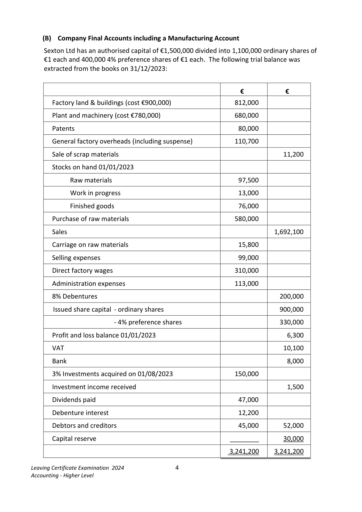
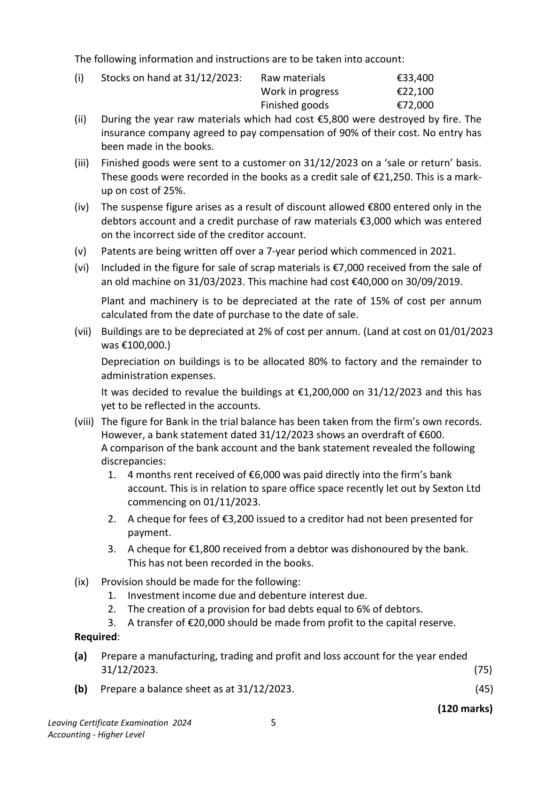
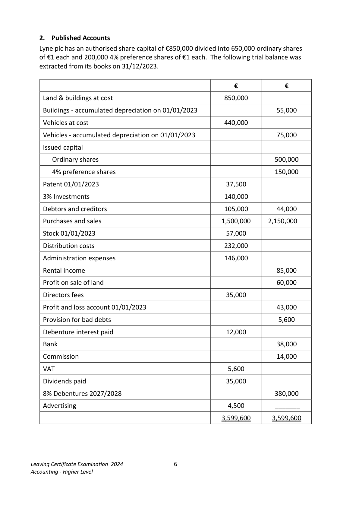
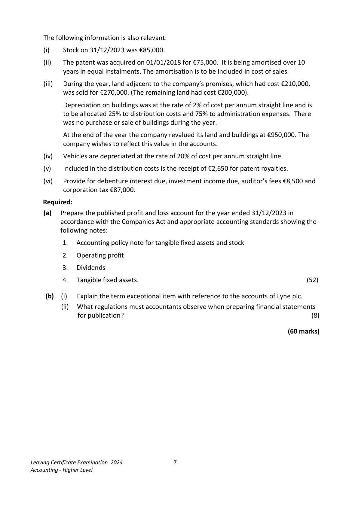
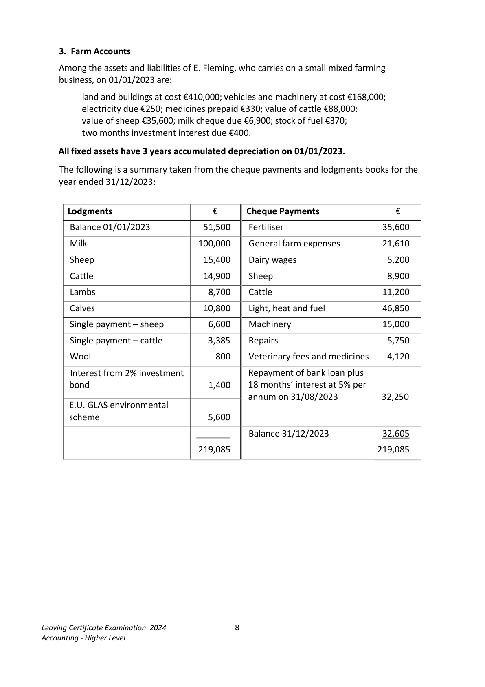
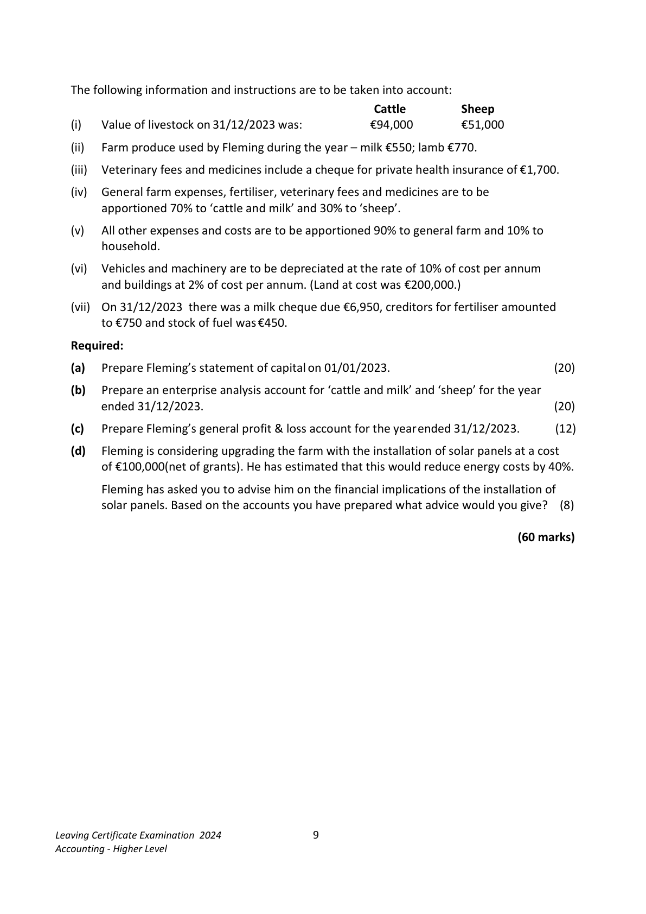
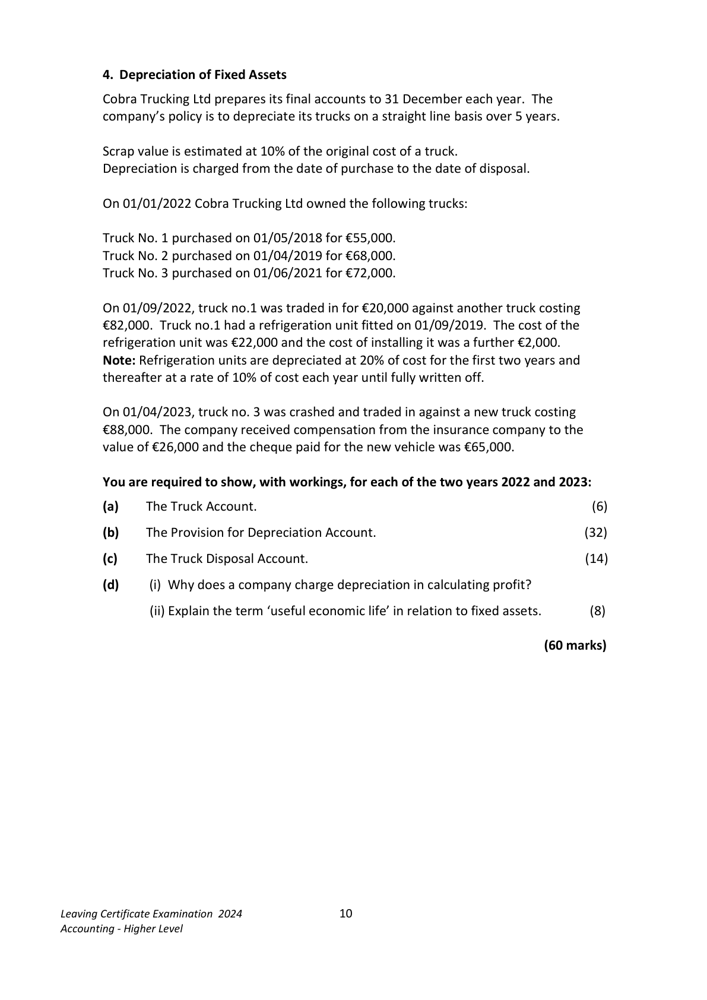
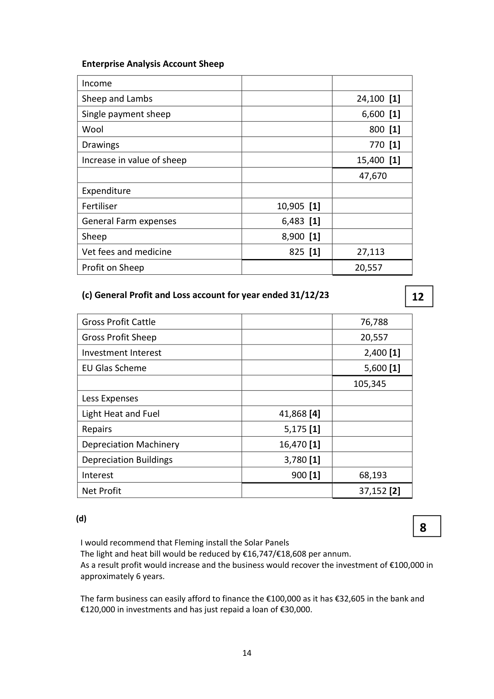
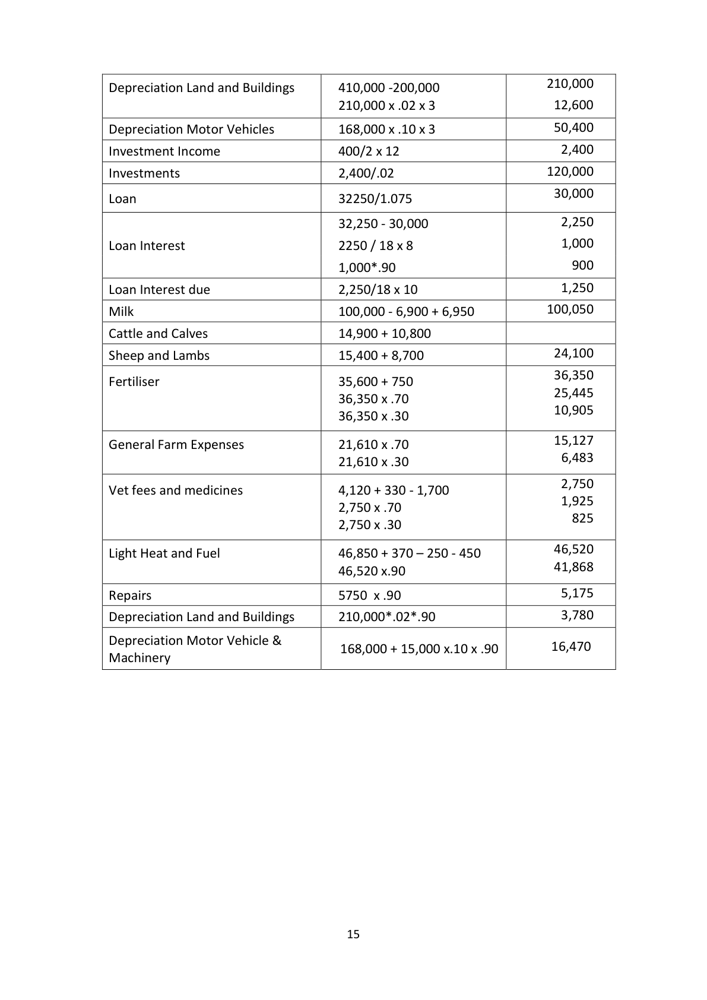
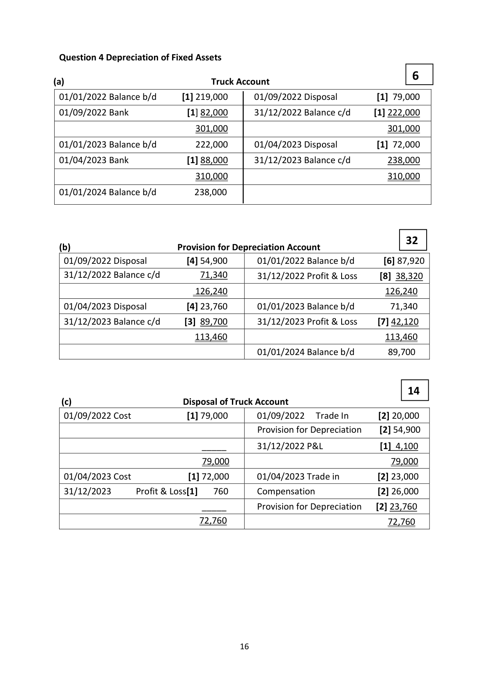

# Question

3. A transfer of €20,000 should be made from profit to the capital reserve.

       Required:

        (a)   Prepare a trading and profit and loss account for the year ended 31/12/2023.    (75)

       (b)   Prepare a balance sheet as at 31/12/2023.                                       (45)

                                                                            (120 marks)

Leaving Certificate Examination 2024               3
Accounting - Higher Level

<!-- PAGE 4 -->
# Page 4

<!-- HAS_VISUAL: true -->
<!-- VISUAL_REASON: page contains vector drawings; page image extracted because text may not fully capture visual content -->

(B)  Company Final Accounts including a Manufacturing Account

    Sexton Ltd has an authorised capital of €1,500,000 divided into 1,100,000 ordinary shares of
    €1 each and 400,000 4% preference shares of €1 each. The following trial balance was
    extracted from the books on 31/12/2023:

                                                         €           €

       Factory land & buildings (cost €900,000)                  812,000

       Plant and machinery (cost €780,000)                      680,000

       Patents                                                80,000

      General factory overheads (including suspense)            110,700

       Sale of scrap materials                                                 11,200

       Stocks on hand 01/01/2023

         Raw materials                                     97,500

          Work in progress                                   13,000

             Finished goods                                     76,000

      Purchase of raw materials                               580,000

       Sales                                                               1,692,100

       Carriage on raw materials                                15,800

        Selling expenses                                         99,000

       Direct factory wages                                   310,000

       Administration expenses                                113,000

     8% Debentures                                                     200,000

       Issued share capital - ordinary shares                                  900,000

                                     - 4% preference shares                             330,000

        Profit and loss balance 01/01/2023                                        6,300

     VAT                                                                 10,100

      Bank                                                                  8,000

     3% Investments acquired on 01/08/2023                  150,000

      Investment income received                                             1,500

       Dividends paid                                          47,000

      Debenture interest                                      12,200

      Debtors and creditors                                    45,000       52,000

       Capital reserve                                     ________       30,000

                                                            3,241,200     3,241,200

Leaving Certificate Examination 2024               4
Accounting - Higher Level

<!-- PAGE 5 -->
# Page 5

<!-- HAS_VISUAL: true -->
<!-- VISUAL_REASON: text contains visual keywords: figure; page image extracted because text may not fully capture visual content -->

The following information and instructions are to be taken into account:

        (i)    Stocks on hand at 31/12/2023:   Raw materials             €33,400
                                  Work in progress           €22,100
                                             Finished goods             €72,000
         (ii)   During the year raw materials which had cost €5,800 were destroyed by fire. The
           insurance company agreed to pay compensation of 90% of their cost. No entry has
         been made in the books.
         (iii)   Finished goods were sent to a customer on 31/12/2023 on a ‘sale or return’ basis.
          These goods were recorded in the books as a credit sale of €21,250. This is a mark-
         up on cost of 25%.
       (iv)  The suspense figure arises as a result of discount allowed €800 entered only in the
           debtors account and a credit purchase of raw materials €3,000 which was entered
         on the incorrect side of the creditor account.
       (v)   Patents are being written off over a 7-year period which commenced in 2021.
       (vi)  Included in the figure for sale of scrap materials is €7,000 received from the sale of
         an old machine on 31/03/2023. This machine had cost €40,000 on 30/09/2019.

           Plant and machinery is to be depreciated at the rate of 15% of cost per annum
           calculated from the date of purchase to the date of sale.
        (vii)  Buildings are to be depreciated at 2% of cost per annum. (Land at cost on 01/01/2023
         was €100,000.)
           Depreciation on buildings is to be allocated 80% to factory and the remainder to
           administration expenses.
                It was decided to revalue the buildings at €1,200,000 on 31/12/2023 and this has
           yet to be reflected in the accounts.
        (viii) The figure for Bank in the trial balance has been taken from the firm’s own records.
          However, a bank statement dated 31/12/2023 shows an overdraft of €600.
        A comparison of the bank account and the bank statement revealed the following
           discrepancies:
              1.  4 months rent received of €6,000 was paid directly into the firm’s bank
                account. This is in relation to spare office space recently let out by Sexton Ltd
              commencing on 01/11/2023.
              2.  A cheque for fees of €3,200 issued to a creditor had not been presented for
               payment.
              3.  A cheque for €1,800 received from a debtor was dishonoured by the bank.
                 This has not been recorded in the books.

       (ix)   Provision should be made for the following:
              1.  Investment income due and debenture interest due.
              2.  The creation of a provision for bad debts equal to 6% of debtors.
              3.  A transfer of €20,000 should be made from profit to the capital reserve.
     Required:

      (a)   Prepare a manufacturing, trading and profit and loss account for the year ended
          31/12/2023.                                                                     (75)

      (b)   Prepare a balance sheet as at 31/12/2023.                                        (45)

                                                                           (120 marks)
Leaving Certificate Examination 2024               5
Accounting - Higher Level

<!-- PAGE 6 -->
# Page 6

<!-- HAS_VISUAL: true -->
<!-- VISUAL_REASON: page contains vector drawings; page image extracted because text may not fully capture visual content -->

2.  Published Accounts
   Lyne plc has an authorised share capital of €850,000 divided into 650,000 ordinary shares
   of €1 each and 200,000 4% preference shares of €1 each. The following trial balance was
   extracted from its books on 31/12/2023.

                                                       €             €

   Land & buildings at cost                                 850,000

    Buildings - accumulated depreciation on 01/01/2023                        55,000

    Vehicles at cost                                        440,000

    Vehicles - accumulated depreciation on 01/01/2023                        75,000

    Issued capital

       Ordinary shares                                                    500,000

     4% preference shares                                               150,000

    Patent 01/01/2023                                      37,500

   3% Investments                                        140,000

    Debtors and creditors                                  105,000        44,000

    Purchases and sales                                     1,500,000     2,150,000

    Stock 01/01/2023                                       57,000

    Distribution costs                                      232,000

    Administration expenses                                146,000

    Rental income                                                         85,000

    Profit on sale of land                                                   60,000

    Directors fees                                          35,000

    Profit and loss account 01/01/2023                                       43,000

    Provision for bad debts                                                   5,600

   Debenture interest paid                                  12,000

   Bank                                                                 38,000

   Commission                                                           14,000

   VAT                                                    5,600

    Dividends paid                                          35,000

   8% Debentures 2027/2028                                             380,000

    Advertising                                              4,500        _______

                                                           3,599,600       3,599,600

Leaving Certificate Examination 2024               6
Accounting - Higher Level

<!-- PAGE 7 -->
# Page 7

<!-- HAS_VISUAL: true -->
<!-- VISUAL_REASON: text contains visual keywords: line; page image extracted because text may not fully capture visual content -->

The following information is also relevant:

      (i)    Stock on 31/12/2023 was €85,000.

       (ii)   The patent was acquired on 01/01/2018 for €75,000.  It is being amortised over 10
          years in equal instalments. The amortisation is to be included in cost of sales.

       (iii)   During the year, land adjacent to the company’s premises, which had cost €210,000,
         was sold for €270,000. (The remaining land had cost €200,000).

          Depreciation on buildings was at the rate of 2% of cost per annum straight line and is
          to be allocated 25% to distribution costs and 75% to administration expenses. There
        was no purchase or sale of buildings during the year.

          At the end of the year the company revalued its land and buildings at €950,000. The
        company wishes to reflect this value in the accounts.

      (iv)   Vehicles are depreciated at the rate of 20% of cost per annum straight line.

     (v)    Included in the distribution costs is the receipt of €2,650 for patent royalties.

      (vi)   Provide for debenture interest due, investment income due, auditor’s fees €8,500 and
          corporation tax €87,000.

    Required:
     (a)   Prepare the published profit and loss account for the year ended 31/12/2023 in
         accordance with the Companies Act and appropriate accounting standards showing the
          following notes:

            1.   Accounting policy note for tangible fixed assets and stock

            2.   Operating profit

            3.   Dividends

            4.   Tangible fixed assets.                                                          (52)

     (b)    (i)   Explain the term exceptional item with reference to the accounts of Lyne plc.
                (ii)  What regulations must accountants observe when preparing financial statements
                 for publication?                                                                      (8)

                                                                                 (60 marks)

Leaving Certificate Examination 2024               7
Accounting - Higher Level

<!-- PAGE 8 -->
# Page 8

<!-- HAS_VISUAL: true -->
<!-- VISUAL_REASON: page contains vector drawings; page image extracted because text may not fully capture visual content -->

3. Farm Accounts

   Among the assets and liabilities of E. Fleming, who carries on a small mixed farming
    business, on 01/01/2023 are:

          land and buildings at cost €410,000; vehicles and machinery at cost €168,000;
           electricity due €250; medicines prepaid €330; value of cattle €88,000;
         value of sheep €35,600; milk cheque due €6,900; stock of fuel €370;
        two months investment interest due €400.

     All fixed assets have 3 years accumulated depreciation on 01/01/2023.

    The following is a summary taken from the cheque payments and lodgments books for the
    year ended 31/12/2023:

     Lodgments                    €      Cheque Payments               €

      Balance 01/01/2023            51,500     Fertiliser                      35,600

       Milk                        100,000    General farm expenses         21,610

      Sheep                        15,400    Dairy wages                    5,200

       Cattle                        14,900    Sheep                          8,900

      Lambs                         8,700     Cattle                        11,200

       Calves                        10,800     Light, heat and fuel             46,850

       Single payment – sheep          6,600    Machinery                    15,000

       Single payment – cattle          3,385    Repairs                         5,750

     Wool                         800    Veterinary fees and medicines    4,120

       Interest from 2% investment             Repayment of bank loan plus
     bond                           1,400    18 months’ interest at 5% per
                                     annum on 31/08/2023          32,250
       E.U. GLAS environmental
     scheme                        5,600

                                               Balance 31/12/2023            32,605

                                  219,085                                219,085

Leaving Certificate Examination 2024               8
Accounting - Higher Level

<!-- PAGE 9 -->
# Page 9

The following information and instructions are to be taken into account:
                                                            Cattle        Sheep
    (i)   Value of livestock on 31/12/2023 was:           €94,000        €51,000

     (ii)   Farm produce used by Fleming during the year – milk €550; lamb €770.

     (iii)   Veterinary fees and medicines include a cheque for private health insurance of €1,700.

    (iv)  General farm expenses, fertiliser, veterinary fees and medicines are to be
        apportioned 70% to ‘cattle and milk’ and 30% to ‘sheep’.

   (v)    All other expenses and costs are to be apportioned 90% to general farm and 10% to
        household.

    (vi)   Vehicles and machinery are to be depreciated at the rate of 10% of cost per annum
       and buildings at 2% of cost per annum. (Land at cost was €200,000.)

    (vii) On 31/12/2023 there was a milk cheque due €6,950, creditors for fertiliser amounted
        to €750 and stock of fuel was €450.

   Required:

   (a)   Prepare Fleming’s statement of capital on 01/01/2023.                               (20)

   (b)   Prepare an enterprise analysis account for ‘cattle and milk’ and ‘sheep’ for the year
       ended 31/12/2023.                                                                  (20)

   (c)   Prepare Fleming’s general profit & loss account for the year ended 31/12/2023.       (12)

   (d)   Fleming is considering upgrading the farm with the installation of solar panels at a cost
         of €100,000(net of grants). He has estimated that this would reduce energy costs by 40%.

        Fleming has asked you to advise him on the financial implications of the installation of
         solar panels. Based on the accounts you have prepared what advice would you give?  (8)

                                                                                (60 marks)

Leaving Certificate Examination 2024               9
Accounting - Higher Level

<!-- PAGE 10 -->
# Page 10

<!-- HAS_VISUAL: true -->
<!-- VISUAL_REASON: text contains visual keywords: line; page image extracted because text may not fully capture visual content -->

# Marking Scheme

Question 3 Farm Acccounts                                                     20

    (a) Statement of Capital 01/01/2023

    Assets

   Land and Buildings                        410,000 [1]

    Depreciation Land and Buildings              (12,600) [1]       397,400

   Motor Vehicles                              168,000[1]
    Depreciation Motor Vehicles                  (50,400)[1]        117,600

   Medicine prepaid                                           330 [1]
    Value of cattle                                               88,000 [1]

    Value of Sheep                                               35,600 [1]

    Milk cheque due                                               6,900 [1]

    Stock of fuel                                               370 [1]

    Investment income due                                      400 [1]

    Investments                                                120,000 [2]

   Bank                                                        51,500 [1]

                                                              818,100
     Liabilities

   ESB due                                   250 [1]

   Loan                                      30,000 [2]

   Loan Interest due                             1,250 [2]         31,500

    Capital as at 01/01/2023                                     786,600 [2]

   (b)
                                                     20

    Enterprise Analysis Account Cattle and Milk

   Income
    Milk                                                      100,050 [1]
    Cattle and Calves                                             25,700 [1]
   Drawings                                                  550 [1]
    Increase in value of cattle                                       6,000 [1]
    Single payment cattle                                           3,385 [1]
                                                             135,685
    Expenditure
    Dairy Wages                                 5,200 [1]
     Fertiliser                                   25,445 [1]
    General Farm expenses                      15,127 [1]
    Cattle                                     11,200 [1]
   Vet fees and medicine                        1,925 [2]            58,897

    Gross Profit Cattle and Milk                                       76,788

                                       13

<!-- PAGE 14 -->
# Page 14

<!-- HAS_VISUAL: true -->
<!-- VISUAL_REASON: page contains vector drawings; page image extracted because text may not fully capture visual content -->

Enterprise Analysis Account Sheep

 Income

 Sheep and Lambs                                            24,100 [1]

 Single payment sheep                                          6,600 [1]

 Wool                                                     800 [1]

 Drawings                                                  770 [1]

 Increase in value of sheep                                     15,400 [1]

                                                             47,670
 Expenditure

  Fertiliser                                   10,905 [1]

 General Farm expenses                       6,483 [1]

 Sheep                                       8,900 [1]

 Vet fees and medicine                       825 [1]        27,113

  Profit on Sheep                                              20,557

  (c) General Profit and Loss account for year ended 31/12/23              12

 Gross Profit Cattle                                            76,788

 Gross Profit Sheep                                            20,557

 Investment Interest                                             2,400 [1]

 EU Glas Scheme                                                5,600 [1]

                                                           105,345
 Less Expenses

 Light Heat and Fuel                          41,868 [4]

 Repairs                                      5,175 [1]

 Depreciation Machinery                      16,470 [1]

 Depreciation Buildings                         3,780 [1]

 Interest                                   900 [1]        68,193

 Net Profit                                                   37,152 [2]

(d)
                                                   8
  I would recommend that Fleming install the Solar Panels
 The light and heat bill would be reduced by €16,747/€18,608 per annum.
 As a result profit would increase and the business would recover the investment of €100,000 in
 approximately 6 years.

 The farm business can easily afford to finance the €100,000 as it has €32,605 in the bank and
 €120,000 in investments and has just repaid a loan of €30,000.

                                    14

<!-- PAGE 15 -->
# Page 15

<!-- HAS_VISUAL: true -->
<!-- VISUAL_REASON: page contains vector drawings; page image extracted because text may not fully capture visual content -->

210,000Depreciation Land and Buildings       410,000 -200,000
                                  210,000 x .02 x 3                  12,600
Depreciation Motor Vehicles          168,000 x .10 x 3                  50,400
Investment Income                 400/2 x 12                         2,400
Investments                         2,400/.02                       120,000
                                                                   30,000Loan                              32250/1.075

                                   32,250 - 30,000                    2,250
Loan Interest                     2250 / 18 x 8                       1,000
                                    1,000*.90                        900
Loan Interest due                    2,250/18 x 10                      1,250
Milk                               100,000 - 6,900 + 6,950           100,050

Cattle and Calves                    14,900 + 10,800
Sheep and Lambs                   15,400 + 8,700                    24,100
                                                                   36,350Fertiliser                           35,600 + 750
                                                                   25,445                                   36,350 x .70
                                                                   10,905                                   36,350 x .30

                                                                   15,127General Farm Expenses              21,610 x .70
                                                                      6,483                                   21,610 x .30

                                                                      2,750Vet fees and medicines               4,120 + 330 - 1,700
                                                                      1,925                                   2,750 x .70
                                                                825                                   2,750 x .30

                                                                   46,520Light Heat and Fuel                  46,850 + 370 – 250 - 450
                                                                   41,868                                   46,520 x.90
Repairs                          5750 x .90                         5,175
Depreciation Land and Buildings       210,000*.02*.90                   3,780

Depreciation Motor Vehicle &
                                   168,000 + 15,000 x.10 x .90        16,470
Machinery

                                    15

<!-- PAGE 16 -->
# Page 16

<!-- HAS_VISUAL: true -->
<!-- VISUAL_REASON: page contains vector drawings; page image extracted because text may not fully capture visual content -->

# Source References

Exam paper:
- file: intermediate_markdown/exam_papers/higher/accounting_higher_2024_paper_1_exam.md
- pages: [4, 5, 6, 7, 8, 9, 10]

Marking scheme:
- file: intermediate_markdown/marking_schemes/higher/accounting_higher_2024_paper_1_marking_scheme.md
- pages: [14, 15, 16]

# Notes

