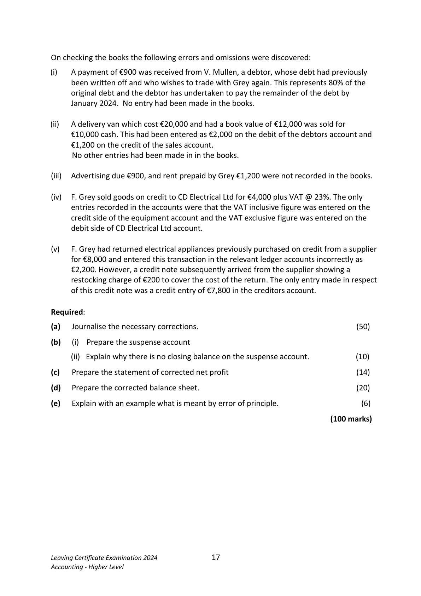
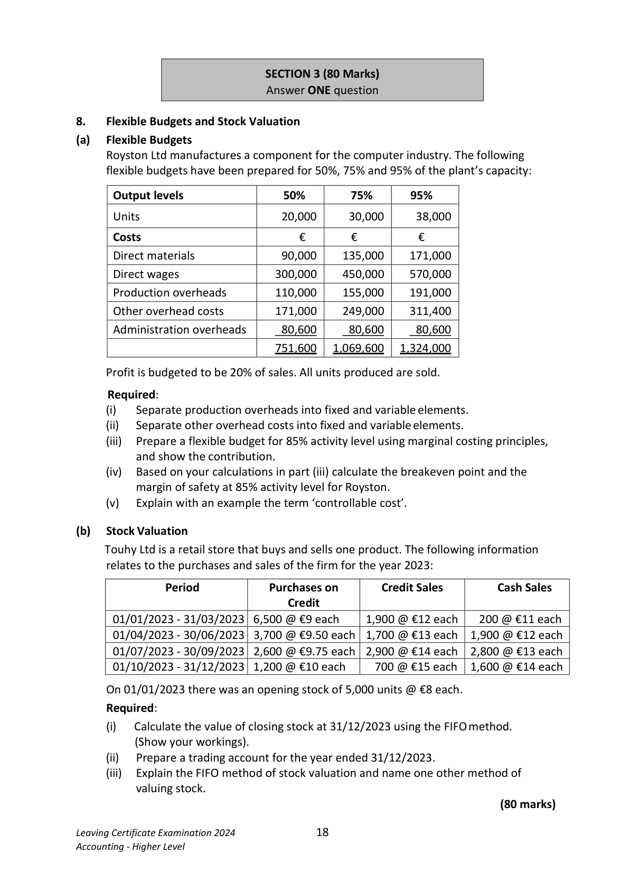
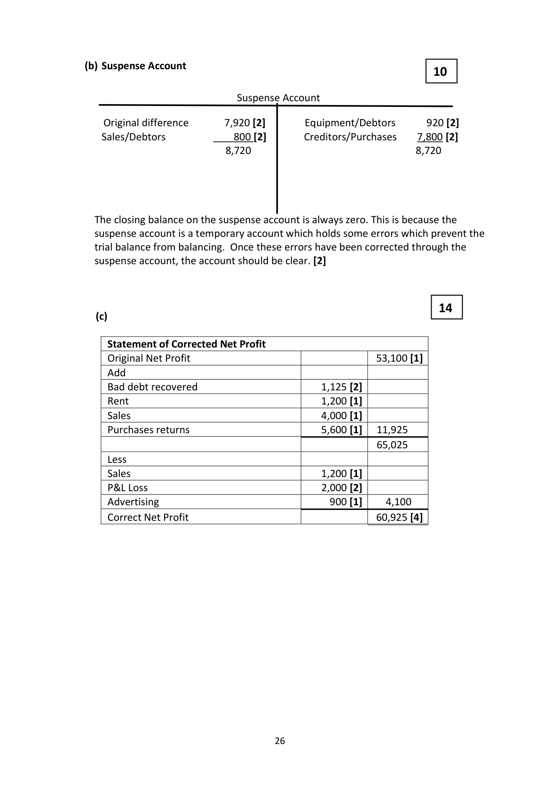
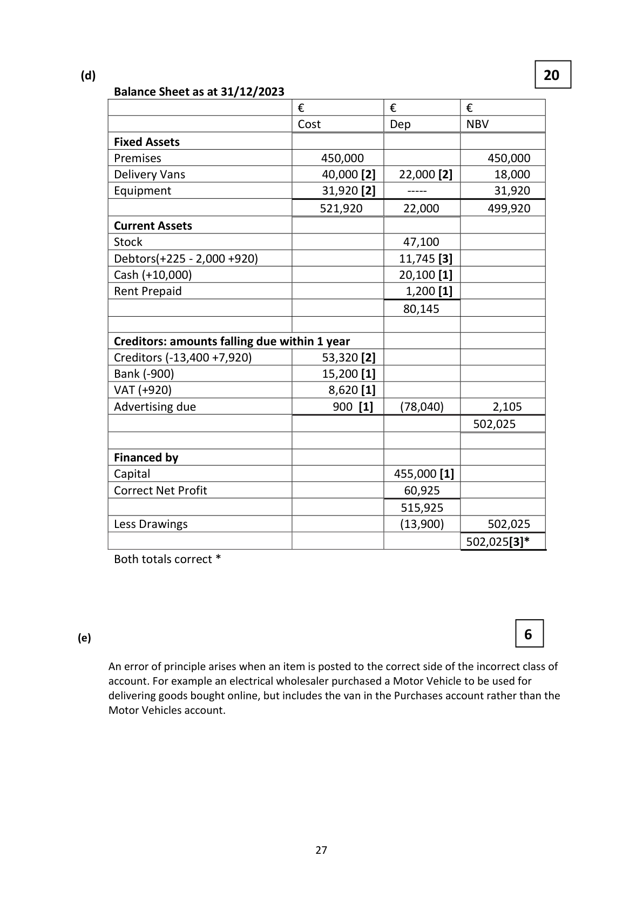
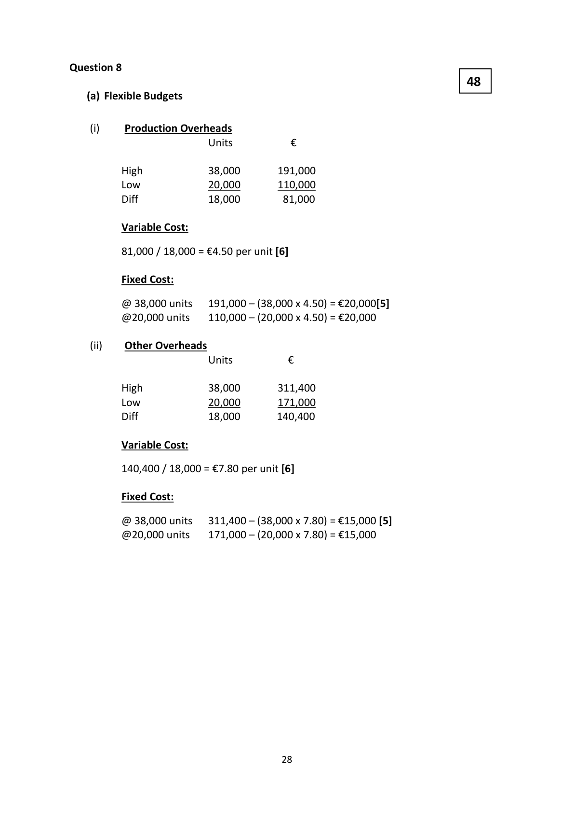

# Question

7.  Correction of Errors and Suspense Account

      The trial balance of F. Grey, an electrical wholesaler, failed to agree on 31/12/2023. The
       difference was entered in a suspense account and the following balance sheet was prepared:

                               Balance Sheet as at 31/12/2023
                                               €           €           €
       Fixed Assets                                 Cost      Dep. to date     NBV
         Premises                              450,000           ----------      450,000
          Delivery Vans                            60,000        30,000       30,000
        Equipment                              27,000          -----------       27,000
                                               537,000        30,000      507,000

       Current Assets
         Stock                                   47,100
         Debtors                                12,600
         Cash                                   10,100        69,800

        Creditors: amounts falling due within 1 year
          Creditors (including suspense)              58,800
        Bank                                    16,100
        VAT                                       7,700        82,600
       Net current assets                                                        (12,800)
        Total assets less current liabilities                                      494,200

       Financed by
          Capital                                              455,000
        Net profit                                             53,100
                                                             508,100
          Less drawings                                             (13,900)      494,200
                                                                          494,200

Leaving Certificate Examination 2024              16
Accounting - Higher Level

<!-- PAGE 17 -->
# Page 17

<!-- HAS_VISUAL: true -->
<!-- VISUAL_REASON: text contains visual keywords: figure; page image extracted because text may not fully capture visual content -->

On checking the books the following errors and omissions were discovered:

(i)   A payment of €900 was received from V. Mullen, a debtor, whose debt had previously
     been written off and who wishes to trade with Grey again. This represents 80% of the
      original debt and the debtor has undertaken to pay the remainder of the debt by
     January 2024. No entry had been made in the books.

(ii)  A delivery van which cost €20,000 and had a book value of €12,000 was sold for
     €10,000 cash. This had been entered as €2,000 on the debit of the debtors account and
     €1,200 on the credit of the sales account.
    No other entries had been made in in the books.

(iii)   Advertising due €900, and rent prepaid by Grey €1,200 were not recorded in the books.

(iv)   F. Grey sold goods on credit to CD Electrical Ltd for €4,000 plus VAT @ 23%. The only
      entries recorded in the accounts were that the VAT inclusive figure was entered on the
      credit side of the equipment account and the VAT exclusive figure was entered on the
      debit side of CD Electrical Ltd account.

(v)    F. Grey had returned electrical appliances previously purchased on credit from a supplier
      for €8,000 and entered this transaction in the relevant ledger accounts incorrectly as
      €2,200. However, a credit note subsequently arrived from the supplier showing a
      restocking charge of €200 to cover the cost of the return. The only entry made in respect
      of this credit note was a credit entry of €7,800 in the creditors account.

Required:

(a)   Journalise the necessary corrections.                                              (50)

(b)     (i)  Prepare the suspense account

         (ii)  Explain why there is no closing balance on the suspense account.             (10)

(c)   Prepare the statement of corrected net profit                                     (14)

(d)   Prepare the corrected balance sheet.                                              (20)

(e)   Explain with an example what is meant by error of principle.                          (6)

                                                                        (100 marks)

Leaving Certificate Examination 2024             17
Accounting - Higher Level

<!-- PAGE 18 -->
# Page 18

<!-- HAS_VISUAL: true -->
<!-- VISUAL_REASON: page contains vector drawings; page image extracted because text may not fully capture visual content -->

SECTION 3 (80 Marks)
                             Answer ONE question

# Marking Scheme

Question 7 Correction of errors.

                                                          50
 (a) General Journal

     General Journal
                                                       Debit           Credit
        (i)   Bank                                              900[2]
          Debtors                                           225[3]
         Bad debt recovered                                                1,125[2]
          Being the posting of a bad debt recovered which had been omitted from the
          accounts [1]

        (ii)   Sales                                               1,200[2]
         Debtor                                                            2,000[2]
         Suspense                                           800[2]
         Cash/Bank                                       10,000[2]
           Delivery Van                                                     20,000[2]
           Provision for Depreciation                           8,000[2]
        P&L Loss                                           2,000[2]

          Being correction of incorrect recording of delivery van sold for cash [1]

         (iii)  Advertising -P&L                                    900[2]
           Advertising due - B/S                                               900[2]
         Rent Prepaid - B/S                                 1,200[2]
         Rent - P&L                                                        1,200[2]
          Being correction of error Advertising due and Rent prepaid not recorded in the
         books [1]

       (iv)  Equipment                                         4,920[2]
          Debtors                                           920[2]
           Sales                                                              4,000[2]
        VAT                                                              920[2]
         Suspense                                                         920[2]
          Being the correction of incorrect entry of goods sold on credit in the
         books [1]

      (v)   Creditors                                        13,400[2]
          Purchases Returns                                                 5,600[2]
         Suspense                                                          7,800[2]
          Being the correction of incorrect recording of purchases returns and a
           restocking charge [1]

                                       25

<!-- PAGE 26 -->
# Page 26

<!-- HAS_VISUAL: true -->
<!-- VISUAL_REASON: page contains vector drawings; page image extracted because text may not fully capture visual content -->

(b) Suspense Account
                                                  10

                            Suspense Account

    Original difference       7,920 [2]       Equipment/Debtors     920 [2]
   Sales/Debtors            800 [2]        Creditors/Purchases    7,800 [2]
                           8,720                                8,720

  The closing balance on the suspense account is always zero. This is because the
  suspense account is a temporary account which holds some errors which prevent the
   trial balance from balancing. Once these errors have been corrected through the
  suspense account, the account should be clear. [2]

                                                   14
   (c)

    Statement of Corrected Net Profit
     Original Net Profit                                   53,100 [1]
    Add
    Bad debt recovered                        1,125 [2]
    Rent                                     1,200 [1]
     Sales                                     4,000 [1]
    Purchases returns                          5,600 [1]   11,925
                                                        65,025
     Less
     Sales                                     1,200 [1]
    P&L Loss                                  2,000 [2]
     Advertising                              900 [1]     4,100
     Correct Net Profit                                    60,925 [4]

                                    26

<!-- PAGE 27 -->
# Page 27

<!-- HAS_VISUAL: true -->
<!-- VISUAL_REASON: page contains vector drawings; text contains visual keywords: line; page image extracted because text may not fully capture visual content -->

(d)                                                        20
      Balance Sheet as at 31/12/2023
                                  €             €           €
                                      Cost          Dep       NBV
      Fixed Assets
      Premises                          450,000                    450,000
       Delivery Vans                       40,000 [2]    22,000 [2]       18,000
      Equipment                         31,920 [2]        -----           31,920
                                        521,920       22,000        499,920
      Current Assets
      Stock                                           47,100
      Debtors(+225 - 2,000 +920)                       11,745 [3]
      Cash (+10,000)                                  20,100 [1]
      Rent Prepaid                                      1,200 [1]
                                                      80,145

       Creditors: amounts falling due within 1 year
       Creditors (-13,400 +7,920)            53,320 [2]
      Bank (-900)                         15,200 [1]
     VAT (+920)                           8,620 [1]
       Advertising due                     900 [1]     (78,040)        2,105
                                                                 502,025

      Financed by
       Capital                                        455,000 [1]
      Correct Net Profit                                 60,925
                                                     515,925
       Less Drawings                                       (13,900)       502,025
                                                                   502,025[3]*
      Both totals correct *

(e)                                                      6

     An error of principle arises when an item is posted to the correct side of the incorrect class of
      account. For example an electrical wholesaler purchased a Motor Vehicle to be used for
      delivering goods bought online, but includes the van in the Purchases account rather than the
     Motor Vehicles account.

                                       27

<!-- PAGE 28 -->
# Page 28

<!-- HAS_VISUAL: true -->
<!-- VISUAL_REASON: page contains vector drawings; page image extracted because text may not fully capture visual content -->

# Source References

Exam paper:
- file: intermediate_markdown/exam_papers/higher/accounting_higher_2024_paper_1_exam.md
- pages: [17, 18]

Marking scheme:
- file: intermediate_markdown/marking_schemes/higher/accounting_higher_2024_paper_1_marking_scheme.md
- pages: [26, 27, 28]

# Notes

