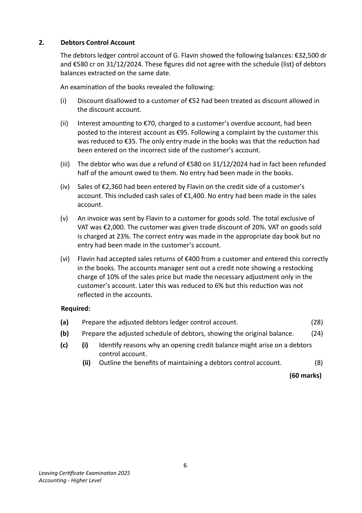
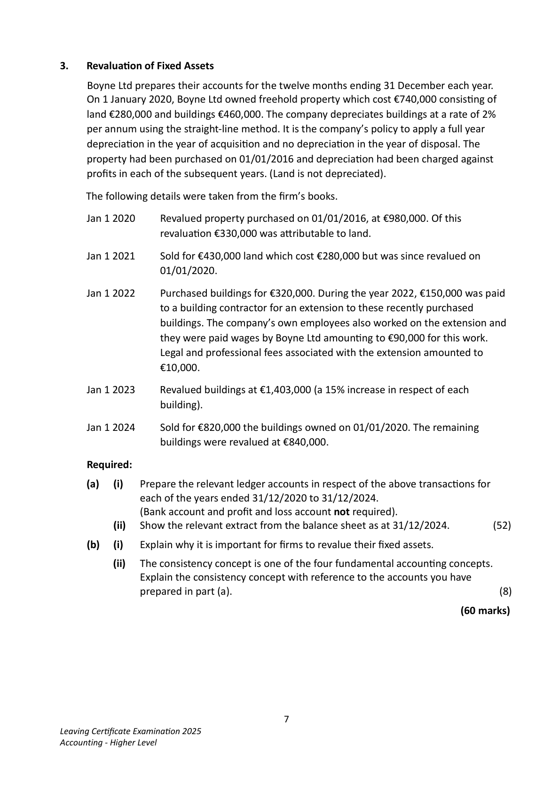
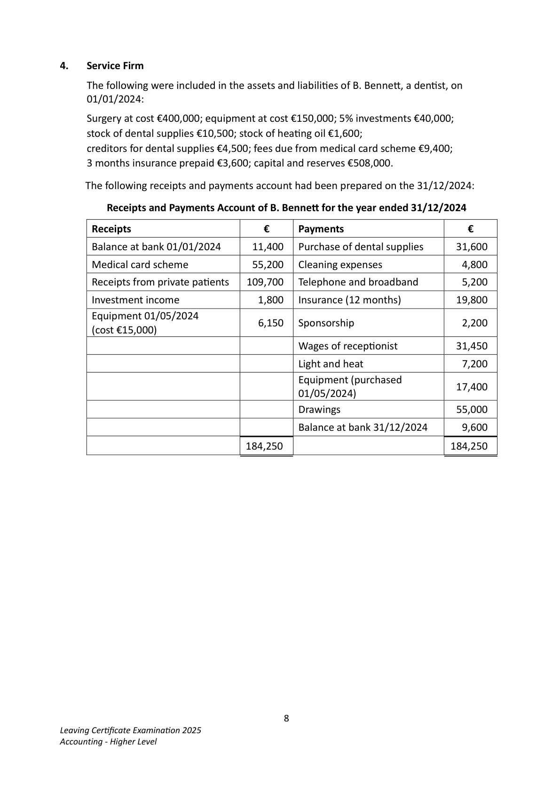
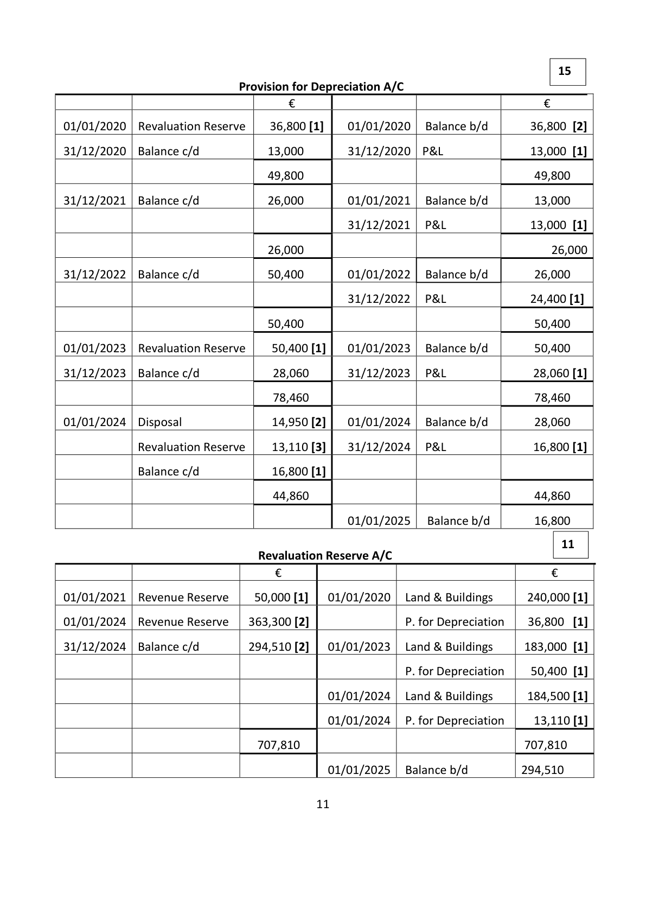
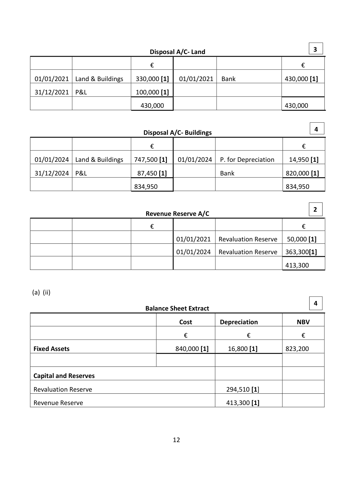
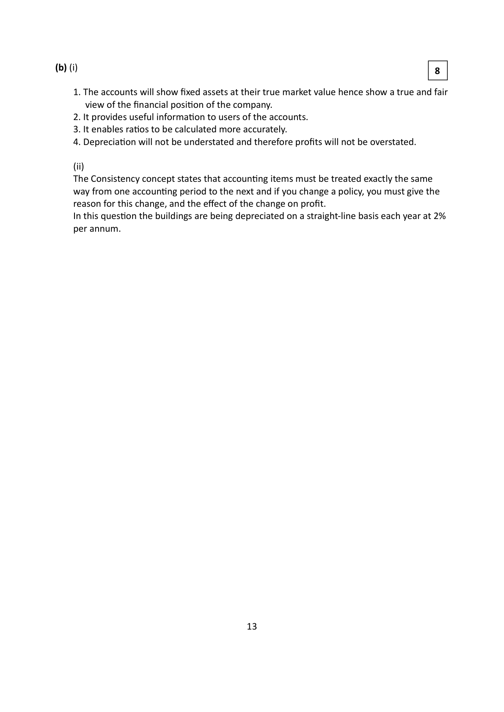

# Question

3.    Buildings be depreciated by 2% of cost.
         4.   The managing director should be paid a bonus commission of 3% on all sales in
              excess of €1,200,000 and an addiƟonal 4% of all sales in excess of €1,600,000.

 Required:
 (a)   Prepare a trading and profit and loss account for the year ended 31/12/2024.       (75)

 (b)   Prepare a balance sheet as at 31/12/2024.                                          (45)
                                                                          (120 marks)

                                           5
Leaving CerƟficate ExaminaƟon 2025
Accounting - Higher Level

<!-- PAGE 6 -->
# Page 6

<!-- HAS_VISUAL: true -->
<!-- VISUAL_REASON: text contains visual keywords: line; page image extracted because text may not fully capture visual content -->

2.     Debtors Control Account

      The debtors ledger control account of G. Flavin showed the following balances: €32,500 dr
      and €580 cr on 31/12/2024. These figures did not agree with the schedule (list) of debtors
       balances extracted on the same date.

     An examinaƟon of the books revealed the following:

           (i)   Discount disallowed to a customer of €52 had been treated as discount allowed in
            the discount account.

           (ii)   Interest amounƟng to €70, charged to a customer’s overdue account, had been
           posted to the interest account as €95. Following a complaint by the customer this
          was reduced to €35. The only entry made in the books was that the reducƟon had
          been entered on the incorrect side of the customer’s account.

           (iii)  The debtor who was due a refund of €580 on 31/12/2024 had in fact been refunded
              half of the amount owed to them. No entry had been made in the books.

         (iv)   Sales of €2,360 had been entered by Flavin on the credit side of a customer’s
            account. This included cash sales of €1,400. No entry had been made in the sales
            account.

        (v)  An invoice was sent by Flavin to a customer for goods sold. The total exclusive of
           VAT was €2,000. The customer was given trade discount of 20%. VAT on goods sold
                 is charged at 23%. The correct entry was made in the appropriate day book but no
            entry had been made in the customer’s account.

         (vi)   Flavin had accepted sales returns of €400 from a customer and entered this correctly
              in the books. The accounts manager sent out a credit note showing a restocking
            charge of 10% of the sales price but made the necessary adjustment only in the
            customer’s account. Later this was reduced to 6% but this reducƟon was not
            reflected in the accounts.

       Required:

        (a)    Prepare the adjusted debtors ledger control account.                         (28)

        (b)    Prepare the adjusted schedule of debtors, showing the original balance.      (24)

         (c)       (i)   IdenƟfy reasons why an opening credit balance might arise on a debtors
                    control account.
                      (ii)   Outline the benefits of maintaining a debtors control account.            (8)

                                                                              (60 marks)

                                           6
Leaving CerƟficate ExaminaƟon 2025
Accounting - Higher Level

<!-- PAGE 7 -->
# Page 7

<!-- HAS_VISUAL: true -->
<!-- VISUAL_REASON: text contains visual keywords: line, table; page image extracted because text may not fully capture visual content -->

3.   RevaluaƟon of Fixed Assets

     Boyne Ltd prepares their accounts for the twelve months ending 31 December each year.
    On 1 January 2020, Boyne Ltd owned freehold property which cost €740,000 consisƟng of
     land €280,000 and buildings €460,000. The company depreciates buildings at a rate of 2%
     per annum using the straight-line method. It is the company’s policy to apply a full year
     depreciaƟon in the year of acquisiƟon and no depreciaƟon in the year of disposal. The
     property had been purchased on 01/01/2016 and depreciaƟon had been charged against
     profits in each of the subsequent years. (Land is not depreciated).

     The following details were taken from the firm’s books.

     Jan 1 2020     Revalued property purchased on 01/01/2016, at €980,000. Of this
                   revaluaƟon €330,000 was aƩributable to land.

     Jan 1 2021     Sold for €430,000 land which cost €280,000 but was since revalued on
                   01/01/2020.

     Jan 1 2022     Purchased buildings for €320,000. During the year 2022, €150,000 was paid
                     to a building contractor for an extension to these recently purchased
                       buildings. The company’s own employees also worked on the extension and
                    they were paid wages by Boyne Ltd amounƟng to €90,000 for this work.
                     Legal and professional fees associated with the extension amounted to
                    €10,000.

     Jan 1 2023     Revalued buildings at €1,403,000 (a 15% increase in respect of each
                       building).

     Jan 1 2024     Sold for €820,000 the buildings owned on 01/01/2020. The remaining
                      buildings were revalued at €840,000.

     Required:

      (a)    (i)   Prepare the relevant ledger accounts in respect of the above transacƟons for
               each of the years ended 31/12/2020 to 31/12/2024.
               (Bank account and profit and loss account not required).
                 (ii)  Show the relevant extract from the balance sheet as at 31/12/2024.         (52)

      (b)    (i)    Explain why it is important for firms to revalue their fixed assets.

                 (ii)   The consistency concept is one of the four fundamental accounƟng concepts.
                 Explain the consistency concept with reference to the accounts you have
               prepared in part (a).                                                                (8)

                                                                                (60 marks)

                                           7
Leaving CerƟficate ExaminaƟon 2025
Accounting - Higher Level

<!-- PAGE 8 -->
# Page 8

<!-- HAS_VISUAL: true -->
<!-- VISUAL_REASON: page contains vector drawings; page image extracted because text may not fully capture visual content -->

# Marking Scheme

Q3  RevaluaƟon of Fixed Assets

      (a) (i)                                                         52

                                                                             13
                                 Land & Buildings A/C

                                      €                                    €

01/01/2020    Balance b/d             740,000 [1]  31/12/2020  Balance c/d     980,000

01/01/2020    Revaluation Reserve     240,000 [1]

                                        980,000                             980,000

01/01/2021     Balance b/d               980,000  01/01/2021  Disposal       330,000 [1]

                                                31/12/2021  Balance c/d     650,000

                                        980,000                              980,000

01/01/2022    Balance b/d             650,000 [1]  31/12/2022  Balance c/d    1,220,000

             Bank                   320,000 [1]

             Bank                   150,000 [1]

                Legal fees                10,000 [1]

             Bank                    90,000 [1]

                                     1,220,000                                 1,220,000

01/01/2023    Balance b/d            1,220,000 [1]  31/12/2023  Balance c/d    1,403,000

01/01/2023    Revaluation Reserve     183,000 [1]

                                     1,403,000                                 1,403,000

01/01/2024    Balance b/d           1,403,000     01/01/2024  Disposal       747,500 [1]

01/01/2024    Revaluation Reserve     184,500 [2]  31/12/2024  Balance c/d     840,000

                                     1,587,500                                1,587,500

01/01/2025    Balance b/d             840,000

                                       10

<!-- PAGE 12 -->
# Page 12

<!-- HAS_VISUAL: true -->
<!-- VISUAL_REASON: page contains vector drawings; page image extracted because text may not fully capture visual content -->

15
                               Provision for Depreciation A/C
                                  €                                      €

01/01/2020  Revaluation Reserve    36,800 [1]    01/01/2020  Balance b/d       36,800 [2]

31/12/2020  Balance c/d           13,000       31/12/2020  P&L              13,000 [1]

                                  49,800                                      49,800

31/12/2021  Balance c/d           26,000       01/01/2021  Balance b/d        13,000

                                             31/12/2021  P&L              13,000 [1]

                                  26,000                                         26,000

31/12/2022  Balance c/d           50,400       01/01/2022  Balance b/d        26,000

                                             31/12/2022  P&L              24,400 [1]

                                  50,400                                      50,400

01/01/2023  Revaluation Reserve    50,400 [1]   01/01/2023  Balance b/d        50,400

31/12/2023  Balance c/d            28,060      31/12/2023  P&L              28,060 [1]

                                   78,460                                     78,460

01/01/2024  Disposal               14,950 [2]   01/01/2024  Balance b/d        28,060

             Revaluation Reserve    13,110 [3]   31/12/2024  P&L              16,800 [1]

             Balance c/d            16,800 [1]

                                   44,860                                     44,860

                                             01/01/2025   Balance b/d       16,800

                                                                            11
                                 Revaluation Reserve A/C
                                €                                         €

01/01/2021  Revenue Reserve    50,000 [1]   01/01/2020  Land & Buildings      240,000 [1]

01/01/2024  Revenue Reserve   363,300 [2]                   P. for Depreciation    36,800  [1]

31/12/2024  Balance c/d        294,510 [2]   01/01/2023  Land & Buildings     183,000 [1]

                                                                    P. for Depreciation    50,400 [1]

                                          01/01/2024  Land & Buildings      184,500 [1]

                                          01/01/2024   P. for Depreciation     13,110 [1]

                                707,810                                     707,810

                                          01/01/2025  Balance b/d         294,510

                                      11

<!-- PAGE 13 -->
# Page 13

<!-- HAS_VISUAL: true -->
<!-- VISUAL_REASON: page contains vector drawings; page image extracted because text may not fully capture visual content -->

3                                      Disposal A/C- Land

                                 €                                         €

 01/01/2021  Land & Buildings    330,000 [1]   01/01/2021  Bank               430,000 [1]

 31/12/2021  P&L               100,000 [1]

                                430,000                                    430,000

                                                                              4                                    Disposal A/C- Buildings

                                 €                                         €

 01/01/2024  Land & Buildings   747,500 [1]   01/01/2024   P. for Depreciation    14,950 [1]

 31/12/2024  P&L               87,450 [1]               Bank               820,000 [1]

                               834,950                                      834,950

                                                                              2
                               Revenue Reserve A/C

                                 €                                         €

                                          01/01/2021   Revaluation Reserve   50,000 [1]

                                          01/01/2024  Revaluation Reserve   363,300[1]

                                                                            413,300

(a)  (ii)

                                                                              4
                                  Balance Sheet Extract

                                              Cost         Depreciation         NBV

                                          €                €              €

Fixed Assets                                840,000 [1]      16,800 [1]        823,200

Capital and Reserves

Revaluation Reserve                                        294,510 [1]

Revenue Reserve                                           413,300 [1]

                                       12

<!-- PAGE 14 -->
# Page 14

<!-- HAS_VISUAL: true -->
<!-- VISUAL_REASON: page contains vector drawings; text contains visual keywords: line; page image extracted because text may not fully capture visual content -->

(b) (i)                                                                          8

3. It enables raƟos to be calculated more accurately.

# Source References

Exam paper:
- file: intermediate_markdown/exam_papers/higher/accounting_higher_2025_paper_1_exam.md
- pages: [6, 7, 8]

Marking scheme:
- file: intermediate_markdown/marking_schemes/higher/accounting_higher_2025_paper_1_marking_scheme.md
- pages: [12, 13, 14]

# Notes

