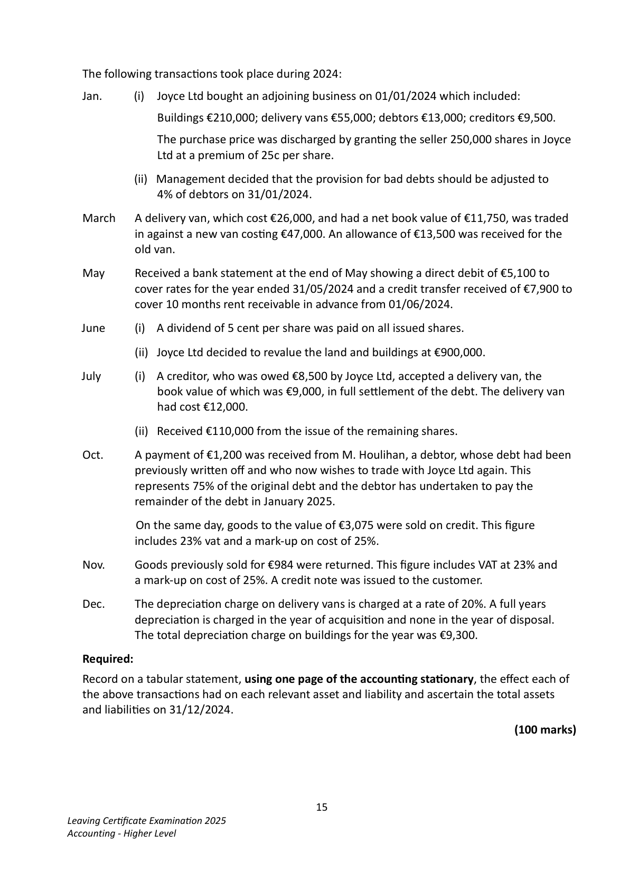
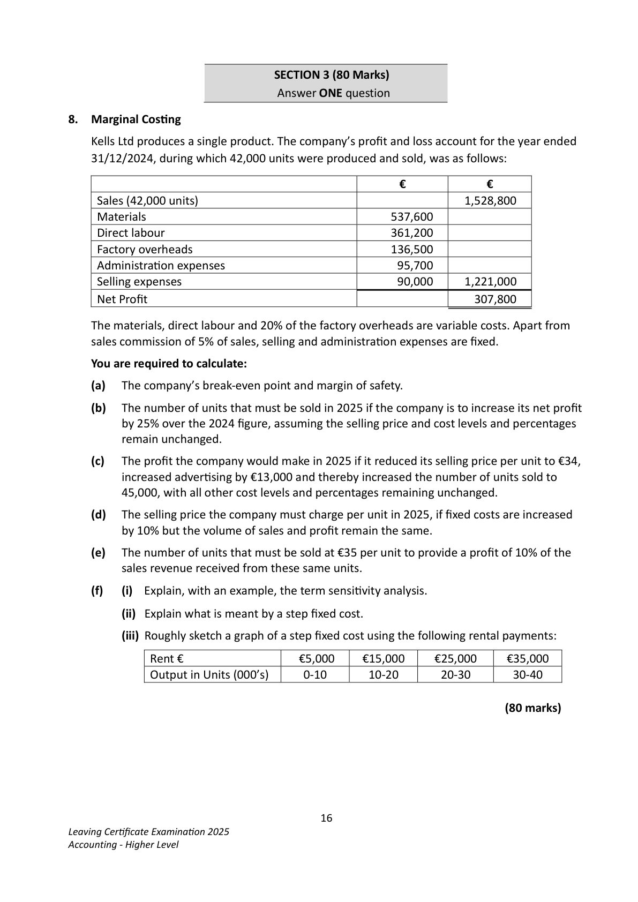

# Question

7.     Tabular Statement

    The financial posiƟon of Joyce Ltd on 01/01/2024 is shown in the following balance sheet:

                               Balance Sheet as at 01/01/2024

                                                      Cost      Dep. to date     Net

     Fixed Assets                                   €           €           €

      Land and buildings                            580,000       36,000      544,000

       Delivery vans                                  92,000       41,000       51,000

                                                  672,000       77,000      595,000

     Current Assets

       Stock                                         66,735

      Debtors (less provision 5%)                      65,265       132,000

     Less Creditors: amounts falling due within 1 year

       Creditors                                     57,000

      Bank                                         28,000

      VAT                                            1,000

      Expenses due                                   3,000       89,000

                                                                              43,000

                                                                            638,000

     Financed by:

     Capital and Reserves

      Authorised – 800,000 ordinary shares of €1 each

       Issued     – 450,000 ordinary shares of €1 each               450,000

      Share premium                                              52,000

      Profit and loss balance                                      136,000      638,000

                                                                            638,000

                                          14
Leaving CerƟficate ExaminaƟon 2025
Accounting - Higher Level

<!-- PAGE 15 -->
# Page 15

The following transacƟons took place during 2024:

   Jan.         (i)  Joyce Ltd bought an adjoining business on 01/01/2024 which included:

                 Buildings €210,000; delivery vans €55,000; debtors €13,000; creditors €9,500.

              The purchase price was discharged by granƟng the seller 250,000 shares in Joyce
                 Ltd at a premium of 25c per share.

                    (ii) Management decided that the provision for bad debts should be adjusted to
            4% of debtors on 31/01/2024.

  March   A delivery van, which cost €26,000, and had a net book value of €11,750, was traded
              in against a new van cosƟng €47,000. An allowance of €13,500 was received for the
            old van.

  May     Received a bank statement at the end of May showing a direct debit of €5,100 to
            cover rates for the year ended 31/05/2024 and a credit transfer received of €7,900 to
            cover 10 months rent receivable in advance from 01/06/2024.

  June        (i)  A dividend of 5 cent per share was paid on all issued shares.

                    (ii)  Joyce Ltd decided to revalue the land and buildings at €900,000.

   July          (i)  A creditor, who was owed €8,500 by Joyce Ltd, accepted a delivery van, the
              book value of which was €9,000, in full seƩlement of the debt. The delivery van
              had cost €12,000.

                    (ii) Received €110,000 from the issue of the remaining shares.

   Oct.    A payment of €1,200 was received from M. Houlihan, a debtor, whose debt had been
             previously wriƩen off and who now wishes to trade with Joyce Ltd again. This
            represents 75% of the original debt and the debtor has undertaken to pay the
           remainder of the debt in January 2025.

         On the same day, goods to the value of €3,075 were sold on credit. This figure
             includes 23% vat and a mark-up on cost of 25%.

   Nov.     Goods previously sold for €984 were returned. This figure includes VAT at 23% and
           a mark-up on cost of 25%. A credit note was issued to the customer.

   Dec.     The depreciaƟon charge on delivery vans is charged at a rate of 20%. A full years
           depreciaƟon is charged in the year of acquisiƟon and none in the year of disposal.
           The total depreciaƟon charge on buildings for the year was €9,300.

   Required:

   Record on a tabular statement, using one page of the accounƟng staƟonary, the effect each of
   the above transacƟons had on each relevant asset and liability and ascertain the total assets
  and liabiliƟes on 31/12/2024.

                                                                             (100 marks)

                                          15
Leaving CerƟficate ExaminaƟon 2025
Accounting - Higher Level

<!-- PAGE 16 -->
# Page 16

<!-- HAS_VISUAL: true -->
<!-- VISUAL_REASON: page contains vector drawings; text contains visual keywords: graph; page image extracted because text may not fully capture visual content -->

SECTION 3 (80 Marks)
                                Answer ONE question

# Marking Scheme

[No matching marking scheme section detected.]

# Source References

Exam paper:
- file: intermediate_markdown/exam_papers/higher/accounting_higher_2025_paper_1_exam.md
- pages: [15, 16]

Marking scheme:
- file: 
- pages: []

# Notes

