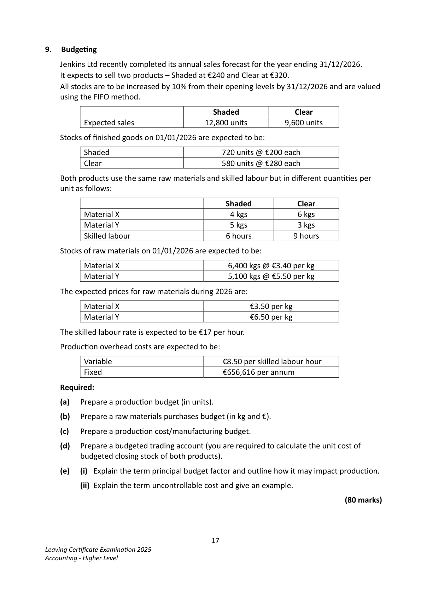
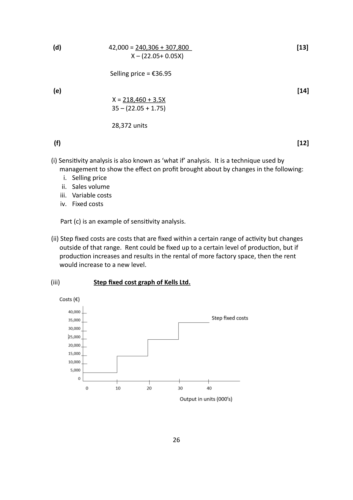
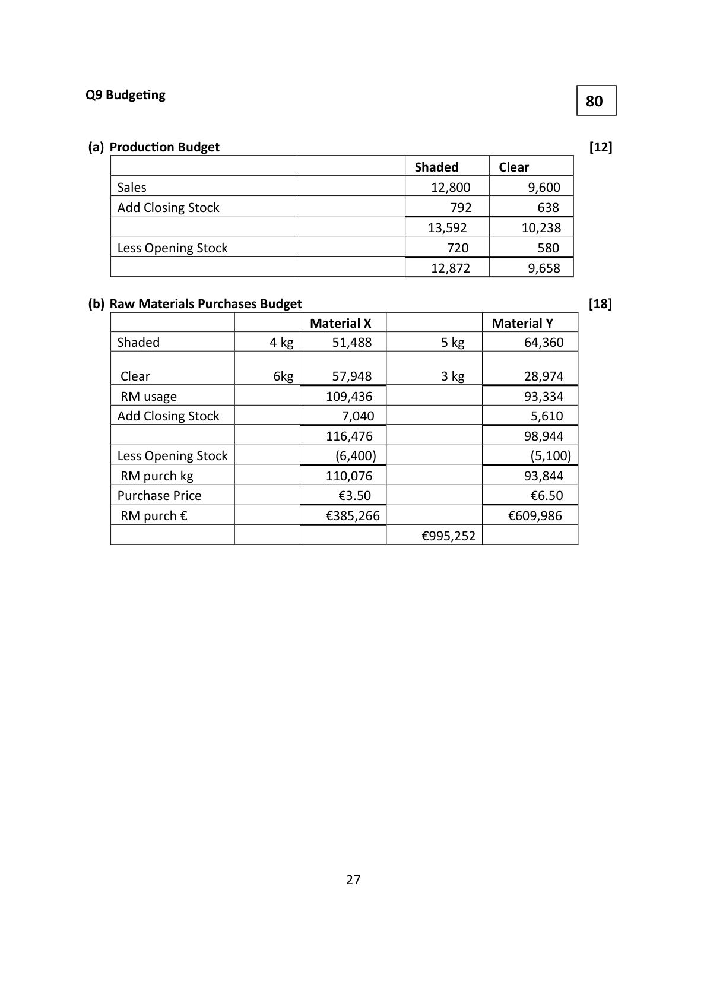

# Question

8.  Marginal CosƟng

     Kells Ltd produces a single product. The company’s profit and loss account for the year ended
    31/12/2024, during which 42,000 units were produced and sold, was as follows:

                                                   €            €
     Sales (42,000 units)                                              1,528,800
     Materials                                        537,600
     Direct labour                                     361,200
     Factory overheads                                 136,500
     AdministraƟon expenses                             95,700
      Selling expenses                                    90,000     1,221,000
     Net Profit                                                      307,800

    The materials, direct labour and 20% of the factory overheads are variable costs. Apart from
    sales commission of 5% of sales, selling and administraƟon expenses are fixed.

   You are required to calculate:

     (a)  The company’s break-even point and margin of safety.

     (b)  The number of units that must be sold in 2025 if the company is to increase its net profit
        by 25% over the 2024 figure, assuming the selling price and cost levels and percentages
         remain unchanged.

     (c)   The profit the company would make in 2025 if it reduced its selling price per unit to €34,
          increased adverƟsing by €13,000 and thereby increased the number of units sold to
          45,000, with all other cost levels and percentages remaining unchanged.

     (d)  The selling price the company must charge per unit in 2025, if fixed costs are increased
        by 10% but the volume of sales and profit remain the same.

     (e)  The number of units that must be sold at €35 per unit to provide a profit of 10% of the
          sales revenue received from these same units.

      (f)     (i)  Explain, with an example, the term sensiƟvity analysis.

               (ii)  Explain what is meant by a step fixed cost.

               (iii) Roughly sketch a graph of a step fixed cost using the following rental payments:
              Rent €                   €5,000     €15,000     €25,000     €35,000
             Output in Units (000’s)      0-10       10-20       20-30       30-40

                                                                             (80 marks)

                                          16
Leaving CerƟficate ExaminaƟon 2025
Accounting - Higher Level

<!-- PAGE 17 -->
# Page 17

<!-- HAS_VISUAL: true -->
<!-- VISUAL_REASON: page contains vector drawings; text contains visual keywords: line; page image extracted because text may not fully capture visual content -->

# Marking Scheme

Q8 Marginal CosƟng                                                              80

                                                  €       €           €

     Sales                                           1,528,800     36.40

     Less Variable Costs

     Materials                           537,600

     Direct Labour                       361,200

     Fixed Overheads                      27,300

      Selling Expenses                      76,440    1,002,540    23.87    (22.05+1.82)

      Contribution                                    526,260    12.53

     Less Fixed Costs

     Fixed Overheads                      109,200

      Selling Expenses                       13,560

     Administration                         95,700     218,460

     Net Profit                                       307,800

   (a)                                                                                [15]
                Break Even Point   Fixed Costs        218,460  = 17,435 Units
                              CPU           36.4 -23.87

                Margin of Safety Budgeted Sales – Break Even Point
                        42,000 - 17,435 = 24,565 units

   (b)                                                                                [12]

                Net Profit  2024                    307,800
                  Increase in net profit by 25%            76,950
                Net Profit for 2025                  384,750

                  Fixed Costs + Target Profit = 218,460 +384,750    = 48,142 units
                      CPU             36.4 – 23.87

   (c)           45,000  =     231,460 + N                                        [14]
                            34 - (22.05 + 1.7)

                     Profit = €229,790

                                    25

<!-- PAGE 27 -->
# Page 27

<!-- HAS_VISUAL: true -->
<!-- VISUAL_REASON: page contains embedded images; page contains vector drawings; text contains visual keywords: graph; page image extracted because text may not fully capture visual content -->

(d)              42,000 = 240,306 + 307,800                                     [13]
                      X – (22.05+ 0.05X)

                      Selling price = €36.95

 (e)                                                                                [14]
                 X = 218,460 + 3.5X
                 35 – (22.05 + 1.75)

                   28,372 units

 (f)                                                                                [12]

(i) SensiƟvity analysis is also known as ‘what if’ analysis.  It is a technique used by
  management to show the effect on profit brought about by changes in the following:
       i.  Selling price
      ii.  Sales volume
      iii.  Variable costs
    iv.  Fixed costs

   Part (c) is an example of sensiƟvity analysis.

(ii) Step fixed costs are costs that are fixed within a certain range of acƟvity but changes
   outside of that range. Rent could be fixed up to a certain level of producƟon, but if
  producƟon increases and results in the rental of more factory space, then the rent
  would increase to a new level.

(iii)          Step fixed cost graph of Kells Ltd.

                                  26

<!-- PAGE 28 -->
# Page 28

<!-- HAS_VISUAL: true -->
<!-- VISUAL_REASON: page contains vector drawings; page image extracted because text may not fully capture visual content -->

# Source References

Exam paper:
- file: intermediate_markdown/exam_papers/higher/accounting_higher_2025_paper_1_exam.md
- pages: [17]

Marking scheme:
- file: intermediate_markdown/marking_schemes/higher/accounting_higher_2025_paper_1_marking_scheme.md
- pages: [27, 28]

# Notes

