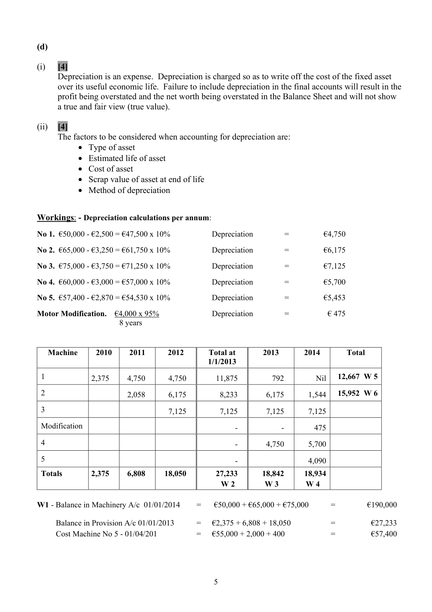
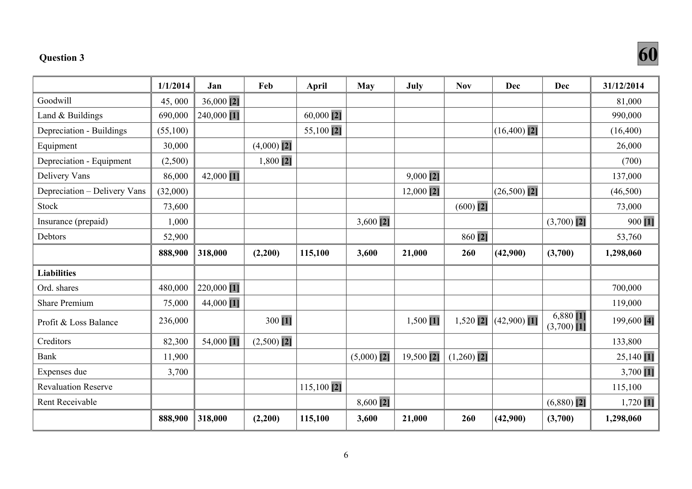
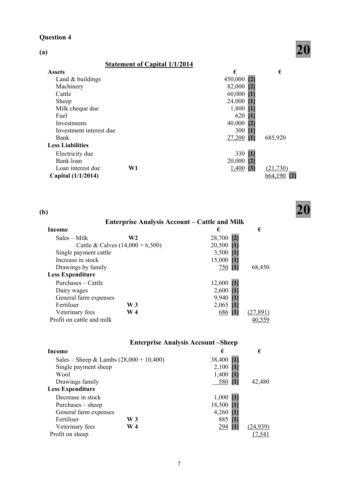

# Question

2.  Provision for bad debts to be adjusted to 4% of debtors.

# Marking Scheme

2.    Closing stock                    80,400 – 3,400                          77,000

Question 2

                                     60
                               Machinery Account
Date           Details                  €      Date      Details                    €
01/01/13      Balance W 1         190,000 [1]  01/03/13  Disposal No 1              50,000 [1]
01/03/13     Bank - No 4           60,000 [1]  31/12/13  Balance                  200,000
                                   250,000                                        250,000

01/01/14      Balance              200,000      01/04/14  Disposal No 2              65,000 [1]
01/01/14     Bank                   4,000 [1]  31/12/14  Balance                  196,400
01/04/14     Bank – No 5           57,400 [1]                                 _______
                                   261,400                                        261,400

                             Provision for Depreciation Account
     [1]     Details                   €        Date        Details                   €
01/03/13    Disposal No 1 W 5        12,667 [3]  01/01/13   Balance W 2              27,233 [6]
31/12/13   Balance                  33,408      31/12/13    Profit &Loss a/c W 3      18,842 [7]
                                    46,075                                          46,075
     [1]
01/04/14    Disposal No 2 W 6        15,952 [2]  01/01/14   Balance                  33,408
31/12/14   Balance                  36,390 [4]  31/12/14    Profit & Loss a/c W 4     18,934 [8]
                                    52,342                                          52,342

                                     Disposal Account
Date        Details                   €        Date        Details                  €
01/03/13   Machine No 1            50,000 [1]  01/03/13    Insurance               25,000 [2]
                                                 01/03/13    Scrap allowance           500 [2]
                                                 01/03/13    Depreciation            12,667 [2]
                                  _____      31/12/13    Profit & Loss a/c         11,833 [1]
                                    50,000                                        50,000

01/04/14   Machine No 2            65,000 [1]  01/04/14    Trade-in allowance       27,500 [2]
                                                 01/04/14    Depreciation            15,952 [2]
                                  _____      31/12/14    Profit & Loss a/c         21,548 [1]
                                    65,000                                        65,000

                                            4

<!-- PAGE 7 -->
# Page 7

<!-- HAS_VISUAL: true -->
<!-- VISUAL_REASON: page contains vector drawings; page image extracted because text may not fully capture visual content -->

(d)

(i)    [4]
     Depreciation is an expense. Depreciation is charged so as to write off the cost of the fixed asset
     over its useful economic life. Failure to include depreciation in the final accounts will result in the
      profit being overstated and the net worth being overstated in the Balance Sheet and will not show
     a true and fair view (true value).

(ii)   [4]
     The factors to be considered when accounting for depreciation are:
          • Type of asset
          •  Estimated life of asset
          •  Cost of asset
          •  Scrap value of asset at end of life
          • Method of depreciation

Workings: - Depreciation calculations per annum:

No 1. €50,000 - €2,500 = €47,500 x 10%            Depreciation       =         €4,750

No 2. €65,000 - €3,250 = €61,750 x 10%            Depreciation       =         €6,175

No 3. €75,000 - €3,750 = €71,250 x 10%            Depreciation       =         €7,125

No 4. €60,000 - €3,000 = €57,000 x 10%            Depreciation       =         €5,700

No 5. €57,400 - €2,870 = €54,530 x 10%            Depreciation       =         €5,453

Motor Modification.  €4,000 x 95%               Depreciation       =          € 475
                     8 years

   Machine     2010    2011      2012       Total at       2013      2014       Total
                                                1/1/2013

 1             2,375     4,750      4,750        11,875         792         Nil   12,667 W 5

 2                       2,058      6,175         8,233        6,175       1,544   15,952 W 6

 3                                  7,125         7,125        7,125       7,125

 Modification                                                         -                -        475

 4                                                                        -        4,750       5,700

 5                                                                        -                    4,090
 Totals        2,375     6,808     18,050        27,233       18,842     18,934
                       W 2    W 3   W 4

W1 - Balance in Machinery A/c 01/01/2014    =   €50,000 + €65,000 + €75,000     =         €190,000

     Balance in Provision A/c 01/01/2013     =   €2,375 + 6,808 + 18,050         =          €27,233
     Cost Machine No 5 - 01/04/201         =   €55,000 + 2,000 + 400          =          €57,400

                                            5

<!-- PAGE 8 -->
# Page 8

<!-- HAS_VISUAL: true -->
<!-- VISUAL_REASON: page contains vector drawings; page image extracted because text may not fully capture visual content -->

[1]                           [4]        [1]  [1]      [1]60
                                81,000   990,000    (16,400)   26,000   (700)    137,000    (46,500)   73,000  900   53,760     1,298,060                  700,000    119,000     199,600        133,800   25,140   3,700    115,100   1,720     1,298,060                                      31/12/2014

                                                    [2]                         [1] [1]                    [2]
           Dec                                                                                                                          (3,700)               (3,700)                           6,880 (3,700)                                              (6,880)    (3,700)

                         [2]               [2]                                    [1]
           Dec                                                                  (16,400)                                         (26,500)                                         (42,900)                                              (42,900)                                                                      (42,900)

                                                [2]      [2]                      [2]        [2]
                                                         860  260                                               260           Nov                                                       (600)                                                    1,520                  (1,260)

                                      [2]  [2]                                    [1]        [2]
               July                                        9,000   12,000                               21,000                             1,500                19,500                               21,000

                                                    [2]                                      [2]           [2]
           May                                                               3,600           3,600                                                                  (5,000)                  8,600   3,600

                                         6
                    [2]  [2]                                                                          [2]
                   April            60,000   55,100                                                                               115,100                                                                                       115,100               115,100

                             [2]  [2]                                             [1]   [2]

           Feb                                                                    (4,000)   1,800                                                         (2,200)                 300        (2,500)                                               (2,200)

                [2] [1]               [1]                               [1]  [1]         [1]

           Jan                                36,000   240,000                              42,000                                               318,000                  220,000   44,000                 54,000                                               318,000
                              1/1/2014  000                45,   690,000    (55,100)   30,000    (2,500)   86,000    (32,000)   73,600   1,000   52,900    888,900                  480,000   75,000     236,000      82,300   11,900   3,700                          888,900

                                                         Vans
                                                                          Buildings                  Equipment                Delivery                                                                                                                                                                                                Balance
        -  -  –                                                                                                                                                                                                                                             Reserve
 3                                                                                                                                                            (prepaid)                                          due                                                   Vans                                                       Loss                                                            Buildings                                                                                                                                                                                   Premium &                                                                                                                                                                                                                                                                                                                                                                  Receivable       &                                                                                                  shares      Question                          Goodwill  Land      Depreciation     Equipment      Depreciation    Delivery      Depreciation   Stock     Insurance    Debtors                             Liabilities  Ord.   Share      Profit        Creditors  Bank    Expenses      Revaluation  Rent

<!-- PAGE 9 -->
# Page 9

<!-- HAS_VISUAL: true -->
<!-- VISUAL_REASON: page contains vector drawings; page image extracted because text may not fully capture visual content -->

2.    Milk sales                                            29,000
    Add due 31/12                                          1,500
      Less due 1/1                                              (1,800)       28,700

2.    Purchases

      Credit purchases  [42,100 + 32,600 -22,500 ]                           52,200
     Cash purchases                                                      86,200
      Total Purchases                                                   138,400
      Less drawings of stock                                                    (5,200)
      Total purchases                                                               133,200

# Source References

Exam paper:
- file: intermediate_markdown/exam_papers/higher/accounting_higher_2015_paper_1_exam.md
- pages: []

Marking scheme:
- file: intermediate_markdown/marking_schemes/higher/accounting_higher_2015_paper_1_marking_scheme.md
- pages: [7, 8, 9]

# Notes

