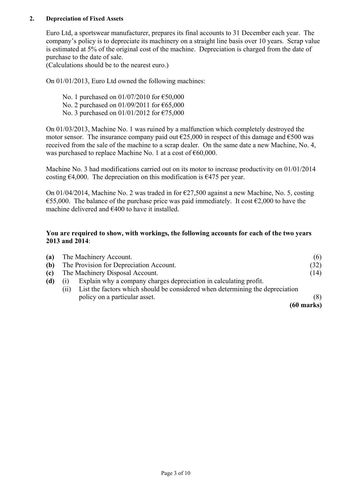
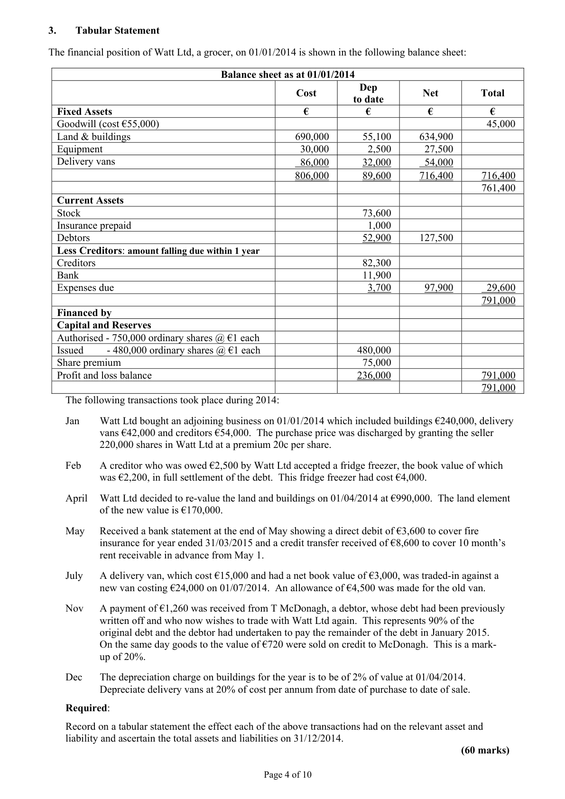
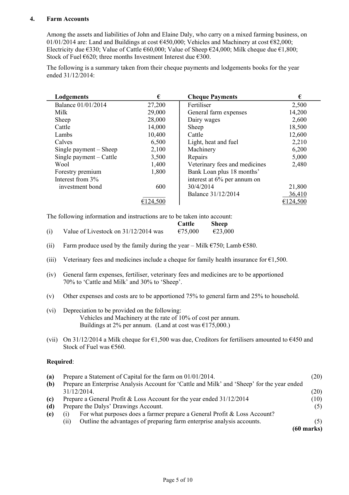

# Question

3.  Buildings to be depreciated by 2% of cost.
                 4. The managing director should be paid a bonus commission of 3% on all sales in excess of €900,000 and
                  a further 5% in excess of all sales above €1,200,000.
      Required:
       (a)    Prepare a Trading and Profit and Loss Account for the year ended 31/12/2014.                          (75)
       (b)    Prepare a Balance Sheet as at 31/12/2014.                                                             (45)
                                                                                                 (120 marks)

                                               Page 2 of 10

<!-- PAGE 3 -->
# Page 3

<!-- HAS_VISUAL: true -->
<!-- VISUAL_REASON: text contains visual keywords: line; page image extracted because text may not fully capture visual content -->

2.    Depreciation of Fixed Assets

     Euro Ltd, a sportswear manufacturer, prepares its final accounts to 31 December each year. The
     company’s policy is to depreciate its machinery on a straight line basis over 10 years. Scrap value
       is estimated at 5% of the original cost of the machine. Depreciation is charged from the date of
     purchase to the date of sale.
      (Calculations should be to the nearest euro.)

    On 01/01/2013, Euro Ltd owned the following machines:

          No. 1 purchased on 01/07/2010 for €50,000
          No. 2 purchased on 01/09/2011 for €65,000
          No. 3 purchased on 01/01/2012 for €75,000

    On 01/03/2013, Machine No. 1 was ruined by a malfunction which completely destroyed the
     motor sensor. The insurance company paid out €25,000 in respect of this damage and €500 was
      received from the sale of the machine to a scrap dealer. On the same date a new Machine, No. 4,
     was purchased to replace Machine No. 1 at a cost of €60,000.

     Machine No. 3 had modifications carried out on its motor to increase productivity on 01/01/2014
      costing €4,000. The depreciation on this modification is €475 per year.

    On 01/04/2014, Machine No. 2 was traded in for €27,500 against a new Machine, No. 5, costing
     €55,000. The balance of the purchase price was paid immediately.  It cost €2,000 to have the
     machine delivered and €400 to have it installed.

    You are required to show, with workings, the following accounts for each of the two years
     2013 and 2014:

      (a)  The Machinery Account.                                                                   (6)
      (b)  The Provision for Depreciation Account.                                              (32)
      (c)  The Machinery Disposal Account.                                                    (14)
      (d)    (i)   Explain why a company charges depreciation in calculating profit.
               (ii)   List the factors which should be considered when determining the depreciation
                 policy on a particular asset.                                                           (8)
                                                                                    (60 marks)

                                               Page 3 of 10

<!-- PAGE 4 -->
# Page 4

<!-- HAS_VISUAL: true -->
<!-- VISUAL_REASON: page contains vector drawings; page image extracted because text may not fully capture visual content -->

3.    Tabular Statement

The financial position of Watt Ltd, a grocer, on 01/01/2014 is shown in the following balance sheet:

                                  Balance sheet as at 01/01/2014
                                                    Dep
                                                 Cost                    Net         Total
                                                                      to date
  Fixed Assets                                     €           €           €           €
  Goodwill (cost €55,000)                                                                     45,000
  Land & buildings                                  690,000       55,100      634,900
  Equipment                                         30,000        2,500       27,500
  Delivery vans                                       86,000       32,000       54,000
                                                   806,000       89,600      716,400      716,400
                                                                                         761,400
  Current Assets
  Stock                                                           73,600
  Insurance prepaid                                                  1,000
  Debtors                                                         52,900      127,500
  Less Creditors: amount falling due within 1 year
  Creditors                                                        82,300
  Bank                                                           11,900
  Expenses due                                                      3,700       97,900       29,600
                                                                                         791,000
  Financed by
  Capital and Reserves
  Authorised - 750,000 ordinary shares @ €1 each
  Issued       - 480,000 ordinary shares @ €1 each                    480,000
  Share premium                                                  75,000
  Profit and loss balance                                          236,000                   791,000
                                                                                         791,000
   The following transactions took place during 2014:

    Jan    Watt Ltd bought an adjoining business on 01/01/2014 which included buildings €240,000, delivery
           vans €42,000 and creditors €54,000. The purchase price was discharged by granting the seller
           220,000 shares in Watt Ltd at a premium 20c per share.

   Feb  A creditor who was owed €2,500 by Watt Ltd accepted a fridge freezer, the book value of which
         was €2,200, in full settlement of the debt. This fridge freezer had cost €4,000.

    April  Watt Ltd decided to re-value the land and buildings on 01/04/2014 at €990,000. The land element
            of the new value is €170,000.

   May   Received a bank statement at the end of May showing a direct debit of €3,600 to cover fire
            insurance for year ended 31/03/2015 and a credit transfer received of €8,600 to cover 10 month’s
             rent receivable in advance from May 1.

    July  A delivery van, which cost €15,000 and had a net book value of €3,000, was traded-in against a
         new van costing €24,000 on 01/07/2014. An allowance of €4,500 was made for the old van.

   Nov  A payment of €1,260 was received from T McDonagh, a debtor, whose debt had been previously
            written off and who now wishes to trade with Watt Ltd again. This represents 90% of the
             original debt and the debtor had undertaken to pay the remainder of the debt in January 2015.
        On the same day goods to the value of €720 were sold on credit to McDonagh. This is a mark-
          up of 20%.

   Dec   The depreciation charge on buildings for the year is to be of 2% of value at 01/04/2014.
           Depreciate delivery vans at 20% of cost per annum from date of purchase to date of sale.

   Required:

   Record on a tabular statement the effect each of the above transactions had on the relevant asset and
     liability and ascertain the total assets and liabilities on 31/12/2014.
                                                                                         (60 marks)

                                               Page 4 of 10

<!-- PAGE 5 -->
# Page 5

<!-- HAS_VISUAL: true -->
<!-- VISUAL_REASON: page contains vector drawings; text contains visual keywords: line; page image extracted because text may not fully capture visual content -->

# Marking Scheme

3.    Patents                          (21,500 + 3,500) * 5                        5,000

3.     Fertiliser                                               2,500
    Add due 31/12                                       450
                                                             2,950
        70% of 2,950         =                                        2,065
        30% of 2,950         =                                     885

3.    General Expenses [45,800 – 1,800]                                               44,000

# Source References

Exam paper:
- file: intermediate_markdown/exam_papers/higher/accounting_higher_2015_paper_1_exam.md
- pages: [3, 4, 5]

Marking scheme:
- file: intermediate_markdown/marking_schemes/higher/accounting_higher_2015_paper_1_marking_scheme.md
- pages: []

# Notes

