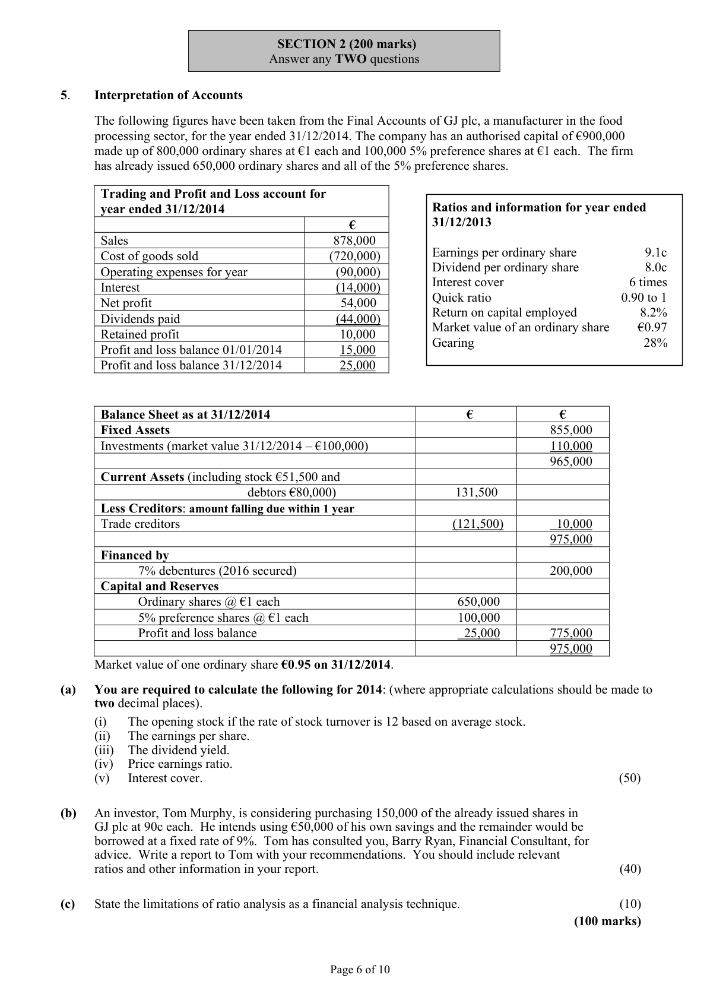
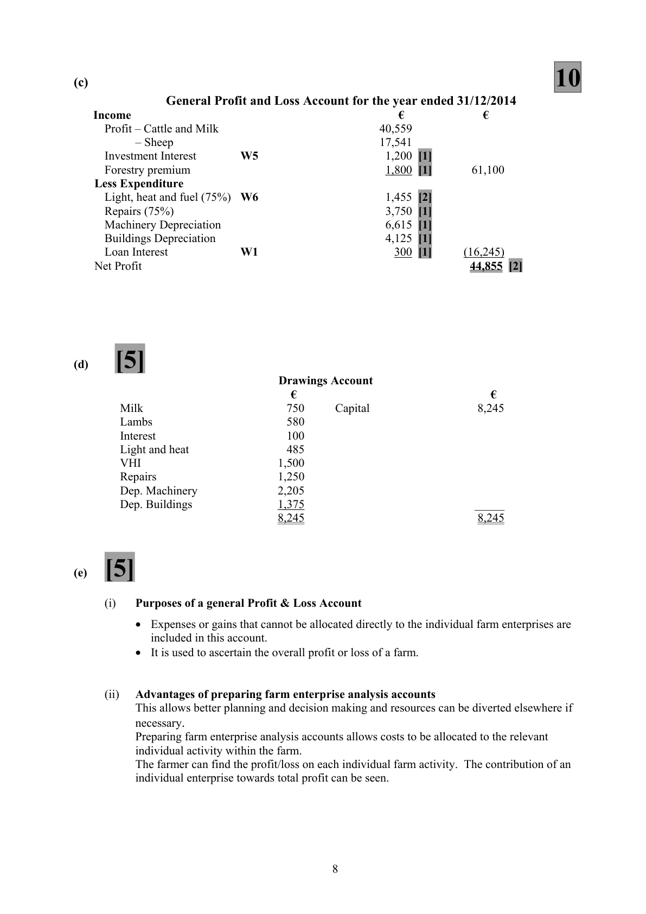
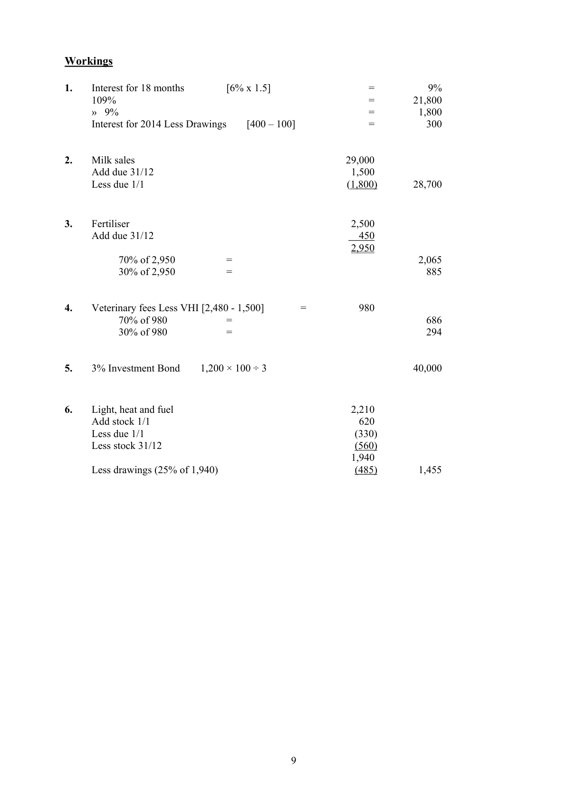

# Question

4.   Farm Accounts

    Among the assets and liabilities of John and Elaine Daly, who carry on a mixed farming business, on
      01/01/2014 are: Land and Buildings at cost €450,000; Vehicles and Machinery at cost €82,000;
       Electricity due €330; Value of Cattle €60,000; Value of Sheep €24,000; Milk cheque due €1,800;
      Stock of Fuel €620; three months Investment Interest due €300.

     The following is a summary taken from their cheque payments and lodgements books for the year
     ended 31/12/2014:

       Lodgements                     €        Cheque Payments                   €
        Balance 01/01/2014              27,200          Fertiliser                            2,500
        Milk                           29,000        General farm expenses              14,200
        Sheep                          28,000        Dairy wages                         2,600
          Cattle                          14,000       Sheep                             18,500
       Lambs                          10,400         Cattle                             12,600
         Calves                           6,500         Light, heat and fuel                   2,210
         Single payment – Sheep            2,100       Machinery                          6,200
         Single payment – Cattle            3,500        Repairs                             5,000
       Wool                            1,400        Veterinary fees and medicines         2,480
         Forestry premium                 1,800       Bank Loan plus 18 months’
          Interest from 3%                                      interest at 6% per annum on
          investment bond                 600        30/4/2014                         21,800
                                   _______        Balance 31/12/2014                 36,410
                                     €124,500                                       €124,500

     The following information and instructions are to be taken into account:
                                                     Cattle     Sheep
        (i)   Value of Livestock on 31/12/2014 was     €75,000     €23,000

        (ii)   Farm produce used by the family during the year – Milk €750; Lamb €580.

         (iii)   Veterinary fees and medicines include a cheque for family health insurance for €1,500.

       (iv)  General farm expenses, fertiliser, veterinary fees and medicines are to be apportioned
        70% to ‘Cattle and Milk’ and 30% to ‘Sheep’.

       (v)   Other expenses and costs are to be apportioned 75% to general farm and 25% to household.

       (vi)   Depreciation to be provided on the following:
                  Vehicles and Machinery at the rate of 10% of cost per annum.
                  Buildings at 2% per annum. (Land at cost was €175,000.)

       (vii) On 31/12/2014 a Milk cheque for €1,500 was due, Creditors for fertilisers amounted to €450 and
           Stock of Fuel was €560.

     Required:

       (a)   Prepare a Statement of Capital for the farm on 01/01/2014.                                    (20)
      (b)   Prepare an Enterprise Analysis Account for ‘Cattle and Milk’ and ‘Sheep’ for the year ended
            31/12/2014.                                                                                 (20)
       (c)   Prepare a General Profit & Loss Account for the year ended 31/12/2014                       (10)
      (d)   Prepare the Dalys’ Drawings Account.                                                             (5)
       (e)     (i)    For what purposes does a farmer prepare a General Profit & Loss Account?
                 (ii)   Outline the advantages of preparing farm enterprise analysis accounts.                     (5)
                                                                                            (60 marks)

                                               Page 5 of 10

<!-- PAGE 6 -->
# Page 6

<!-- HAS_VISUAL: true -->
<!-- VISUAL_REASON: page contains vector drawings; text contains visual keywords: figure; page image extracted because text may not fully capture visual content -->

SECTION 2 (200 marks)
                               Answer any TWO questions

# Marking Scheme

4.    Investment income              [350,000 × 3%]     =                    10,500
      Investment income due            10,500 – 3,500 – 1,750                     5,250 (due)

Question 4
(a)                                    20
                    Statement of Capital 1/1/2014
   Assets                                                     €             €
     Land & buildings                                          450,000 [2]
     Machinery                                                 82,000 [2]
      Cattle                                                     60,000 [1]
     Sheep                                                     24,000 [1]
     Milk cheque due                                              1,800 [1]
      Fuel                                                     620 [1]
      Investments                                                40,000 [2]
      Investment interest due                                      300 [1]
     Bank                                                      27,200 [1]   685,920
   Less Liabilities
       Electricity due                                             330 [1]
     Bank loan                                                  20,000 [2]
     Loan interest due      W1                                1,400 [3]    (21,730)
    Capital (1/1/2014)                                                        664,190 [2]

(b)                                    20
                     Enterprise Analysis Account – Cattle and Milk
  Income                                               €            €
      Sales – Milk        W2                         28,700 [2]
               Cattle & Calves (14,000 + 6,500)                 20,500 [1]
      Single payment cattle                                    3,500 [1]
      Increase in stock                                      15,000 [1]
     Drawings by family                                   750 [1]    68,450
   Less Expenditure
      Purchases – Cattle                                     12,600 [1]
      Dairy wages                                            2,600 [1]
      General farm expenses                                   9,940 [1]
       Fertiliser        W 3                          2,065 [1]
      Veterinary fees     W 4                         686 [1]   (27,891)
    Profit on cattle and milk                                                40,559

                             Enterprise Analysis Account –Sheep
  Income                                                €           €
      Sales – Sheep & Lambs (28,000 + 10,400)                38,400 [1]
      Single payment sheep                                    2,100 [1]
     Wool                                                  1,400 [1]
     Drawings family                                      580 [1]    42,480
   Less Expenditure
      Decrease in stock                                       1,000 [1]
      Purchases – sheep                                     18,500 [1]
      General farm expenses                                   4,260 [1]
       Fertiliser        W 3                         885 [1]
      Veterinary fees     W 4                         294 [1]   (24,939)
    Profit on sheep                                                        17,541

                                           7

<!-- PAGE 10 -->
# Page 10

<!-- HAS_VISUAL: true -->
<!-- VISUAL_REASON: page contains vector drawings; page image extracted because text may not fully capture visual content -->

(c)                                    10
              General Profit and Loss Account for the year ended 31/12/2014
   Income                                             €             €
       Profit – Cattle and Milk                             40,559
          – Sheep                                      17,541
      Investment Interest     W5                        1,200 [1]
      Forestry premium                                    1,800 [1]       61,100
    Less Expenditure
      Light, heat and fuel (75%) W6                        1,455 [2]
      Repairs (75%)                                       3,750 [1]
     Machinery Depreciation                               6,615 [1]
      Buildings Depreciation                                4,125 [1]
     Loan Interest        W1                       300 [1]      (16,245)
    Net Profit                                                            44,855 [2]

(d)   [5]
                                 Drawings Account
                                    €                                 €
        Milk                        750      Capital                    8,245
       Lambs                      580
          Interest                      100
         Light and heat                485
       VHI                         1,500
         Repairs                       1,250
        Dep. Machinery               2,205
        Dep. Buildings                1,375                            _____
                                      8,245                                8,245

(e)  [5]

        (i)   Purposes of a general Profit & Loss Account

           •  Expenses or gains that cannot be allocated directly to the individual farm enterprises are
               included in this account.
           •   It is used to ascertain the overall profit or loss of a farm.

        (ii)   Advantages of preparing farm enterprise analysis accounts
            This allows better planning and decision making and resources can be diverted elsewhere if
            necessary.
            Preparing farm enterprise analysis accounts allows costs to be allocated to the relevant
             individual activity within the farm.
          The farmer can find the profit/loss on each individual farm activity. The contribution of an
             individual enterprise towards total profit can be seen.

                                           8

<!-- PAGE 11 -->
# Page 11

<!-- HAS_VISUAL: true -->
<!-- VISUAL_REASON: page contains vector drawings; page image extracted because text may not fully capture visual content -->

Workings

4.    Veterinary fees Less VHI [2,480 - 1,500]      =          980
        70% of 980          =                                     686
        30% of 980          =                                     294

5.   3% Investment Bond    1,200 × 100 ÷ 3                               40,000

4.    Insurance         [1,200 + 3,800 – 950]                                            4,050

# Source References

Exam paper:
- file: intermediate_markdown/exam_papers/higher/accounting_higher_2015_paper_1_exam.md
- pages: [6]

Marking scheme:
- file: intermediate_markdown/marking_schemes/higher/accounting_higher_2015_paper_1_marking_scheme.md
- pages: [10, 11]

# Notes

