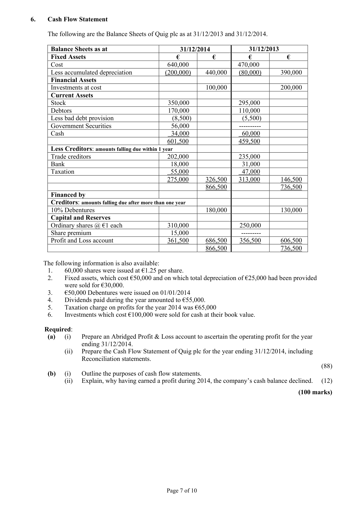
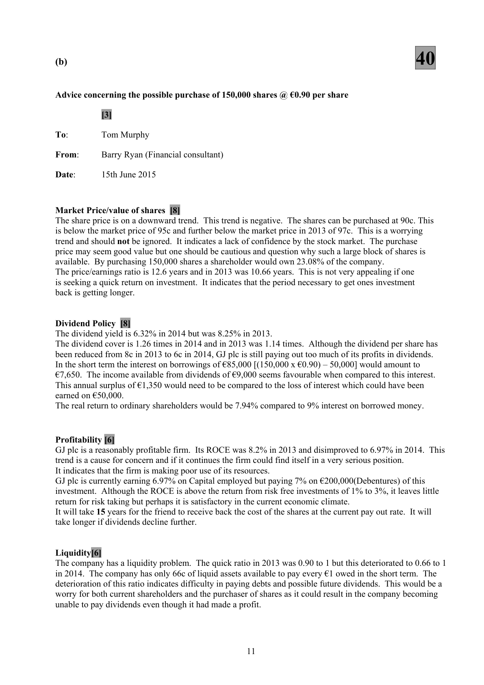
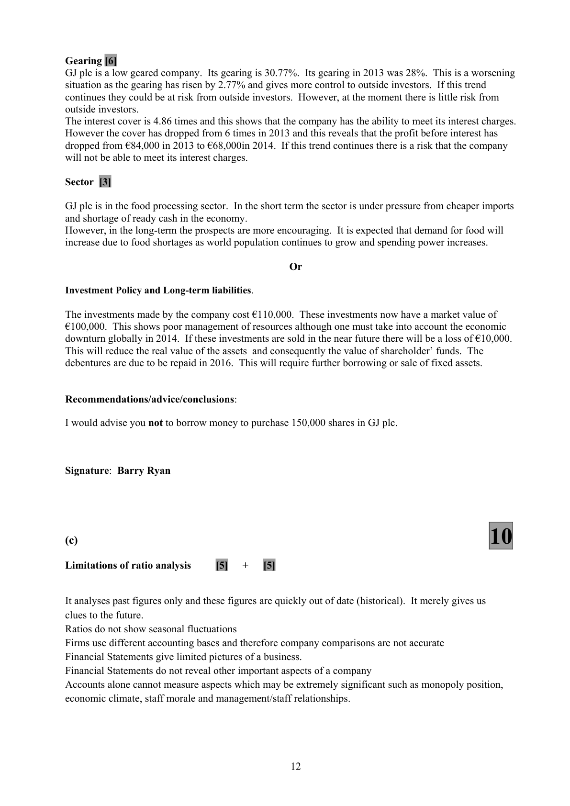
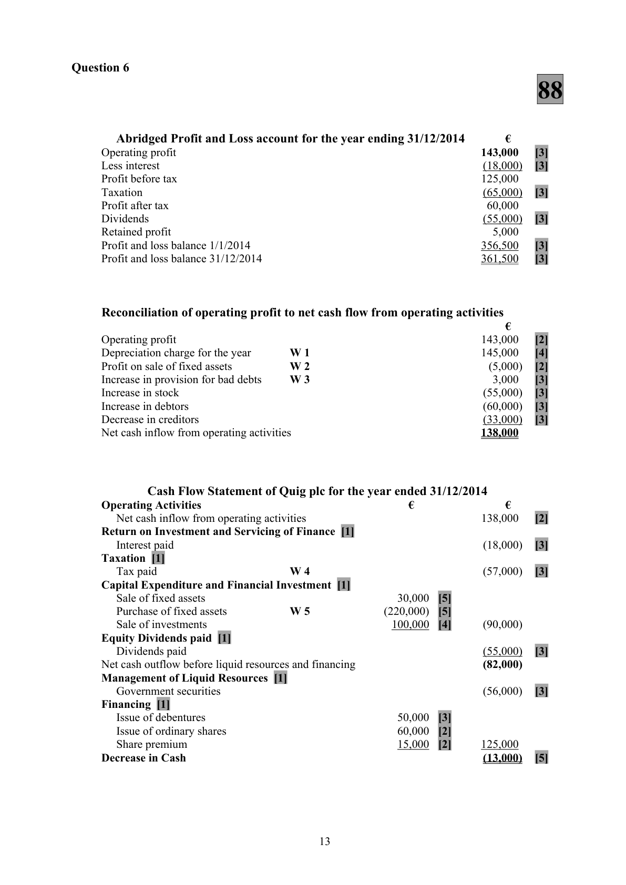

# Question

5.    Interpretation of Accounts

     The following figures have been taken from the Final Accounts of GJ plc, a manufacturer in the food
      processing sector, for the year ended 31/12/2014. The company has an authorised capital of €900,000
     made up of 800,000 ordinary shares at €1 each and 100,000 5% preference shares at €1 each. The firm
      has already issued 650,000 ordinary shares and all of the 5% preference shares.

      Trading and Profit and Loss account for
       year ended 31/12/2014                                   Ratios and information for year ended
                                            €             31/12/2013
       Sales                                  878,000
                                                                Earnings per ordinary share            9.1c       Cost of goods sold                       (720,000)
                                                             Dividend per ordinary share            8.0c       Operating expenses for year                (90,000)
                                                                            Interest cover                   6 times        Interest                                   (14,000)
                                                          Quick ratio                       0.90 to 1      Net profit                                54,000
                                                               Return on capital employed         8.2%       Dividends paid                            (44,000)
                                                           Market value of an ordinary share     €0.97       Retained profit                           10,000
                                                              Gearing                     28%
        Profit and loss balance 01/01/2014          15,000
        Profit and loss balance 31/12/2014          25,000

      Balance Sheet as at 31/12/2014                              €             €
      Fixed Assets                                                               855,000
       Investments (market value 31/12/2014 – €100,000)                              110,000
                                                                                 965,000
      Current Assets (including stock €51,500 and
                                  debtors €80,000)                    131,500
       Less Creditors: amount falling due within 1 year
       Trade creditors                                                (121,500)         10,000
                                                                                 975,000
      Financed by
         7% debentures (2016 secured)                                          200,000
       Capital and Reserves
             Ordinary shares @ €1 each                             650,000
         5% preference shares @ €1 each                         100,000
                Profit and loss balance                                   25,000        775,000
                                                                                 975,000
     Market value of one ordinary share €0.95 on 31/12/2014.

(a)  You are required to calculate the following for 2014: (where appropriate calculations should be made to
     two decimal places).
        (i)   The opening stock if the rate of stock turnover is 12 based on average stock.
        (ii)   The earnings per share.
         (iii)  The dividend yield.
       (iv)   Price earnings ratio.
       (v)    Interest cover.                                                                             (50)

(b)  An investor, Tom Murphy, is considering purchasing 150,000 of the already issued shares in
     GJ plc at 90c each. He intends using €50,000 of his own savings and the remainder would be
     borrowed at a fixed rate of 9%. Tom has consulted you, Barry Ryan, Financial Consultant, for
      advice. Write a report to Tom with your recommendations. You should include relevant
       ratios and other information in your report.                                                       (40)

(c)    State the limitations of ratio analysis as a financial analysis technique.                             (10)
                                                                                      (100 marks)

                                               Page 6 of 10

<!-- PAGE 7 -->
# Page 7

<!-- HAS_VISUAL: true -->
<!-- VISUAL_REASON: page contains vector drawings; text contains visual keywords: line; page image extracted because text may not fully capture visual content -->

# Marking Scheme

5.     Salaries and general expenses     231,100 + 200 + 400                     231,700

Question 5
(a)                                    50

(i)   Opening stock
        Cost of sales            =            12
        Average stock

        Average stock × 12      =        720,000

        Average stock          =        720,000
                                          12

        Average stock          =          60,000

        Opening stock          =       (60,000 × 2) less 51,500  =           €68,500 [12]

(ii)   Earnings per share
        Net profit after preference dividend    =           49,000
         Number of ordinary shares                     650,000                    7.54c [10]

(iii)  Dividend Yield
        Dividend per share × 100           =         6c × 100
           Market price                                 95c                 6.32% [12]

(iv)  Price earnings ratio
          Market price                   =             95c
         Earnings per share                                   7.54c              12.60 years [8]

(v)   Interest Cover
        Net profit before interest            =      54,000 + 14,000
           Debenture Interest                            14,000

                                    =           68,000                4.86 times [8]
                                                        14,000

                                           10

<!-- PAGE 13 -->
# Page 13

<!-- HAS_VISUAL: true -->
<!-- VISUAL_REASON: page contains vector drawings; text contains visual keywords: line, table; page image extracted because text may not fully capture visual content -->

(b)                                    40

Advice concerning the possible purchase of 150,000 shares @ €0.90 per share

             [3]

To:      Tom Murphy

From:     Barry Ryan (Financial consultant)

Date:      15th June 2015

Market Price/value of shares [8]
The share price is on a downward trend. This trend is negative. The shares can be purchased at 90c. This
is below the market price of 95c and further below the market price in 2013 of 97c. This is a worrying
trend and should not be ignored.  It indicates a lack of confidence by the stock market. The purchase
price may seem good value but one should be cautious and question why such a large block of shares is
available. By purchasing 150,000 shares a shareholder would own 23.08% of the company.
The price/earnings ratio is 12.6 years and in 2013 was 10.66 years. This is not very appealing if one
is seeking a quick return on investment.  It indicates that the period necessary to get ones investment
back is getting longer.

Dividend Policy [8]
The dividend yield is 6.32% in 2014 but was 8.25% in 2013.
The dividend cover is 1.26 times in 2014 and in 2013 was 1.14 times. Although the dividend per share has
been reduced from 8c in 2013 to 6c in 2014, GJ plc is still paying out too much of its profits in dividends.
In the short term the interest on borrowings of €85,000 [(150,000 x €0.90) – 50,000] would amount to
€7,650. The income available from dividends of €9,000 seems favourable when compared to this interest.
This annual surplus of €1,350 would need to be compared to the loss of interest which could have been
earned on €50,000.
The real return to ordinary shareholders would be 7.94% compared to 9% interest on borrowed money.

Profitability [6]
GJ plc is a reasonably profitable firm.  Its ROCE was 8.2% in 2013 and disimproved to 6.97% in 2014. This
trend is a cause for concern and if it continues the firm could find itself in a very serious position.
It indicates that the firm is making poor use of its resources.
GJ plc is currently earning 6.97% on Capital employed but paying 7% on €200,000(Debentures) of this
investment. Although the ROCE is above the return from risk free investments of 1% to 3%, it leaves little
return for risk taking but perhaps it is satisfactory in the current economic climate.
It will take 15 years for the friend to receive back the cost of the shares at the current pay out rate.  It will
take longer if dividends decline further.

Liquidity[6]
The company has a liquidity problem. The quick ratio in 2013 was 0.90 to 1 but this deteriorated to 0.66 to 1
in 2014. The company has only 66c of liquid assets available to pay every €1 owed in the short term. The
deterioration of this ratio indicates difficulty in paying debts and possible future dividends. This would be a
worry for both current shareholders and the purchaser of shares as it could result in the company becoming
unable to pay dividends even though it had made a profit.

                                           11

<!-- PAGE 14 -->
# Page 14

<!-- HAS_VISUAL: true -->
<!-- VISUAL_REASON: page contains vector drawings; text contains visual keywords: figure; page image extracted because text may not fully capture visual content -->

Gearing [6]
GJ plc is a low geared company. Its gearing is 30.77%.  Its gearing in 2013 was 28%. This is a worsening
situation as the gearing has risen by 2.77% and gives more control to outside investors.  If this trend
continues they could be at risk from outside investors. However, at the moment there is little risk from
outside investors.
The interest cover is 4.86 times and this shows that the company has the ability to meet its interest charges.
However the cover has dropped from 6 times in 2013 and this reveals that the profit before interest has
dropped from €84,000 in 2013 to €68,000in 2014. If this trend continues there is a risk that the company
will not be able to meet its interest charges.

Sector [3]

GJ plc is in the food processing sector. In the short term the sector is under pressure from cheaper imports
and shortage of ready cash in the economy.
However, in the long-term the prospects are more encouraging.  It is expected that demand for food will
increase due to food shortages as world population continues to grow and spending power increases.

                                   Or

Investment Policy and Long-term liabilities.

The investments made by the company cost €110,000. These investments now have a market value of
€100,000. This shows poor management of resources although one must take into account the economic
downturn globally in 2014.  If these investments are sold in the near future there will be a loss of €10,000.
This will reduce the real value of the assets and consequently the value of shareholder’ funds. The
debentures are due to be repaid in 2016. This will require further borrowing or sale of fixed assets.

Recommendations/advice/conclusions:

I would advise you not to borrow money to purchase 150,000 shares in GJ plc.

Signature: Barry Ryan

(c)                                    10

Limitations of ratio analysis      [5]  +    [5]

It analyses past figures only and these figures are quickly out of date (historical).  It merely gives us
clues to the future.
Ratios do not show seasonal fluctuations
Firms use different accounting bases and therefore company comparisons are not accurate
Financial Statements give limited pictures of a business.
Financial Statements do not reveal other important aspects of a company
Accounts alone cannot measure aspects which may be extremely significant such as monopoly position,
economic climate, staff morale and management/staff relationships.

                                           12

<!-- PAGE 15 -->
# Page 15

<!-- HAS_VISUAL: true -->
<!-- VISUAL_REASON: page contains vector drawings; page image extracted because text may not fully capture visual content -->

5.     Interest           [2,000 – 400]                                                    1,600
       Interest due       [2,000 – 1,500]                                              500

# Source References

Exam paper:
- file: intermediate_markdown/exam_papers/higher/accounting_higher_2015_paper_1_exam.md
- pages: [7]

Marking scheme:
- file: intermediate_markdown/marking_schemes/higher/accounting_higher_2015_paper_1_marking_scheme.md
- pages: [13, 14, 15]

# Notes

