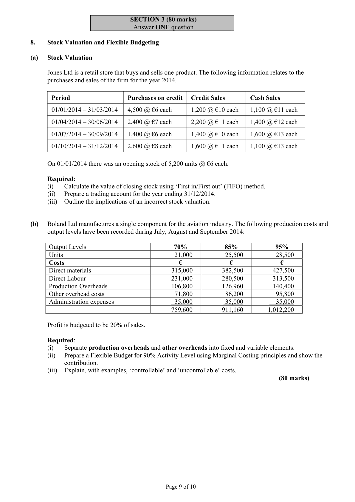
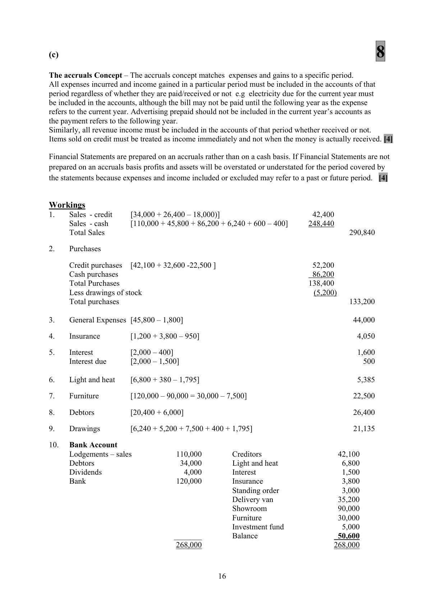

# Question

7.    Incomplete Records

    On 01/01/2014, A. Murphy purchased a business for €220,000 consisting of the following tangible
       assets and liabilities: Premises €180,000; Stock €17,000; Debtors €18,000; 3 months Premises
      Insurance prepaid €1,200; Trade Creditors €22,500; Wages due €1,800 and Cash €400.

     During 2014 Murphy did not keep a full set of accounts but was able to supply the following
      information on 31/12/2014.

     Cash Payments:        Lodgements €110,000, General Expenses €45,800, Purchases €86,200.

     Bank Payments:         Creditors €42,100, Light and Heat €6,800, Interest €1,500, annual
                             Premises Insurance Premium €3,800, Standing Order for Charitable
                              Organisation €3,000, Delivery Vans €35,200.

     Bank Lodgements:      Debtors €34,000, Cash €110,000, Dividends €4,000.

     Murphy took goods from stock to the value of €100 per week and cash €120 per week for household
      expenses during the year.

     Murphy borrowed €120,000 on 01/09/2014, part of which was used to purchase an adjoining
     showroom costing €90,000. The remainder of the loan was used to purchase furniture.  It was agreed
       that Murphy would pay interest on the last day of each month at a rate of 5% per annum. The capital
     sum was to be repaid in a lump sum in the year 2022 and to provide for this the bank was to transfer
      €1,250 on the last day of each month from Murphy’s business bank account into an investment fund
     commencing on 30/09/2014.

     Murphy estimated that 25% of the furniture, 20% of interest payable for the year and 25% of light and
       heat used should be attributed to the private section of the premises.

    On the 31/12/2014 goods with a sales value of €6,000 which had been sold on credit at a mark-up of
    20% on cost had not been recorded in the books. An invoice was issued to the debtor on the same date.
     The goods were still in the warehouse and were included in closing stock.

      Included in the assets and liabilities of the firm on 31/12/2014 were: Stock €16,200, Debtors €20,400,
      Trade Creditors €32,600, Cash €600, Electricity due €380 and €30 Interest earned by the fund to date.

     Required:

       (a)   Trading and Profit and Loss Account for the year ended 31/12/2014. (Show workings)         (52)
      (b)   Balance Sheet as at 31/12/2014. (Show workings)                                            (40)
       (c)   Explain the ‘Accruals Concept’ and why it is fundamental to Accounting practice.                 (8)

                                                                                         (100 marks)

                                               Page 8 of 10

<!-- PAGE 9 -->
# Page 9

<!-- HAS_VISUAL: true -->
<!-- VISUAL_REASON: page contains vector drawings; text contains visual keywords: line; page image extracted because text may not fully capture visual content -->

SECTION 3 (80 marks)
                              Answer ONE question

# Marking Scheme

7.    Depreciation - Buildings         [713,000 – 13,000] = 700,000 x 2%         14,000

Question 7
(a)                                    52
           Trading and Profit and Loss Account for the year ended 31/12/2014
                                                             €            €
   Sales            W 1                                       290,840    [9]
   Less Cost of sales
   Opening stock                                                 17,000  [3]
   Purchases (138,400 – 5,200)   W 2                         133,200  [7]
                                                              150,200
   Closing stock (16,200 – 5,000)                                    (11,200) [5]  (139,000)
   Gross Profit                                                               151,840
   Less Administration expenses
      General expenses      W 3                           44,000  [5]
      Donation                                                     3,000  [2]
      Insurance         W 4                            4,050  [7]
      Light and heat       W 6                            5,385  [7]   (56,435)
                                                                              95,405
   Less Interest         W 5                                             (1,600)   [2]
                                                                              93,805
  Add Income from Investment Fund                                            30    [2]
   Net Profit                                                                   93,835    [3]

(b)                                    40
                            Balance Sheet as at 31/12/2014
   Intangible Fixed Assets                       €           €           €
     Goodwill                                                                 27,700    [3]
   Tangible Fixed Assets
      Buildings                                                270,000  [2]
      Delivery Vans                                              35,200  [1]
      Furniture         W 7                           22,500  [2]   327,700
   Financial Assets
      Investment Fund                                                            5,030    [2]
                                                                            360,430
   Current Assets
      Stock                                        11,200  [1]
      Debtors          W 8             26,400  [3]
     Bank                                        50,600  [7]
     Cash                                       600  [1]
      Prepayments (Insurance)                       950  [2]    89,750
   Creditors: amounts falling due within 1 year
      Creditors                                    32,600  [1]
       Interest due        W 5              500  [2]
       Electricity due                                380  [1]   (33,480)       56,270
                                                                            416,700
   Financed By
   Creditors: amounts falling due after more than one year
     Loan                                                                  120,000    [2]
   Capital                                                     220,000  [2]
   Capital introduced                                               4,000  [3]
   Net Profit                                                     93,835
                                                              317,835
   Less Drawings        W 9                            (21,135) [5]   296,700
                                                                            416,700

                                           15

<!-- PAGE 18 -->
# Page 18

<!-- HAS_VISUAL: true -->
<!-- VISUAL_REASON: page contains vector drawings; page image extracted because text may not fully capture visual content -->

(c)                                     8

The accruals Concept – The accruals concept matches expenses and gains to a specific period.
All expenses incurred and income gained in a particular period must be included in the accounts of that
period regardless of whether they are paid/received or not e.g electricity due for the current year must
be included in the accounts, although the bill may not be paid until the following year as the expense
refers to the current year. Advertising prepaid should not be included in the current year’s accounts as
the payment refers to the following year.
Similarly, all revenue income must be included in the accounts of that period whether received or not.
Items sold on credit must be treated as income immediately and not when the money is actually received. [4]

Financial Statements are prepared on an accruals rather than on a cash basis. If Financial Statements are not
prepared on an accruals basis profits and assets will be overstated or understated for the period covered by
the statements because expenses and income included or excluded may refer to a past or future period.  [4]

Workings

7.    Furniture         [120,000 – 90,000 = 30,000 – 7,500]                             22,500

# Source References

Exam paper:
- file: intermediate_markdown/exam_papers/higher/accounting_higher_2015_paper_1_exam.md
- pages: [9]

Marking scheme:
- file: intermediate_markdown/marking_schemes/higher/accounting_higher_2015_paper_1_marking_scheme.md
- pages: [18]

# Notes

