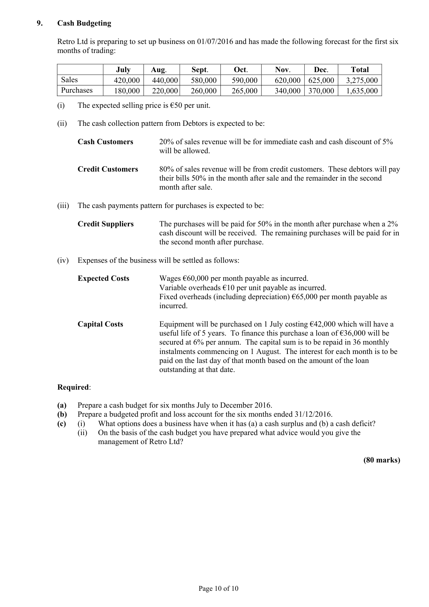
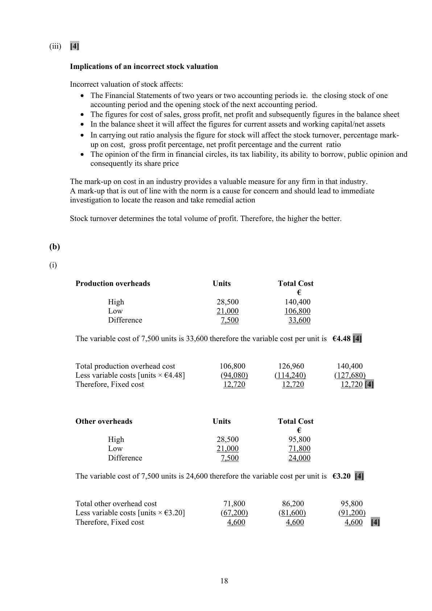
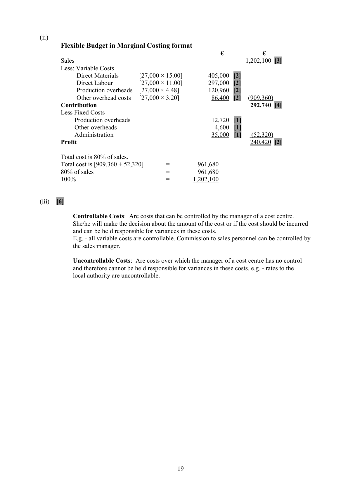
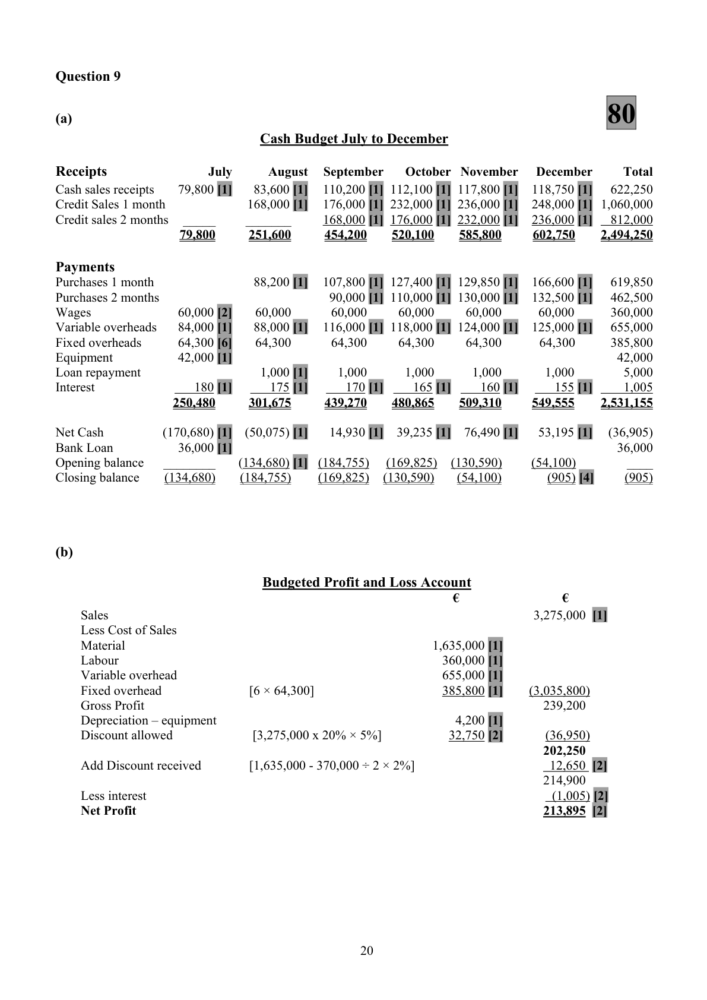

# Question

8.    Stock Valuation and Flexible Budgeting

(a)   Stock Valuation

      Jones Ltd is a retail store that buys and sells one product. The following information relates to the
      purchases and sales of the firm for the year 2014.

       Period                  Purchases on credit   Credit Sales       Cash Sales

       01/01/2014 – 31/03/2014   4,500 @ €6 each      1,200 @ €10 each    1,100 @ €11 each

       01/04/2014 – 30/06/2014   2,400 @ €7 each      2,200 @ €11 each    1,400 @ €12 each

       01/07/2014 – 30/09/2014   1,400 @ €6 each      1,400 @ €10 each    1,600 @ €13 each

       01/10/2014 – 31/12/2014   2,600 @ €8 each      1,600 @ €11 each    1,100 @ €13 each

    On 01/01/2014 there was an opening stock of 5,200 units @ €6 each.

     Required:
        (i)    Calculate the value of closing stock using ‘First in/First out’ (FIFO) method.
        (ii)   Prepare a trading account for the year ending 31/12/2014.
         (iii)   Outline the implications of an incorrect stock valuation.

(b)   Boland Ltd manufactures a single component for the aviation industry. The following production costs and
      output levels have been recorded during July, August and September 2014:

      Output Levels                    70%         85%         95%
       Units                                     21,000           25,500           28,500
      Costs                                   €              €              €
       Direct materials                          315,000          382,500          427,500
       Direct Labour                            231,000          280,500          313,500
      Production Overheads                     106,800          126,960          140,400
      Other overhead costs                       71,800           86,200           95,800
       Administration expenses                    35,000           35,000           35,000
                                              759,600          911,160        1,012,200

       Profit is budgeted to be 20% of sales.

     Required:
        (i)    Separate production overheads and other overheads into fixed and variable elements.
        (ii)   Prepare a Flexible Budget for 90% Activity Level using Marginal Costing principles and show the
             contribution.
         (iii)   Explain, with examples, ‘controllable’ and ‘uncontrollable’ costs.
                                                                                     (80 marks)

                                               Page 9 of 10

<!-- PAGE 10 -->
# Page 10

<!-- HAS_VISUAL: true -->
<!-- VISUAL_REASON: page contains vector drawings; page image extracted because text may not fully capture visual content -->

# Marking Scheme

8.    Depreciation - Delivery van        33,000 + 1,125 + 6,300
                                      37,500 + 2,925                          40,425

8.    Debtors          [20,400 + 6,000]                                               26,400

Question 8

                                      80
(a)  Stock Valuation

(i)        Purchases                 Unit Cost               Purchases at cost
             in units                                               €
             4,500                       €6                       27,000
             2,400                       €7                       16,800
             1,400                       €6                        8,400
             2,600                       €8                       20,800
            10,900                                                 73,000

     Credit Sales                Cash Sales                      Total Sales
     Units              €         Units              €           Units       €
     1,200 @  €10   12,000        1,100 @  €11  12,100          2,300     24,100
     2,200 @  €11   24,200        1,400 @  €12  16,800          3,600     41,000
     1,400 @  €10   14,000        1,600 @  €13  20,800          3,000     34,800
     1,600 @  €11   17,600        1,100 @  €13  14,300          2,700     31,900
     6,400            67,800        5,200            64,000        11,600    131,800

     Closing Stock in Units = Opening Stock 5,200 + Purchases 10,900 – Sales 11,600 = 4,500 units [7]

     Closing Stock Valuation:         Units                         €
                                       2,600   @     €8   =     20,800  [3]
                                       1,400   @     €6   =      8,400  [3]
                                    500   @     €7   =      3,500  [3]
                                       4,500                        32,700  [4]

(ii)   Trading Account for the year ended 31/12/2014

       Sales                                                            131,800 [3]
      Less Cost of sales
        Opening Stock                                    31,200 [2]
       Add Purchases                                    73,000 [3]
                                                        104,200
         Less Closing Stock                                  (32,700) [2]    (71,500)
      Gross Profit                                                        60,300 [4]

                                           17

<!-- PAGE 20 -->
# Page 20

<!-- HAS_VISUAL: true -->
<!-- VISUAL_REASON: page contains vector drawings; text contains visual keywords: circle, figure, line; page image extracted because text may not fully capture visual content -->

(iii)   [4]

      Implications of an incorrect stock valuation

      Incorrect valuation of stock affects:
        •  The Financial Statements of two years or two accounting periods ie. the closing stock of one
            accounting period and the opening stock of the next accounting period.
        •  The figures for cost of sales, gross profit, net profit and subsequently figures in the balance sheet
        •  In the balance sheet it will affect the figures for current assets and working capital/net assets
        •  In carrying out ratio analysis the figure for stock will affect the stock turnover, percentage mark-
          up on cost, gross profit percentage, net profit percentage and the current ratio
        •  The opinion of the firm in financial circles, its tax liability, its ability to borrow, public opinion and
            consequently its share price

     The mark-up on cost in an industry provides a valuable measure for any firm in that industry.
    A mark-up that is out of line with the norm is a cause for concern and should lead to immediate
      investigation to locate the reason and take remedial action

      Stock turnover determines the total volume of profit. Therefore, the higher the better.

(b)

(i)

       Production overheads                 Units             Total Cost
                                                              €
               High                         28,500            140,400
            Low                          21,000            106,800
                 Difference                      7,500              33,600

      The variable cost of 7,500 units is 33,600 therefore the variable cost per unit is  €4.48 [4]

        Total production overhead cost            106,800         126,960         140,400
       Less variable costs [units × €4.48]           (94,080)        (114,240)        (127,680)
        Therefore, Fixed cost                      12,720          12,720          12,720 [4]

      Other overheads                      Units             Total Cost
                                                              €
               High                         28,500              95,800
            Low                          21,000              71,800
                 Difference                      7,500              24,000

      The variable cost of 7,500 units is 24,600 therefore the variable cost per unit is  €3.20 [4]

        Total other overhead cost                  71,800          86,200          95,800
       Less variable costs [units × €3.20]           (67,200)         (81,600)          (91,200)
        Therefore, Fixed cost                       4,600           4,600           4,600   [4]

                                           18

<!-- PAGE 21 -->
# Page 21

<!-- HAS_VISUAL: true -->
<!-- VISUAL_REASON: page contains vector drawings; page image extracted because text may not fully capture visual content -->

(ii)
       Flexible Budget in Marginal Costing format
                                                        €            €
        Sales                                                            1,202,100 [3]
        Less: Variable Costs
              Direct Materials       [27,000 × 15.00]         405,000  [2]
              Direct Labour         [27,000 × 11.00]         297,000  [2]
             Production overheads  [27,000 × 4.48]          120,960  [2]
             Other overhead costs   [27,000 × 3.20]           86,400  [2]   (909,360)
       Contribution                                                   292,740 [4]
       Less Fixed Costs
            Production overheads                            12,720  [1]
            Other overheads                                  4,600  [1]
             Administration                                 35,000  [1]    (52,320)
        Profit                                                          240,420 [2]

        Total cost is 80% of sales.
        Total cost is [909,360 + 52,320]      =         961,680
     80% of sales                    =         961,680
      100%                         =        1,202,100

(iii)   [6]

           Controllable Costs: Are costs that can be controlled by the manager of a cost centre.
           She/he will make the decision about the amount of the cost or if the cost should be incurred
           and can be held responsible for variances in these costs.
             E.g. - all variable costs are controllable. Commission to sales personnel can be controlled by
             the sales manager.

           Uncontrollable Costs: Are costs over which the manager of a cost centre has no control
           and therefore cannot be held responsible for variances in these costs. e.g. - rates to the
             local authority are uncontrollable.

                                           19

<!-- PAGE 22 -->
# Page 22

<!-- HAS_VISUAL: true -->
<!-- VISUAL_REASON: page contains vector drawings; page image extracted because text may not fully capture visual content -->

# Source References

Exam paper:
- file: intermediate_markdown/exam_papers/higher/accounting_higher_2015_paper_1_exam.md
- pages: [10]

Marking scheme:
- file: intermediate_markdown/marking_schemes/higher/accounting_higher_2015_paper_1_marking_scheme.md
- pages: [20, 21, 22]

# Notes

