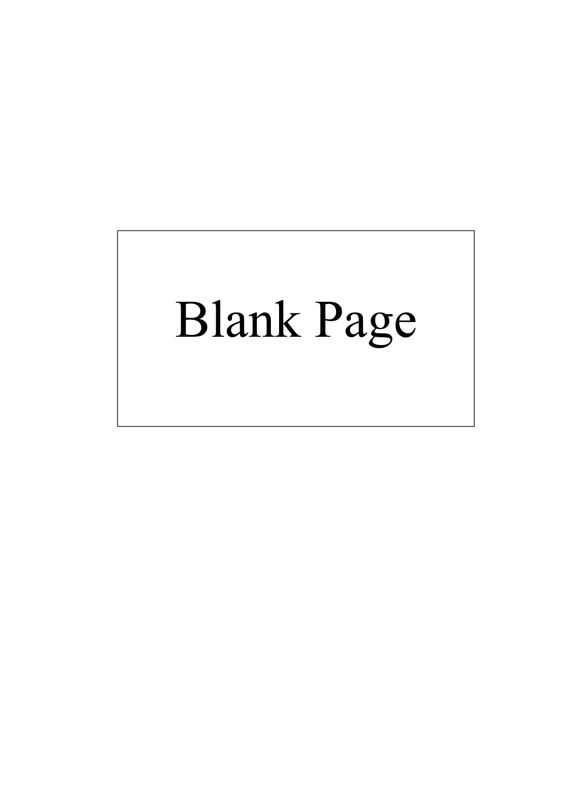
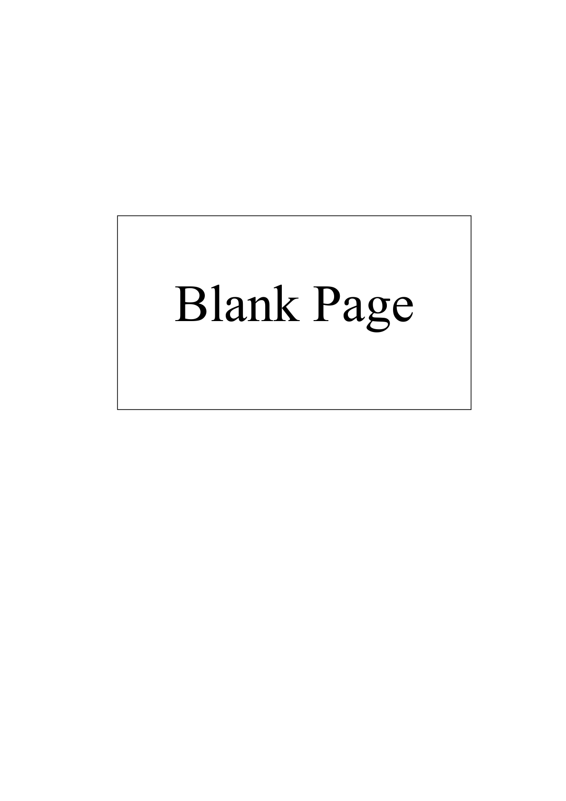
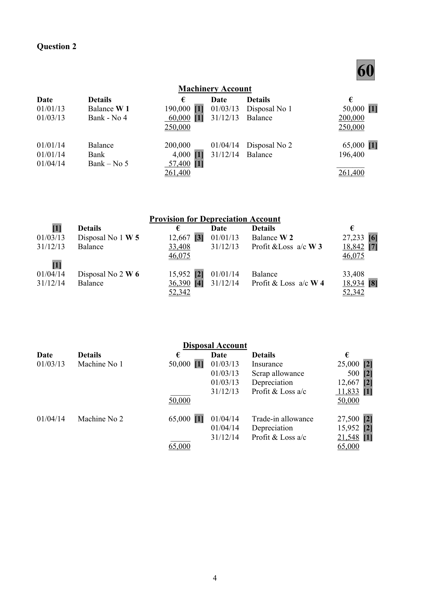
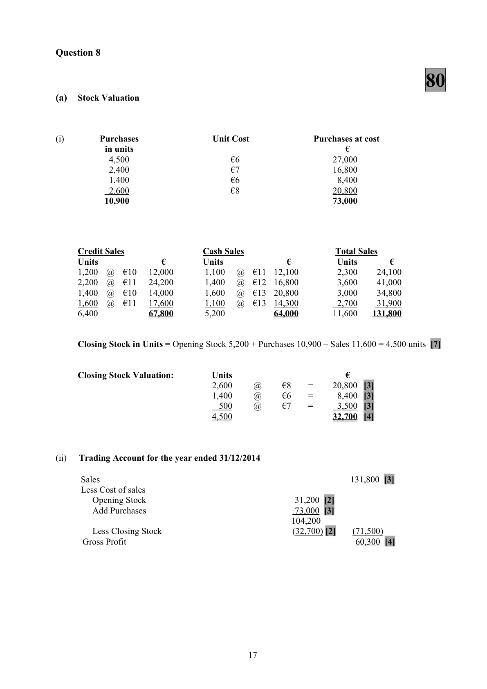
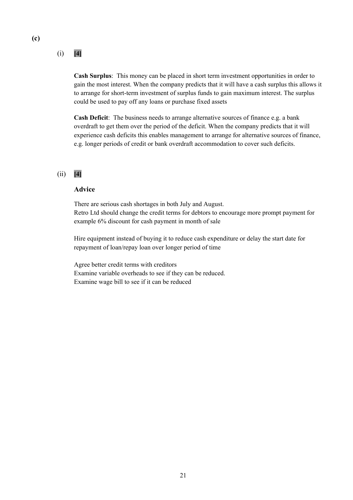

# Question

9.   Cash Budgeting

      Retro Ltd is preparing to set up business on 01/07/2016 and has made the following forecast for the first six
     months of trading:

                      July     Aug.       Sept.       Oct.       Nov.      Dec.      Total
       Sales          420,000   440,000    580,000    590,000     620,000  625,000   3,275,000
       Purchases      180,000   220,000    260,000    265,000     340,000  370,000   1,635,000

        (i)   The expected selling price is €50 per unit.

        (ii)   The cash collection pattern from Debtors is expected to be:

          Cash Customers     20% of sales revenue will be for immediate cash and cash discount of 5%
                                        will be allowed.

           Credit Customers    80% of sales revenue will be from credit customers. These debtors will pay
                                          their bills 50% in the month after sale and the remainder in the second
                              month after sale.

         (iii)  The cash payments pattern for purchases is expected to be:

           Credit Suppliers      The purchases will be paid for 50% in the month after purchase when a 2%
                                   cash discount will be received. The remaining purchases will be paid for in
                                      the second month after purchase.

       (iv)  Expenses of the business will be settled as follows:

          Expected Costs       Wages €60,000 per month payable as incurred.
                                    Variable overheads €10 per unit payable as incurred.
                                  Fixed overheads (including depreciation) €65,000 per month payable as
                                       incurred.

           Capital Costs         Equipment will be purchased on 1 July costing €42,000 which will have a
                                      useful life of 5 years. To finance this purchase a loan of €36,000 will be
                                   secured at 6% per annum. The capital sum is to be repaid in 36 monthly
                                     instalments commencing on 1 August. The interest for each month is to be
                                    paid on the last day of that month based on the amount of the loan
                                    outstanding at that date.

     Required:

       (a)   Prepare a cash budget for six months July to December 2016.
      (b)   Prepare a budgeted profit and loss account for the six months ended 31/12/2016.
       (c)     (i)   What options does a business have when it has (a) a cash surplus and (b) a cash deficit?
                 (ii)  On the basis of the cash budget you have prepared what advice would you give the
               management of Retro Ltd?

                                                                                             (80 marks)

                                              Page 10 of 10

<!-- PAGE 11 -->
# Page 11

<!-- HAS_VISUAL: true -->
<!-- VISUAL_REASON: page contains vector drawings; text extraction is sparse relative to visible page content; page image extracted because text may not fully capture visual content -->

<!-- EXTRACTION_ISSUE: very sparse extracted text -->

Blank Page

<!-- PAGE 12 -->
# Page 12

<!-- HAS_VISUAL: true -->
<!-- VISUAL_REASON: page contains vector drawings; text extraction is sparse relative to visible page content; page image extracted because text may not fully capture visual content -->

<!-- EXTRACTION_ISSUE: very sparse extracted text -->

Blank Page

# Marking Scheme

9.    Loss on sale of van               30,000 – 8,000 – 13,500                    8,500

10.  Bad Debts a/c                     4,000 – 1,000                            3,000

11.   Reduction in Bad debts provision    4,000 – 3,792                           208 (cr)

12.   Sales Commission               595,000 × 3%     =        17,850
                                    295,000 × 5%     =        14,750       32,600

13.   Debenture interest               400,000 × 8%                            32,000
      Debenture interest due            32,000 – 16,200 + 200                    16,000 (due)

14.   Delivery vans at cost            250,000 + 56,000 – 30,000                276,000

15.   Provision for Dep – vans          80,000 + 40,425 – 13,500                106,925

16.   Debtors                         99,200 – 4,000 – 400                     94,800

17.  VAT                             5,000 – 13,000                           8,000 Current Asset

18.   Bank Overdraft                  50,000 – 1,750 – 1,000                   47,250
     Bank Overdraft                  46,690 + 560                            47,250

Penalties:    One mark each for the omission of two headings in the Profit & Loss Account and
               Authorised Capital in the Balance Sheet [3 x 1 mark].

                                            3

<!-- PAGE 6 -->
# Page 6

<!-- HAS_VISUAL: true -->
<!-- VISUAL_REASON: page contains vector drawings; page image extracted because text may not fully capture visual content -->

9.    Drawings         [6,240 + 5,200 + 7,500 + 400 + 1,795]                            21,135

10.  Bank Account
     Lodgements – sales            110,000         Creditors                     42,100
      Debtors                        34,000         Light and heat                  6,800
      Dividends                       4,000          Interest                        1,500
     Bank                         120,000         Insurance                      3,800
                                                    Standing order                  3,000
                                                     Delivery van                  35,200
                                          Showroom                    90,000
                                                        Furniture                     30,000
                                                    Investment fund                5,000
                                _______        Balance                      50,600
                                   268,000                                    268,000

                                           16

<!-- PAGE 19 -->
# Page 19

<!-- HAS_VISUAL: true -->
<!-- VISUAL_REASON: page contains vector drawings; page image extracted because text may not fully capture visual content -->

Question 9
(a)                                      80
                          Cash Budget July to December

Receipts                 July     August  September   October November   December     Total
Cash sales receipts    79,800 [1]    83,600 [1]  110,200 [1] 112,100 [1] 117,800 [1]  118,750 [1]   622,250
Credit Sales 1 month             168,000 [1]  176,000 [1] 232,000 [1] 236,000 [1]  248,000 [1] 1,060,000
Credit sales 2 months  _____     _______     168,000 [1] 176,000 [1] 232,000 [1]  236,000 [1]   812,000
                     79,800     251,600     454,200    520,100    585,800     602,750    2,494,250

Payments
Purchases 1 month                 88,200 [1]  107,800 [1] 127,400 [1] 129,850 [1]  166,600 [1]   619,850
Purchases 2 months                            90,000 [1] 110,000 [1] 130,000 [1]  132,500 [1]   462,500
Wages               60,000 [2]    60,000       60,000     60,000     60,000      60,000      360,000
Variable overheads    84,000 [1]    88,000 [1]  116,000 [1] 118,000 [1] 124,000 [1]  125,000 [1]   655,000
Fixed overheads      64,300 [6]    64,300       64,300     64,300     64,300      64,300      385,800
Equipment           42,000 [1]                                                                42,000
Loan repayment                    1,000 [1]     1,000      1,000      1,000       1,000        5,000
Interest               180 [1]      175 [1]      170 [1]    165 [1]    160 [1]      155 [1]     1,005
                   250,480     301,675     439,270    480,865    509,310     549,555     2,531,155

Net Cash          (170,680) [1]  (50,075) [1]    14,930 [1]  39,235 [1]  76,490 [1]   53,195 [1]   (36,905)
Bank Loan           36,000 [1]                                                                36,000
Opening balance   ________    (134,680) [1]  (184,755)   (169,825)  (130,590)     (54,100)        ____
Closing balance    (134,680)    (184,755)     (169,825)  (130,590)    (54,100)        (905) [4]     (905)

(b)

                             Budgeted Profit and Loss Account
                                                             €                €
     Sales                                                                         3,275,000 [1]
    Less Cost of Sales
     Material                                                     1,635,000 [1]
    Labour                                                     360,000 [1]
    Variable overhead                                            655,000 [1]
    Fixed overhead                [6 × 64,300]                     385,800 [1]     (3,035,800)
    Gross Profit                                                                  239,200
    Depreciation – equipment                                         4,200 [1]
    Discount allowed              [3,275,000 x 20% × 5%]           32,750 [2]        (36,950)
                                                                                202,250
   Add Discount received        [1,635,000 - 370,000 ÷ 2 × 2%]                       12,650 [2]
                                                                                214,900
    Less interest                                                                           (1,005) [2]
    Net Profit                                                                   213,895 [2]

                                               20

<!-- PAGE 23 -->
# Page 23

<!-- HAS_VISUAL: true -->
<!-- VISUAL_REASON: page contains vector drawings; page image extracted because text may not fully capture visual content -->

(c)

           (i)    [4]

            Cash Surplus: This money can be placed in short term investment opportunities in order to
               gain the most interest. When the company predicts that it will have a cash surplus this allows it
                 to arrange for short-term investment of surplus funds to gain maximum interest. The surplus
               could be used to pay off any loans or purchase fixed assets

            Cash Deficit: The business needs to arrange alternative sources of finance e.g. a bank
                overdraft to get them over the period of the deficit. When the company predicts that it will
               experience cash deficits this enables management to arrange for alternative sources of finance,
                  e.g. longer periods of credit or bank overdraft accommodation to cover such deficits.

            (ii)   [4]

            Advice

              There are serious cash shortages in both July and August.
               Retro Ltd should change the credit terms for debtors to encourage more prompt payment for
             example 6% discount for cash payment in month of sale

               Hire equipment instead of buying it to reduce cash expenditure or delay the start date for
              repayment of loan/repay loan over longer period of time

             Agree better credit terms with creditors
             Examine variable overheads to see if they can be reduced.
             Examine wage bill to see if it can be reduced

                                             21

<!-- PAGE 24 -->
# Page 24

<!-- EXTRACTION_ISSUE: no extractable text found -->

[No extractable text found]

<!-- PAGE 25 -->
# Page 25

<!-- EXTRACTION_ISSUE: no extractable text found -->

[No extractable text found]

<!-- PAGE 26 -->
# Page 26

<!-- EXTRACTION_ISSUE: no extractable text found -->

[No extractable text found]

<!-- PAGE 27 -->
# Page 27

<!-- EXTRACTION_ISSUE: no extractable text found -->

[No extractable text found]

<!-- PAGE 28 -->
# Page 28

<!-- HAS_VISUAL: true -->
<!-- VISUAL_REASON: page contains vector drawings; text extraction is sparse relative to visible page content; page image extracted because text may not fully capture visual content -->

<!-- EXTRACTION_ISSUE: no extractable text found -->

[No extractable text found]

# Source References

Exam paper:
- file: intermediate_markdown/exam_papers/higher/accounting_higher_2015_paper_1_exam.md
- pages: [11, 12]

Marking scheme:
- file: intermediate_markdown/marking_schemes/higher/accounting_higher_2015_paper_1_marking_scheme.md
- pages: [6, 19, 23, 24, 25, 26, 27, 28]

# Notes

