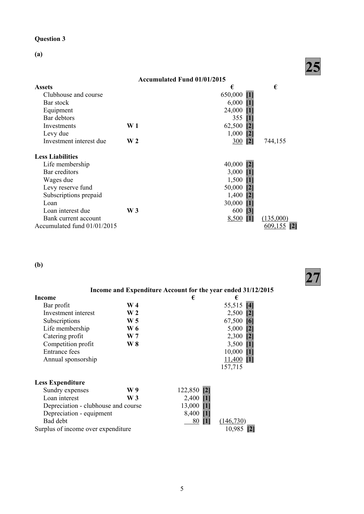

# Question

2. Rent of €5,100 for six months ending 30/04/2016 was paid directly into the firm’s bank account.

# Marking Scheme

2.    Factory wages                         220,000 + 5,500 - 12,300                 213,200

Question 2

(a)
                                     22
                           Adjusted Debtors Control Account
                                 €                                            €
      Balance b/d                 27,000 [1]     Balance b/d                        650 [1]
       Interest            (ii)              6 [5]     Discount allowed       (i)            330 [5]
      Sales returns   (vi)             15 [5]     Contra                 (iv)            280 [4]
      Balance c/d                   650 [1]     Balance c/d                       26,411
                                 27,671                                          27,671
      Balance b/d                 26,411        Balance b/d                        650

(b)
                                     30
     Schedule of Debtors Accounts Balances                    €         €
      Balance as per list of debtors                                          25,396 [3]
    Add
         Sales – cash and credit   (iii)                                         2,200 [4]
                                                                         27,596
     Deduct
         Discount allowed            (i)                         120 [5]
          Interest                        (ii)                          30 [5]
         Contra                     (iv)                         550 [4]
          Bills receivable           (v)                           1,120 [4]
         Sales returns              (vi)                          15 [4]     (1,835)
     Net balance as per adjusted control account                             25,761 [1]

(c)
                                      8
(i)  Why debtors control accounts should be prepared.

       1. They act as a check on the accuracy of the ledgers by comparing the balance of the control account
         with the total as per the schedule.
       2. They locate errors quickly and narrow searching for errors to confined areas.
       3. They are useful when a firm needs to find credit sales from incomplete records.
       4. They allow amounts owed by debtors to be ascertained quickly by simply balancing the control
         accounts.

(ii)   Limitations of control accounts

       1. Control accounts do not identify which ledger account may contain an error.
       2. Some types of errors are not revealed by the control account such as errors of commission, errors of
         omission, compensating errors, and errors of original entry.

                                           4

<!-- PAGE 7 -->
# Page 7

<!-- HAS_VISUAL: true -->
<!-- VISUAL_REASON: page contains vector drawings; page image extracted because text may not fully capture visual content -->

2.    Investment interest
         2,400 - 300 + 400           =                                   2,500

2.   Equipment less drawings 30% [16,000 - 4,800]                         11,200

2.    Operating Profit [5]
      Operating profit is arrived at after charging:
      Depreciation on tangible assets                             72,000
      Patent amortised                                         11,000
      Directors’ remuneration                                   26,000
      Auditors’ fees                                           18,000

2.     Distribution costs          121,000 + 58,000                            =     179,000

# Source References

Exam paper:
- file: intermediate_markdown/exam_papers/higher/accounting_higher_2016_paper_1_exam.md
- pages: []

Marking scheme:
- file: intermediate_markdown/marking_schemes/higher/accounting_higher_2016_paper_1_marking_scheme.md
- pages: [7]

# Notes

