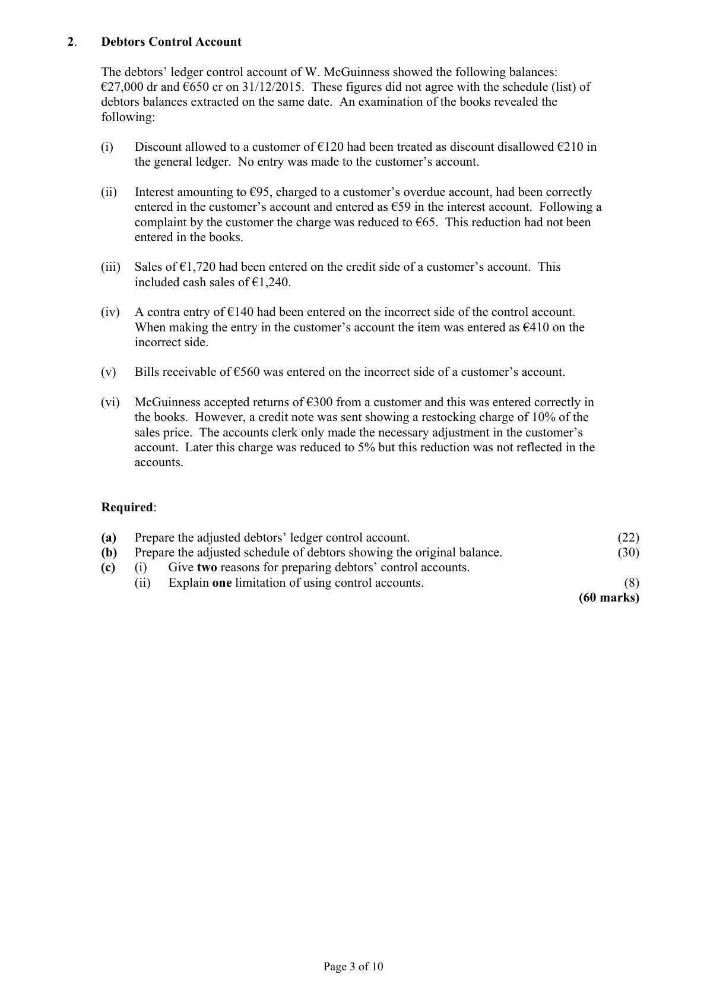
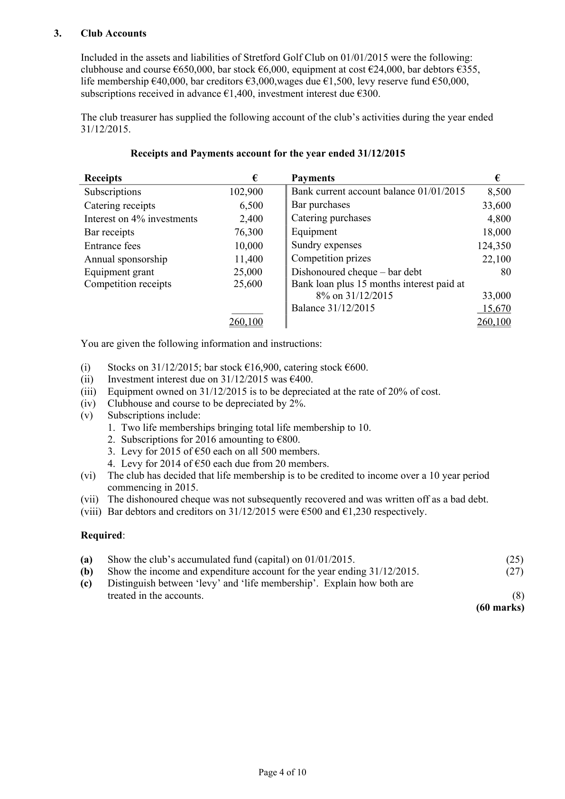
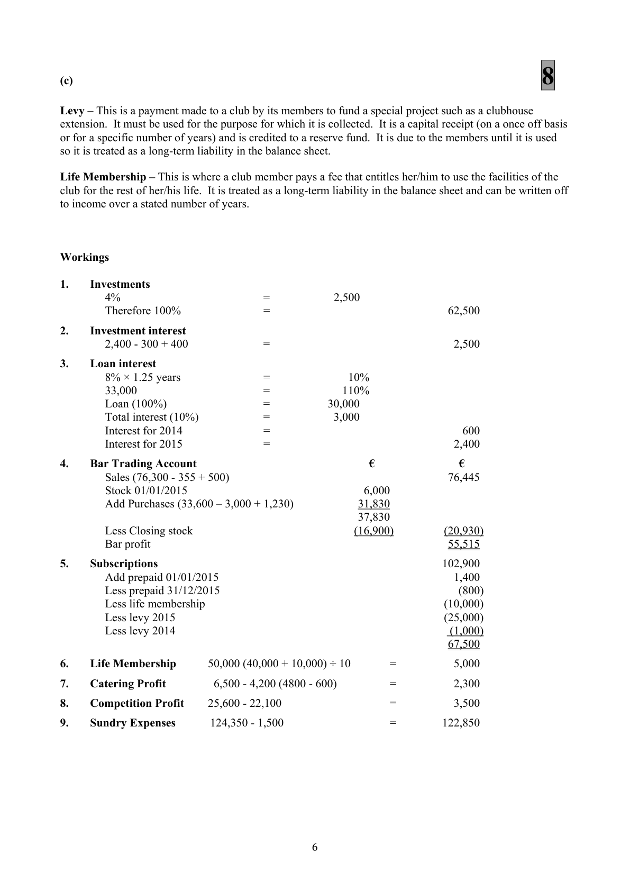

# Question

3. A cheque of €2,000 issued to a supplier had not been presented for payment.
        (vii)  During 2015 Ryan Ltd built an extension to the warehouse. The work was carried out by the company’s
          own employees. The cost of their labour €12,000 is included in factory wages. The materials, costing
             €28,000, were taken from stocks. No entry had been made in the books in respect of this extension.
        (viii)  Provide for a recent wage increase of 5% which has been backdated to cover the six months from 01/07/2015.
        (ix)   Provision should be made for the following:
                   1. Investment income due and debenture interest due.
                   2. The creation of a provision for bad debts equal to 4% of debtors.
      Required:
       (a)    Prepare a Manufacturing, Trading and Profit and Loss Account for the year ended 31/12/2015.       (75)
       (b)    Prepare a Balance Sheet as at 31/12/2015.                                                          (45)
                                                                                              (120 marks)

                                            Page 2 of 10

<!-- PAGE 3 -->
# Page 3

<!-- HAS_VISUAL: true -->
<!-- VISUAL_REASON: text contains visual keywords: figure; page image extracted because text may not fully capture visual content -->

2.    Debtors Control Account

     The debtors’ ledger control account of W. McGuinness showed the following balances:
      €27,000 dr and €650 cr on 31/12/2015. These figures did not agree with the schedule (list) of
      debtors balances extracted on the same date. An examination of the books revealed the
      following:

        (i)    Discount allowed to a customer of €120 had been treated as discount disallowed €210 in
             the general ledger. No entry was made to the customer’s account.

        (ii)    Interest amounting to €95, charged to a customer’s overdue account, had been correctly
            entered in the customer’s account and entered as €59 in the interest account. Following a
            complaint by the customer the charge was reduced to €65. This reduction had not been
            entered in the books.

         (iii)   Sales of €1,720 had been entered on the credit side of a customer’s account. This
            included cash sales of €1,240.

       (iv)  A contra entry of €140 had been entered on the incorrect side of the control account.
         When making the entry in the customer’s account the item was entered as €410 on the
             incorrect side.

       (v)    Bills receivable of €560 was entered on the incorrect side of a customer’s account.

       (vi)  McGuinness accepted returns of €300 from a customer and this was entered correctly in
             the books. However, a credit note was sent showing a restocking charge of 10% of the
             sales price. The accounts clerk only made the necessary adjustment in the customer’s
            account. Later this charge was reduced to 5% but this reduction was not reflected in the
            accounts.

     Required:

       (a)   Prepare the adjusted debtors’ ledger control account.                                      (22)
      (b)   Prepare the adjusted schedule of debtors showing the original balance.                     (30)
       (c)     (i)   Give two reasons for preparing debtors’ control accounts.
                 (ii)   Explain one limitation of using control accounts.                                       (8)
                                                                                        (60 marks)

                                            Page 3 of 10

<!-- PAGE 4 -->
# Page 4

<!-- HAS_VISUAL: true -->
<!-- VISUAL_REASON: page contains vector drawings; page image extracted because text may not fully capture visual content -->

3.   Club Accounts

      Included in the assets and liabilities of Stretford Golf Club on 01/01/2015 were the following:
      clubhouse and course €650,000, bar stock €6,000, equipment at cost €24,000, bar debtors €355,
        life membership €40,000, bar creditors €3,000,wages due €1,500, levy reserve fund €50,000,
      subscriptions received in advance €1,400, investment interest due €300.

     The club treasurer has supplied the following account of the club’s activities during the year ended
      31/12/2015.

                Receipts and Payments account for the year ended 31/12/2015

      Receipts                         €      Payments                               €
       Subscriptions                  102,900     Bank current account balance 01/01/2015     8,500
       Catering receipts                  6,500      Bar purchases                            33,600
        Interest on 4% investments         2,400      Catering purchases                         4,800
      Bar receipts                     76,300      Equipment                              18,000
       Entrance fees                    10,000      Sundry expenses                        124,350
      Annual sponsorship              11,400      Competition prizes                       22,100
      Equipment grant                 25,000      Dishonoured cheque – bar debt               80
      Competition receipts             25,600     Bank loan plus 15 months interest paid at
                                      8% on 31/12/2015                   33,000
                                  ______      Balance 31/12/2015                      15,670
                                    260,100                                            260,100

    You are given the following information and instructions:

        (i)    Stocks on 31/12/2015; bar stock €16,900, catering stock €600.
        (ii)   Investment interest due on 31/12/2015 was €400.
         (iii)  Equipment owned on 31/12/2015 is to be depreciated at the rate of 20% of cost.
       (iv)  Clubhouse and course to be depreciated by 2%.
       (v)   Subscriptions include:
              1. Two life memberships bringing total life membership to 10.
              2. Subscriptions for 2016 amounting to €800.
              3. Levy for 2015 of €50 each on all 500 members.

# Marking Scheme

3.    General factory overheads               86,400 + 10,000 - 1,200                   95,200

Question 3

(a)
                                     25
                              Accumulated Fund 01/01/2015
Assets                                                     €            €
   Clubhouse and course                                      650,000 [1]
   Bar stock                                                    6,000 [1]
   Equipment                                                 24,000 [1]
   Bar debtors                                               355 [1]
   Investments        W 1                            62,500 [2]
   Levy due                                                     1,000 [2]
   Investment interest due   W 2                            300 [2]   744,155

Less Liabilities
   Life membership                                            40,000 [2]
   Bar creditors                                                 3,000 [1]
  Wages due                                                   1,500 [1]
   Levy reserve fund                                           50,000 [2]
   Subscriptions prepaid                                          1,400 [2]
   Loan                                                      30,000 [1]
   Loan interest due     W 3                            600 [3]
  Bank current account                                          8,500 [1]   (135,000)
Accumulated fund 01/01/2015                                               609,155 [2]

(b)
                                     27
                Income and Expenditure Account for the year ended 31/12/2015
Income                                        €            €
   Bar profit         W 4                            55,515 [4]
   Investment interest     W 2                             2,500 [2]
   Subscriptions       W 5                            67,500 [6]
   Life membership      W 6                             5,000 [2]
   Catering profit       W 7                             2,300 [2]
   Competition profit     W 8                             3,500 [1]
   Entrance fees                                               10,000 [1]
   Annual sponsorship                                         11,400 [1]
                                                            157,715

Less Expenditure
   Sundry expenses      W 9            122,850 [2]
   Loan interest       W 3               2,400 [1]
   Depreciation - clubhouse and course             13,000 [1]
   Depreciation - equipment                        8,400 [1]
  Bad debt                                     80 [1]   (146,730)
Surplus of income over expenditure                               10,985 [2]

                                           5

<!-- PAGE 8 -->
# Page 8

<!-- HAS_VISUAL: true -->
<!-- VISUAL_REASON: page contains vector drawings; page image extracted because text may not fully capture visual content -->

(c)                                     8

Levy – This is a payment made to a club by its members to fund a special project such as a clubhouse
extension.  It must be used for the purpose for which it is collected.  It is a capital receipt (on a once off basis
or for a specific number of years) and is credited to a reserve fund.  It is due to the members until it is used
so it is treated as a long-term liability in the balance sheet.

Life Membership – This is where a club member pays a fee that entitles her/him to use the facilities of the
club for the rest of her/his life.  It is treated as a long-term liability in the balance sheet and can be written off
to income over a stated number of years.

Workings

3.   Loan interest
      8% × 1.25 years             =           10%
        33,000                   =           110%
        Loan (100%)               =           30,000
         Total interest (10%)          =            3,000
          Interest for 2014            =                                 600
          Interest for 2015            =                                   2,400

3.                          Bank Account
                                   €                                 €
   Lodgement                      560,000         Business             490,000
   Loan                           350,000        Drawings               7,800
   Capital introduced                   4,200       Wages                94,000
   Cash lodgements                 145,000        Equipment             16,000
                                                     Purchases-premises    295,000
                                                     Investments            15,600
                                                     Light and heat           9,200
                                                              Interest                 3,500
                                                    Rates                 10,800
                                                    College fees             4,600
                               ________        Balance              112,700
                                  1,059,200                             1,059,200

3.    Dividends [2]
      Ordinary dividend
      Paid 6.96c per share                                      33,400

      Preference dividend
      Paid 8c per share                                           9,600

3.    Administrative expenses    203,000 + 18,000 + 26,000 + 8,250 + 14,000 + 60,000 =     329,250

# Source References

Exam paper:
- file: intermediate_markdown/exam_papers/higher/accounting_higher_2016_paper_1_exam.md
- pages: [3, 4]

Marking scheme:
- file: intermediate_markdown/marking_schemes/higher/accounting_higher_2016_paper_1_marking_scheme.md
- pages: [8]

# Notes

