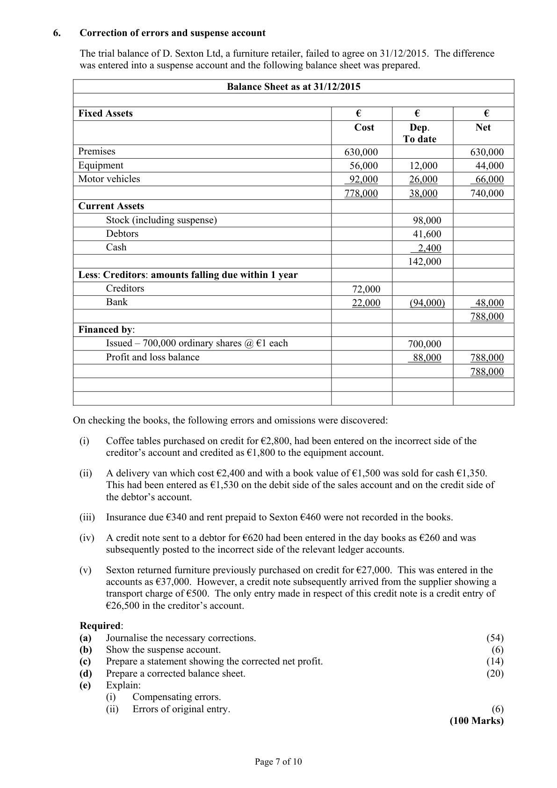
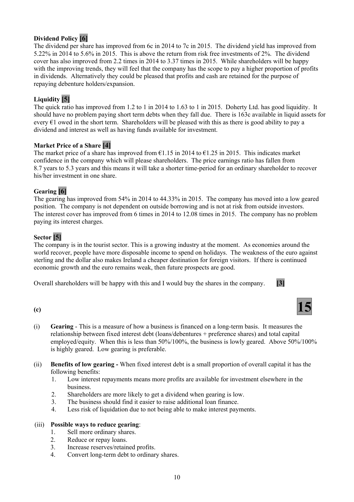
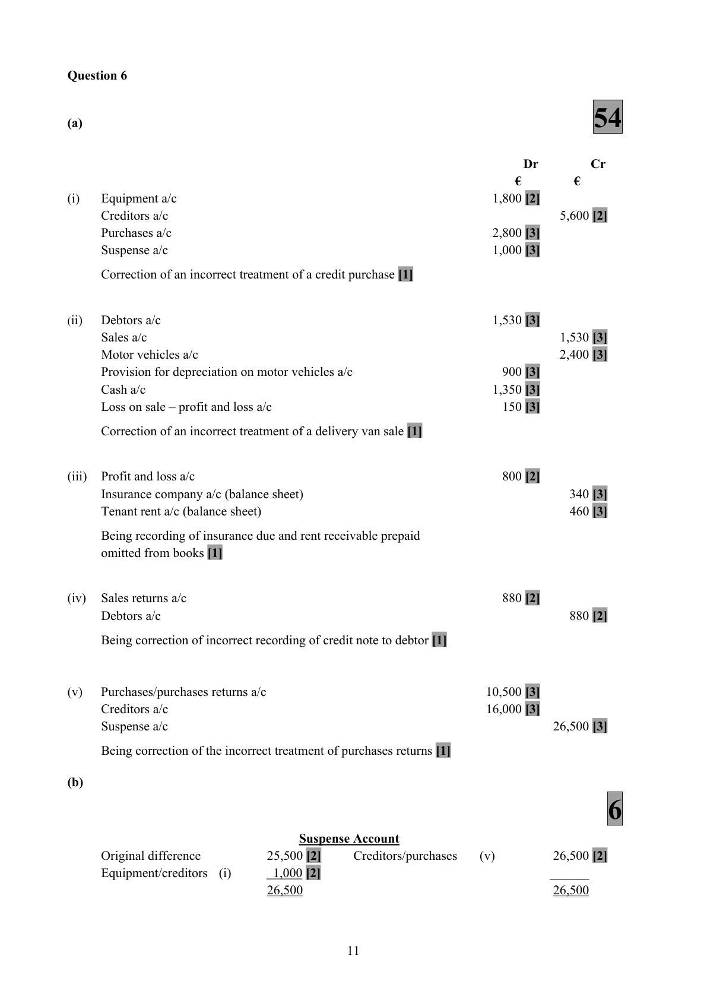
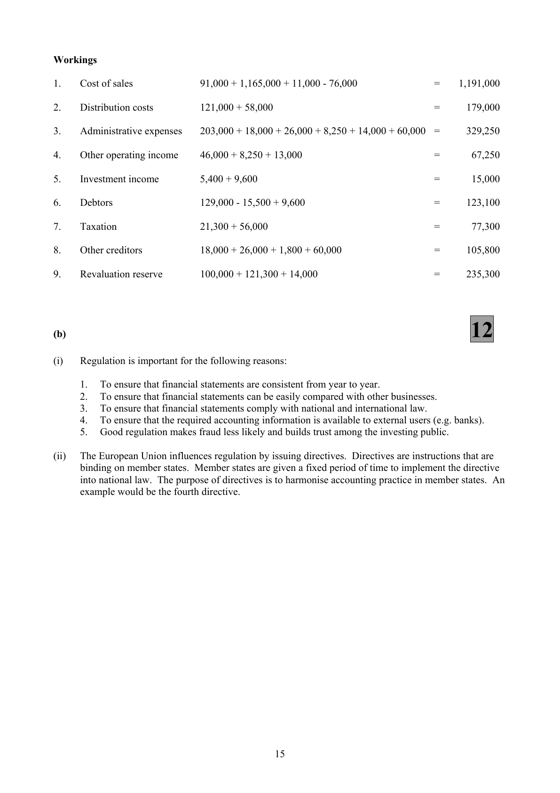

# Question

5.    Interpretation of Accounts

     The following figures have been extracted from the final accounts of Doherty Ltd, a service provider in
      the tourist industry, for the year ended 31/12/2015. The company has an authorised capital of €900,000
     made up of 600,000 ordinary shares at €1 each and 300,000 5% preference shares at €1 each.
      Doherty Ltd has already issued 500,000 ordinary shares and all of the 5% preference shares.

         Trading and Profit and Loss Account for year
        ended 31/12/2015                                        Ratios and information for year
                                        €         €        ended 31/12/2014
         Sales                                     980,000       Earnings per ordinary share       13.2c
        Opening stock                    55,000                  Dividend per ordinary share         6c
         Closing stock                    65,000                      Interest cover                6 times
         Costs of goods sold                          (752,000)      Quick ratio                        1.2:1
         Operating expenses for year                    (83,000)      Market value of one ord. share    €1.15
          Interest for year                               (12,000)      Return on capital employed     10.3%
        Net Profit for year                          133,000       Gearing                  54%
        Dividends paid                                (50,000)      Dividend cover               2.2 times
         Retained profit                               83,000       Dividend yield                 5.22 %
          Profit and loss balance 01/01/2015              45,000
          Profit and loss balance 31/12/2015            128,000

                                      Balance Sheet as at 31/12/2015
                                                                      €              €
        Fixed Assets                                                                    856,000
        Investments (market value 31/12/2015 €200,000)                                     150,000
                                                                                         1,006,000
       Current Assets (including stock €65,000 and debtors €95,000)         212,000
        Less Creditors: amounts falling due within 1 year
        Trade creditors                                                        (90,000)       122,000
                                                                                         1,128,000
       Financed by:
     6% Debentures (2017 Secured)                                                    200,000
        Capital and Reserves
        Ordinary shares @ €1 each                                         500,000
     5% Preference shares @ €1 each                                    300,000
         Profit and loss balance                                             128,000        928,000
                                                                                         1,128,000

       Market value of one ordinary share on 31/12/2015 is €1.25

     You are required to calculate the following for 2015: (where appropriate calculations should be
      made to two decimal places).

        (a)    (i)   Cash purchases if the period of credit received from trade creditors is 2 months.
                   (ii)   Dividend yield.
                   (iii)   Price earnings ratio
                (iv)  Return on capital employed.
               (v)   Dividend cover.                                                                      (50)

        (b)  Would you as a shareholder be prepared to purchase more shares in Doherty Ltd? Use relevant
                ratios and other information to support your answer.                                          (35)

         (c)     (i)    Explain the term ‘Gearing’.
                   (ii)   What are the benefits to a business of having a low gearing?
                   (iii)   State two ways to reduce the gearing of a company.                                    (15)
                                                                                         (100 marks)

                                              Page 6 of 10

<!-- PAGE 7 -->
# Page 7

<!-- HAS_VISUAL: true -->
<!-- VISUAL_REASON: page contains vector drawings; text contains visual keywords: table; page image extracted because text may not fully capture visual content -->

# Marking Scheme

5.    Loss on sale of machine                  18,000 - 9,450 - 3,600                     4,950

5.    Subscriptions                                                     102,900
       Add prepaid 01/01/2015                                             1,400
        Less prepaid 31/12/2015                                               (800)
        Less life membership                                                (10,000)
        Less levy 2015                                                      (25,000)
        Less levy 2014                                                         (1,000)
                                                                         67,500

5.    Interest - amount paid                                                 3,500
    Add interest due                                                       1,750
                                                                           5,250
      Less drawings                                                            (1,575)

Question 5

(a)
                                     50
(i)   Cash Purchases      =      total purchases less credit purchases

         Total purchases     =     cost of sales + closing stock - opening stock

         Total purchases     =    752,000 + 65,000 - 55,000

         Total purchases     =    762,000

         Credit purchases    =    90,000 × 12             =   540,000
                                    2

        Cash purchases     =    762,000 - 540,000          =              222,000  [12]

(ii)   Dividend Yield

        Dividend per share × 100      =    7 × 100            =         5.6%  [10]
            Market price                     125

(iii)  Price earnings ratio

        Market price                =     125               =          5.3 to 1
         EPS                               23.6                              5.3 years  [10]

(iv)  Return on Capital Employed

         Operating profit × 100         =    145,000 × 100        =       12.85%   [9]
            Capital employed                    1,128,000

(v)   Dividend Cover

        Net profit  - preference dividend  =    133,000 - 15,000      =       3.37 times   [9]
              Ordinary dividend                  35,000

(b)
                                     35
Profitability [6]
The ROCE has improved from 10.3% in 2014 to 12.85% in 2015. Doherty Ltd is a profitable company. The
return is well above the return from risk free investments of 2%. The return is also above the company’s
cost of borrowing of 6%. The company is making efficient use of its resources.
Shareholders will be pleased with this.  If this upward trend continues the debentures can be paid in 2017
without having to sell the secured assets.

                                           9

<!-- PAGE 12 -->
# Page 12

<!-- HAS_VISUAL: true -->
<!-- VISUAL_REASON: page contains vector drawings; page image extracted because text may not fully capture visual content -->

Dividend Policy [6]
The dividend per share has improved from 6c in 2014 to 7c in 2015. The dividend yield has improved from
5.22% in 2014 to 5.6% in 2015. This is above the return from risk free investments of 2%. The dividend
cover has also improved from 2.2 times in 2014 to 3.37 times in 2015. While shareholders will be happy
with the improving trends, they will feel that the company has the scope to pay a higher proportion of profits
in dividends. Alternatively they could be pleased that profits and cash are retained for the purpose of
repaying debenture holders/expansion.

Liquidity [5]
The quick ratio has improved from 1.2 to 1 in 2014 to 1.63 to 1 in 2015. Doherty Ltd. has good liquidity.  It
should have no problem paying short term debts when they fall due. There is 163c available in liquid assets for
every €1 owed in the short term. Shareholders will be pleased with this as there is good ability to pay a
dividend and interest as well as having funds available for investment.

Market Price of a Share [4]
The market price of a share has improved from €1.15 in 2014 to €1.25 in 2015. This indicates market
confidence in the company which will please shareholders. The price earnings ratio has fallen from
8.7 years to 5.3 years and this means it will take a shorter time-period for an ordinary shareholder to recover
his/her investment in one share.

Gearing [6]
The gearing has improved from 54% in 2014 to 44.33% in 2015. The company has moved into a low geared
position. The company is not dependent on outside borrowing and is not at risk from outside investors.
The interest cover has improved from 6 times in 2014 to 12.08 times in 2015. The company has no problem
paying its interest charges.

Sector [5]
The company is in the tourist sector. This is a growing industry at the moment. As economies around the
world recover, people have more disposable income to spend on holidays. The weakness of the euro against
sterling and the dollar also makes Ireland a cheaper destination for foreign visitors.  If there is continued
economic growth and the euro remains weak, then future prospects are good.

Overall shareholders will be happy with this and I would buy the shares in the company.    [3]

(c)                                    15

(i)   Gearing - This is a measure of how a business is financed on a long-term basis.  It measures the
       relationship between fixed interest debt (loans/debentures + preference shares) and total capital
      employed/equity. When this is less than 50%/100%, the business is lowly geared. Above 50%/100%
        is highly geared. Low gearing is preferable.

(ii)   Benefits of low gearing - When fixed interest debt is a small proportion of overall capital it has the
      following benefits:
       1.   Low interest repayments means more profits are available for investment elsewhere in the
             business.
       2.    Shareholders are more likely to get a dividend when gearing is low.
       3.   The business should find it easier to raise additional loan finance.
       4.    Less risk of liquidation due to not being able to make interest payments.

(iii)  Possible ways to reduce gearing:
       1.     Sell more ordinary shares.
       2.    Reduce or repay loans.
       3.    Increase reserves/retained profits.
       4.    Convert long-term debt to ordinary shares.

                                           10

<!-- PAGE 13 -->
# Page 13

<!-- HAS_VISUAL: true -->
<!-- VISUAL_REASON: page contains vector drawings; page image extracted because text may not fully capture visual content -->

5.    Contingent Liability [3]

     The company has provided €60,000 for a claim made by an employee for unfair dismissal. The
     company’s legal advisers have advised that the company will probably be liable for the full €60,000 of
      the claim.

                                           14

<!-- PAGE 17 -->
# Page 17

<!-- HAS_VISUAL: true -->
<!-- VISUAL_REASON: page contains vector drawings; page image extracted because text may not fully capture visual content -->

Workings

5.    Investment income         5,400 + 9,600                              =       15,000

# Source References

Exam paper:
- file: intermediate_markdown/exam_papers/higher/accounting_higher_2016_paper_1_exam.md
- pages: [7]

Marking scheme:
- file: intermediate_markdown/marking_schemes/higher/accounting_higher_2016_paper_1_marking_scheme.md
- pages: [12, 13, 17]

# Notes

