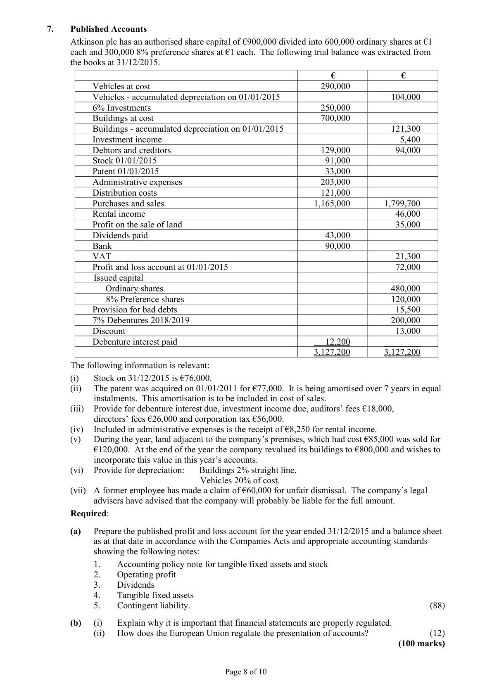
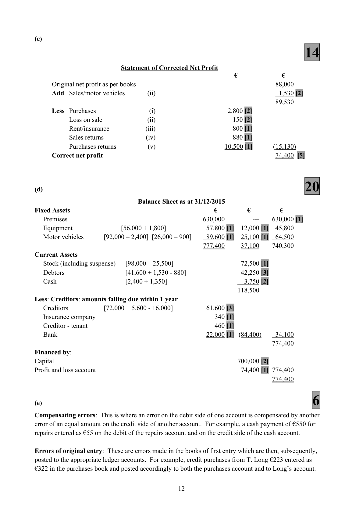
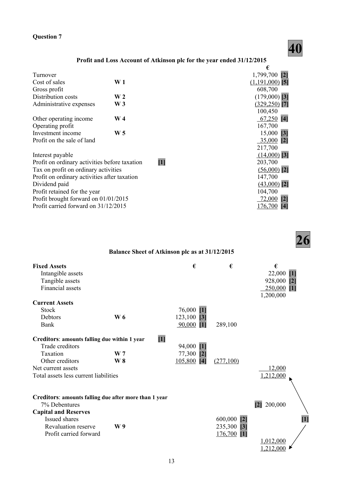

# Question

6.    Correction of errors and suspense account

     The trial balance of D. Sexton Ltd, a furniture retailer, failed to agree on 31/12/2015. The difference
     was entered into a suspense account and the following balance sheet was prepared.

                                   Balance Sheet as at 31/12/2015

     Fixed Assets                                           €          €            €
                                                            Cost       Dep.         Net
                                                          To date
     Premises                                                630,000                   630,000
     Equipment                                                56,000       12,000        44,000
     Motor vehicles                                            92,000       26,000        66,000
                                                             778,000       38,000       740,000
     Current Assets
           Stock (including suspense)                                          98,000
           Debtors                                                          41,600
          Cash                                                               2,400
                                                                          142,000
      Less: Creditors: amounts falling due within 1 year
            Creditors                                            72,000
          Bank                                                22,000       (94,000)      48,000
                                                                                       788,000
     Financed by:
            Issued – 700,000 ordinary shares @ €1 each                         700,000
              Profit and loss balance                                             88,000      788,000
                                                                                       788,000

   On checking the books, the following errors and omissions were discovered:

        (i)    Coffee tables purchased on credit for €2,800, had been entered on the incorrect side of the
             creditor’s account and credited as €1,800 to the equipment account.

        (ii)  A delivery van which cost €2,400 and with a book value of €1,500 was sold for cash €1,350.
            This had been entered as €1,530 on the debit side of the sales account and on the credit side of
             the debtor’s account.

         (iii)   Insurance due €340 and rent prepaid to Sexton €460 were not recorded in the books.

       (iv)  A credit note sent to a debtor for €620 had been entered in the day books as €260 and was
            subsequently posted to the incorrect side of the relevant ledger accounts.

       (v)   Sexton returned furniture previously purchased on credit for €27,000. This was entered in the
            accounts as €37,000. However, a credit note subsequently arrived from the supplier showing a
             transport charge of €500. The only entry made in respect of this credit note is a credit entry of
           €26,500 in the creditor’s account.

     Required:
       (a)   Journalise the necessary corrections.                                                      (54)
      (b)  Show the suspense account.                                                                    (6)
       (c)   Prepare a statement showing the corrected net profit.                                      (14)
      (d)   Prepare a corrected balance sheet.                                                        (20)
       (e)   Explain:
                (i)   Compensating errors.
                 (ii)   Errors of original entry.                                                                 (6)
                                                                                    (100 Marks)

                                            Page 7 of 10

<!-- PAGE 8 -->
# Page 8

<!-- HAS_VISUAL: true -->
<!-- VISUAL_REASON: page contains vector drawings; text contains visual keywords: line; page image extracted because text may not fully capture visual content -->

# Marking Scheme

6.    Sale of scrap materials                     6,100 - 3,600                            2,500

6.    Life Membership      50,000 (40,000 + 10,000) ÷ 10      =           5,000

6.    Drawings
     Drawings of stock                                                     9,880
     Cash/bank                                                            7,800
      College fees – family member                                           4,600
     Equipment                                                            4,800
      Light and heat                                                         2,988
       Interest                                                               1,575
                                                                         31,643

Question 6

(a)                                    54

                                                            Dr       Cr
                                                                     €        €
(i)   Equipment a/c                                                      1,800 [2]
      Creditors a/c                                                                   5,600 [2]
      Purchases a/c                                                       2,800 [3]
      Suspense a/c                                                       1,000 [3]

      Correction of an incorrect treatment of a credit purchase [1]

(ii)   Debtors a/c                                                        1,530 [3]
      Sales a/c                                                                      1,530 [3]
     Motor vehicles a/c                                                              2,400 [3]
      Provision for depreciation on motor vehicles a/c                       900 [3]
     Cash a/c                                                           1,350 [3]
     Loss on sale – profit and loss a/c                                   150 [3]

      Correction of an incorrect treatment of a delivery van sale [1]

(iii)   Profit and loss a/c                                               800 [2]
      Insurance company a/c (balance sheet)                                         340 [3]
      Tenant rent a/c (balance sheet)                                               460 [3]

     Being recording of insurance due and rent receivable prepaid
      omitted from books [1]

(iv)   Sales returns a/c                                                880 [2]
      Debtors a/c                                                               880 [2]

     Being correction of incorrect recording of credit note to debtor [1]

(v)   Purchases/purchases returns a/c                                     10,500 [3]
      Creditors a/c                                                     16,000 [3]
      Suspense a/c                                                                26,500 [3]

     Being correction of the incorrect treatment of purchases returns [1]

(b)
                                      6
                                    Suspense Account
      Original difference           25,500 [2]      Creditors/purchases    (v)          26,500 [2]
      Equipment/creditors   (i)       1,000 [2]                                   ______
                                 26,500                                          26,500

                                           11

<!-- PAGE 14 -->
# Page 14

<!-- HAS_VISUAL: true -->
<!-- VISUAL_REASON: page contains vector drawings; page image extracted because text may not fully capture visual content -->

(c)
                                     14
                           Statement of Corrected Net Profit
                                                            €             €
      Original net profit as per books                                             88,000
    Add  Sales/motor vehicles           (ii)                                         1,530 [2]
                                                                              89,530
     Less  Purchases                         (i)                        2,800 [2]
           Loss on sale                      (ii)                       150 [2]
            Rent/insurance                  (iii)                       800 [1]
            Sales returns                 (iv)                       880 [1]
            Purchases returns            (v)                      10,500 [1]       (15,130)
     Correct net profit                                                        74,400 [5]

(d)                                    20
                                Balance Sheet as at 31/12/2015
Fixed Assets                                           €         €         €
   Premises                                            630,000            ---    630,000 [1]
   Equipment                [56,000 + 1,800]             57,800 [1]  12,000 [1]  45,800
   Motor vehicles       [92,000 – 2,400] [26,000 – 900]     89,600 [1]  25,100 [1]  64,500
                                                      777,400     37,100    740,300
Current Assets
   Stock (including suspense)   [98,000 – 25,500]                      72,500 [1]
   Debtors                     [41,600 + 1,530 - 880]                  42,250 [3]
   Cash                        [2,400 + 1,350]                          3,750 [2]
                                                                 118,500
Less: Creditors: amounts falling due within 1 year
   Creditors            [72,000 + 5,600 - 16,000]           61,600 [3]
   Insurance company                                    340 [1]
   Creditor - tenant                                      460 [1]
  Bank                                                22,000 [1]  (84,400)     34,100
                                                                            774,400
Financed by:
Capital                                                           700,000 [2]
Profit and loss account                                               74,400 [1] 774,400
                                                                            774,400

(e)                                     6
Compensating errors: This is where an error on the debit side of one account is compensated by another
error of an equal amount on the credit side of another account. For example, a cash payment of €550 for
repairs entered as €55 on the debit of the repairs account and on the credit side of the cash account.

Errors of original entry: These are errors made in the books of first entry which are then, subsequently,
posted to the appropriate ledger accounts. For example, credit purchases from T. Long €223 entered as
€322 in the purchases book and posted accordingly to both the purchases account and to Long’s account.

                                           12

<!-- PAGE 15 -->
# Page 15

<!-- HAS_VISUAL: true -->
<!-- VISUAL_REASON: page contains vector drawings; page image extracted because text may not fully capture visual content -->

6.    Debtors                  129,000 - 15,500 + 9,600                      =     123,100

# Source References

Exam paper:
- file: intermediate_markdown/exam_papers/higher/accounting_higher_2016_paper_1_exam.md
- pages: [8]

Marking scheme:
- file: intermediate_markdown/marking_schemes/higher/accounting_higher_2016_paper_1_marking_scheme.md
- pages: [14, 15]

# Notes

