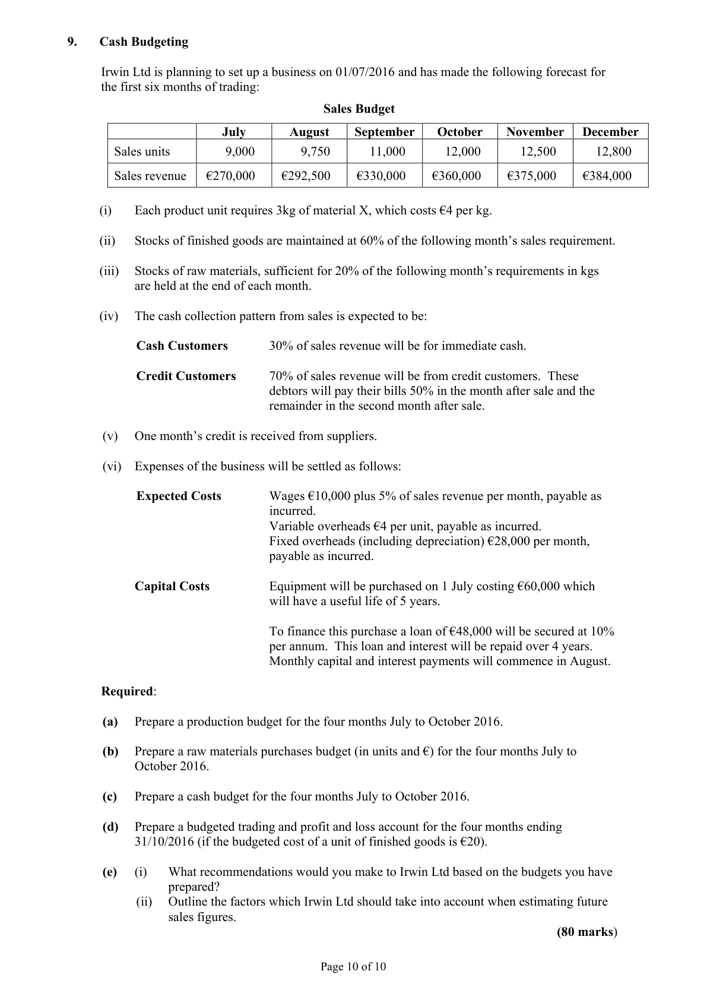
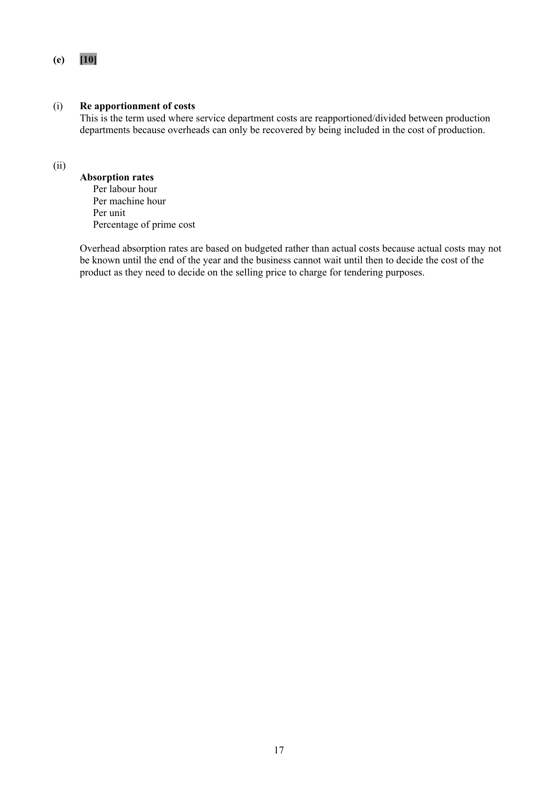
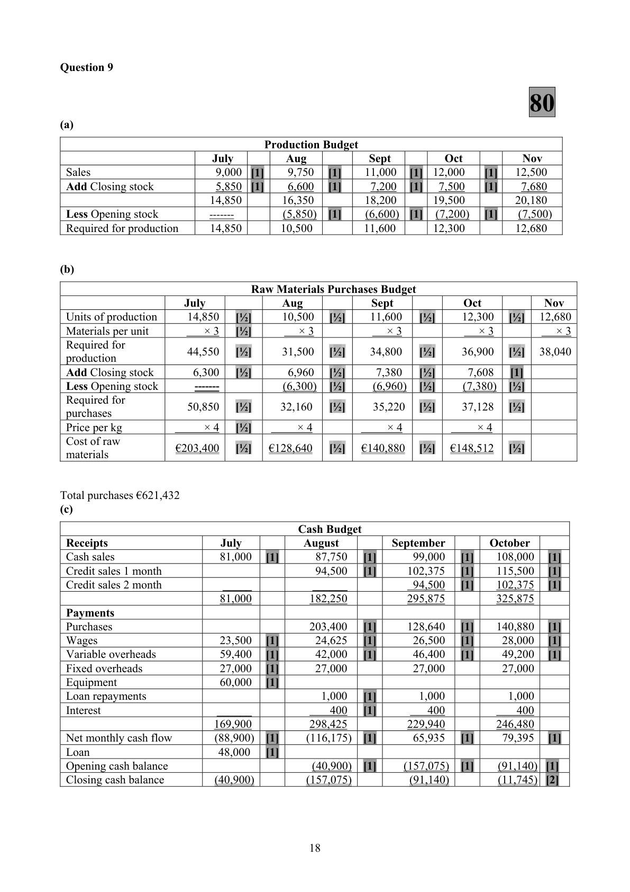

# Question

8.   Overhead Apportionment/Job Costing

     Moran Ltd has two production departments, 1 and 2 and two ancillary Service Departments, A and B.
     The following costs relate to 2016.

                                         Total   Production 1  Production 2  Service A   Service B
                                       €          €            €          €         €
        Indirect materials                 380,000    245,000       135,000        --------       --------
        Indirect labour                    400,000    280,000       120,000
      Machine maintenance               12,000
       Depreciation on factory buildings     30,000
       Factory light and heat               18,000
       Factory cleaning                     8,000
       Factory canteen                      5,600

     The following information relates to the production and service departments:

                                        Total    Production 1  Production 2  Service A  Service B
      Volume in cubic metres             6,000        3,000         1,500        1,000       500
       Floor area in square metres          1,000         400          300        200       100
      Number of employees              490         280          140          70       --------
      Book value of buildings          600,000     300,000       150,000     100,000     50,000
      Machine hours                   50,000       30,000        20,000         --------       --------
      Labour hours                     60,000       15,000        45,000         --------       ---------

      Service departments are to be transferred to the Production Departments on the following
      percentage basis:

                                     Production 1             Production 2
       Service A                    70%                  30%
       Service B                    60%                  40%

     Job No. 650 has just been completed, the details are:

                           Direct Materials     Direct Labour   Machine Hours   Labour
                                                                      Hours
                               €                €
       Production 1              7,500              4,000            120             50
       Production 2              2,800              3,900             80            100

     The company budgets for a profit margin of 20%.

     Required:

       (a)   Calculate the overhead to be absorbed by each department showing clearly the basis of
           apportionment used.
      (b)   Transfer the service department costs to production departments 1 and 2.
       (c)    Calculate a suitable overhead absorption rate for each department.
      (d)   Compute the selling price of Job No. 650.
       (e)     (i)    Explain what is meant by reapportionment of overheads.
                 (ii)  Name three overhead absorption rates and state why they are based on budgeted figures.

                                                                                      (80 Marks)

                                            Page 9 of 10

<!-- PAGE 10 -->
# Page 10

<!-- HAS_VISUAL: true -->
<!-- VISUAL_REASON: page contains vector drawings; text contains visual keywords: figure, line; page image extracted because text may not fully capture visual content -->

# Marking Scheme

8.    Closing Stock - finished goods            77,600 + 12,500                         90,100

8.    Competition Profit    25,600 - 22,100                 =           3,500

8.    Other creditors            18,000 + 26,000 + 1,800 + 60,000                =     105,800

Question 8
                                      80
(a)

 Overhead         Basis      Total    Prod 1       Prod 2       Service        Service
                                             A        B
 Indirect
                 Given      380,000   245,000       135,000
 materials
 Indirect
                 Given      400,000   280,000       120,000
 labour
 Machine        Machine
                [1]              12,000     7,200   [1]     4,800  [1]
 maintenance      hours
 Dep. –
                [1] Book value   30,000    15,000   [1]     7,500  [1]   5,000   [1]    2,500  [1]
 buildings
 Factory
                [1] Volume      18,000     9,000   [1]     4,500  [1]   3,000   [1]    1,500  [1]
 L & H
 Factory
                [1]  Floor area     8,000     3,200   [1]     2,400  [1]   1,600   [1]     800  [1]
 cleaning
                 No. of
 Canteen      [1]                5,600     3,200   [1]     1,600  [1]    800   [1]        -----
                 employees

                             853,600   562,600   [1]  275,800  [1]  10,400   [1]    4,800  [1]

(b)

                            Production 1         Production 2        Service A    Service B
 Overhead costs                   562,600             275,800           10,400        4,800
 Apportion Service A
                                    7,280     [2]         3,120     [2]   (10,400)
 [70%/30%]
 Apportion Service B
                                    2,880     [2]         1,920     [2]                  (4,800)
 [60%/40%]
                                 572,760             280,840

(c)

    Overhead Rate Production 1 - (Machine Hours)

                   572,760      =             €19.09 per machine hour [6]
                 30,000 hours

    Overhead Rate Production 2 - (Labour Hours)

                   280,840      =                €6.24 per labour hour [6]
                 45,000 hours

(d)

      Selling price of Job 650                                  €
      Direct materials (7,500 + 2,800)                             10,300.00    [4]
      Direct labour (4,000 + 3,900)                                  7,900.00    [4]
     Prime cost                                                 18,200.00
     Overheads
      Production 1 (120 machine hours × €19.09)                    2,290.80    [4]
      Production 2 (100 labour hours × €6.24)                        624.00    [4]
     Cost of Job 650                                            21,114.80
     Margin of 20%                                               5,278.70    [2]
      Selling price of Job 650                                     26,393.50    [6]

                                           16

<!-- PAGE 19 -->
# Page 19

<!-- HAS_VISUAL: true -->
<!-- VISUAL_REASON: page contains vector drawings; page image extracted because text may not fully capture visual content -->

(e)    [10]

(i)   Re apportionment of costs
      This is the term used where service department costs are reapportioned/divided between production
      departments because overheads can only be recovered by being included in the cost of production.

(ii)
     Absorption rates
         Per labour hour
         Per machine hour
         Per unit
         Percentage of prime cost

     Overhead absorption rates are based on budgeted rather than actual costs because actual costs may not
     be known until the end of the year and the business cannot wait until then to decide the cost of the
      product as they need to decide on the selling price to charge for tendering purposes.

                                           17

<!-- PAGE 20 -->
# Page 20

<!-- HAS_VISUAL: true -->
<!-- VISUAL_REASON: page contains vector drawings; page image extracted because text may not fully capture visual content -->

# Source References

Exam paper:
- file: intermediate_markdown/exam_papers/higher/accounting_higher_2016_paper_1_exam.md
- pages: [10]

Marking scheme:
- file: intermediate_markdown/marking_schemes/higher/accounting_higher_2016_paper_1_marking_scheme.md
- pages: [19, 20]

# Notes

