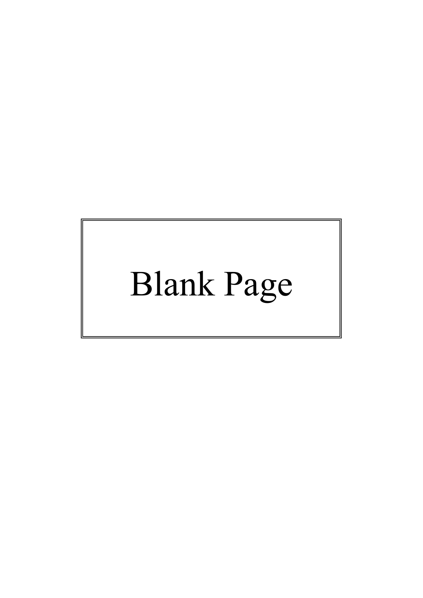
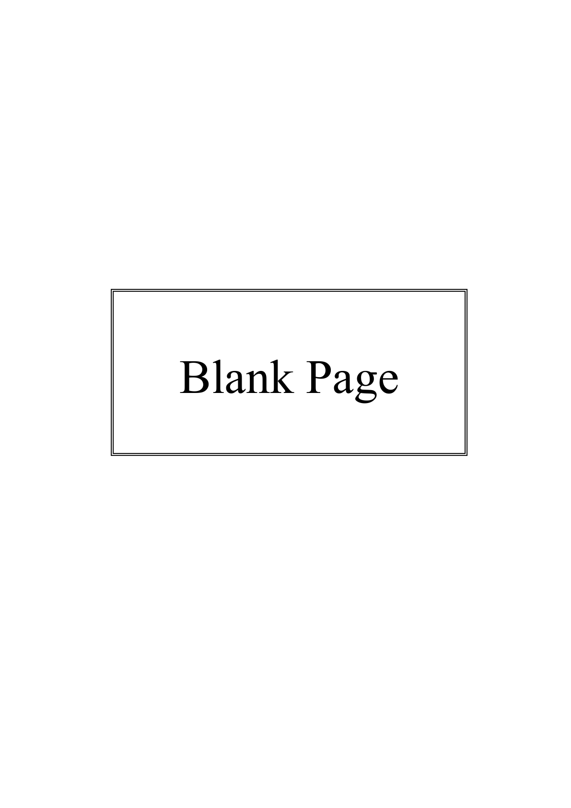
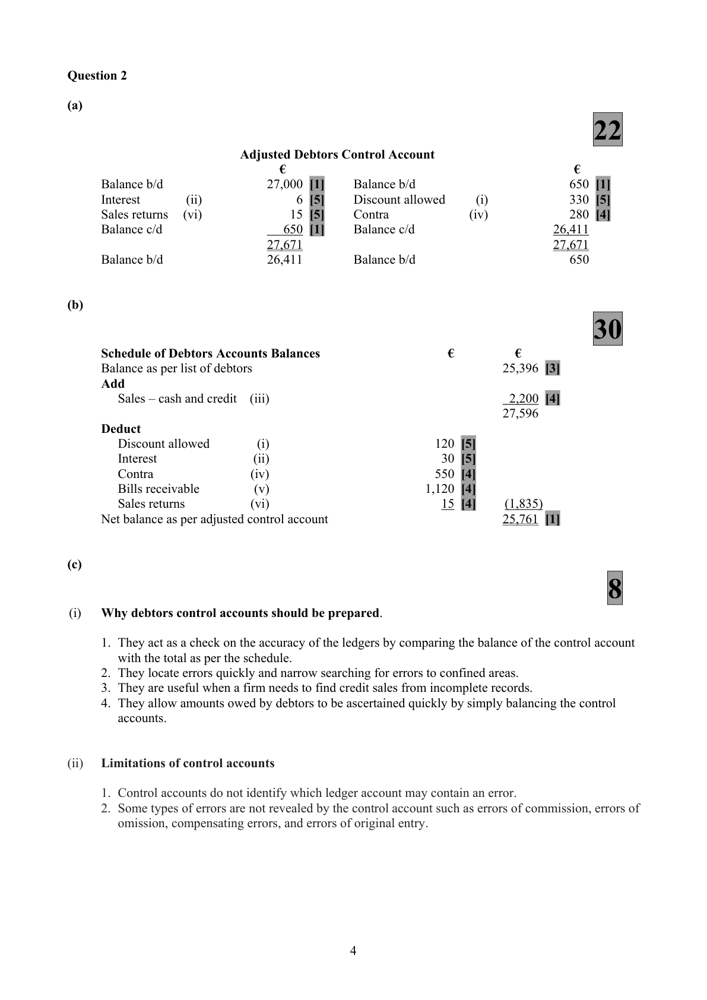
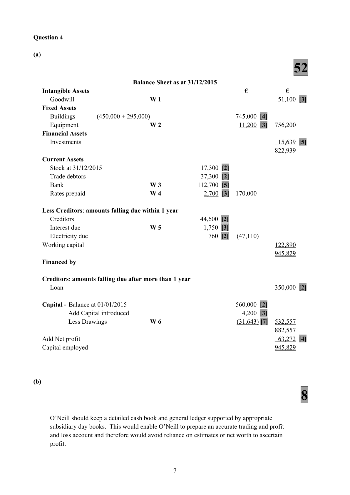
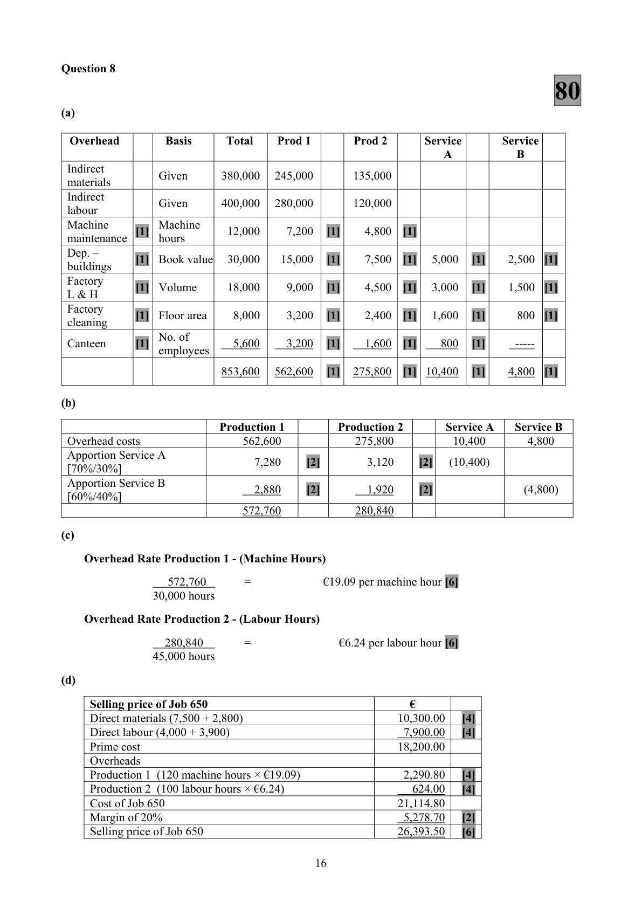
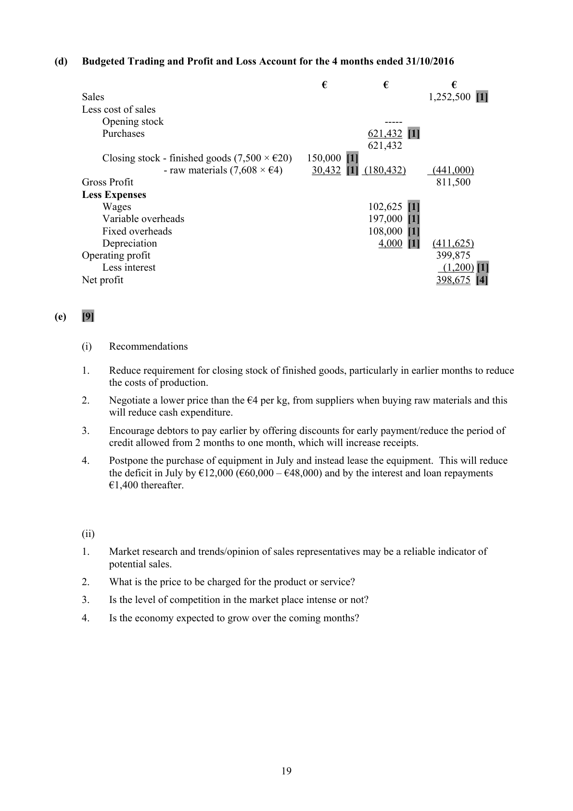
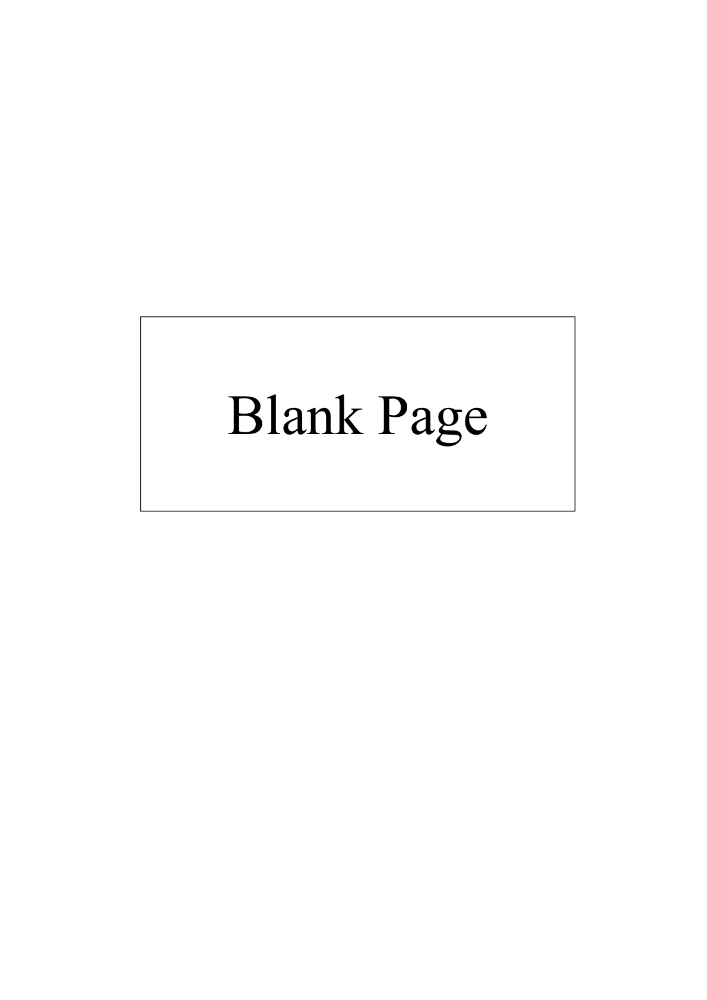

# Question

9.   Cash Budgeting

      Irwin Ltd is planning to set up a business on 01/07/2016 and has made the following forecast for
      the first six months of trading:

                                             Sales Budget

                          July       August    September   October   November   December
         Sales units         9,000        9,750       11,000       12,000       12,500       12,800

        Sales revenue   €270,000    €292,500    €330,000    €360,000    €375,000    €384,000

        (i)    Each product unit requires 3kg of material X, which costs €4 per kg.

        (ii)   Stocks of finished goods are maintained at 60% of the following month’s sales requirement.

        (iii)   Stocks of raw materials, sufficient for 20% of the following month’s requirements in kgs
             are held at the end of each month.

       (iv)  The cash collection pattern from sales is expected to be:

          Cash Customers     30% of sales revenue will be for immediate cash.

           Credit Customers    70% of sales revenue will be from credit customers. These
                                     debtors will pay their bills 50% in the month after sale and the
                                  remainder in the second month after sale.

       (v)  One month’s credit is received from suppliers.

       (vi)  Expenses of the business will be settled as follows:

           Expected Costs       Wages €10,000 plus 5% of sales revenue per month, payable as
                                       incurred.
                                    Variable overheads €4 per unit, payable as incurred.
                                  Fixed overheads (including depreciation) €28,000 per month,
                                   payable as incurred.

           Capital Costs         Equipment will be purchased on 1 July costing €60,000 which
                                        will have a useful life of 5 years.

                            To finance this purchase a loan of €48,000 will be secured at 10%
                                    per annum. This loan and interest will be repaid over 4 years.
                               Monthly capital and interest payments will commence in August.

     Required:

       (a)   Prepare a production budget for the four months July to October 2016.

       (b)   Prepare a raw materials purchases budget (in units and €) for the four months July to
           October 2016.

       (c)   Prepare a cash budget for the four months July to October 2016.

       (d)   Prepare a budgeted trading and profit and loss account for the four months ending
           31/10/2016 (if the budgeted cost of a unit of finished goods is €20).

       (e)    (i)   What recommendations would you make to Irwin Ltd based on the budgets you have
                  prepared?
                 (ii)   Outline the factors which Irwin Ltd should take into account when estimating future
                    sales figures.
                                                                                    (80 marks)

                                            Page 10 of 10

<!-- PAGE 11 -->
# Page 11

<!-- HAS_VISUAL: true -->
<!-- VISUAL_REASON: page contains vector drawings; text extraction is sparse relative to visible page content; page image extracted because text may not fully capture visual content -->

<!-- EXTRACTION_ISSUE: very sparse extracted text -->

Blank Page

<!-- PAGE 12 -->
# Page 12

<!-- HAS_VISUAL: true -->
<!-- VISUAL_REASON: page contains vector drawings; text extraction is sparse relative to visible page content; page image extracted because text may not fully capture visual content -->

<!-- EXTRACTION_ISSUE: very sparse extracted text -->

Blank Page

# Marking Scheme

9.    Provision for bad debts                   [37,800 × 4%]                             1,512

10.   Discount                                 6,000 - 1,200                            4,800

11.   Rent                                     8,500 + 5,100 – 3,400 prepaid            10,200

12.   Investment income               4% [315,000] × 8/12                       8,400

13.   Debenture interest                       25,200 + 3,200                          28,400
                                             20,000 + 8,400

14.   Factory buildings                        930,000 + [28,000 + 12,300]            970,300

15.   Accumulated depreciation -               75,000 - 9,450 + 31,100                  96,650
      plant and machinery

16.   Debtors                                52,000 + 800 – 15,000                   37,800

17.   Creditors                               49,400 + 10,000                         59,400

18.   Bank                                  42,600 + 800 – 5,100                    38,300
                                             36,300 + 2,000                          38,300

Penalties:  1 mark for the omission of expense heading ‘selling and distribution’ in profit and loss a/c
          1 mark for the omission of ‘total cost’ figure for fixed assets.

                                           3

<!-- PAGE 6 -->
# Page 6

<!-- HAS_VISUAL: true -->
<!-- VISUAL_REASON: page contains vector drawings; page image extracted because text may not fully capture visual content -->

9.   Sundry Expenses      124,350 - 1,500                =        122,850

                                           6

<!-- PAGE 9 -->
# Page 9

<!-- HAS_VISUAL: true -->
<!-- VISUAL_REASON: page contains vector drawings; page image extracted because text may not fully capture visual content -->

9.    Revaluation reserve        100,000 + 121,300 + 14,000                    =     235,300

(b)                                    12

(i)    Regulation is important for the following reasons:

       1.  To ensure that financial statements are consistent from year to year.
       2.  To ensure that financial statements can be easily compared with other businesses.
       3.  To ensure that financial statements comply with national and international law.
       4.  To ensure that the required accounting information is available to external users (e.g. banks).
       5.  Good regulation makes fraud less likely and builds trust among the investing public.

(ii)   The European Union influences regulation by issuing directives. Directives are instructions that are
      binding on member states. Member states are given a fixed period of time to implement the directive
       into national law. The purpose of directives is to harmonise accounting practice in member states. An
     example would be the fourth directive.

                                           15

<!-- PAGE 18 -->
# Page 18

<!-- HAS_VISUAL: true -->
<!-- VISUAL_REASON: page contains vector drawings; page image extracted because text may not fully capture visual content -->

Question 9

                                     80
(a)

                                     Production Budget
                             July        Aug           Sept         Oct         Nov
 Sales                        9,000  [1]    9,750   [1]    11,000   [1]  12,000    [1]   12,500
 Add Closing stock            5,850  [1]    6,600   [1]      7,200   [1]   7,500    [1]    7,680
                            14,850        16,350         18,200       19,500         20,180
 Less Opening stock              -------          (5,850)  [1]     (6,600)  [1]   (7,200)   [1]    (7,500)
 Required for production      14,850       10,500          11,600       12,300         12,680

(b)

                         Raw Materials Purchases Budget
                       July           Aug            Sept            Oct         Nov
 Units of production      14,850   [½]      10,500   [½]     11,600   [½]     12,300   [½]   12,680
 Materials per unit        × 3   [½]       × 3           × 3            × 3         × 3
 Required for
                        44,550   [½]      31,500   [½]     34,800   [½]     36,900   [½]   38,040
 production
 Add Closing stock       6,300   [½]       6,960   [½]      7,380   [½]      7,608    [1]
 Less Opening stock          -------             (6,300)  [½]      (6,960)  [½]      (7,380)  [½]
 Required for
                        50,850   [½]     32,160   [½]     35,220   [½]     37,128   [½]
 purchases
 Price per kg            × 4   [½]       × 4           × 4           × 4
 Cost of raw
                     €203,400   [½]   €128,640   [½]   €140,880   [½]   €148,512   [½]
 materials

Total purchases €621,432
(c)

                                      Cash Budget
 Receipts                     July          August         September        October
 Cash sales                    81,000   [1]       87,750   [1]       99,000   [1]    108,000   [1]
 Credit sales 1 month                             94,500   [1]      102,375   [1]    115,500   [1]
 Credit sales 2 month          _____          ______            94,500   [1]    102,375   [1]
                              81,000           182,250           295,875         325,875
 Payments
 Purchases                                    203,400    [1]      128,640   [1]    140,880   [1]
 Wages                       23,500   [1]       24,625   [1]       26,500   [1]     28,000   [1]
 Variable overheads            59,400   [1]       42,000   [1]       46,400   [1]     49,200   [1]
 Fixed overheads              27,000   [1]       27,000            27,000           27,000
 Equipment                   60,000   [1]
 Loan repayments                                 1,000    [1]        1,000            1,000
 Interest                    ______             400   [1]         400            400
                            169,900           298,425           229,940         246,480
 Net monthly cash flow        (88,900)   [1]     (116,175)   [1]       65,935   [1]     79,395   [1]
 Loan                        48,000   [1]
 Opening cash balance                             (40,900)   [1]     (157,075)   [1]     (91,140)  [1]
 Closing cash balance          (40,900)          (157,075)            (91,140)          (11,745)  [2]

                                           18

<!-- PAGE 21 -->
# Page 21

<!-- HAS_VISUAL: true -->
<!-- VISUAL_REASON: page contains vector drawings; page image extracted because text may not fully capture visual content -->

(d)   Budgeted Trading and Profit and Loss Account for the 4 months ended 31/10/2016

                                                   €           €            €
      Sales                                                                     1,252,500 [1]
      Less cost of sales
         Opening stock                                                               -----
          Purchases                                             621,432 [1]
                                                                621,432
          Closing stock - finished goods (7,500 × €20)   150,000 [1]
                               - raw materials (7,608 × €4)      30,432 [1] (180,432)      (441,000)
      Gross Profit                                                              811,500
     Less Expenses
        Wages                                                102,625 [1]
          Variable overheads                                     197,000 [1]
          Fixed overheads                                        108,000 [1]
          Depreciation                                               4,000 [1]   (411,625)
      Operating profit                                                          399,875
          Less interest                                                                 (1,200) [1]
     Net profit                                                                398,675 [4]

(e)    [9]

        (i)   Recommendations

       1.    Reduce requirement for closing stock of finished goods, particularly in earlier months to reduce
             the costs of production.

       2.    Negotiate a lower price than the €4 per kg, from suppliers when buying raw materials and this
             will reduce cash expenditure.

       3.    Encourage debtors to pay earlier by offering discounts for early payment/reduce the period of
              credit allowed from 2 months to one month, which will increase receipts.

       4.    Postpone the purchase of equipment in July and instead lease the equipment. This will reduce
             the deficit in July by €12,000 (€60,000 – €48,000) and by the interest and loan repayments
           €1,400 thereafter.

        (ii)

       1.    Market research and trends/opinion of sales representatives may be a reliable indicator of
             potential sales.

       2.   What is the price to be charged for the product or service?

       3.     Is the level of competition in the market place intense or not?

       4.     Is the economy expected to grow over the coming months?

                                           19

<!-- PAGE 22 -->
# Page 22

<!-- HAS_VISUAL: true -->
<!-- VISUAL_REASON: page contains vector drawings; text extraction is sparse relative to visible page content; page image extracted because text may not fully capture visual content -->

<!-- EXTRACTION_ISSUE: very sparse extracted text -->

Blank Page

<!-- PAGE 23 -->
# Page 23

<!-- HAS_VISUAL: true -->
<!-- VISUAL_REASON: page contains vector drawings; text extraction is sparse relative to visible page content; page image extracted because text may not fully capture visual content -->

<!-- EXTRACTION_ISSUE: very sparse extracted text -->

Blank Page

<!-- PAGE 24 -->
# Page 24

<!-- HAS_VISUAL: true -->
<!-- VISUAL_REASON: page contains vector drawings; text extraction is sparse relative to visible page content; page image extracted because text may not fully capture visual content -->

<!-- EXTRACTION_ISSUE: no extractable text found -->

[No extractable text found]

# Source References

Exam paper:
- file: intermediate_markdown/exam_papers/higher/accounting_higher_2016_paper_1_exam.md
- pages: [11, 12]

Marking scheme:
- file: intermediate_markdown/marking_schemes/higher/accounting_higher_2016_paper_1_marking_scheme.md
- pages: [6, 9, 18, 21, 22, 23, 24]

# Notes

