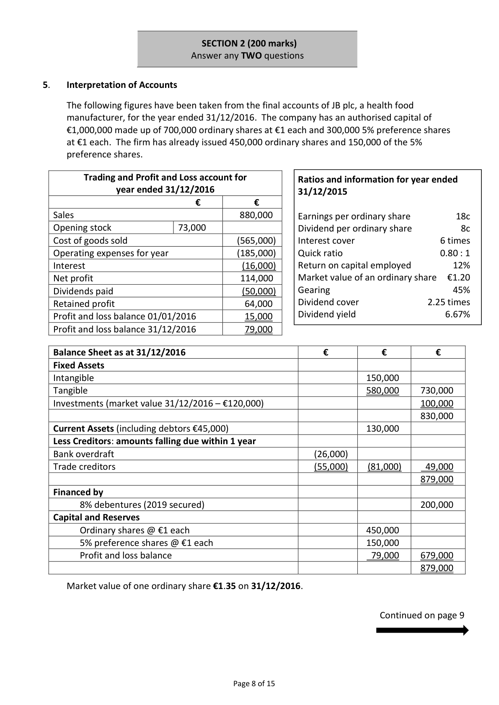
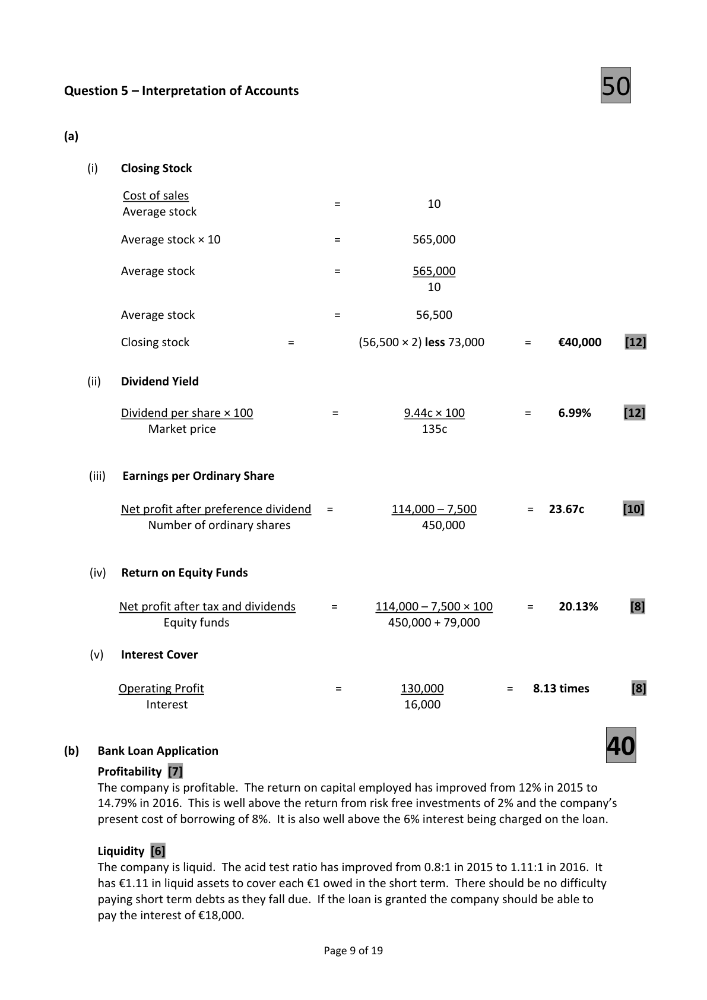

# Question

4.   Departmental Final Accounts of a Sole Trader

     The Byrne family’s firm is divided into two departments – Ladieswear and Menswear. The
      following balances were extracted from its books on 31/12/2016:

                                                      €                €
   Capital                                                                 316,500
   Buildings at cost                                       440,000
   Delivery vans at cost                                    40,000
   Debtors and creditors                                   43,100            50,000
  4% Fixed mortgage                                                      150,000
   Ladieswear department
        Stock 01/01/2016                                  25,000
        Purchases and sales                               210,000           300,000
        Carriage in                                          4,000
  Menswear department
        Stock 01/01/2016                                  16,000
        Purchases and sales                               140,000           200,000
        Import duty                                         1,000
        Returns out                                                            3,000
      Salaries and general expenses                          75,600
      Advertising                                            6,000
     Insurance                                             8,400
      Light and heat                                       10,300
     Cleaning                                              9,100
     Bank                                          ________              9,000
                                                        1,028,500          1,028,500

You are given the following additional information:

(i)   Stock at 31/12/2016:       Ladieswear:     28,000
                            Menswear:      17,000
(ii)   Insurance was for the year ended 28/02/2017.
(iii)  The advertising payment was for a 15 month campaign which began on 01/03/2016.
(iv)  Depreciation is to be provided as follows:
                 Delivery vans at 20% of cost.
                 Buildings at 2% of cost.
(v)   Provision should be made for a year’s mortgage interest.
(vi)  The floor space of the firm is divided as follows:
                Ladieswear:       800 square metres
              Menswear:       200 square metres
(vii)  Expenses applicable to both departments should be divided on the basis of sales or floor space
     where appropriate.

Required:

(a)   Prepare a departmental trading and profit and loss account for the year ended 31/12/2016.
                                                                                                  (50)
(b)  What recommendations would you make as manager of the Byrne family’s firm based on
     the prepared accounts? (Note: Retail shopping space is renting for €35 per square metre.)
                                                                                                  (10)
                                                                                    (60 marks)

                                              Page 7 of 15

<!-- PAGE 8 -->
# Page 8

<!-- HAS_VISUAL: true -->
<!-- VISUAL_REASON: page contains vector drawings; text contains visual keywords: figure; page image extracted because text may not fully capture visual content -->

SECTION 2 (200 marks)
                             Answer any TWO questions

# Marking Scheme

4.      Depreciation – van                 5,625 + 17,775                       23,400
                                           [22,500 + 900]
                                            (1,500 + 16,500 + 5,400)

Question 4 – Departmental Final Accounts

      (a)                                       50

              Departmental Trading and Profit and Loss Account for the year ended 31/12/2016
                           €             €           €          €             €           €
                              Total       Ladieswear   Menswear      Total        Ladieswear   Menswear
Sales                                                                500,000   [1]  300,000   [1]  200,000  [1]
Less Cost of goods sold
  Stock 01/01/2016         41,000  [1]    25,000  [1]   16,000  [1]
  Purchases               350,000  [1]   210,000  [1]  140,000  [1]
  Returns out                 (3,000)  [1]             ‐‐‐         (3,000) [1]
  Carriage in                 4,000  [1]      4,000  [1]          ‐‐‐
  Import duty                1,000  [1]             ‐‐‐         1,000  [1]
                          393,000        239,000      154,000
Less stock 31/12/2016       (45,000)  [1]    (28,000)  [1]   (17,000) [1]   (348,000)      (211,000)     (137,000)
Gross profit                                                          152,000        89,000       63,000

Less expenses
  Salaries and general expenses  75,600  [1]    45,360  [1]   30,240  [1]
 Advertising                 4,000  [3]     2,400  [1]    1,600  [1]
 Insurance                   7,000  [3]     5,600  [1]    1,400  [1]
 Light and heat             10,300  [1]     8,240  [1]    2,060  [1]
 Cleaning                    9,100  [1]     7,280  [1]    1,820  [1]
 Dep. – delivery vans         8,000  [1]     4,800  [1]    3,200  [1]
 Dep. – buildings             8,800  [1]     7,040  [1]    1,760  [1]   (122,800)       (80,720)       (42,080)
Operating profit                                                        29,200         8,280        20,920
Less mortgage interest                                                        (6,000)  [1]    (4,800)  [1]    (1,200) [1]
Net profit for year                                                      23,200   [4]    3,480        19,720

     (b)   Recommendations to the Manager:                                              [10]

            1.    Downsize the Ladieswear Department and expand the Menswear Department as the €4.35
                   profit earned per square metre in the Ladies section is far less than the €98.60 profit per
                square metre earned in the Menswear section.

            2.    Rent out the Ladieswear Department as the €35 per square metre (€28,000) earned from
                 rent would be far greater than the profit made per square metre of €4.35 (€3,480).

            3.    Close the business and rent out all the floor space as the rental income of €35,000 (€35 per
                square metre) is greater than the combined profit from the two Departments of €23,200
                 (€23.2 per square metre).

         Workings

            1.    Insurance paid                                       8,400
                 Less prepaid                                             (1,400)           7,000

            2.    Advertising paid                                      6,000
                 Less prepaid                                             (2,000)           4,000

                                                 Page 8 of 19

<!-- PAGE 11 -->
# Page 11

<!-- HAS_VISUAL: true -->
<!-- VISUAL_REASON: page contains vector drawings; text contains visual keywords: table; page image extracted because text may not fully capture visual content -->

4.   Purchases – supplies      43,200 – 2,000 + 3,600           =     44,800

# Source References

Exam paper:
- file: intermediate_markdown/exam_papers/higher/accounting_higher_2017_paper_1_exam.md
- pages: [8]

Marking scheme:
- file: intermediate_markdown/marking_schemes/higher/accounting_higher_2017_paper_1_marking_scheme.md
- pages: [11]

# Notes

