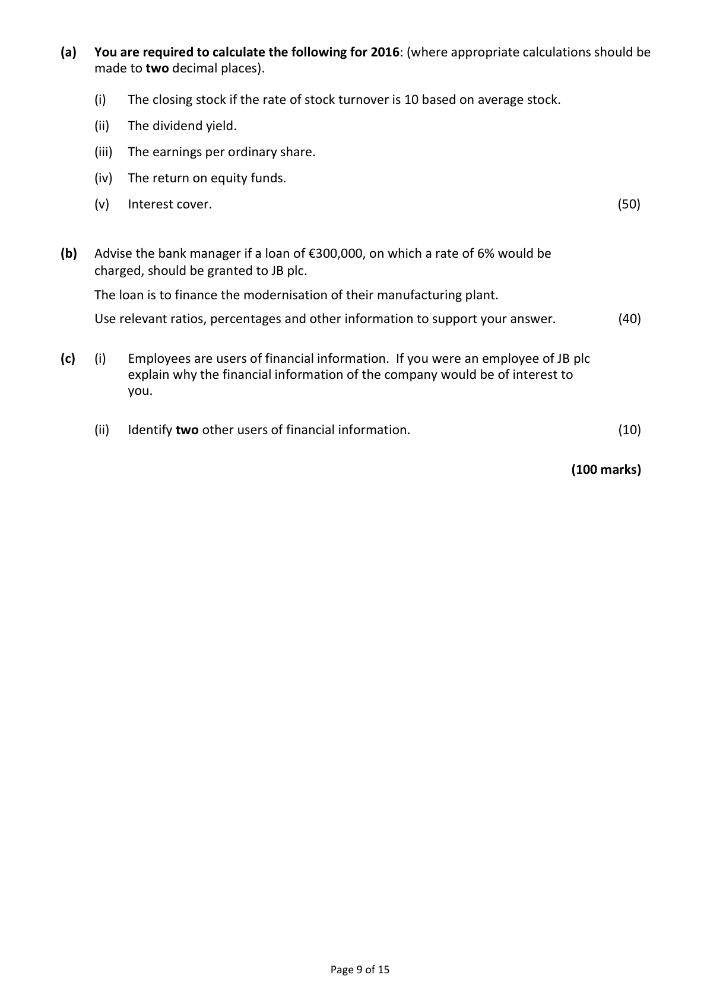
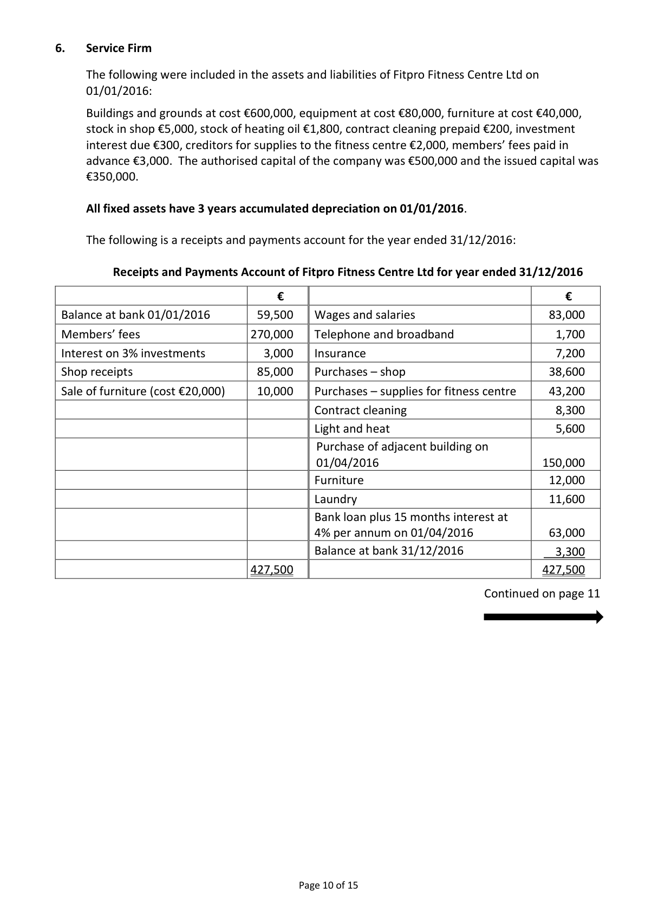
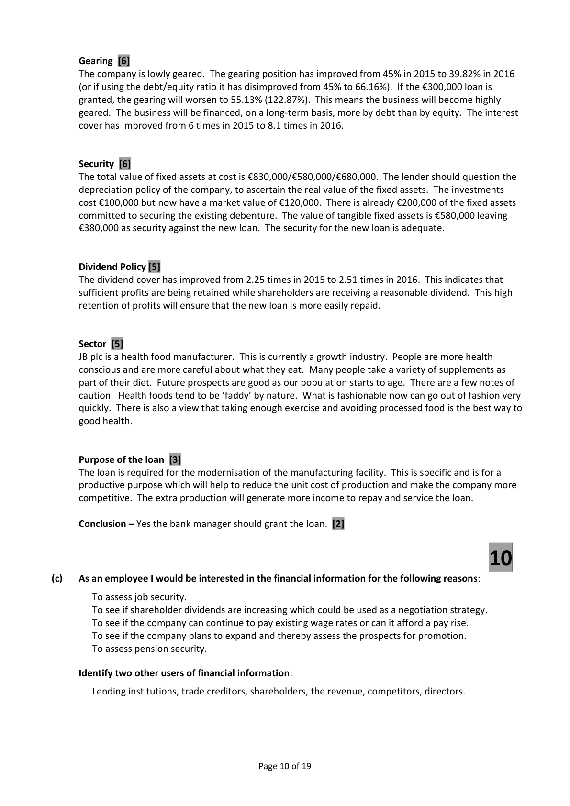
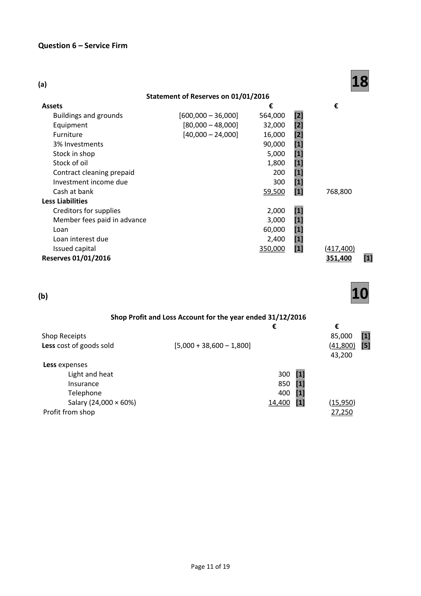

# Question

5.    Interpretation of Accounts

     The following figures have been taken from the final accounts of JB plc, a health food
     manufacturer, for the year ended 31/12/2016. The company has an authorised capital of
     €1,000,000 made up of 700,000 ordinary shares at €1 each and 300,000 5% preference shares
      at €1 each. The firm has already issued 450,000 ordinary shares and 150,000 of the 5%
     preference shares.

         Trading and Profit and Loss account for            Ratios and information for year ended
                year ended 31/12/2016                 31/12/2015
                              €          €
   Sales                                   880,000      Earnings per ordinary share         18c
  Opening stock              73,000                    Dividend per ordinary share          8c
  Cost of goods sold                         (565,000)     Interest cover                 6 times
  Operating expenses for year                (185,000)     Quick ratio                      0.80 : 1
   Interest                                     (16,000)     Return on capital employed       12%
  Net profit                               114,000     Market value of an ordinary share  €1.20
  Dividends paid                              (50,000)     Gearing                     45%
  Retained profit                            64,000      Dividend cover               2.25 times
   Profit and loss balance 01/01/2016          15,000      Dividend yield                  6.67%
   Profit and loss balance 31/12/2016          79,000

  Balance Sheet as at 31/12/2016                           €          €          €
  Fixed Assets
   Intangible                                                          150,000
  Tangible                                                           580,000    730,000
  Investments (market value 31/12/2016 – €120,000)                                 100,000
                                                                                830,000
  Current Assets (including debtors €45,000)                             130,000
  Less Creditors: amounts falling due within 1 year
  Bank overdraft                                               (26,000)
  Trade creditors                                               (55,000)     (81,000)     49,000
                                                                                879,000
  Financed by
      8% debentures (2019 secured)                                              200,000
   Capital and Reserves
        Ordinary shares @ €1 each                                     450,000
      5% preference shares @ €1 each                                150,000
          Profit and loss balance                                           79,000    679,000
                                                                                879,000

     Market value of one ordinary share €1.35 on 31/12/2016.

                                                                       Continued on page 9

                                              Page 8 of 15

<!-- PAGE 9 -->
# Page 9

(a)  You are required to calculate the following for 2016: (where appropriate calculations should be
    made to two decimal places).

        (i)   The closing stock if the rate of stock turnover is 10 based on average stock.

         (ii)   The dividend yield.

         (iii)  The earnings per ordinary share.

       (iv)  The return on equity funds.

       (v)   Interest cover.                                                                      (50)

(b)   Advise the bank manager if a loan of €300,000, on which a rate of 6% would be
     charged, should be granted to JB plc.

     The loan is to finance the modernisation of their manufacturing plant.

     Use relevant ratios, percentages and other information to support your answer.           (40)

(c)     (i)   Employees are users of financial information.  If you were an employee of JB plc
           explain why the financial information of the company would be of interest to
           you.

         (ii)   Identify two other users of financial information.                                    (10)

                                                                              (100 marks)

                                              Page 9 of 15

<!-- PAGE 10 -->
# Page 10

<!-- HAS_VISUAL: true -->
<!-- VISUAL_REASON: page contains vector drawings; page image extracted because text may not fully capture visual content -->

# Marking Scheme

5.      Acc. dep. delivery vans              65,000 – 21,000 + 23,400              67,400

Question 5 – Interpretation of Accounts                     50

(a)

      (i)    Closing Stock

          Cost of sales
                                          =             10
         Average stock

         Average stock × 10                 =            565,000

         Average stock                     =            565,000
                                                       10

         Average stock                     =            56,500

          Closing stock               =           (56,500 × 2) less 73,000      =    €40,000    [12]

       (ii)   Dividend Yield

          Dividend per share × 100            =           9.44c × 100         =    6.99%      [12]
             Market price                                135c

       (iii)   Earnings per Ordinary Share

         Net profit after preference dividend  =         114,000 – 7,500        =   23.67c       [10]
            Number of ordinary shares                     450,000

      (iv)  Return on Equity Funds

         Net profit after tax and dividends     =      114,000 – 7,500 × 100     =    20.13%      [8]
                  Equity funds                          450,000 + 79,000

      (v)   Interest Cover

         Operating Profit                    =          130,000          =   8.13 times        [8]
                Interest                                    16,000

(b)   Bank Loan Application                                      40
       Profitability [7]
     The company is profitable. The return on capital employed has improved from 12% in 2015 to
     14.79% in 2016. This is well above the return from risk free investments of 2% and the company’s
      present cost of borrowing of 8%.  It is also well above the 6% interest being charged on the loan.

      Liquidity [6]
     The company is liquid. The acid test ratio has improved from 0.8:1 in 2015 to 1.11:1 in 2016.  It
      has €1.11 in liquid assets to cover each €1 owed in the short term. There should be no difficulty
      paying short term debts as they fall due.  If the loan is granted the company should be able to
     pay the interest of €18,000.

                                            Page 9 of 19

<!-- PAGE 12 -->
# Page 12

<!-- HAS_VISUAL: true -->
<!-- VISUAL_REASON: page contains vector drawings; page image extracted because text may not fully capture visual content -->

Gearing [6]
     The company is lowly geared. The gearing position has improved from 45% in 2015 to 39.82% in 2016
       (or if using the debt/equity ratio it has disimproved from 45% to 66.16%).  If the €300,000 loan is
      granted, the gearing will worsen to 55.13% (122.87%). This means the business will become highly
      geared. The business will be financed, on a long‐term basis, more by debt than by equity. The interest
      cover has improved from 6 times in 2015 to 8.1 times in 2016.

      Security [6]
     The total value of fixed assets at cost is €830,000/€580,000/€680,000. The lender should question the
      depreciation policy of the company, to ascertain the real value of the fixed assets. The investments
      cost €100,000 but now have a market value of €120,000. There is already €200,000 of the fixed assets
     committed to securing the existing debenture. The value of tangible fixed assets is €580,000 leaving
     €380,000 as security against the new loan. The security for the new loan is adequate.

      Dividend Policy [5]
     The dividend cover has improved from 2.25 times in 2015 to 2.51 times in 2016. This indicates that
       sufficient profits are being retained while shareholders are receiving a reasonable dividend. This high
      retention of profits will ensure that the new loan is more easily repaid.

      Sector [5]
      JB plc is a health food manufacturer. This is currently a growth industry. People are more health
      conscious and are more careful about what they eat. Many people take a variety of supplements as
      part of their diet. Future prospects are good as our population starts to age. There are a few notes of
      caution. Health foods tend to be ‘faddy’ by nature. What is fashionable now can go out of fashion very
       quickly. There is also a view that taking enough exercise and avoiding processed food is the best way to
     good health.

     Purpose of the loan [3]
     The loan is required for the modernisation of the manufacturing facility. This is specific and is for a
      productive purpose which will help to reduce the unit cost of production and make the company more
      competitive. The extra production will generate more income to repay and service the loan.

      Conclusion – Yes the bank manager should grant the loan. [2]

                                      10
(c)   As an employee I would be interested in the financial information for the following reasons:

        To assess job security.
        To see if shareholder dividends are increasing which could be used as a negotiation strategy.
        To see if the company can continue to pay existing wage rates or can it afford a pay rise.
        To see if the company plans to expand and thereby assess the prospects for promotion.
        To assess pension security.

      Identify two other users of financial information:

        Lending institutions, trade creditors, shareholders, the revenue, competitors, directors.

                                            Page 10 of 19

<!-- PAGE 13 -->
# Page 13

<!-- HAS_VISUAL: true -->
<!-- VISUAL_REASON: page contains vector drawings; page image extracted because text may not fully capture visual content -->

5.   Contract Cleaning         8,300 + 200 – 600               =      7,900

# Source References

Exam paper:
- file: intermediate_markdown/exam_papers/higher/accounting_higher_2017_paper_1_exam.md
- pages: [9, 10]

Marking scheme:
- file: intermediate_markdown/marking_schemes/higher/accounting_higher_2017_paper_1_marking_scheme.md
- pages: [12, 13]

# Notes

