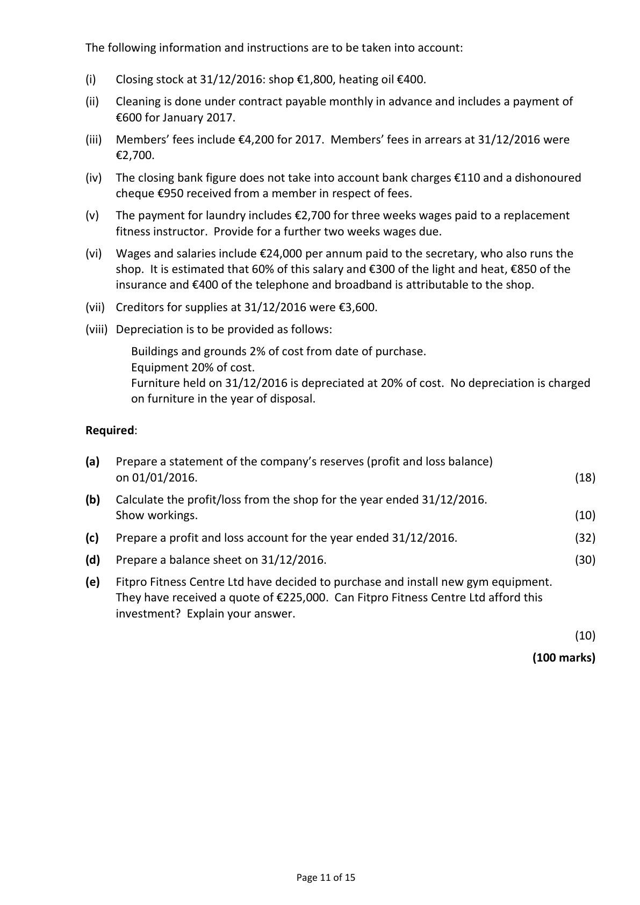
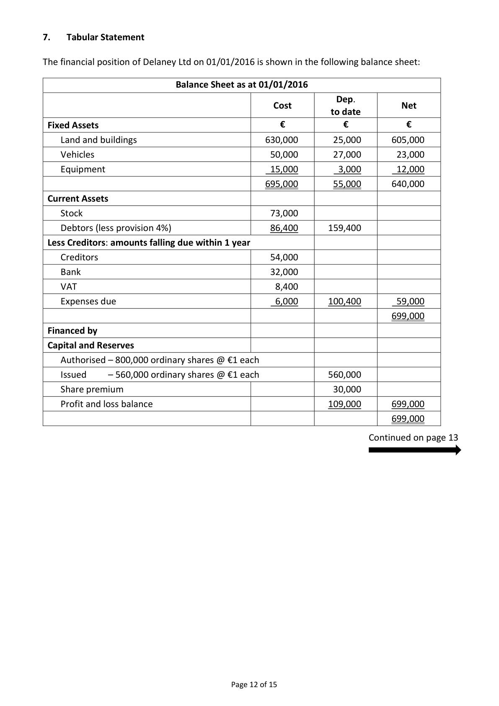
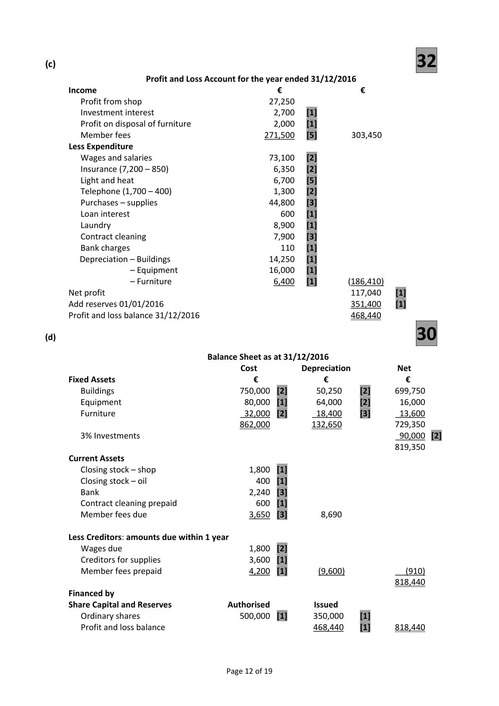
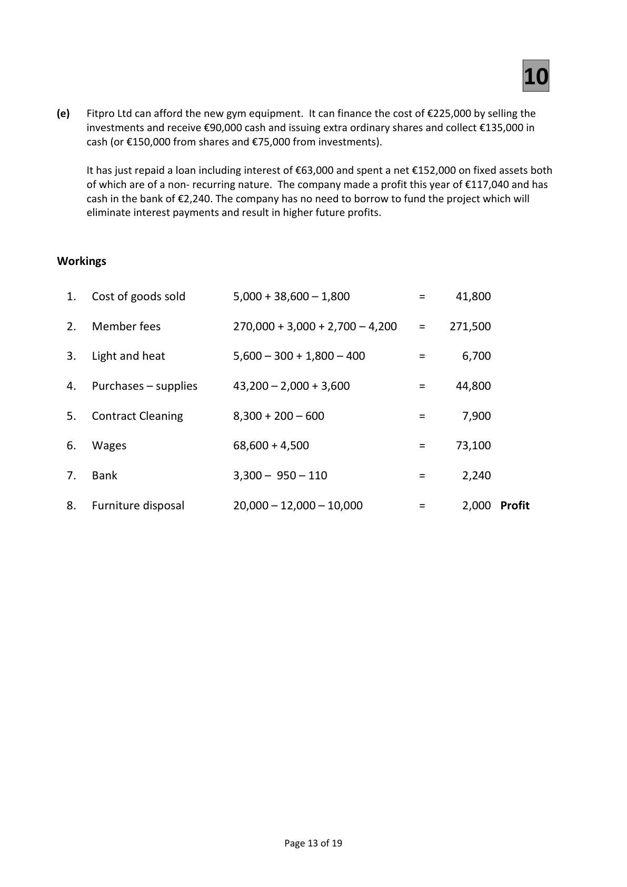

# Question

6.    Service Firm

     The following were included in the assets and liabilities of Fitpro Fitness Centre Ltd on
     01/01/2016:

      Buildings and grounds at cost €600,000, equipment at cost €80,000, furniture at cost €40,000,
      stock in shop €5,000, stock of heating oil €1,800, contract cleaning prepaid €200, investment
      interest due €300, creditors for supplies to the fitness centre €2,000, members’ fees paid in
     advance €3,000. The authorised capital of the company was €500,000 and the issued capital was
     €350,000.

      All fixed assets have 3 years accumulated depreciation on 01/01/2016.

     The following is a receipts and payments account for the year ended 31/12/2016:

          Receipts and Payments Account of Fitpro Fitness Centre Ltd for year ended 31/12/2016

                                  €                                           €
 Balance at bank 01/01/2016        59,500   Wages and salaries                      83,000
 Members’ fees                  270,000   Telephone and broadband                 1,700
 Interest on 3% investments          3,000    Insurance                                7,200
 Shop receipts                     85,000    Purchases – shop                        38,600
 Sale of furniture (cost €20,000)     10,000    Purchases – supplies for fitness centre     43,200
                                             Contract cleaning                         8,300
                                                  Light and heat                            5,600
                                           Purchase of adjacent building on
                                          01/04/2016                           150,000
                                               Furniture                               12,000
                                           Laundry                                11,600
                                        Bank loan plus 15 months interest at
                                 4% per annum on 01/04/2016             63,000
                                            Balance at bank 31/12/2016                3,300
                                427,500                                         427,500

                                                                      Continued on page 11

                                              Page 10 of 15

<!-- PAGE 11 -->
# Page 11

<!-- HAS_VISUAL: true -->
<!-- VISUAL_REASON: text contains visual keywords: figure, table; page image extracted because text may not fully capture visual content -->

The following information and instructions are to be taken into account:

(i)    Closing stock at 31/12/2016: shop €1,800, heating oil €400.

(ii)   Cleaning is done under contract payable monthly in advance and includes a payment of
     €600 for January 2017.

(iii)  Members’ fees include €4,200 for 2017. Members’ fees in arrears at 31/12/2016 were
     €2,700.

(iv)  The closing bank figure does not take into account bank charges €110 and a dishonoured
     cheque €950 received from a member in respect of fees.

(v)   The payment for laundry includes €2,700 for three weeks wages paid to a replacement
      fitness instructor. Provide for a further two weeks wages due.

(vi)  Wages and salaries include €24,000 per annum paid to the secretary, who also runs the
     shop.  It is estimated that 60% of this salary and €300 of the light and heat, €850 of the
     insurance and €400 of the telephone and broadband is attributable to the shop.

(vii)  Creditors for supplies at 31/12/2016 were €3,600.

(viii) Depreciation is to be provided as follows:

         Buildings and grounds 2% of cost from date of purchase.
       Equipment 20% of cost.
        Furniture held on 31/12/2016 is depreciated at 20% of cost. No depreciation is charged
       on furniture in the year of disposal.

Required:

(a)   Prepare a statement of the company’s reserves (profit and loss balance)
     on 01/01/2016.                                                                        (18)

(b)   Calculate the profit/loss from the shop for the year ended 31/12/2016.
    Show workings.                                                                        (10)

(c)   Prepare a profit and loss account for the year ended 31/12/2016.                      (32)

(d)   Prepare a balance sheet on 31/12/2016.                                                (30)

(e)   Fitpro Fitness Centre Ltd have decided to purchase and install new gym equipment.
     They have received a quote of €225,000. Can Fitpro Fitness Centre Ltd afford this
     investment? Explain your answer.

                                                                                              (10)

                                                                            (100 marks)

                                        Page 11 of 15

<!-- PAGE 12 -->
# Page 12

<!-- HAS_VISUAL: true -->
<!-- VISUAL_REASON: page contains vector drawings; page image extracted because text may not fully capture visual content -->

# Marking Scheme

6.      Loss on sale of van                 40,000 – 21,000 – 18,000               1,000

Question 6 – Service Firm

(a)                                    18
                             Statement of Reserves on 01/01/2016
 Assets                                                    €                €
     Buildings and grounds                [600,000 – 36,000]      564,000   [2]
    Equipment                            [80,000 – 48,000]       32,000   [2]
     Furniture                             [40,000 – 24,000]       16,000   [2]
   3% Investments                                            90,000   [1]
    Stock in shop                                                 5,000   [1]
    Stock of oil                                                   1,800   [1]
    Contract cleaning prepaid                                   200   [1]
    Investment income due                                     300   [1]
    Cash at bank                                               59,500   [1]      768,800
 Less Liabilities
     Creditors for supplies                                         2,000   [1]
   Member fees paid in advance                                  3,000   [1]
    Loan                                                      60,000   [1]
    Loan interest due                                             2,400   [1]
     Issued capital                                             350,000   [1]      (417,400)
 Reserves 01/01/2016                                                           351,400    [1]

(b)                                   10

                  Shop Profit and Loss Account for the year ended 31/12/2016
                                                            €               €
 Shop Receipts                                                                    85,000   [1]
 Less cost of goods sold                  [5,000 + 38,600 – 1,800]                        (41,800)  [5]
                                                                                 43,200
 Less expenses
          Light and heat                                          300  [1]
         Insurance                                             850  [1]
        Telephone                                             400  [1]
         Salary (24,000 × 60%)                                     14,400  [1]       (15,950)
  Profit from shop                                                                 27,250

                                            Page 11 of 19

<!-- PAGE 14 -->
# Page 14

<!-- HAS_VISUAL: true -->
<!-- VISUAL_REASON: page contains vector drawings; page image extracted because text may not fully capture visual content -->

(c)                                   32
                            Profit and Loss Account for the year ended 31/12/2016
     Income                                       €                 €
          Profit from shop                              27,250
        Investment interest                            2,700   [1]
          Profit on disposal of furniture                    2,000   [1]
       Member fees                               271,500   [5]        303,450
      Less Expenditure
       Wages and salaries                           73,100   [2]
         Insurance (7,200 – 850)                         6,350   [2]
          Light and heat                                 6,700   [5]
        Telephone (1,700 – 400)                        1,300   [2]
        Purchases – supplies                          44,800   [3]
        Loan interest                                600   [1]
        Laundry                                       8,900   [1]
         Contract cleaning                              7,900   [3]
        Bank charges                                110   [1]
         Depreciation – Buildings                       14,250   [1]
                   – Equipment                     16,000   [1]
                   – Furniture                        6,400   [1]        (186,410)
     Net profit                                                         117,040    [1]
     Add reserves 01/01/2016                                           351,400    [1]
       Profit and loss balance 31/12/2016                                   468,440

(d)                                    30

                                      Balance Sheet as at 31/12/2016
                                               Cost           Depreciation          Net
      Fixed Assets                              €              €                 €
         Buildings                             750,000  [2]       50,250     [2]      699,750
        Equipment                             80,000  [1]       64,000     [2]       16,000
         Furniture                              32,000  [2]       18,400     [3]       13,600
                                             862,000          132,650            729,350
      3% Investments                                                             90,000  [2]
                                                                                 819,350
      Current Assets
         Closing stock – shop                      1,800  [1]
         Closing stock – oil                       400  [1]
        Bank                                    2,240  [3]
         Contract cleaning prepaid                 600  [1]
       Member fees due                        3,650  [3]        8,690

      Less Creditors: amounts due within 1 year
       Wages due                              1,800  [2]
         Creditors for supplies                     3,600  [1]
       Member fees prepaid                     4,200  [1]        (9,600)                (910)
                                                                                 818,440
     Financed by
     Share Capital and Reserves             Authorised           Issued
         Ordinary shares                       500,000  [1]      350,000     [1]
          Profit and loss balance                                  468,440     [1]      818,440

                                            Page 12 of 19

<!-- PAGE 15 -->
# Page 15

<!-- HAS_VISUAL: true -->
<!-- VISUAL_REASON: page contains vector drawings; page image extracted because text may not fully capture visual content -->

10

(e)    Fitpro Ltd can afford the new gym equipment.  It can finance the cost of €225,000 by selling the
      investments and receive €90,000 cash and issuing extra ordinary shares and collect €135,000 in
      cash (or €150,000 from shares and €75,000 from investments).

         It has just repaid a loan including interest of €63,000 and spent a net €152,000 on fixed assets both
      of which are of a non‐ recurring nature. The company made a profit this year of €117,040 and has
      cash in the bank of €2,240. The company has no need to borrow to fund the project which will
      eliminate interest payments and result in higher future profits.

Workings

6.  Wages                  68,600 + 4,500                 =     73,100

# Source References

Exam paper:
- file: intermediate_markdown/exam_papers/higher/accounting_higher_2017_paper_1_exam.md
- pages: [11, 12]

Marking scheme:
- file: intermediate_markdown/marking_schemes/higher/accounting_higher_2017_paper_1_marking_scheme.md
- pages: [14, 15]

# Notes

