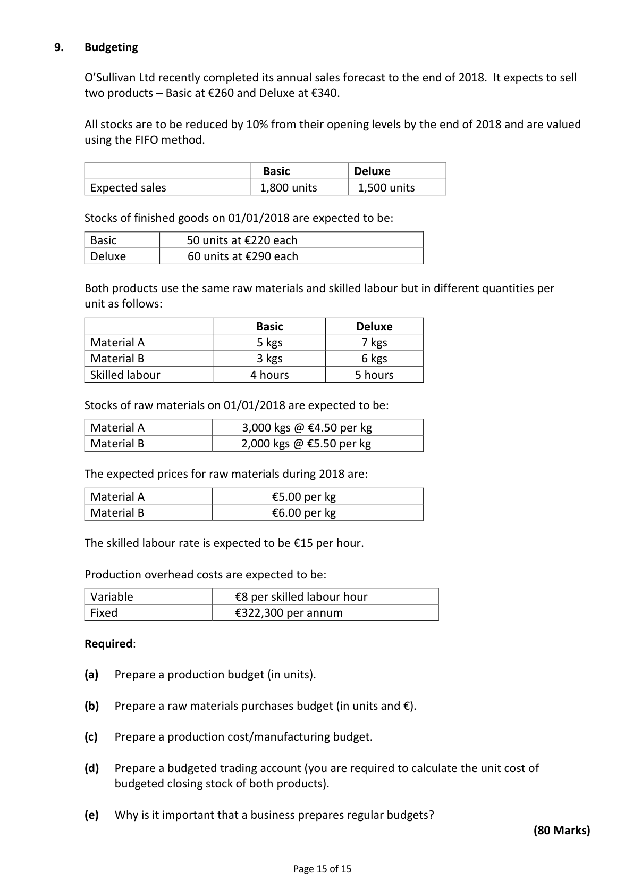
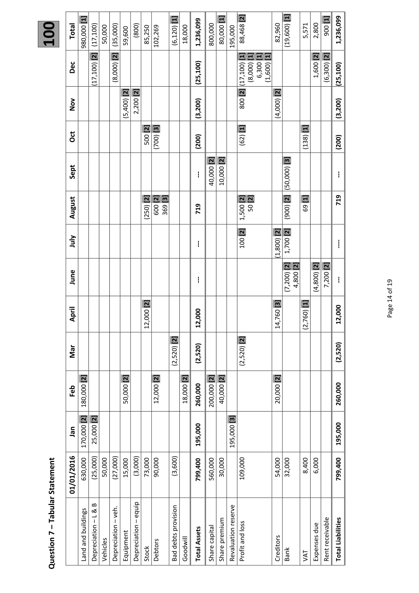
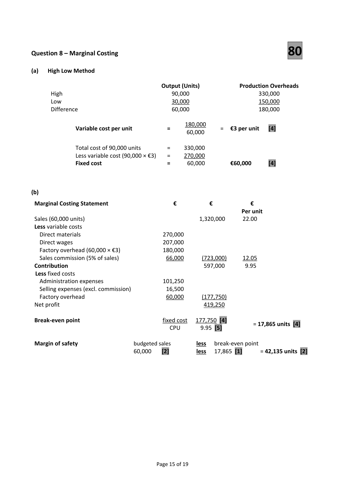
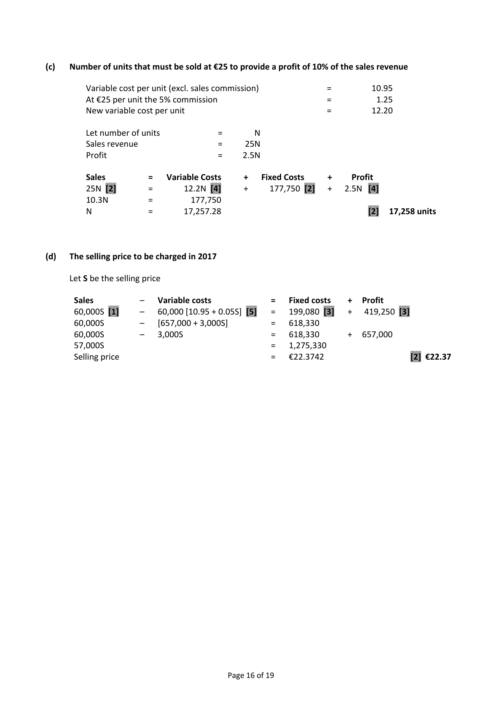
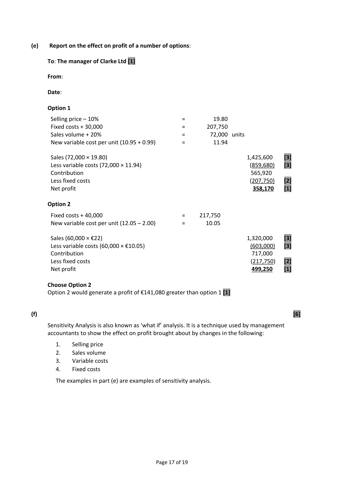
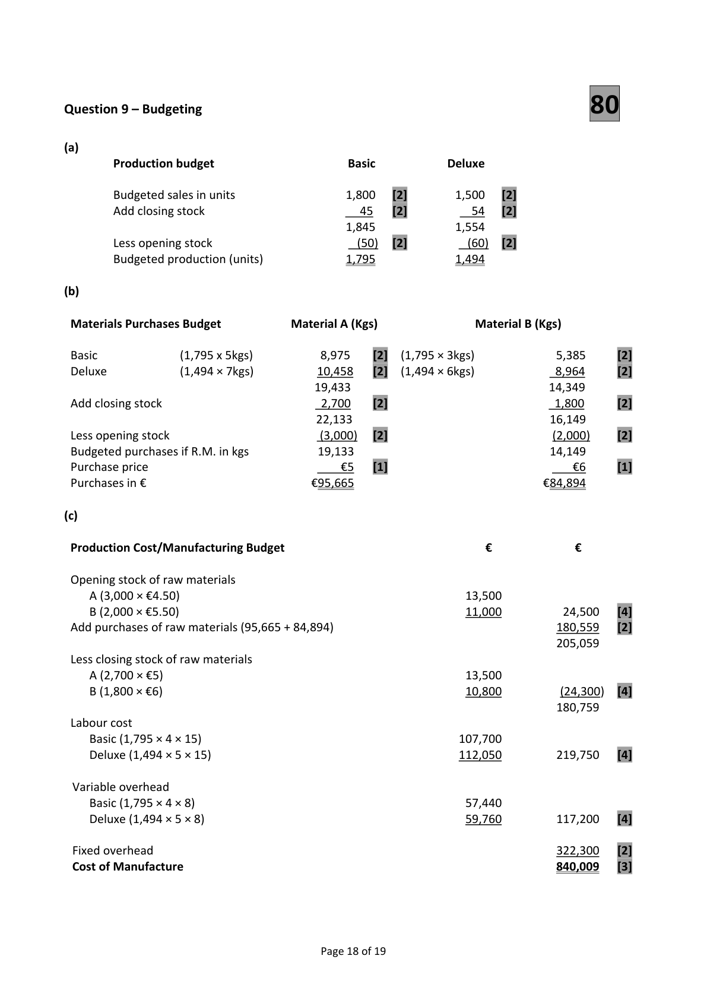

# Question

8.   Marginal Costing

      Clarke Ltd produces a single product. The company’s profit and loss account for the year
     ended 31/12/2016, during which 60,000 units were produced and sold, was as follows:

                                            €                €
       Sales (60,000 units)                                       1,320,000
       Materials                              270,000
       Direct labour                           207,000
      Factory overheads                      240,000
       Administration expenses                 101,250
       Selling expenses                         82,500           900,750
      Net profit                                                419,250

     The materials and direct labour are variable costs. Apart from a sales commission of 5% of
      sales, selling and administration expenses are fixed. Factory overheads are mixed costs,
     and have behaved in the past as follows:

              Year ended              Output (units)              Factory Overheads in €
            31/12/2013                  90,000                       330,000
            31/12/2014                  50,000                       210,000
            31/12/2015                  30,000                       150,000

     Required:

      (a)   Calculate the variable and fixed elements of factory overheads using the high/low method.
      (b)   Calculate the company’s break–even point and margin of safety.
       (c)   Calculate the number of units that must be sold at €25 per unit to provide a profit of 10% of
           the sales revenue earned from these same units.
      (d)   Calculate the selling price the company must charge per unit in 2017, if fixed costs increase by
        12% but the volume of sales and profit remain the same.

      (e)   After conducting market research the following options have been proposed.

          Option 1 – Reduce the selling price by 10% and spend an extra €30,000 on advertising to
           increase sales volume by 20%.

          Option 2 – Spend €40,000 on leasing a new packaging machine (fixed cost). This will
          reduce the variable cost per unit by €2 maintaining sales at current levels.

          Prepare a marginal costing statement for each option.

          Write a brief report for the manager of Clarke Ltd with your recommendation.

        (f)   What is meant by the term ‘Sensitivity Analysis’?
                                                                                     (80 marks)

                                              Page 14 of 15

<!-- PAGE 15 -->
# Page 15

<!-- HAS_VISUAL: true -->
<!-- VISUAL_REASON: page contains vector drawings; page image extracted because text may not fully capture visual content -->

# Marking Scheme

8.     Patent                             (68,000 + 2,000) ÷ 5                  14,000

8.   Furniture disposal        20,000 – 12,000 – 10,000         =      2,000  Profit

                                            Page 13 of 19

<!-- PAGE 16 -->
# Page 16

<!-- HAS_VISUAL: true -->
<!-- VISUAL_REASON: page contains vector drawings; page image extracted because text may not fully capture visual content -->

[1]                                    [1]                 [1]      [2]                [1]              [1]
                                                                                                                        900                                                                                                                                                                                                                                                                                                                                                                                       1,236,099                                                   50,000    (35,000)   59,600  (800)   85,250   102,269           (6,120)   18,000        1,236,099      800,000                                                                                                                                                       80,000   195,000  88,468                        82,960   (19,600)        5,571  2,800100       Total    980,000    (17,100)
                     [2]      [2]                                                   [1] [1] [1] [1]                  [2] [2]
           Dec                (17,100)              (8,000)                                                                                      (25,100)                                          (17,100)  (8,000) 6,300  (1,600)                             1,600   (6,300)      (25,100)
                                  [2] [2]                                          [2]            [2]
           Nov                                              (5,400)  2,200                                                       (3,200)                800                            (4,000)                                                      (3,200)

                                           [2] [3]                                 [1]                        [1]
           Oct                                           500  (700)                         (200)                     (62)                                        (138)                  (200)

                                                                       [2] [2]                         [3]

                                                                                                                             ‐‐‐              Sept                                                  ‐‐‐     40,000   10,000                                                                  (50,000)
                                           [2] [2] [3]                              [2] [2]             [2]     [1]           719
                                               600 369           719             50              69                     August                                               (250)                                                               1,500                           (900)

                                                                                    [2]            [2] [2]
              July                                                  ‐‐‐                100                                                   ‐‐‐‐                                                                                                                                                                                                                                       (1,800)  1,700
                                                                                                       [2] [2]      [2] [2]

                                                                                                                             ‐‐‐                                                                                                  19              June                                                  ‐‐‐                                                                                 (7,200) 4,800             (4,800)  7,200                                                                                                  of
                                                                                                  14
                                           [2]                                                     [3]         [1]
                                                                                                                                                                                                    Page                  April                                                                                                                                                                                                                            12,000                                                                                       12,000                                      12,000                                                             14,760                     (2,760)

                                                       [2]                          [2]
           Mar                                                                                                                      (2,520)                                                                                                                                    (2,520)                                                                                                                                 (2,520)                                                            (2,520)

                 [2]               [2]          [2]         [2]        [2] [2]                     [2]
           Feb    180,000                              50,000                    12,000                   18,000      260,000      200,000   40,000                                         20,000                                                      260,000

                 [2] [2]                                                        [3]
           Jan    170,000   25,000                                                                                                195,000                           195,000                                                                                                   195,000
                                                                     15,000   (3,000)   73,000  90,000           (3,600)                                                                                                                                                        799,400      560,000   30,000             109,000                        54,000  32,000        8,400  6,000               799,400       Statement                01/01/2016    630,000    (25,000)   50,000    (27,000)

       B
       &       L        veh.          equip     Tabular     –  –  –                                                                                                                                                                                          reserve
 –                                                                                                                                                                      provision                                  loss                            due 7                               buildings
                 and                                                                                           Assets      capital                                                                                                                                                                                premium      and                                                                                                              receivable        Liabilities                                                                                            debts                      Land      Depreciation    Vehicles      Depreciation    Equipment      Depreciation  Stock   Debtors     Bad    Goodwill    Total    Share  Share     Revaluation  Profit                                    Creditors  Bank     VAT    Expenses  Rent    Total      Question

<!-- PAGE 17 -->
# Page 17

<!-- HAS_VISUAL: true -->
<!-- VISUAL_REASON: page contains vector drawings; page image extracted because text may not fully capture visual content -->

Question 8 – Marginal Costing                        80

(a)   High Low Method

                                         Output (Units)              Production Overheads
       High                                     90,000                       330,000
      Low                                     30,000                       150,000
       Difference                                60,000                       180,000

                                                   180,000
                Variable cost per unit           =                =  €3 per unit    [4]
                                                    60,000

                 Total cost of 90,000 units        =     330,000
                Less variable cost (90,000 × €3)   =     270,000
                Fixed cost                     =      60,000        €60,000       [4]

(b)

 Marginal Costing Statement                    €          €            €
                                                                        Per unit
 Sales (60,000 units)                                        1,320,000      22.00
 Less variable costs
   Direct materials                           270,000
   Direct wages                              207,000
   Factory overhead (60,000 × €3)              180,000
   Sales commission (5% of sales)                66,000       (723,000)     12.05
 Contribution                                             597,000       9.95
 Less fixed costs
   Administration expenses                    101,250
   Selling expenses (excl. commission)            16,500
   Factory overhead                           60,000       (177,750)
 Net profit                                                419,250

 Break‐even point                                 fixed cost   177,750 [4]
                                                                      = 17,865 units [4]
                                      CPU       9.95 [5]

 Margin of safety                   budgeted sales          less   break‐even point
                                   60,000    [2]           less   17,865 [1]      = 42,135 units [2]

                                            Page 15 of 19

<!-- PAGE 18 -->
# Page 18

<!-- HAS_VISUAL: true -->
<!-- VISUAL_REASON: page contains vector drawings; page image extracted because text may not fully capture visual content -->

(c)   Number of units that must be sold at €25 to provide a profit of 10% of the sales revenue

          Variable cost per unit (excl. sales commission)               =         10.95
          At €25 per unit the 5% commission                        =           1.25
       New variable cost per unit                               =         12.20

          Let number of units             =     N
           Sales revenue                 =    25N
            Profit                        =     2.5N

          Sales         =   Variable Costs     +   Fixed Costs     +     Profit
        25N [2]       =       12.2N [4]     +     177,750 [2]   +   2.5N  [4]
         10.3N         =         177,750
       N            =       17,257.28                                         [2]  17,258 units

(d)   The selling price to be charged in 2017

      Let S be the selling price

       Sales          –   Variable costs             =   Fixed costs    +   Profit
       60,000S [1]     –   60,000 [10.95 + 0.05S] [5]   =   199,080 [3]   +   419,250 [3]
       60,000S        –   [657,000 + 3,000S]         =   618,330
       60,000S        –   3,000S                   =   618,330      +  657,000
       57,000S                                    =   1,275,330
        Selling price                                 =   €22.3742                        [2] €22.37

                                            Page 16 of 19

<!-- PAGE 19 -->
# Page 19

<!-- HAS_VISUAL: true -->
<!-- VISUAL_REASON: page contains vector drawings; page image extracted because text may not fully capture visual content -->

(e)    Report on the effect on profit of a number of options:

      To: The manager of Clarke Ltd [1]

     From:

      Date:

     Option 1

        Selling price – 10%                          =          19.80
       Fixed costs + 30,000                         =       207,750
       Sales volume + 20%                         =        72,000  units
     New variable cost per unit (10.95 + 0.99)        =          11.94

       Sales (72,000 × 19.80)                                                 1,425,600     [3]
       Less variable costs (72,000 × 11.94)                                       (859,680)    [3]
       Contribution                                                        565,920
       Less fixed costs                                                          (207,750)    [2]
      Net profit                                                           358,170    [1]

     Option 2

       Fixed costs + 40,000                         =     217,750
     New variable cost per unit (12.05 – 2.00)        =       10.05

       Sales (60,000 × €22)                                                  1,320,000     [3]
       Less variable costs (60,000 × €10.05)                                      (603,000)    [3]
       Contribution                                                        717,000
       Less fixed costs                                                          (217,750)    [2]
      Net profit                                                           499,250     [1]

     Choose Option 2
      Option 2 would generate a profit of €141,080 greater than option 1 [1]

(f)                                                                                                         [6]

       Sensitivity Analysis is also known as ‘what if’ analysis. It is a technique used by management
      accountants to show the effect on profit brought about by changes in the following:

          1.     Selling price
          2.    Sales volume
          3.    Variable costs
          4.    Fixed costs

        The examples in part (e) are examples of sensitivity analysis.

                                            Page 17 of 19

<!-- PAGE 20 -->
# Page 20

<!-- HAS_VISUAL: true -->
<!-- VISUAL_REASON: page contains vector drawings; page image extracted because text may not fully capture visual content -->

# Source References

Exam paper:
- file: intermediate_markdown/exam_papers/higher/accounting_higher_2017_paper_1_exam.md
- pages: [15]

Marking scheme:
- file: intermediate_markdown/marking_schemes/higher/accounting_higher_2017_paper_1_marking_scheme.md
- pages: [16, 17, 18, 19, 20]

# Notes

