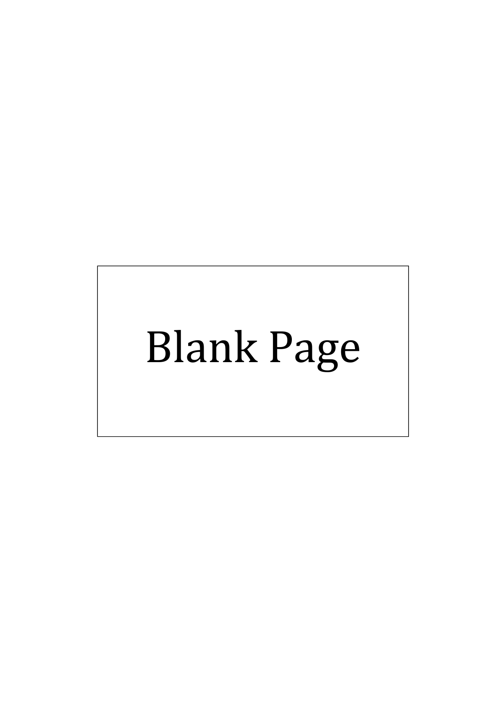
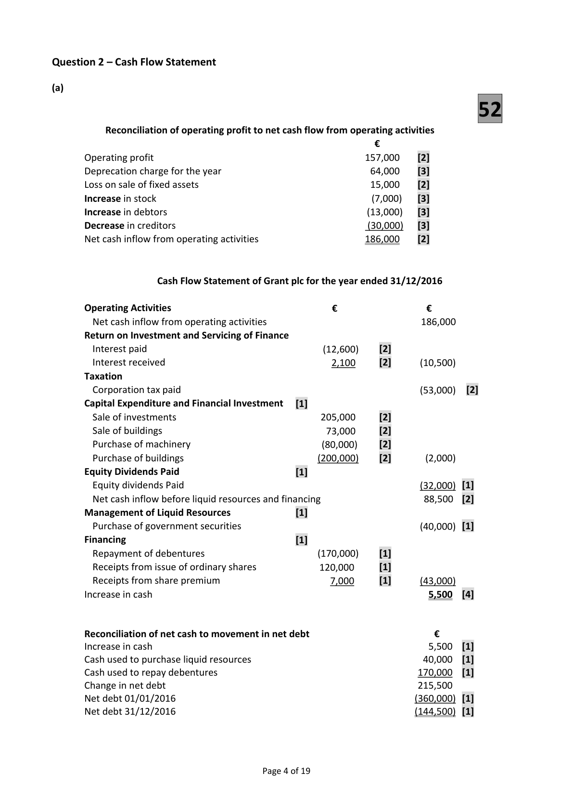
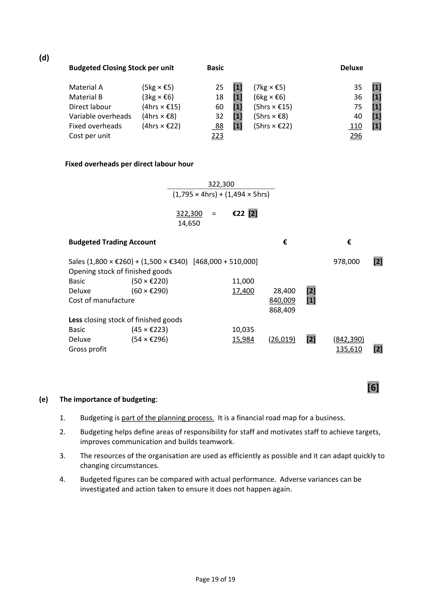
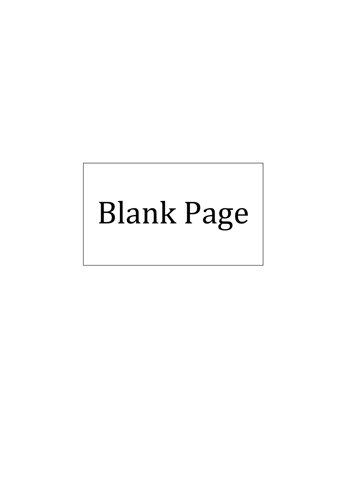

# Question

9.   Budgeting

      O’Sullivan Ltd recently completed its annual sales forecast to the end of 2018.  It expects to sell
    two products – Basic at €260 and Deluxe at €340.

       All stocks are to be reduced by 10% from their opening levels by the end of 2018 and are valued
      using the FIFO method.

                                       Basic          Deluxe
      Expected sales                1,800 units       1,500 units

     Stocks of finished goods on 01/01/2018 are expected to be:

       Basic           50 units at €220 each
      Deluxe          60 units at €290 each

     Both products use the same raw materials and skilled labour but in different quantities per
      unit as follows:

                                     Basic            Deluxe
       Material A                 5 kgs            7 kgs
       Material B                 3 kgs            6 kgs
        Skilled labour              4 hours          5 hours

     Stocks of raw materials on 01/01/2018 are expected to be:

       Material A                 3,000 kgs @ €4.50 per kg
       Material B                 2,000 kgs @ €5.50 per kg

     The expected prices for raw materials during 2018 are:

       Material A                      €5.00 per kg
       Material B                      €6.00 per kg

     The skilled labour rate is expected to be €15 per hour.

     Production overhead costs are expected to be:

       Variable                €8 per skilled labour hour
       Fixed                   €322,300 per annum

     Required:

      (a)   Prepare a production budget (in units).

      (b)   Prepare a raw materials purchases budget (in units and €).

       (c)   Prepare a production cost/manufacturing budget.

      (d)   Prepare a budgeted trading account (you are required to calculate the unit cost of
          budgeted closing stock of both products).

      (e)  Why is it important that a business prepares regular budgets?
                                                                                     (80 Marks)

                                              Page 15 of 15

<!-- PAGE 16 -->
# Page 16

<!-- HAS_VISUAL: true -->
<!-- VISUAL_REASON: page contains vector drawings; text extraction is sparse relative to visible page content; page image extracted because text may not fully capture visual content -->

<!-- EXTRACTION_ISSUE: very sparse extracted text -->

Blank Page

# Marking Scheme

9.     Investment income                 200,000 × 3% × 2/3 year                4,000
       Investment income due             4,000 – 2,000                         2,000

10.    Mortgage interest                  180,000 × 6%                        10,800
      Mortgage interest due              10,800 – 2,700                        8,100

11.    Discount received                  3,200 + 1,100                         4,300

12     Creditors                          78,000 – 7,600 + 12,800               83,200

13.     Office equipment at cost            25,000 – 11,000                      14,000

14.    Depreciation – office equipment     14,000 × 20%                         2,800
        Acc. dep. office equipment          10,000 – 4,500 + 2,800                 8,300

15.    Depreciation – buildings            680,000 × 2%                        13,600

16.    Revaluation reserve                120,000 + 85,000 + 13,600           218,600

17.    Debtors                           70,500 + 500                        71,000

18.    Bank                             70,300 – 700                        69,600

19.    VAT                               6,400 – 2000                          4,400

20.    Drawings                         15,600 + 4,000                       19,600

                                    Page 3 of 19

<!-- PAGE 6 -->
# Page 6

<!-- HAS_VISUAL: true -->
<!-- VISUAL_REASON: page contains vector drawings; page image extracted because text may not fully capture visual content -->

Question 9 – Budgeting                           80

(a)
        Production budget                        Basic           Deluxe

        Budgeted sales in units                   1,800   [2]        1,500   [2]
       Add closing stock                       45    [2]          54   [2]
                                               1,845             1,554
         Less opening stock                           (50)   [2]           (60)   [2]
        Budgeted production (units)              1,795             1,494

(b)

 Materials Purchases Budget            Material A (Kgs)                 Material B (Kgs)

 Basic               (1,795 x 5kgs)           8,975    [2]  (1,795 × 3kgs)              5,385      [2]
 Deluxe             (1,494 × 7kgs)          10,458    [2]  (1,494 × 6kgs)              8,964      [2]
                                         19,433                                 14,349
 Add closing stock                           2,700    [2]                            1,800       [2]
                                          22,133                                16,149
 Less opening stock                            (3,000)   [2]                               (2,000)     [2]
 Budgeted purchases if R.M. in kgs           19,133                                14,149
 Purchase price                             €5    [1]                            €6      [1]
 Purchases in €                           €95,665                               €84,894

(c)

 Production Cost/Manufacturing Budget                              €             €

 Opening stock of raw materials
   A (3,000 × €4.50)                                               13,500
    B (2,000 × €5.50)                                               11,000          24,500    [4]
 Add purchases of raw materials (95,665 + 84,894)                                    180,559    [2]
                                                                                205,059
 Less closing stock of raw materials
   A (2,700 × €5)                                                  13,500
    B (1,800 × €6)                                                  10,800           (24,300)   [4]
                                                                                180,759
 Labour cost
     Basic (1,795 × 4 × 15)                                          107,700
    Deluxe (1,494 × 5 × 15)                                        112,050         219,750    [4]

 Variable overhead
     Basic (1,795 × 4 × 8)                                             57,440
    Deluxe (1,494 × 5 × 8)                                           59,760         117,200    [4]

 Fixed overhead                                                                  322,300    [2]
 Cost of Manufacture                                                             840,009    [3]

                                            Page 18 of 19

<!-- PAGE 21 -->
# Page 21

<!-- HAS_VISUAL: true -->
<!-- VISUAL_REASON: page contains vector drawings; text contains visual keywords: figure; page image extracted because text may not fully capture visual content -->

(d)
        Budgeted Closing Stock per unit          Basic                               Deluxe

         Material A           (5kg × €5)          25   [1]   (7kg × €5)                 35   [1]
         Material B           (3kg × €6)          18   [1]   (6kg × €6)                 36   [1]
         Direct labour         (4hrs × €15)         60   [1]   (5hrs × €15)               75   [1]
         Variable overheads   (4hrs × €8)          32   [1]   (5hrs × €8)                40   [1]
         Fixed overheads      (4hrs × €22)         88   [1]   (5hrs × €22)              110   [1]
        Cost per unit                         223                               296

       Fixed overheads per direct labour hour

                                             322,300
                                       (1,795 × 4hrs) + (1,494 × 5hrs)

                                     322,300  =    €22 [2]
                                      14,650

       Budgeted Trading Account                               €               €

         Sales (1,800 × €260) + (1,500 × €340)  [468,000 + 510,000]                    978,000    [2]
        Opening stock of finished goods
         Basic             (50 × €220)                 11,000
        Deluxe            (60 × €290)                 17,400     28,400    [2]
        Cost of manufacture                                    840,009    [1]
                                                             868,409
         Less closing stock of finished goods
         Basic             (45 × €223)                 10,035
        Deluxe            (54 × €296)                 15,984    (26,019)    [2]     (842,390)
        Gross profit                                                             135,610    [2]

                                                                                    [6]
(e)   The importance of budgeting:

       1.    Budgeting is part of the planning process.  It is a financial road map for a business.

       2.    Budgeting helps define areas of responsibility for staff and motivates staff to achieve targets,
           improves communication and builds teamwork.

       3.    The resources of the organisation are used as efficiently as possible and it can adapt quickly to
           changing circumstances.

       4.    Budgeted figures can be compared with actual performance. Adverse variances can be
            investigated and action taken to ensure it does not happen again.

                                            Page 19 of 19

<!-- PAGE 22 -->
# Page 22

<!-- HAS_VISUAL: true -->
<!-- VISUAL_REASON: page contains vector drawings; text extraction is sparse relative to visible page content; page image extracted because text may not fully capture visual content -->

<!-- EXTRACTION_ISSUE: very sparse extracted text -->

Blank Page

<!-- PAGE 23 -->
# Page 23

<!-- HAS_VISUAL: true -->
<!-- VISUAL_REASON: page contains vector drawings; text extraction is sparse relative to visible page content; page image extracted because text may not fully capture visual content -->

<!-- EXTRACTION_ISSUE: very sparse extracted text -->

Blank Page

<!-- PAGE 24 -->
# Page 24

<!-- HAS_VISUAL: true -->
<!-- VISUAL_REASON: page contains vector drawings; text extraction is sparse relative to visible page content; page image extracted because text may not fully capture visual content -->

<!-- EXTRACTION_ISSUE: no extractable text found -->

[No extractable text found]

# Source References

Exam paper:
- file: intermediate_markdown/exam_papers/higher/accounting_higher_2017_paper_1_exam.md
- pages: [16]

Marking scheme:
- file: intermediate_markdown/marking_schemes/higher/accounting_higher_2017_paper_1_marking_scheme.md
- pages: [6, 21, 22, 23, 24]

# Notes

